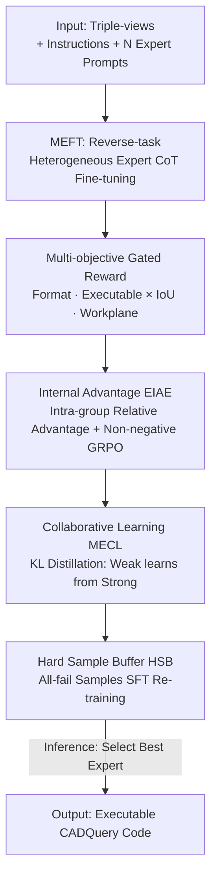

# CME-CAD: Heterogeneous Collaborative Multi-Expert Reinforcement Learning for CAD Code Generation

**Conference**: CVPR 2026  
**Paper**: [CVF OpenAccess](https://openaccess.thecvf.com/content/CVPR2026/html/Niu_CME-CAD_Heterogeneous_Collaborative_Multi-Expert_Reinforcement_Learning_for_CAD_Code_Generation_CVPR_2026_paper.html)  
**Code**: Dataset open-sourced at https://modelscope.cn/datasets/zhuofanChen/CADExpert  
**Area**: Reinforcement Learning / CAD Code Generation / Vision-Language Models  
**Keywords**: Multi-expert Reinforcement Learning, GRPO, Triple-view, CADQuery, Knowledge Distillation

## TL;DR
Aiming at the industrial scenario of "directly generating executable and editable CAD code from 2D engineering triple-views," CME-CAD enables multiple heterogeneous pre-trained large models to act as "experts" with distinct styles. It first employs Multi-Expert Fine-Tuning (MEFT) using their respective reasoning styles, followed by a Multi-Expert Reinforcement Learning (MERL) stage. In MERL, strong experts transfer superior strategies to weak experts via KL distillation, and a Hard Sample Buffer mechanism is used to repeatedly tackle the most difficult samples. Ultimately, on the self-built industrial-grade benchmark CADExpert, the IoU is improved from 71.84% to 80.71%, and the code execution rate reaches 98.25%.

## Background & Motivation

**Background**: Automatically converting design intent into precise, editable CAD models is a core part of the "digital-first" workflow in intelligent manufacturing. Existing CAD code generation methods mostly follow two paths: either direct 3D reconstruction from sketches (CAD-MLLM, GenCAD, Img2CAD, etc.) or using text/image descriptions to drive VLMs to generate parametric commands (CAD-Coder, CAD-Llama). Methodologically, these generally rely on **Reinforcement Learning from Verifiable Rewards (RLVR)** to enhance reasoning.

**Limitations of Prior Work**: 3D models reconstructed from direct methods are often approximate and non-editable, failing to meet industrial requirements for precision and editability. Text/image inputs require extensive manual expert descriptions, which are difficult to scale. More critically, RLVR is **on-policy**, meaning it can only optimize along reasoning paths where the model already finds "abundant rewards." This effectively limits the model to exploring its existing knowledge base and **prevents active exploration of new knowledge**. Once the initial policy is biased and fails to generate correct answers for complex samples, rewards become extremely sparse, halting optimization.

**Key Challenge**: There is a ceiling on the reasoning paths of a single model, and RLVR cannot break through this ceiling (it reinforces existing patterns rather than introducing new ones). Consequently, for task like CAD that are highly sensitive to spatial geometry and numerical values and have low initial accuracy, the process gets stuck in a "model cannot do it → sparse reward → no learning" deadlock.

**Goal**: (1) Align inputs with real industrial workflows—directly generating precise CADQuery code from orthogonal triple-views with dimension annotations; (2) Identify a training paradigm that breaks the single-model reasoning ceiling without sacrificing self-driven exploration capabilities.

**Key Insight**: The authors leverage the intuition of "drawing on the strengths of many." Different pre-trained large models possess varying reasoning styles and strengths. By treating them as heterogeneous experts **learning from each other**, knowledge beyond the reach of a single model can be introduced, effectively injecting "others'" exploration directions into on-policy RL.

**Core Idea**: Use a set of heterogeneous experts to generate diverse reasoning paths, then let "poorly performing experts learn from well-performing ones" (KL distillation) and "re-process hard samples where all experts failed" (Hard Sample Buffer). This breaks the single-model ceiling without losing exploration diversity.

## Method

### Overall Architecture
CME-CAD is a two-stage training paradigm. The input consists of orthogonal triple-views with precise dimensions + instructions, and the output is executable, editable CADQuery (Python-based CAD script) code. The core approach involves N heterogeneous pre-trained expert models, where each expert is defined by a **fixed and unique system prompt** $P_n$ to establish its reasoning style. This allows the same base model to exhibit differentiated "expert personalities" under different prompts.

The first stage, **MEFT (Multi-Expert Fine-Tuning)**, teaches the model the reasoning styles of each expert. Since "triple-view to code" data is scarce in the pre-training phase, direct CoTs generated by experts are unreliable. The authors use a "reverse task" where code is provided first to let the model back-derive reasoning paths, generating high-quality CoT samples. The second stage, **MERL (Multi-Expert Reinforcement Learning)**, is the core of collaboration: first, a gated multi-objective reward is designed, then Expert-Internal Advantage Estimation (EIAE) is used for GRPO within each expert group. Next, Multi-Expert Collaborative Learning (MECL) uses KL distillation for weak experts to learn from strong ones. Finally, the Hard Sample Buffer (HSB) stores and re-trains on samples where all experts failed. At inference, only the best-performing expert is used, avoiding the overhead of "running all and selecting the best."

### Key Designs

**1. MEFT Reverse-task Heterogeneous Expert CoT Generation: Solving unreliable CoTs when experts directly reason from triple-views**

Directly requiring a VLM to reason CADQuery code from 2D triple-views results in poor CoT quality because pre-training lacks "drawing-to-code" data. The authors' strategy is a **reverse-task**: during sample construction, instead of zero-shot reasoning, the model is given the orthogonal projections **and the ground-truth CADQuery code**, then asked to "back-derive"—explaining how to get that code step-by-step. Each expert $n$ is guided by a unique prompt $P_n$, producing expert-styled CoTs $C_i^{(n)}$ and answers $A_i^{(n)}$ for instruction $I_i$, forming expert samples $S_n = (P_n, I_i, C_i^{(n)}, A_i^{(n)})$. The objective is to maximize the joint likelihood of the reasoning and answer sequence (minimizing negative log-likelihood):

$$\mathcal{L} = -\sum_{n=1}^{N}\sum_{i=1}^{I}\log\big(p(\text{Concat}(C_i^{(i)}, A_i^{(i)}) \mid P_n, I_i)\big)$$

*Note: The superscript $C_i^{(i)}$ in equation (2) of the paper is likely a typo for $C_i^{(n)}$.*

**2. Multi-objective Gated Reward: Ensuring rewards enforce "code must run" while refining geometric precision**

CAD code is extremely sensitive to numerical values and coordinate systems. A single reward cannot capture requirements for execution, geometry, and coordinates. The reward is split into four gated components. **Format reward** $R_{\text{format}}$ uses regex to ensure reasoning precedes code (1 if met, 0 otherwise). **Executable reward** $R_{\text{exec}}$ runs the code in a Python interpreter (1 if error-free, 0 otherwise). **Geometric precision reward** $R_{\text{IoU}}$ measures the Jaccard overlap between the generated and ground-truth models: $R_{\text{IoU}} = J(M_{\text{gen}}, M_{\text{gt}}) = \frac{|M_{\text{gen}}\cap M_{\text{gt}}|}{|M_{\text{gen}}\cup M_{\text{gt}}|}$.

Crucially, even if the geometry is correct, an **incorrect coordinate system** can result in zero IoU. Thus, the **Workplane Reward** $R_{\text{plane}}$ quantifies coordinate consistency via origin deviation $Dis_{\text{ori}} = \|O_{\text{gen}} - O_{\text{gt}}\|_2$ and normal vector deviation $Dis_{\text{vec}} = \frac{1}{2}[2 - \text{sim}(\boldsymbol{x}_{\text{gen}}, \boldsymbol{x}_{\text{gt}}) - \text{sim}(\boldsymbol{y}_{\text{gen}}, \boldsymbol{y}_{\text{gt}})]$, combined as $R_{\text{plane}} = 1 - \beta\cdot Dis_{\text{ori}} - \gamma\cdot Dis_{\text{vec}}$. The final reward uses **multiplicative gating**:

$$R = \lambda_{\text{format}}R_{\text{format}} \cdot \lambda_{\text{exec}}R_{\text{exec}} \cdot \big(\lambda_{\text{IoU}}R_{\text{IoU}} + \lambda_{\text{plane}}R_{\text{plane}}\big)$$

**3. Expert-Internal Advantage Estimation (EIAE): Using intra-group relative advantages + non-negative truncation to keep exploration alive**

In the RL stage, the MEFT-trained model serves as the policy $\pi_\theta$. For each sample, prompts $P_n$ guide $G$ responses per expert (total $N \times G$). Advantage estimation is **performed only within the same expert group** by subtracting the mean reward of that expert's $G$ responses from the absolute reward:

$$\mathcal{A}_n = R_g^n - \frac{1}{G}\sum_{g'=1}^{G}R_{g'}^n$$

GRPO is then applied with **non-negative truncation** $\max(\mathcal{A}_g^n, 0)$:

$$\mathcal{L}_{\text{GRPO}}^{(n)} = -\mathbb{E}_{A_g^n\sim\pi_\theta}\big[\log\pi_\theta(A_g^n \mid P_n, I_i)\cdot\max(\mathcal{A}_g^n, 0)\big]$$

Reasoning: Small errors in complex CAD tasks yield slightly negative advantages. Standard penalties would discourage the model from exploring uncertain actions; truncation at 0 preserves the intent to explore.

**4. Multi-Expert Collaborative Learning (MECL): Forcing the worst expert to learn from the best without losing diversity**

To enable knowledge flow between experts, for each input $I_i$, the mean absolute reward $r_n$ is calculated for each expert. The highest is the best $E^+$, and the lowest is the worst $E^-$. KL divergence is used to force $E^-$ to learn from $E^+$'s high-quality solution:

$$\mathcal{L}_{\text{KL}} = \text{KL}\big(\pi_\theta(A^+ \mid P_{E^-}, I_i) \,\|\, \pi_\theta(A_{\text{correct}} \mid P_{E^+}, I_i)\big)$$

Because each $P_n$ is unique, the experts do not collapse into a single model; diversity is anchored by the prompt.

**5. Hard Sample Buffer (HSB): Re-training on all-fail samples to alleviate reward sparsity**

When all experts fail a query, the reward is zero, providing no signal. HSB splits RL data into $M$ chunks. After training each $\frac{1}{M}$, failed samples (where expert $n$ fails more than $K$ of $G$ responses) are added to buffer $B$. Supervised fine-tuning is then performed on the buffer:

$$\mathcal{L}_{\text{SFT}} = -\sum_{B}\log p_\theta(A_{\text{correct}} \mid P_n, I_i)$$

### Loss & Training
Base model: Qwen3-VL-4B-Instruct on 8x H100. MEFT stage: LR $1\times10^{-5}$, batch size 32. MERL stage: LR $1\times10^{-5}$, batch size 8, 4 rollouts per prompt, temperature 0.9. Three heterogeneous expert styles used (Expert 1: Qwen3-VL-Plus, Expert 2: GPT-5-Mini, Expert 3: Doubao-Seed-1.6-Vision). Total training time increased only 20%–30% due to vLLM efficiency.

## Key Experimental Results

### Main Results
Comparison on the CADExpert benchmark.

| Model | IoU(%)↑ | Mean CD↓ | Med CD↓ | Exec.(%)↑ |
|------|---------|----------|---------|-----------|
| Qwen2.5-VL | 19.21 | 20.68 | 6.64 | 31.27 |
| Gemini2.5 Pro | 30.86 | 14.13 | 5.97 | 39.40 |
| GPT5-Mini | 35.15 | 9.89 | 4.81 | 47.13 |
| Qwen3-VL (Base) | 37.04 | 6.96 | 3.84 | 54.79 |
| CAD-RL* (Prev. SOTA) | 71.84 | 1.38 | 0.36 | 97.32 |
| **CME-CAD (Ours)** | **80.71** | **1.00** | **0.11** | **98.25** |

Ours improves IoU by 8.87% over CAD-RL, with an execution rate of 98.25%.

### Ablation Study

| Config | IoU(%)↑ | Mean CD↓ | Exec.(%)↑ |
|------|---------|----------|-----------|
| Expert3-SFT | 40.91 | 5.34 | 85.35 |
| MoE-SFT (Expert3) | 64.45 | 1.63 | 96.99 |
| E3-SFT-GRPO | 52.38 | 4.70 | 96.88 |
| EIAE | 73.89 | 1.33 | 98.28 |
| EIAE+HSB | 78.14 | 1.13 | 98.22 |
| EIAE+MECL | 76.71 | 1.28 | 98.19 |
| **EIAE+HSB+MECL (Full)** | **80.71** | **1.00** | **98.25** |

### Key Findings
- **Multi-expert data breaks single-expert ceilings**: Single-expert SFT+GRPO (52.38 IoU) is far inferior to multi-expert SFT (64.45 IoU).
- **HSB contributes most to overall performance**: Adding HSB to EIAE increased IoU from 73.89 to 78.14 (+4.25).
- **EIAE primarily boosts execution rate**: It helps select the best expert per task, pushing the execution rate above 98%.

## Highlights & Insights
- **"Heterogeneous Expert = Same Base + Different System Prompt"** is a cost-effective design that provides differentiated reasoning without training multiple models.
- **Non-negative truncation $\max(\mathcal{A}, 0)$** addresses the issue where small errors in long code sequences prematurely stifle exploration.
- **Workplane Reward** targets the specific CAD issue where "shape is correct but coordinate system is offset," a domain-specific insight that prevents IoU zeroing.

## Limitations & Future Work
- **Reliance on external strong experts**: The framework's ceiling is tied to the availability and capability of closed-source experts (GPT-5, etc.).
- **Limited target scope**: Currently focused on triple-view to CADQuery; its effectiveness for freeform surfaces or complex assemblies is unverified.

## Related Work & Insights
- **vs CAD-RL**: While CAD-RL introduced verifiable rewards for CAD, it remains limited by single-model on-policy reasoning. CME-CAD breaks this with multi-expert diversity.
- **vs Traditional RLVR**: CME-CAD injects "other's" exploration directions to overcome the sparse reward problem in complex generation tasks.

## Rating
- Novelty: ⭐⭐⭐⭐⭐ 
- Experimental Thoroughness: ⭐⭐⭐⭐ 
- Writing Quality: ⭐⭐⭐⭐ 
- Value: ⭐⭐⭐⭐⭐ 

<!-- RELATED:START -->

## Related Papers

- [\[ICLR 2026\] cadrille: Multi-modal CAD Reconstruction with Reinforcement Learning](../../ICLR2026/reinforcement_learning/cadrille_multi-modal_cad_reconstruction_with_reinforcement_learning.md)
- [\[CVPR 2026\] MSRL: Scaling Generative Multimodal Reward Modeling via Multi-Stage Reinforcement Learning](msrl_scaling_generative_multimodal_reward_modeling.md)
- [\[CVPR 2026\] EVA: Efficient Reinforcement Learning for End-to-End Video Agent](eva_efficient_reinforcement_learning_for_end-to-end_video_agent.md)
- [\[CVPR 2026\] Reading or Reasoning? Format Decoupled Reinforcement Learning for Document OCR](reading_or_reasoning_format_decoupled_reinforcement_learning_for_document_ocr.md)
- [\[CVPR 2026\] Cross-modal Identity Mapping: Minimizing Information Loss in Modality Conversion via Reinforcement Learning](cross-modal_identity_mapping_minimizing_information_loss_in_modality_conversion_.md)

<!-- RELATED:END -->
