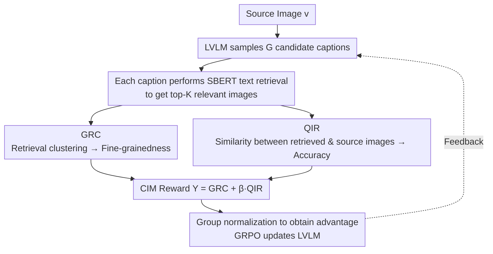

# Cross-modal Identity Mapping: Minimizing Information Loss in Modality Conversion via Reinforcement Learning

**Conference**: CVPR 2026  
**arXiv**: [2603.01696](https://arxiv.org/abs/2603.01696)  
**Code**: To be released (Public after paper acceptance)  
**Area**: Reinforcement Learning  
**Keywords**: Image Captioning, Cross-modal Information Loss, Retrieval Reward, Reinforcement Learning, GRPO

## TL;DR
The authors propose Cross-modal Identity Mapping (CIM), which quantifies information loss in image descriptions by analyzing the representation consistency (GRC) of images retrieved via the caption and their relevance to the source image (QIR). This serves as an RL reward signal to train LVLMs to generate fine-grained and accurate descriptions without requiring additional human annotations.

## Background & Motivation
LVLMs often omit or misrepresent key visual content in image captioning tasks. This is verified by fine-grained classification experiments on the Oxford-IIIT Pet dataset: while species classification accuracy for multiple LVLMs (e.g., Qwen3-VL-8B, InternVL3-8B) is near 100%, breed classification accuracy ranges only from 15% to 40%. This suggests that models tend to describe coarse-grained concepts while ignoring detailed information, leading to significant cross-modal information loss.

Existing improvement methods fall into two categories: (1) constructing fine-grained annotated data for SFT, which is expensive; (2) using VLM-based metrics as RL rewards, which are prone to reward hacking due to the limited compositional reasoning of VLMs. The **Key Challenge** is: how to accurately quantify information loss in image descriptions without relying on additional annotations?

The authors propose a **Key Insight**: **The more fine-grained the caption, the more consistent the images retrieved by it; the more accurate the caption, the more similar the retrieved images are to the source image**. Based on this, information loss in captions can be inferred by analyzing the distribution of retrieval results.

## Method

### Overall Architecture
CIM addresses the problem of "how to judge the loss of visual information in a caption without fine-grained annotations." The core idea is to translate this cross-modal evaluation problem into an image retrieval problem: the LVLM samples $G$ candidate captions for a source image; each caption is used as a query to retrieve the top-$K$ related images from a text retrieval library. By analyzing whether the retrieved images are similar to each other and whether they resemble the source image, the quality of the caption is inferred—finer captions lead to more clustered results, while accurate captions lead to results closer to the source. Two metrics are derived: **GRC** measures "fine-grainedness," and **QIR** measures "accuracy." These are combined into a single reward $\Upsilon$, which is then fed into **GRPO** after group normalization to update the LVLM. This entire pipeline operates without any human intervention.

### Key Designs

**1. Gallery Representation Consistency (GRC): Quantifying caption fine-grainedness via retrieval clustering**

One of the most difficult types of information loss to capture is "missing details"—where a model says "a pet" instead of a specific breed. CIM passes the $K$ images retrieved by a caption through a visual representation model, performs $\ell_2$ normalization into unit vectors, and calculates their mean vector length:

$$GRC(c) = \Big\|\frac{1}{K}\sum_{r=1}^{K}\tilde{v}(x_{i_r})\Big\|_2$$

This is essentially the "mean resultant length" in directional statistics, measuring the concentration of unit vectors on a hypersphere. When a caption is specific (e.g., naming a breed, pattern, or pose), retrieved images are highly homogeneous with similar vector directions, resulting in a GRC near 1. If the caption is vague, retrieved results are diverse, vectors cancel each other out, and GRC approaches 0. Thus, "fine-grainedness" is quantified as a clustering degree between 0 and 1 without requiring ground-truth labels.

**2. Query-gallery Image Relevance (QIR): Quantifying caption accuracy via similarity to source image**

GRC alone is insufficient, as a detailed but hallucinated caption could also yield clustered retrieval results (centered on the wrong concept). QIR adds the dimension of "accuracy" by calculating the cosine similarity between the source image $v$ and each retrieved image, weighted by an exponential decay based on retrieval rank:

$$QIR(v, c) = \sum_{r=1}^{K}\lambda(r)\cdot Cos\big(\tilde{v}(v), \tilde{v}(x_{i_r})\big),\qquad \lambda(r) = \frac{1}{2^{r-1}}$$

If the caption faithfully describes the source image, the retrieved images will be semantically close to it, resulting in a high QIR. If the caption contains errors, retrieval will be biased toward other images, lowering QIR. The weight $\lambda(r)=1/2^{r-1}$ ensures that high-ranking, more reliable retrieval results dominate the score.

**3. CIM Reward and GRPO Optimization: Synthesizing signals into an unannotated reward**

GRC (details) and QIR (accuracy) are combined linearly to form the final reward, with $\beta$ adjusting the balance:

$$\Upsilon(v, c) = GRC(c) + \beta\cdot QIR(v, c)$$

For $G$ captions sampled from the same image, $\Upsilon$ is calculated for each, and the advantage is obtained via group normalization: $A_z = \dfrac{\Upsilon_z - \mathrm{mean}(\{\Upsilon\})}{\mathrm{std}(\{\Upsilon\})}$. This is used by GRPO to update the LVLM. The model is pushed toward being both "finer" and "more accurate." The key lies in replacing cross-modal evaluation with image-image similarity calculations, bypassing both the difficulty of direct information loss measurement and common reward hacking in VLM-as-a-judge setups.

### Loss & Training
The framework uses VERL for GRPO training. The training data consists of RefinedCaps (6.5K images) with 5 captions sampled per image. SBERT (MPNet-base) is used for text retrieval, and OpenCLIP ViT-H/14 is used for image encoding. The retrieval gallery is augmented with RefinedCaps + DenseFusion-1M to provide reliable retrieval signals. The learning rate is set to $1\times 10^{-6}$ for 2 epochs.

## Key Experimental Results

### Main Results

| Model | Dataset | CAPTURE | Relation QA | Gain |
|------|--------|---------|-------------|------|
| Qwen2.5-VL-7B + CIM | COCO-LN500 | 48.93 | 44.15 | Relation Recall +20.2, QA +20.4 |
| Qwen2-VL-7B + CIM | COCO-LN500 | 48.64 | 38.71 | Relation Recall +10.4, QA +18.2 |
| LLaVA1.5-7B + CIM | COCO-LN500 | 48.62 | 24.98 | Relation Recall +12.6, QA +10.6 |
| InternVL3-8B + CIM | COCO-LN500 | 48.90 | 38.67 | Relation Recall +10.0, QA +12.2 |

### Ablation Study

| Configuration | CAPTURE | Description |
|------|---------|------|
| GRC only | Improved but limited | Only encourages detail richness |
| QIR only | Improved but limited | Only constrains accuracy |
| GRC + QIR | Best | Complementary effects |
| Gallery Scale | Larger is better | Larger gallery provides more reliable signals |

### Key Findings
- CIM improves Relation Recall for Qwen2.5-VL-7B on COCO-LN500 by 20.2% and Relation QA by 20.4%—a very significant margin.
- CIM is effective across different architectures (LLaVA, Qwen-VL, InternVL) and versions, proving the universality of the method.
- Pearson correlation analysis validates a positive correlation between GRC/QIR and actual caption quality (breed classification logits).

## Highlights & Insights
- Cleverly converts cross-modal information loss quantification into image-image similarity problems post-retrieval, requiring zero extra labels.
- The design of GRC and QIR is intuitive: one for "detail" and one for "accuracy," aligning with human perception of caption quality.
- The massive gains in the "Relation" dimension suggest that current LVLMs suffer the most information loss in relational reasoning, which is also the most amenable to RL improvement.

## Limitations & Future Work
- The composition and scale of the retrieval gallery directly affect reward quality; sensitive to the choice of retrieval model.
- Training on only 6.5K images is efficient but may limit the potential performance ceiling.
- Calculating GRC and QIR requires additional retrieval steps, increasing training overhead.
- The design of the exponential decay weight $\lambda(r)$ lacks theoretical backing.

## Related Work & Insights
- Similar to CapRL in using RL to optimize captioning, but uses retrieval consistency instead of VQA as the reward source.
- The "self-retrieval reward" concept explored in prior work is further decomposed by CIM into fine-grainedness (GRC) and accuracy (QIR) dimensions.
- The paradigm of transforming generation evaluation into retrieval evaluation could be extended to other cross-modal generation tasks.
- Compared to cycle-consistency methods (reconstructing images from captions), CIM avoids the high overhead of training image generators.
- Unlike SC-Captioner's keyword checking, CIM provides continuous and comprehensive quality signals through retrieval distributions.

## Rating
- Novelty: ⭐⭐⭐⭐ The insight of retrieval consistency as a caption quality proxy is novel; GRC/QIR design is clever.
- Experimental Thoroughness: ⭐⭐⭐⭐ Sufficient validation across models with Pearson correlation, though ablations could be more granular.
- Writing Quality: ⭐⭐⭐⭐ Clear logic, ingenious validation experiment design, and high-quality figures.
- Value: ⭐⭐⭐⭐ The label-free RL optimization scheme is highly practical, yielding significant improvements in relational reasoning.

<!-- RELATED:START -->

## Related Papers

- [\[ICCV 2025\] R1-Onevision: Advancing Generalized Multimodal Reasoning through Cross-Modal Formalization](../../ICCV2025/reinforcement_learning/r1-onevision_advancing_generalized_multimodal_reasoning_through_cross-modal_form.md)
- [\[ICLR 2026\] cadrille: Multi-modal CAD Reconstruction with Reinforcement Learning](../../ICLR2026/reinforcement_learning/cadrille_multi-modal_cad_reconstruction_with_reinforcement_learning.md)
- [\[CVPR 2026\] EVA: Efficient Reinforcement Learning for End-to-End Video Agent](eva_efficient_reinforcement_learning_for_end-to-end_video_agent.md)
- [\[CVPR 2026\] Reading or Reasoning? Format Decoupled Reinforcement Learning for Document OCR](reading_or_reasoning_format_decoupled_reinforcement_learning_for_document_ocr.md)
- [\[ICML 2026\] SPHERE: Mitigating the Loss of Spectral Plasticity in Mixture-of-Experts for Deep Reinforcement Learning](../../ICML2026/reinforcement_learning/sphere_mitigating_the_loss_of_spectral_plasticity_in_mixture-of-experts_for_deep.md)

<!-- RELATED:END -->
