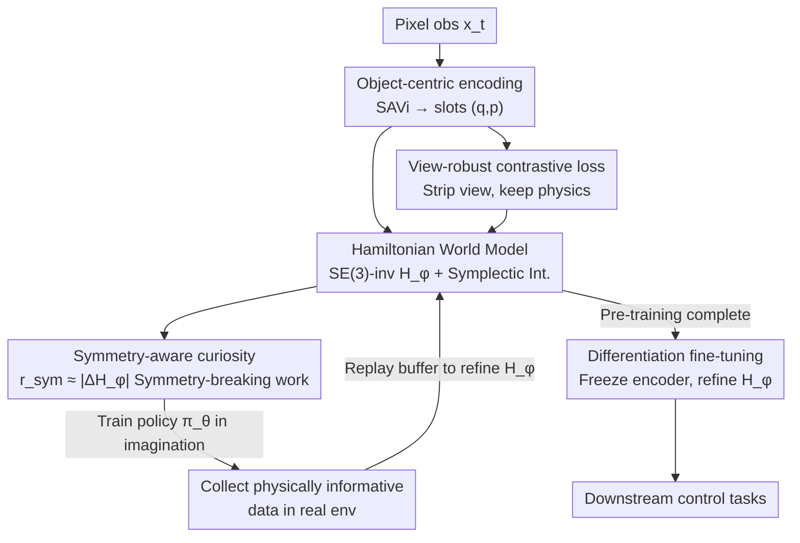

# DreamSAC: Learning Hamiltonian World Models via Symmetry Exploration

**Conference**: CVPR 2026  
**Paper**: [CVF Open Access](https://openaccess.thecvf.com/content/CVPR2026/html/Tang_DreamSAC_Learning_Hamiltonian_World_Models_via_Symmetry_Exploration_CVPR_2026_paper.html)  
**Code**: None  
**Area**: Reinforcement Learning / World Models  
**Keywords**: World Models, Hamiltonian Dynamics, Intrinsic Curiosity, Symmetry Exploration, Extrapolative Generalization

## TL;DR
DreamSAC replaces the black-box dynamics of pixel-based world models (DreamerV3) with an SE(3)-invariant Hamiltonian dynamics prior and employs a "symmetry-breaking work" intrinsic curiosity to collect physically informative data. This allows the model to learn conservation laws rather than just pixel statistical correlations, achieving 22%–163% higher extrapolative generalization on unseen physical parameters such as mass, gravity, and friction compared to SOTA.

## Background & Motivation
**Background**: World models, exemplified by the Dreamer series, have demonstrated the ability to learn predictive representations from high-dimensional pixels. They excel at interpolative generalization—combining familiar objects with familiar dynamics—by fundamentally capturing non-parametric statistical patterns in observed pixel sequences.

**Limitations of Prior Work**: These models suffer from sharp performance degradation when facing physical parameters outside the training distribution (e.g., unseen mass ratios in collisions, new contact dynamics, 1.5× gravity, or 2× friction). This occurs because they only learn the **statistical correlations** of pixel-level dynamics, acting as "descriptive systems" without an inherent understanding of underlying principles like the conservation of force, momentum, and energy.

**Key Challenge**: The authors argue that the key to robust extrapolation is shifting the learning objective from "modeling pixel statistics" to "discovering physical invariants"—specifically, conservation laws derived from underlying symmetries. However, embedding physical structures like Hamiltonian or Lagrangian networks into end-to-end agents learning from pixels presents two major obstacles: (1) previous physical structure models (HNN/LNN) only succeeded with low-dimensional state inputs or in offline settings; (2) Hamiltonians require view-invariant physical states, whereas pixel observations are inherently view-dependent, creating a direct conflict. Furthermore, learning "Symmetry = Conservation ($\Delta H \approx 0$)" via passive observation is ineffective, as the Hamiltonian is already conserved during self-evolution, providing no new information.

**Goal**: To enable an online MBRL agent learning from pixels to disentangle view-invariant physical laws from view-dependent observations while actively collecting data that "exposes its own errors in physical understanding."

**Key Insight**: Drawing from physical intuition of controlled Hamiltonian systems, an agent must actively exert external forces to **do work** on the system to break apparent conservation. This process allows for the detection of Hamiltonian structures (potential barriers, stiffness, etc.). Since the amount of work done equals the change in internal Hamiltonian $|\Delta H_\phi|$, the act of "challenging one's understanding of conservation laws" can be directly quantified as an intrinsic reward.

**Core Idea**: Replace "Black-box dynamics predictors + Statistical novelty curiosity" with "Hamiltonian world models + Symmetry-aware curiosity." The former embeds physical invariance into the model structure (Lie Transformer for SE(3)-invariance + contrastive learning for view removal), while the latter rewards the agent for performing work to break symmetry, thereby actively collecting data with maximum physical information to refine the Hamiltonian.

## Method

### Overall Architecture
DreamSAC is built upon DreamerV3 but replaces two components with physics-driven versions. The learning process consists of two stages: **unsupervised pre-training** using symmetry exploration to learn a physicalized world model, followed by **downstream task fine-tuning** using extrinsic rewards.

World Model: Observations $x_t$ are mapped to $N$ object slots $Z_t = \{z_t^i\}$ via a SAVi object-centric encoder. Each slot is **structured** into generalized coordinates and conjugate momenta $z_t^i = (q_t^i, p_t^i)$. Dynamics follow a dual-track: the stochastic state $Z_{t+1}$ is obtained by integrating a $G$-invariant internal Hamiltonian $H_\phi$, while the deterministic state $h_{t+1}$ is updated by a GRU. A view-robust contrastive loss strips view factors from $Z_t$ to satisfy the Hamiltonian's invariance requirements.

Exploration: A policy $\pi_\theta$ is **trained entirely in imagination** to maximize the symmetry-aware curiosity reward $r_{sym}$, targeting "symmetry-breaking work." The imagined policy is then executed in the real environment to collect data that "challenges the world model" for $H_\phi$ refinement.

### Key Designs

**1. Hamiltonian World Model: Embedding Conservation Laws into Dynamics Priors**

To address the failure of standard RSSM dynamics predictors (which act as entangled black boxes), DreamSAC replaces the RSSM dynamics prior $p_\phi(Z_{t+1} \mid Z_t, a_t)$ with a controlled Hamiltonian process. The system is modeled such that internal dynamics are governed by an internal Hamiltonian $H_\phi(z)$, while external actions $a_t$ exert forces through a learned input matrix $g(q)$:

$$\frac{dq}{dt}=\frac{\partial H_\phi(z)}{\partial p},\qquad \frac{dp}{dt}=-\frac{\partial H_\phi(z)}{\partial q}+g(q)a_t$$

At inference, a **symplectic integrator** is used to ensure long-term conservation. A key constraint is that the internal Hamiltonian must remain invariant under transformations $g$ of the relevant 3D physical symmetry group $G$ (e.g., SE(3)): $H_\phi(g \cdot Z_t) = H_\phi(Z_t), \forall g \in G$. This is implemented via a **Lie Transformer**, a $G$-invariant architecture. This embeds "physical invariance" as a hard structural constraint, allowing extrapolation by merely adjusting latent physical parameters without breaking learned symmetries.

**2. View-robust Contrastive Loss: Resolving the View-Reconstruction Conflict**

Reconstruction losses $\mathcal{L}_{pred}$ force $Z_t$ to encode camera parameters, while the $G$-invariant Hamiltonian prior requires $Z_t$ to be invariant to them. The authors introduce a view-robust loss $\mathcal{L}_{vr}$ based on self-supervised contrastive learning that **does not require synchronized multi-view data**. For a single observation $x_t$, strong view augmentations $\tau$ (random perspective shifts, camera jitter) generate two views $x_t^A, x_t^B$. Their encodings $Z_t^A, Z_t^B$ form positive pairs, while other samples in the batch form negative pairs, optimized via InfoNCE:

$$\mathcal{L}_{vr}(\phi)=-\mathbb{E}\!\left[\log\frac{\exp(\mathrm{sim}(Z_t^A,Z_t^B)/\tau)}{\sum_{j=1}^{K}\exp(\mathrm{sim}(Z_t^A,Z_j^B)/\tau)}\right]$$

This explicitly trains the encoder to factor out view variations, providing "clean" view-robust states $Z_t$ for the $G$-invariant Hamiltonian.

**3. Symmetry-aware Curiosity: Rewarding Symmetry-Breaking Work**

To address the limitations of statistical novelty curiosity (like RND/ICM) which can be distracted by noisy-TV effects, intrinsic reward is defined as the work $W_C$ done by the agent, which equals the change in the internal Hamiltonian:

$$r_{sym,t+1}=\underbrace{|H_\phi(Z_{t+1})-H_\phi(Z_t)|}_{\text{Symmetry Detection}}-\underbrace{\lambda_s\lVert a_t-a_{t-1}\rVert^2}_{\text{Action Smoothing}}$$

Maximizing $r_{sym}$ encourages the agent to seek interactions requiring significant work, which are precisely the interactions that expose errors in $H_\phi$'s understanding of stiffness and potential barriers. This resolves the paradox of learning symmetry: symmetry implies conservation ($\Delta H \approx 0$), but the agent only learns this invariance by actively challenging the system's inertia.

**4. Annealing Curiosity + Imagine Training: Stabilizing Joint Optimization**

When $H_\phi$ is not yet mature, $r_{sym}$ is noisy and non-stationary. The authors **anneal** the intrinsic reward from stable novelty-based signals to physical signals. Initially, RND provides a broad, stable signal, and the weight $w_t$ linearly transitions from 0 to 1:

$$r_{int,t+1}=(1-w_t)\cdot r_{RND,t+1}+w_t\cdot r_{sym,t+1}$$

Additionally, $r_{sym}$ is calculated using an EMA target Hamiltonian $H_{target}$ to further reduce noise.

### Loss & Training
- **Pre-training**: 2M environment steps, purely unsupervised, maximizing annealed intrinsic rewards + ELBO.
- **Downstream Differentiation Fine-tuning**: ~500K steps. Intrinsic policies/critics are reset. The **view-robust encoder $q_\phi$ is frozen** (as visual attributes remain constant). Only the Hamiltonian world model $(H_\phi, g)$ is fine-tuned with a small learning rate. The invariant architecture acts as a strong regularizer, constraining optimization to physical parameter identification (mass, friction).
- **0-shot Evaluation**: The entire world model is frozen, and a new policy is learned purely within the pre-trained imagination to test physics-based generalization.

## Key Experimental Results

Benchmarks include DeepMind Control Suite (DMCS) and GymFetch. Metrics: Image reconstruction MSE and task reward/success rate.

### Main Results: World Model Prediction Accuracy (MSE, lower is better, H=16)

| Env (H=16) | DreamerV3+Policy | DreamerV3+RND | DreamSAC (Ours) |
|--------|------|------|------|
| Cheetah | 0.798 | 0.636 | 0.405 |
| Acrobot | 0.772 | 0.211 | 0.206 |
| Hopper | 1.036 | 1.064 | 0.315 |
| Walker | 4.377 | 2.898 | 1.004 |
| FetchPush | 2.030 | 1.708 | 0.645 |
| FetchReach | 1.492 | 0.682 | 0.386 |

On Acrobot (H=16), DreamSAC's 0.206 is a 10x improvement over DreamerV3+Policy (3.639).

### OOD Extrapolation (FetchReach is Success Rate, others are Average Reward)

| Task | DreamerV3+Policy | DreamerV3+RND | DreamSAC 0-shot | DreamSAC (Ours) |
|------|------|------|------|------|
| Reacher-hard / Unseen View | 265.3 | 314.0 | 149.6 | **321.9** |
| FetchReach / Unseen Goal | 919.7 | 927.4 | 934.2 | **967.6** |
| Walker / Unseen Gravity (1.5×) | 189.8 | 167.5 | 124.8 | **499.9** |
| Cheetah / Unseen Friction (2×) | 118.8 | 97.4 | 27.5 | **120.2** |

Gains in parametric OOD (gravity/friction) are most significant. Walker with 1.5× Gravity jumped from ~190 to ~500.

### Ablation Study

| Config | Reacher Unseen View↑ | Walker 1.5×Gravity↓ | Avg. OOD MSE↓ |
|------|------|------|------|
| Full | **321.9** | **1.004** | **0.705** |
| w/o $\mathcal{L}_{vr}$ | 212.4 | 1.068 | 0.793 |
| w/o $H_\phi$ | 159.6 | 4.967 | 2.899 |
| w/o SAVi | 279.7 | 1.188 | 0.903 |

### Key Findings
- **Hamiltonian Prior ($H_\phi$) is the largest contributor**: Replacing it with an MLP caused the average OOD MSE to quadruple.
- **$\mathcal{L}_{vr}$ handles views**: Removing it specifically degraded performance on Unseen View tasks (321.9 $\rightarrow$ 212.4).
- **Physical interpretability**: During zero-action rollouts, the learned $H_\phi$ is nearly constant, proving the model actually learned energy conservation.

## Highlights & Insights
- **Redefining curiosity as physical work**: $r_{sym} \approx |\Delta H_\phi|$ uses the current Hamiltonian as a reward signal, avoiding noisy-TV effects and creating an elegant self-refining loop.
- **Decoupling "Imagination Training" from "Real Interaction"**: The policy is trained on imagined trajectories, while real-world execution is reserved for high-information physical data collection.
- **Differentiation fine-tuning as structural regularization**: Freezing the visual encoder while slightly tuning $H_\phi$ narrows adaptation down to system identification of latent physical parameters.

## Limitations & Future Work
- **Dependency on symplectic integrators and symmetry group priors**: The method assumes the environment is a controlled Hamiltonian system with known symmetries (SE(3)), which may not hold for highly dissipative or non-conservative systems ⚠️.
- **No formal guarantee for canonical coordinates**: The authors acknowledge that splitting slots into $(q, p)$ is a functional assumption rather than a formally guaranteed mapping to true canonical coordinates.
- **Simulation-only validation**: All gains were observed in 3D physical simulations; sim-to-real remains an open challenge.

## Related Work & Insights
- **vs DreamerV3**: While both are pixel-based MBRL, DreamerV3 uses a black-box RSSM that fails at extrapolation. DreamSAC embeds conservation laws into the structure for superior performance (22%–163% gain).
- **vs HNN / LNN**: These models were previously restricted to low-dim states or passive offline data. DreamSAC operates end-to-end from pixels and uses **active online** data collection.
- **vs RND / ICM**: Traditional curiosity rewards statistical novelty (prone to noisy-TV). DreamSAC rewards "challenges to the conservation law," focusing on physical information.

## Rating
- Novelty: ⭐⭐⭐⭐⭐ 
- Experimental Thoroughness: ⭐⭐⭐⭐ 
- Writing Quality: ⭐⭐⭐⭐ 
- Value: ⭐⭐⭐⭐ 

<!-- RELATED:START -->

## Related Papers

- [\[CVPR 2026\] GeoWorld: Geometric World Models](geoworld_geometric_world_models.md)
- [\[CVPR 2026\] Cloning Deterministic Worlds: The Critical Role of Latent Geometry in Long-Horizon World Models](cloning_deterministic_worlds_the_critical_role_of_latent_geometry_in_long-horizo.md)
- [\[ICLR 2026\] Learning Massively Multitask World Models for Continuous Control](../../ICLR2026/reinforcement_learning/learning_massively_multitask_world_models_for_continuous_control.md)
- [\[ICLR 2026\] One Life to Learn: Inferring Symbolic World Models for Stochastic Environments from Unguided Exploration](../../ICLR2026/reinforcement_learning/one_life_to_learn_inferring_symbolic_world_models_for_stochastic_environments_fr.md)
- [\[ICLR 2026\] From Observations to Events: Event-Aware World Models for Reinforcement Learning](../../ICLR2026/reinforcement_learning/from_observations_to_events_event-aware_world_models_for_reinforcement_learning.md)

<!-- RELATED:END -->
