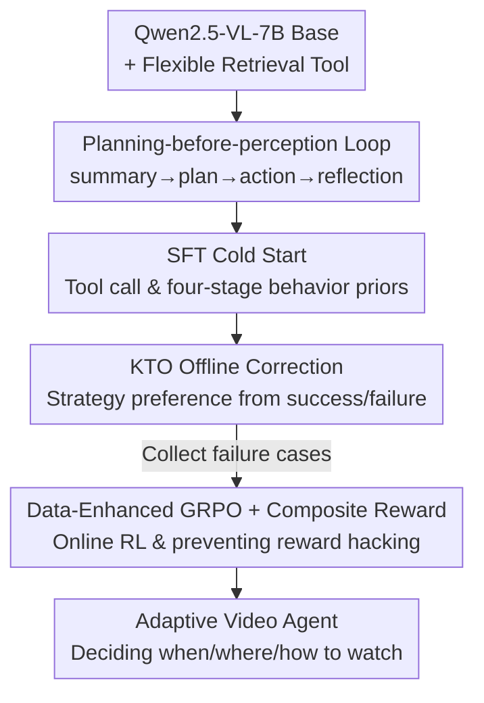

# EVA: Efficient Reinforcement Learning for End-to-End Video Agent

**Conference**: CVPR 2026  
**Paper**: [CVF Open Access](https://openaccess.thecvf.com/content/CVPR2026/html/Zhang_EVA_Efficient_Reinforcement_Learning_for_End-to-End_Video_Agent_CVPR_2026_paper.html)  
**Code**: Yes (SenseTime Research, link provided in the paper)  
**Area**: Reinforcement Learning / Video Understanding / Multimodal VLM  
**Keywords**: Video agent, reinforcement learning, GRPO, KTO, planning-before-perception  

## TL;DR
EVA models long video understanding as a "planning-before-perception" Markov Decision Process (MDP), enabling the MLLM agent to decide "which segment to watch, how many frames to sample, and at what resolution" based solely on the text question. Through a three-stage training pipeline (SFT Cold Start $\rightarrow$ KTO Offline Correction $\rightarrow$ Data-Enhanced GRPO), the model evolves from a format imitator to an active video explorer. It achieves a 6–12% accuracy improvement over general MLLMs and a 1–3% gain over existing adaptive agents using approximately 1/10 of the visual tokens across six video benchmarks.

## Background & Motivation
**Background**: The mainstream approach for video understanding using Multimodal Large Language Models (MLLMs) is to feed the entire video or several uniformly sampled frames as a "passive recognizer." Long videos, often thousands of seconds long, lead to extremely long token sequences filled with temporal redundancy.

**Limitations of Prior Work**: Passive frame feeding faces two major issues: uniform sampling either fills the context with redundant frames or misses critical frames due to insufficient evidence. Furthermore, presenting the entire video initially "anchors" the planning with noisy visual cues, biasing the model. Recent "agentic" methods (introducing frame-selection tools) are a step forward but still rely on **hand-crafted fixed workflows**: fixed sampling rates, single-dimensional actions (time intervals only), and a "perception-first" approach that starts with uniform sampling, which remains redundant and inefficient for long videos.

**Key Challenge**: There is a tension between perception efficiency and reasoning depth—comprehensive perception is accurate but expensive, while sparse perception is fast but prone to missing details. Existing methods treat MLLMs as "fixed components in a workflow," outputting predetermined parameters along a single control dimension without yielding true autonomy over "how to perceive."

**Goal**: To train an end-to-end autonomous video agent that can decide **when, what, and how** to watch based on the question and acquired visual evidence, and know when to stop and answer.

**Key Insight**: The authors propose the **planning-before-perception** paradigm. Before accessing any visual input, the agent reasons about the first step of frame retrieval based only on the text question. It then enters an iterative "Summary–Planning–Action–Reflection" loop to refine perception round by round.

**Core Idea**: Formulate video understanding as an MDP equipped with a flexible retrieval tool that controls the time window, frame count, and spatial resolution. This iterative reasoning strategy is trained through a three-stage pipeline: SFT Cold Start, KTO Correction, and GRPO Online Reinforcement.

## Method

### Overall Architecture
EVA treats video QA as a sequential decision process within an MDP. At each step $t$, the agent observes the belief state $s_t=\{q, h_t, F_t\}$, where $q$ is the user question, $h_t$ is the multimodal history, and $F_t$ is the visual evidence retrieved so far. The policy $\pi_\theta(a_t\mid s_t)$ outputs the next action. Crucially, **the initial state $s_0$ contains only the question**, forcing the model to plan before perceiving. The action space involves a flexible tool with four parameters: `start_time`, `end_time`, `nframes`, and `resize` (spatial downsampling for zoom-in/out).

In each round, the agent follows a **Summary → Planning → Action → Reflection** workflow: summarizing retrieved frames, planning candidate actions with cost-benefit estimates, executing tool calls, and reflecting on whether the evidence is sufficient to respond.

The training involves a three-stage pipeline:

### Key Designs

**1. Planning-before-perception: Video Understanding as an MDP + Flexible Tool**
This design addresses two perception-first pitfalls: uniform sampling redundancy and noisy initial visual cues. By setting $s_0$ to zero visual input, the agent must reason about where to look first. The tool expands the action space to a 3D joint control of time, frame count, and resolution. For instance, an agent might scan a 6600s video at low resolution to get a global view, then zoom in on a specific segment with high resolution to find the answer.

**2. SFT Cold Start: Injecting Behavior Priors**
Direct reinforcement learning is unstable without prior knowledge of tool formats. In this stage, a Teacher MLLM (Qwen2.5-VL-72B) generates high-quality trajectories on QA pairs from llava-video and cgbench. Data is organized into the four-stage format: Summary (forcing attention on visual evidence), Planning (cost-benefit analysis), Action (proper tool calls), and Reflection (handling "insufficient evidence" scenarios).

**3. KTO Offline Correction: Learning Preferences**
SFT provides the format but not the optimal strategy. Typical failures include "guessing when evidence is low" or "inefficient frame allocation." Kahneman–Tversky Optimization (KTO) is used to correct these bad behaviors before GRPO. KTO is preferred over DPO because it handles multi-turn interactions better using single-sample "chosen/rejected" labels. Trajectories where the agent answers despite insufficient tokens are labeled as rejected.

**4. Data-Enhanced GRPO + Composite Reward: Online RL**
Standard GRPO is limited by fixed datasets. **Data-Enhanced GRPO** iteratively collects failure cases from the KTO model and uses the Teacher MLLM to generate new, specialized QA pairs for retraining. The reward function is composite:
$$R(\tau)=w_{\mathrm{acc}}\,r_{\mathrm{acc}}+w_{\mathrm{fmt}}\,r_{\mathrm{fmt}}$$
Multiple-choice questions use a Completeness Self-Verification (CSV) reward where a base model acts as a judge; only if both the judge (given the frames) and EVA are correct is the reward $r_{\mathrm{csv}}=1$. Open-ended questions use ROUGE rewards. A small format reward (0.05) is given for tool calls which is lower than the expected accuracy of random guessing, preventing reward hacking.

### Loss & Training
The base model is Qwen2.5-VL-7B-Instruct. SFT is trained for 2 epochs (lr=2e-6); KTO preserves the lr with $\beta=0.1$. GRPO uses a mixture of 90% open-ended and 10% multi-choice data, trained on 32 H100 GPUs for 1 epoch (8 rollouts per sample, lr=1e-6).

## Key Experimental Results

### Main Results
On the sampling-limited benchmark LSDBench, EVA approaches large model accuracy with minimum tokens:

| Model | Frames | Visual Tokens | Acc (%) |
|------|------|-----------|-----------|
| Gemini-2.0-Flash | 2700 | 696.6k | 56.2 |
| Qwen2.5-VL | 768 | 499.2k | 52.5 |
| **EVA** | 76.9 | **10.3k** | **51.0** |

EVA achieves 51.0% using ~10k tokens (1/60th of Gemini), proving the efficiency of reasoning-driven planning.

Progress across three stages on long video benchmarks:

| Model | LongVideoBench | MLVU | VideoMME | LVBench |
|------|----------------|------|-------------------|---------|
| Qwen2.5-VL (32f) | 43.2 | 48.4 | 53.6 | 31.6 |
| EVA-SFT | 49.9 | 52.3 | 56.0 | 26.5 |
| EVA-KTO | 53.2 | 57.4 | 56.5 | 36.0 |
| **EVA-GRPO** | **55.0** | **68.3** | **60.2** | **43.3** |

On Video-Holmes, EVA-GRPO reaches 37.2%, surpassing Video-R1 (36.5%).

### Ablation Study

| Configuration | Trend | Note |
|------|---------|------|
| SFT only | High frames/rounds, low score | Only learns format, not efficiency |
| + KTO | Drastic reduction in frames/rounds | Corrects failure modes like guessing |
| + GRPO (Full) | Minimum frames, max rounds | Shifts to "sparse frames, intensive reasoning" |
| Pure MCQ Data | Lower VideoMME | Prone to reward hacking (guessing) |
| Mixed MCQ+OE | Highest VideoMME | Forces grounding of answers to visual evidence |

### Key Findings
- **Three-stage Evolutionary Path**: SFT teaches the format; KTO corrects efficiency; GRPO optimizes the trade-off, leading to more reasoning steps but fewer total frames.
- **Data Mixture Matters**: Pure MCQ data encourages guessing (reward hacking). Mixing with open-ended tasks forces the model to ground answers in visual evidence.
- **Reasoning does not equal high cost**: Although planning rounds increase, the total visual tokens—the primary cost driver—are significantly lower than uniform sampling baselines.

## Highlights & Insights
- **The "Planning-before-perception" paradigm** is counter-intuitively effective. By starting with zero visual input, it prevents noisy visual segments from biasing the initial reasoning.
- **3D action space control** (time, frames, resolution) enables sophisticated workflows like "coarse-to-fine" scanning that single-dimensional agents cannot perform.
- **KTO as an intermediate step** is a smart choice for multi-turn agents, as it doesn't require paired preference data and stabilizes online RL.
- **Low format reward (0.05)** is a practical trick to prevent agents from "faking" tool calls to farm rewards from random guessing.

## Limitations & Future Work
- **Static Toolsets**: The loop currently relies on predefined tool interfaces. Future work could involve self-evolving tools or larger tool ecosystems.
- **Complexity**: The three-stage pipeline and massive data generation requirements (SFT/KTO/RL) result in a high reproduction cost.
- **Memory**: The model could benefit from explicit cross-round memory to avoid redundant retrieval of adjacent frames in long videos.

## Related Work & Insights
- **vs Passive MLLMs**: EVA shifts from "passive recognition" to "sequential decision-making," saving 90% of tokens while maintaining accuracy.
- **vs Tool-based Agents**: Unlike FrameThinker or RHS, EVA uses a 3D action space and starts with "planning-before-perception."
- **vs Video-R1**: While Video-R1 applies RL to reasoning over uniform frames, EVA applies RL to the perception strategy itself.

## Rating
- **Novelty**: ⭐⭐⭐⭐⭐ (Elegant combination of MDP formulation and 3D perception control)
- **Experimental Thoroughness**: ⭐⭐⭐⭐ (Extensive benchmarks and ablations, though efficiency analysis is relative)
- **Writing Quality**: ⭐⭐⭐⭐ (Logic of the three stages is well-documented)
- **Value**: ⭐⭐⭐⭐⭐ (Highly practical for efficient long video processing and agentic RL)

## Related Papers

- [\[ICML 2026\] You Can Learn Tokenization End-to-End with Reinforcement Learning](../../ICML2026/reinforcement_learning/you_can_learn_tokenization_end-to-end_with_reinforcement_learning.md)
- [\[CVPR 2026\] VideoSSR: Video Self-Supervised Reinforcement Learning](videossr_video_self-supervised_reinforcement_learning.md)
- [\[CVPR 2026\] Reading or Reasoning? Format Decoupled Reinforcement Learning for Document OCR](reading_or_reasoning_format_decoupled_reinforcement_learning_for_document_ocr.md)
- [\[CVPR 2026\] PlannerRFT: Reinforcing Diffusion Planners through Closed-Loop and Sample-Efficient Fine-Tuning](plannerrft_reinforcing_diffusion_planners.md)
- [\[CVPR 2026\] Cross-modal Identity Mapping: Minimizing Information Loss in Modality Conversion via Reinforcement Learning](cross-modal_identity_mapping_minimizing_information_loss_in_modality_conversion_.md)

<!-- RELATED:END -->

<!-- RELATED:START -->

## Related Papers

- [\[ICML 2026\] You Can Learn Tokenization End-to-End with Reinforcement Learning](../../ICML2026/reinforcement_learning/you_can_learn_tokenization_end-to-end_with_reinforcement_learning.md)
- [\[ICLR 2026\] ComputerRL: Scaling End-to-End Online Reinforcement Learning for Computer Use Agents](../../ICLR2026/reinforcement_learning/computerrl_scaling_end-to-end_online_reinforcement_learning_for_computer_use_age.md)
- [\[CVPR 2026\] PlannerRFT: Reinforcing Diffusion Planners through Closed-Loop and Sample-Efficient Fine-Tuning](plannerrft_reinforcing_diffusion_planners.md)
- [\[CVPR 2026\] Cross-modal Identity Mapping: Minimizing Information Loss in Modality Conversion via Reinforcement Learning](cross-modal_identity_mapping_minimizing_information_loss_in_modality_conversion_.md)
- [\[CVPR 2026\] PanoEnv: Exploring 3D Spatial Intelligence in Panoramic Environments with Reinforcement Learning](panoenv_exploring_3d_spatial_intelligence_in_panoramic_environments_with_reinfor.md)

<!-- RELATED:END -->
