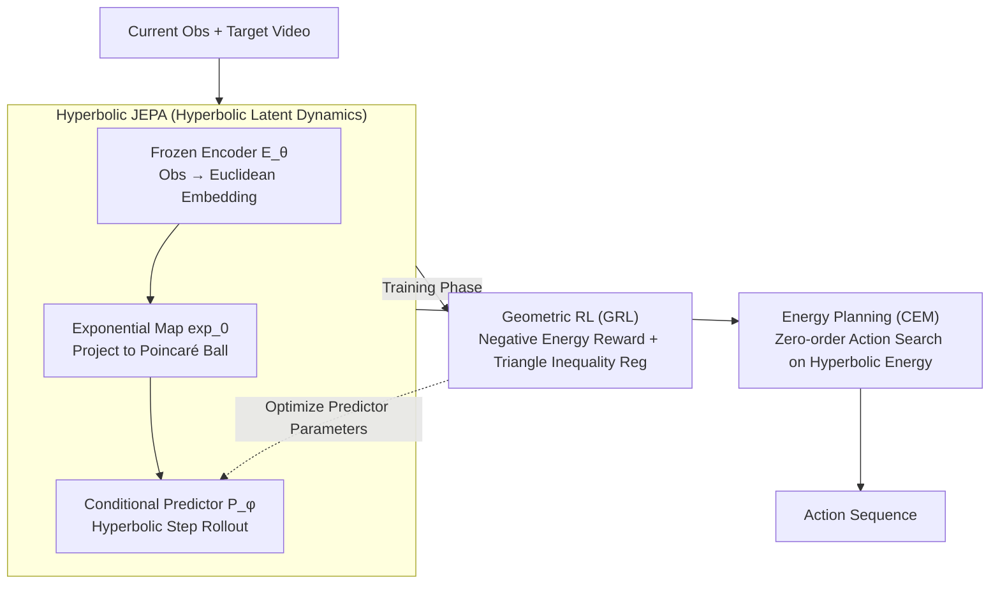

# GeoWorld: Geometric World Models

**Conference**: CVPR 2026  
**arXiv**: [2602.23058](https://arxiv.org/abs/2602.23058)  
**Code**: [https://steve-zeyu-zhang.github.io/GeoWorld](https://steve-zeyu-zhang.github.io/GeoWorld)  
**Area**: Reinforcement Learning  
**Keywords**: Geometric World Models, Hyperbolic Space, JEPA, Reinforcement Learning, Long-term Planning

## TL;DR
GeoWorld maps the latent representations of predictive world models from Euclidean space onto hyperbolic manifolds. By maintaining geometric structures and hierarchical relationships through Hyperbolic JEPA and employing Geometric Reinforcement Learning to optimize multi-step planning, it achieves improvements of approximately 3% SR (3 steps) and 2% SR (4 steps) on CrossTask and COIN.

## Background & Motivation

**Background**: World models are categorized into generative and predictive types. Generative world models (e.g., VideoWorld) explicitly produce pixels or visual tokens to predict the next step but lack global perception of the entire trajectory structure and energy landscape. Predictive world models (e.g., JEPA, V-JEPA 2) do not generate pixels; instead, they learn an energy landscape in latent space to measure the compatibility between current and target states, supporting multi-step hierarchical planning.

**Limitations of Prior Work**: Existing predictive world models face two key issues: (1) Geometric neglect—latent representations are learned in Euclidean space, failing to preserve intrinsic geometric structures and hierarchical relationships between states, which leads to an energy landscape that cannot capture meaningful geodesic distances; (2) Multi-step degradation—multi-step video data is scarce and expensive, and models trained primarily on single-step transitions suffer rapid performance decline as the horizon increases, despite being conceptually capable of long-term planning.

**Key Challenge**: The "flat" structure of Euclidean space cannot naturally encode hierarchical relationships of real-world states (e.g., "chopping vegetables" is a sub-step of "cooking"). Forcing long-range dependencies into Euclidean space leads to geometric drift.

**Goal**: (1) How to maintain geometric and hierarchical structures in latent space? (2) How to improve the stability of multi-step planning given limited training data?

**Key Insight**: The tree-like structure of hyperbolic space is naturally suited for encoding hierarchical relationships (where distance grows exponentially with levels), and hyperbolic geodesics provide the most natural concept of a "shortest path." Combining reinforcement learning to optimize the predictor's energy function allows trajectories to progress along these geodesics.

**Core Idea**: Elevate the latent dynamics of JEPA from Euclidean space to hyperbolic manifolds and optimize geodesic consistency in multi-step planning using Geometric Reinforcement Learning.

## Method

### Overall Architecture
GeoWorld addresses procedural planning: given current video observations and a target video, it outputs an action sequence to transition the state to the target. It follows the "predictive world model" approach of JEPA—rather than decoding pixels, it learns an energy landscape in latent space to measure state compatibility—but shifts the entire dynamics to a hyperbolic manifold. The pipeline functions as follows: a frozen encoder first encodes observations into Euclidean embeddings, which are projected onto a Poincaré ball via an exponential map; a conditional predictor perform successive rollouts of future states in hyperbolic space; during training, beyond standard prediction loss, Geometric Reinforcement Learning (GRL) directly optimizes the geodesic consistency of multi-step planning; during inference, the Cross-Entropy Method (CEM) searches for the optimal action sequence based on energy derived from hyperbolic distances. Three key designs—Hyperbolic JEPA, GRL, and CEM—address "geometric structure," "multi-step degradation," and "action search" respectively.

### Key Designs

**1. Hyperbolic JEPA: Elevating Latent Dynamics to Hyperbolic Manifolds**

Predictive world models traditionally learn energy landscapes in Euclidean space. However, Euclidean space is "flat" and cannot naturally encode hierarchical relationships like "chopping is a sub-step of cooking," meaning learned geodesic distances lack semantic significance. H-JEPA leverages the exponential volume of hyperbolic space to embed tree structures: a pre-trained frozen encoder $E_\theta$ encodes observation $x_t$ into Euclidean embedding $s_t^x \in \mathbb{R}^n$, which is treated as a tangent vector in the tangent space of the origin and projected to hyperbolic space via the Poincaré ball exponential map:

$$s_{t,\mathbb{H}}^x = \exp_0(s_t^x) = \tanh(\sqrt{c}\|s_t^x\|) \frac{s_t^x}{\sqrt{c}\|s_t^x\|},$$

where curvature $c$ is a learnable parameter. The conditional predictor $P_\phi$ receives hyperbolic state and action sequences to predict the next state. Training objectives are based on hyperbolic geodesic distance $d_\mathbb{H}$: teacher-forcing loss ensures single-step accuracy, and rollout loss maintains consistency in recursive predictions. Because hyperbolic volume grows exponentially with the radius, it provides the optimal space for tree embeddings, making geodesic distances more reflective of semantic hierarchies than Euclidean distances.

**2. Geometric Reinforcement Learning: Optimizing Multi-step Planning via Energy**

Since multi-step video data is scarce, models trained on single-step transitions suffer from performance decay over long horizons—a gap supervised learning alone cannot fill. GRL defines planning goals directly as rewards to optimize the predictor. Energy cost is defined as the hyperbolic distance between predicted and target states $c_t = d_\mathbb{H}(\hat{s}_{t+1,\mathbb{H}}^x, s_{t+1,\mathbb{H}}^x)$, with reward as the negative energy. The path value function is the expected cumulative reward $V = \mathbb{E}[\sum \gamma^{t-1} r_t]$, where the optimal value corresponds to minimizing cumulative distance. Its core innovation is a triangle inequality regularization:

$$\mathcal{L}_\Delta = \frac{1}{T-2}\sum\big[d_\mathbb{H}(\hat{s}_t, \hat{s}_{t+2}) - d_\mathbb{H}(\hat{s}_t, \hat{s}_{t+1}) - d_\mathbb{H}(\hat{s}_{t+1}, \hat{s}_{t+2})\big]_+,$$

which forces the distance of a two-step jump to not exceed the sum of individual steps, pinning the predicted trajectory to a geodesic—a constraint difficult to enforce explicitly in Euclidean space. Total loss is $\mathcal{L}_{\text{GRL}} = \text{Cumulative Geodesic Distance} + \beta \mathcal{L}_\Delta$. GRL requires no additional policy network; rewards derive from geometry, optimizing the predictor's own parameters.

**3. Energy Planning (CEM): Action Discovery as Zero-order Search**

With a hyperbolic energy landscape, inference does not require training a policy; instead, it uses direct search. Given observations and a target, they are encoded into hyperbolic space. Energy cost is defined as $C = d_\mathbb{H}(P((\hat{a}_t); s_{1,\mathbb{H}}^x), s_{1+T,\mathbb{H}}^x)$. The Cross-Entropy Method (CEM) iteratively approximates the action sequence that minimizes energy—sampling $N=800$ candidates, retaining $K=80$ elites to update the sampling distribution over $I=10$ iterations. CEM performs zero-order optimization, requiring no gradients relative to actions, making it suitable for high-dimensional action spaces.

### Loss & Training
Two-stage training: (1) Supervised Fine-Tuning (SFT) phase: $\mathcal{L}_{\text{SFT}} = \lambda \mathcal{L}_{\text{TF}} + (1-\lambda) \mathcal{L}_{\text{rollout}}$, using AdamW optimizer, warmup → constant → decay schedule, batch size 256, approx. 94,500 iterations. (2) GRL phase: lower learning rate, shorter schedule, batch size 128, approx. 25,000 iterations, $\gamma=0.99$, $\beta=0.1$. The predictor is a ~300M parameter Transformer (24 layers, 16 heads, 1024D). Training performed on 4 nodes with 32 H100 GPUs.

## Key Experimental Results

### Main Results — Procedural Planning (Image Input)

| Method | CrossTask T=3 SR | CrossTask T=4 SR | COIN T=3 SR | COIN T=4 SR |
|------|-----------------|-----------------|-------------|-------------|
| V-JEPA 2 ViT-g384 | 45.58 | 31.36 | 34.08 | 23.43 |
| **Ours (GeoWorld) ViT-g384** | **47.47** | **31.48** | **34.85** | **27.79** |
| SCHEMA (LLM) | 38.93 | 24.50 | 32.09 | 22.02 |
| MTID (Generative) | 40.45 | 24.76 | 30.44 | 22.74 |

### Main Results — Visual Planning with Videos

| Method | CrossTask T=3 SR | CrossTask T=4 SR | COIN T=3 SR | COIN T=4 SR |
|------|-----------------|-----------------|-------------|-------------|
| V-JEPA 2 ViT-g384 | 50.16 | 35.01 | 42.74 | 31.63 |
| **Ours (GeoWorld) ViT-g384** | **51.71** | **37.04** | **45.29** | **33.29** |
| GPT-5 | 50.03 | 30.20 | 43.84 | 32.64 |
| VideoWorld | 41.59 | 25.50 | 34.88 | 23.74 |

### Long-term Planning (CrossTask)

| Method | T=3 | T=4 | T=5 | T=6 |
|------|-----|-----|-----|-----|
| V-JEPA 2 ViT-g384 | 50.16 | 35.01 | 23.17 | 16.88 |
| **Ours (GeoWorld) ViT-g384** | **51.71** | **37.04** | **24.83** | **18.26** |

### Key Findings
- **Ours** consistently outperforms V-JEPA 2 across all model scales (ViT-L/H/g/g384), indicating improvements are scale-independent.
- As the planning horizon increases (T=3→T=6), the advantage of **Ours** over V-JEPA 2 widens, with an SR gain of 1.38% at T=6 (18.26 vs 16.88), validating enhanced long-term planning stability.
- mIoU improvements are most significant (e.g., CrossTask T=3: 86.55 vs 69.42), showing hyperbolic representations maximize trajectory overlap.
- GeoWorld ViT-g384 outperforms GPT-5 and Gemini 2.5 Pro in video planning settings.

## Highlights & Insights
- Integrating hyperbolic geometry into world models is an elegant design. The hierarchy of daily activities (e.g., "Making Coffee" → "Grinding, Boiling, Brewing") is inherently tree-like, and hyperbolic space is the optimal embedding space for trees. This geometric inductive bias is more efficient than mere scaling.
- The GRL design is clever as it uses geodesic distance directly as a reward without requiring an external reward model. The triangle inequality regularization ensures geometric consistency, a constraint not easily imposed in Euclidean space.
- The two-stage training (SFT → GRL) resembles the SFT → RLHF flow in LLMs, but the objective function is entirely based on geometric principles rather than human preference.

## Limitations & Future Work
- Evaluation is limited to CrossTask and COIN, where action spaces are relatively simple (daily activities). Performance in complex robotics or gaming environments remains unknown.
- The curvature $c$ of the Poincaré ball is learned but shared across all states. Different hierarchy levels or subspaces might requires distinct curvatures.
- The encoder is frozen; H-JEPA only trains the predictor. If the encoder's own representations are ill-suited for hyperbolic space, the performance ceiling is restricted.
- Absolute SR values remain low under long horizons (18.26% at T=6), indicating long-term planning remains a core challenge.

## Related Work & Insights
- **vs V-JEPA 2**: Both are predictive world models. **Ours** achieves consistent gains via hyperbolic mapping and GRL using the same backbone and data. Both use the same frozen encoder for fair comparison.
- **vs VideoWorld**: Generative world models require pixel decoding and are significantly weaker than **Ours** in planning settings.
- **vs GPT-5/Gemini 2.5 Pro**: Strong LLM baselines are competitive in zero-shot settings, but GeoWorld ViT-g384 surpasses them in video planning, showing specialized geometric models still hold an advantage.

## Rating
- Novelty: ⭐⭐⭐⭐⭐ Bringing hyperbolic space, world models, and geometric RL together is a first in visual planning with strong theoretical and technical execution.
- Experimental Thoroughness: ⭐⭐⭐⭐ Multiple datasets, baselines, and model scales. However, limited to two datasets and lacks some ablation details.
- Writing Quality: ⭐⭐⭐⭐ Rigorous mathematical derivation, though heavy notation presents a learning curve.
- Value: ⭐⭐⭐⭐ Proposes a promising direction for geometric world models and outperforms GPT-5 class baselines.

<!-- RELATED:START -->

## Related Papers

- [\[CVPR 2026\] DreamSAC: Learning Hamiltonian World Models via Symmetry Exploration](dreamsac_learning_hamiltonian_world_models_via_symmetry_exploration.md)
- [\[CVPR 2026\] Cloning Deterministic Worlds: The Critical Role of Latent Geometry in Long-Horizon World Models](cloning_deterministic_worlds_the_critical_role_of_latent_geometry_in_long-horizo.md)
- [\[CVPR 2026\] Talk2Move: Reinforcement Learning for Text-Instructed Object-Level Geometric Transformation in Scenes](talk2move_reinforcement_learning_for_text-instructed_object-level_geometric_tran.md)
- [\[ICLR 2026\] Geometric-Mean Policy Optimization](../../ICLR2026/reinforcement_learning/geometric-mean_policy_optimization.md)
- [\[ICLR 2026\] Composition of Memory Experts for Diffusion World Models](../../ICLR2026/reinforcement_learning/composition_of_memory_experts_for_diffusion_world_models.md)

<!-- RELATED:END -->
