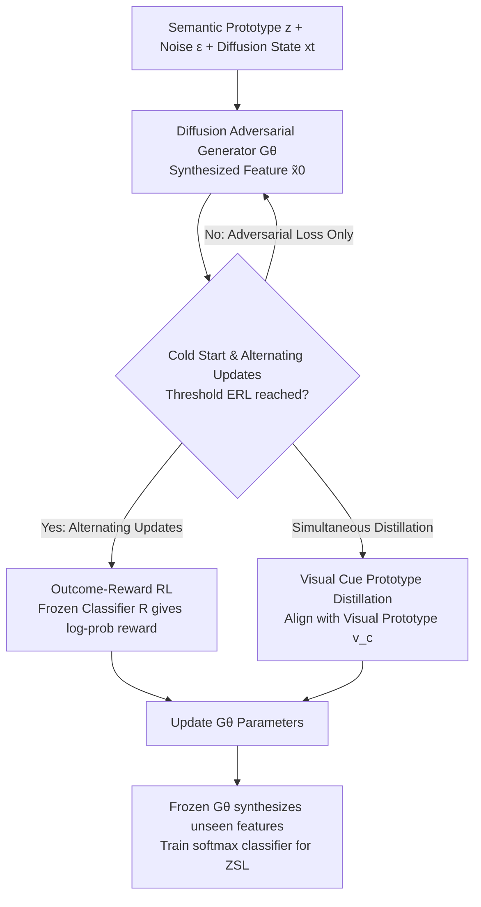

# Incentivizing Generative Zero-Shot Learning via Outcome-Reward Reinforcement Learning with Visual Cues

**Conference**: CVPR 2026  
**Paper**: [CVF Open Access](https://openaccess.thecvf.com/content/CVPR2026/html/Hou_Incentivizing_Generative_Zero-Shot_Learning_via_Outcome_Reward_Reinforcement_Learning_with_Visual_CVPR_2026_paper.html)  
**Area**: Reinforcement Learning / Generative Zero-Shot Learning  
**Keywords**: Zero-Shot Learning, Outcome-Reward RL, Feature Generation, Visual Prototype Distillation, Cold Start

## TL;DR
RLVC treats the feature generator in generative zero-shot learning as an RL policy. It utilizes outcome rewards based on "correct classification" from a frozen classifier to drive generator self-evolution, combined with class-level visual cues for prototype distillation to stabilize training. It achieves new SOTA on CUB, SUN, and AWA2 benchmarks (e.g., 90.1% CZSL accuracy and 81.2% GZSL harmonic mean on CUB).

## Background & Motivation
**Background**: The mainstream approach for generative zero-shot learning (ZSL) involves using VAE, GAN, or Diffusion models. These models are conditioned on semantic prototypes (attribute vectors or text embeddings) to synthesize visual features for unseen classes. This transforms ZSL into a data augmentation problem where a standard classifier is trained on synthetic data.

**Limitations of Prior Work**: The authors identify two specific issues. First, **the generator and the downstream classifier are trained independently**. Generators are optimized via adversarial loss to match the real distribution, but they lack feedback on whether the features are discriminative. This results in task-agnostic features that are suboptimal for classification. Second, **relying solely on semantic conditions causes confusion between similar classes**. For instance, species like "Indigo Bunting," "Lazuli Bunting," and "Painted Bunting" have highly similar semantic descriptions but distinct visual appearances. Synthesizing features based only on semantic prototypes leads to significant class overlap.

**Key Challenge**: There is a mismatch between generative capability (synthesizing plausible distributions) and discriminative requirements (synthesizing features that are easily classified). Adversarial loss optimizes the former, while ZSL requires the latter. Furthermore, "weak supervision" from semantic prototypes is insufficient to separate visually similar categories.

**Goal**: To align the generation process directly with downstream classification objectives while injecting more reliable supervision for visually similar categories, thereby synthesizing features that are both faithful to the data distribution and useful for classification.

**Key Insight**: Drawing inspiration from the success of RL in LLM post-training (e.g., DeepSeek-R1, o1) and visual self-evolution (e.g., Visual-RFT, VPRL), the authors leverage "trial-and-error" with rewards to drive model evolution. RL's outcome-oriented optimization naturally links generation with downstream targets. The authors propose a novel perspective: **viewing the generator as a policy and training it via outcome rewards**. This is the first integration of RL into generative ZSL.

**Core Idea**: The probability of a synthetic feature being correctly classified is used as the outcome reward to update the generator (policy). Simultaneously, class-level visual prototypes extracted from real seen features are used for distillation to anchor synthetic features to real visual centers and stabilize RL training.

## Method

### Overall Architecture
RLVC takes class semantic prototypes $z^c$ and Gaussian noise $\epsilon$ as input to synthesize classification-friendly features for unseen classes. The system operates in two stages: **Reward Model Training**, where a visual encoder (ViT) and a frozen linear classifier $R$ are trained to produce reward signals; and **Policy Training**, where a diffusion-based adversarial generator $G_\theta$ acts as the policy, updated via outcome rewards and visual prototype distillation. A crucial strategy is the "Cold Start + Alternating Updates" schedule: the generator is initially trained only with adversarial loss until it gains basic discriminative capability (reaching threshold $E_{RL}$), after which RL is activated. Updates then alternate between adversarial/distillation loss and RL loss to prevent gradient conflict.

The base framework utilizes a diffusion-based adversarial structure. The generator $G_\theta$ receives $z^c$, $\epsilon$, diffusion state $x_t$, and timestep $t$ to output $\tilde{x}_0 = G_\theta(\epsilon, z^c, x_t, t)$. Two discriminators $D_{x_0}$ (clean features) and $D_{x_t}$ (state transitions) are trained using WGAN objectives with gradient penalty. The primary innovations lie in the three following designs.

### Key Designs

**1. Outcome-Reward Reinforcement Learning: Driving Evolution via Classification Success**

This design addresses the "task-agnostic features" problem. The generator $G_\theta$ is treated as a policy, and a **frozen linear classifier** $R(x) = Wx + b$ acts as the reward model. Given a synthetic feature $\tilde{x}_0$, it is passed through $R$ and a softmax layer to get the class probability $p(y \mid \tilde{x}_0) = \mathrm{softmax}(R(\tilde{x}_0))_y$. The log-probability of the ground-truth class serves as the outcome reward:

$$r = \log p(y \mid \tilde{x}_0)$$

The intuition is that higher confidence from the reward model leads to higher rewards, pushing the generator to produce features that are easier to classify. To stabilize training, an exponential moving average (EMA) baseline $b \leftarrow \alpha b + (1-\alpha)\frac{1}{B}\sum_i r_i$ ($\alpha=0.9$) is maintained. The advantage is calculated as $\hat{r}_i = r_i - b$, and a stop-gradient is applied to treat it as a constant: $\hat{A}_i = \mathrm{sg}[\hat{r}_i]$. The RL objective is $L_{RL} = -\frac{1}{B}\sum_i \hat{A}_i \log p(y_i \mid \tilde{x}_{0,i})$. Gradients propagate through the frozen $R$ back to $G_\theta$.

**2. Class-Level Visual Cues + Prototype Distillation: Injecting Visual Centers**

Semantic conditions alone cannot distinguish visually similar but semantically related categories. Furthermore, RL requires regularization to prevent distribution drift. The authors extract **class-level visual prototypes** by averaging fine-tuned real features $x_i^s$ for each seen class $c$: $v^c = \frac{1}{|I_c|}\sum_{i \in I_c} x_i^s$. A prototype distillation loss pulls synthetic features toward these visual centers:

$$L_{PD} = \frac{1}{B}\sum_{i=1}^{B}\left(1 - \frac{\tilde{x}_{0,i}^\top v^{c_i}}{\|\tilde{x}_{0,i}\|_2\,\|v^{c_i}\|_2}\right)$$

This is integrated into the generator update: $L_G^{total} = L_G^{adv} + \lambda_{PD}L_{PD}$. These prototypes provide visual center information that is more effective than semantic prototypes at separating similar categories and act as a regularizer for RL optimization.

**3. Cold Start + Alternating Updates: Preventing Gradient Conflict**

Training with RL from the start is problematic due to noisy signals from an immature generator and potential gradient conflicts with adversarial loss. borrowing from LLM post-training, RL is only activated after $E_{RL}$ epochs (30 for CUB/SUN, 7 for AWA2). Once active, each iteration **alternates** between $L_G^{total}$ and $L_{RL}$ updates for $G_\theta$, rather than summing the losses. This ensures optimization stability.

## Key Experimental Results

### Main Results
Performance was evaluated on CUB, SUN, and AWA2. Acc denotes CZSL unseen class accuracy; U/S/H denote unseen/seen/harmonic mean for GZSL.

| Dataset | Metric | RLVC | Prev. SOTA (VADS) | Prev. Best Embedding |
|---------|--------|------|-------------------|----------------------|
| CUB     | Acc / H | **90.1 / 81.2** | 86.8 / 74.3 | 80.6 / 75.7 (VSPCN) |
| SUN     | Acc / H | **77.7 / 57.6** | 76.3 / 55.7 | 75.3 / 54.8 (PSVMA+) |
| AWA2    | Acc / H | **84.0 / 80.4** | 82.5 / 79.3 | 79.2 / 79.8 (PSVMA+) |

RLVC achieves SOTA on most metrics, with an average gain of approximately 4.7%. On CUB, it outperforms even large-scale pre-trained CLIP-based methods.

### Ablation Study
Component ablation (Acc / H):

| Configuration | CUB | SUN | AWA2 |
|---------------|-----|-----|------|
| Full RLVC     | 90.1 / 81.2 | 77.7 / 57.6 | 84.0 / 80.4 |
| w/o RL & Visual Cues | 88.6 / 75.1 | 75.8 / 55.1 | 75.7 / 72.8 |
| w/o RL        | 89.2 / 80.1 | 76.1 / 55.6 | 79.4 / 73.9 |
| w/o Visual Cues | 88.9 / 79.2 | 77.0 / 56.9 | 74.9 / 76.6 |

### Key Findings
- **RL provides the most significant gain**, especially on AWA2. Removing RL drops AWA2 performance from 84.0/80.4 to 79.4/73.9, highlighting the importance of task alignment.
- **Visual cues are essential** for stabilization. Removing prototype distillation degrades performance across all benchmarks.
- **Jointly fine-tuning the visual encoder** is beneficial for GZSL, as it injects dataset-specific priors and mitigates domain bias, improving H by up to 4.1%.
- **EMA advantages outperform raw rewards**, proving that standard RL optimization techniques are effective here even with a simple reward structure.

## Highlights & Insights
- **Clean RL Integration**: The bridge between "Generator = Policy" and "Classification Probability = Reward" is elegantly simple. Using a frozen linear classifier allows gradients to propagate without the complexity of heavy algorithms like PPO or GRPO.
- **Dual-Purpose Visual Cues**: They serve simultaneously as discriminative supervision to separate similar classes and as RL regularization to prevent policy drift.
- **Portable Engineering Recipe**: The "Cold Start + Alternating Updates" strategy is a lightweight solution for any scenario where RL is added to adversarial training to avoid gradient conflicts.

## Limitations & Future Work
- **Static Reward Model**: Reward quality is capped by the frozen linear classifier; misleading signals may occur for extremely difficult classes.
- **Sparse/Flat Rewards**: Training curves show raw rewards are relatively flat, necessitating EMA for stability. Effectiveness may be dataset-dependent.
- **Heuristic Reliance**: Thresholds like $E_{RL}$ and coefficients like $\lambda_{PD}$ require dataset-specific tuning.
- **Feature-Level Restriction**: The method is validated on visual features rather than image pixels, and its extension to open-set recognition remains to be verified.

## Related Work & Insights
- **vs VADS (CVPR'24)**: VADS focuses on evolving semantic prototypes. RLVC takes a different dimension by using outcome rewards to evolve the generator, showing that RL gains are complementary to improved prototype alignment.
- **vs Traditional Generative ZSL (FREE, etc.)**: Traditional methods produce task-agnostic features; RLVC adds a direct classification-target supervision layer.
- **Inspiration**: Reward models do not need to be complex; a log-probability from a frozen classifier can provide effective task-aligned supervision.

## Rating
- Novelty: ⭐⭐⭐⭐⭐ 
- Experimental Thoroughness: ⭐⭐⭐⭐ 
- Writing Quality: ⭐⭐⭐⭐ 
- Value: ⭐⭐⭐⭐ 

<!-- RELATED:START -->

## Related Papers

- [\[CVPR 2026\] MSRL: Scaling Generative Multimodal Reward Modeling via Multi-Stage Reinforcement Learning](msrl_scaling_generative_multimodal_reward_modeling.md)
- [\[ICML 2026\] Unlocking Zero-Shot Geospatial Reasoning via Indirect Rewards](../../ICML2026/reinforcement_learning/unlocking_zero-shot_geospatial_reasoning_via_indirect_rewards.md)
- [\[CVPR 2026\] TSTM: Temporal Segmentation for Task-relevant Mask in Visual Reinforcement Learning Generalization](tstm_temporal_segmentation_for_task-relevant_mask_in_visual_reinforcement_learni.md)
- [\[CVPR 2026\] CCCaption: Dual-Reward Reinforcement Learning for Complete and Correct Image Captioning](cccaption_dual-reward_reinforcement_learning_for_complete_and_correct_image_capt.md)
- [\[ICLR 2026\] Offline Reinforcement Learning with Generative Trajectory Policies](../../ICLR2026/reinforcement_learning/offline_reinforcement_learning_with_generative_trajectory_policies.md)

<!-- RELATED:END -->
