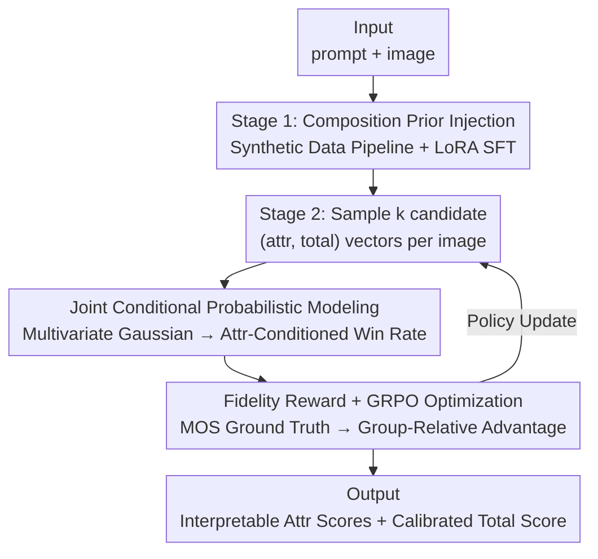

# JoPPO: Hierarchical Photography Assessment via Contrastive Joint Conditional Probabilistic Reinforcement Learning

**Conference**: CVPR 2026  
**Paper**: [CVF Open Access](https://openaccess.thecvf.com/content/CVPR2026/html/Yang_JoPPO_Hierarchical_Photography_Assessment_via_Contrastive_Joint_Conditional_Probabilistic_Reinforcement_CVPR_2026_paper.html)  
**Code**: https://github.com/SpatialVision-Research/JoPPO_CVPR2026  
**Area**: Reinforcement Learning / VLM-as-a-Judge / Image Aesthetic Assessment  
**Keywords**: Image Aesthetic Assessment, GRPO, Conditional Gaussian, Pairwise Win Rate, VLM Judge

## TL;DR
JoPPO upgrades "using VLMs to score image aesthetics" from regressing a single global score to modeling the joint Gaussian distribution of attribute scores and total scores across a batch. By deriving attribute-conditional pairwise win rates and utilizing them as rewards in GRPO to train the judge, the model provides interpretable multi-attribute sub-scores while significantly exceeding GPT-4o in ranking consistency.

## Background & Motivation

**Background**: Utilizing Large Models as judges (LLM/VLM-as-a-Judge) to score and rank generated content has become the mainstream evaluation method for open-ended tasks. In the language domain, judges like JudgeLM and Prometheus exist, while the vision domain has seen SFT-trained judges like Prometheus-Vision, which output scores alongside natural language justifications. Subsequently, several works (VisualQuality-R1, Aes-R1, Q-Insight) have further employed Reinforcement Learning (mostly based on GRPO) to train judges, directly aligning them with the "who is better" comparison objective.

**Limitations of Prior Work**: Judges trained purely via SFT learn an "input $\rightarrow$ score" mapping, but their confidence scores do not reliably reflect the probability that "A is truly better than B"—scoring is easily influenced by prompt phrasing and data distribution shifts, leading to low discriminative power. While existing RL-based judges optimize the comparison objective directly, they generally regress a single global score and lack probability modeling "conditioned on attributes." They cannot explain "why A wins" nor unify fine-grained attributes like composition, lighting, and color with overall judgment into a coherent probabilistic space.

**Key Challenge**: Aesthetic judgment is inherently **compositional**—overall beauty is synthesized from multiple attributes such as composition, lighting, color, and geometry. However, traditional probabilistic ranking models (e.g., Thurstone) only model pairwise comparisons for a single score. Extending this to multiple attributes requires calculating ranking probabilities for each dimension independently, which is computationally expensive and fragments the dependency structure between "attribute scores $\leftrightarrow$ total score." Consequently, judges either focus solely on global impression (losing interpretability) or split into independent dimensions (losing consistency).

**Goal**: To train a judge capable of **compositional reasoning**—one that identifies attributes like composition, lighting, color, and geometry first, then provides an interpretable overall judgment accordingly, ensuring that "who wins and by how much" is self-consistent within a unified probabilistic framework.

**Key Insight**: The authors extend the Thurstone hypothesis from a "single-score Gaussian" to a "multivariate Gaussian of attribute scores + total score." By utilizing the analytical formula for conditional Gaussians, they derive a closed-form win rate for "the probability that total score of $i$ is higher than $j$, given their attribute scores." This win rate naturally encodes the dependency between attributes and the total score while avoiding the overhead of dimension-wise ranking probability calculations.

**Core Idea**: Use the "joint Gaussian pairwise win rate conditioned on attributes" as a reward and integrate it into GRPO for intra-group contrastive optimization, termed JoPPO (Joint Probabilistic Policy Optimization).

## Method

### Overall Architecture
JoPPO is a two-stage training paradigm based on the Qwen2.5-VL-7B backbone. **Stage 1** uses SFT to inject "photography composition priors" into the VLM. Through an automated data generation pipeline, PICD composition annotations, ControlNet synthetic images, and LLM-generated reasoning text are converted into structured composition/perspective/aesthetic reasoning data. LoRA fine-tuning is then applied to equip the model with multi-dimensional perception. **Stage 2** is JoPPO Reinforcement Learning: for a batch of images, multiple candidate scoring vectors (attribute scores + total score) are sampled for each image. The joint Gaussian conditional modeling calculates "attribute-conditional pairwise win rates" between candidates. These win rates are combined with human MOS (Mean Opinion Score) ground-truth preferences to form a fidelity reward. Finally, the policy is updated using GRPO's group-relative standard advantage, clipping ratio, and KL regularization.

The input consists of "a text prompt $q$ + an image $x$." The model outputs $d$ attribute scores (range $[-1, 1]$), a global aesthetic score $s$ (range $[0, 1]$), and a natural language explanation. After training, the model can perform zero-shot scoring and ranking for new images.

### Key Designs

**1. Composition Prior Injection: Injecting "compositional understanding" via synthetic data**

When general VLMs are used directly as aesthetic judges, they often fail to "understand" professional photography concepts like composition and perspective, which are crucial for overall perception. This work uses Stage 1 SFT to fill this gap. Since real samples with composition annotations are scarce, the authors designed an automated data generation pipeline: explicit labels (composition, perspective) are extracted from the PICD dataset, and high-quality images are synthesized via ControlNet conditioned on depth maps and Canny edges to expand long-tail cases. Each generated image is paired with a "comprehensive visual prompt" and routed to LLMs (Qwen/Gemini/GPT) to produce text-aligned reasoning. A template pool covering "composition recognition, perspective discrimination, and aesthetic estimation" ensures data diversity and logical consistency. Finally, Qwen2.5-VL-7B is fine-tuned with LoRA (rank=64). Ablation shows this step is vital for PICD (accuracy drops 27.6% without SFT), providing the semantic foundation for subsequent multi-attribute modeling.

**2. Joint Conditional Gaussian Modeling: Analytical derivation of "multi-attribute win rates"**

This is the theoretical core of the paper, addressing the limitation that "traditional ranking models only handle single-score comparisons, and extending them to multiple attributes is either computationally explosive or structurally inconsistent." The classical Thurstone model assumes aesthetic judgments follow a Gaussian distribution, where the pairwise win rate is:

$$p_\theta(i > j) = \Phi\!\left(\frac{\mu_{s_i} - \mu_{s_j}}{\sqrt{\sigma_{s_i}^2 + \sigma_{s_j}^2 + \gamma}}\right)$$

where $\Phi(\cdot)$ is the standard normal CDF and $\gamma$ is a stability constant. JoPPO extends this from a "single score" to a "joint multivariate Gaussian of attribute scores $A$ and total score $S$": $\begin{pmatrix}A\\S\end{pmatrix} \sim \mathcal{N}\!\left(\begin{pmatrix}\mu_A\\\mu_S\end{pmatrix}, \begin{pmatrix}\Sigma_{AA} & \Sigma_{AS}\\\Sigma_{SA} & \sigma_{SS}\end{pmatrix}\right)$. Using the closed-form solution for Gaussian conditional distributions, given attribute scores $a$, the conditional mean and variance of the total score are:

$$\mu_{S|a} = \mu_S + \Sigma_{SA}\Sigma_{AA}^{-1}(a - \mu_A), \qquad \sigma^2_{S|a} = \sigma_{SS} - \Sigma_{SA}\Sigma_{AA}^{-1}\Sigma_{AS}$$

The "attribute-conditional pairwise win rate" for any two candidates $(a_i^{(m)}, s_i^{(m)})$ and $(a_j^{(n)}, s_j^{(n)})$ can then be substituted back into the Thurstone form: $p_\theta(s_i^{(m)} > s_j^{(n)} \mid a_i^{(m)}, a_j^{(n)}) = \Phi\big((\mu_{s_i^{(m)}|a_i^{(m)}} - \mu_{s_j^{(n)}|a_j^{(n)}}) / \sqrt{\sigma^2_{s_i^{(m)}|a_i^{(m)}} + \sigma^2_{s_j^{(n)}|a_j^{(n)}} + \gamma}\big)$. The elegance of this design lies in the covariance term $\Sigma_{SA}\Sigma_{AA}^{-1}$, which explicitly encodes how attributes influence the total score into the conditional mean. Building the joint distribution for the entire image at once avoids per-dimension ranking overhead and ensures decisions reside in a theoretically sound, unified space where attributes and total scores are consistent.

**3. Fidelity Reward + GRPO Optimization: Aligning win rates with MOS as an RL objective**

With the closed-form win rate, a supervisory signal is needed to define "correct" comparisons. This work uses Human Mean Opinion Scores (MOS) to construct binary preference ground truths: $p_{gt}(x_i, x_j)$ is 1 if $\text{MOS}(x_i) > \text{MOS}(x_j)$, 0.5 if tied, and 0 otherwise. A fidelity reward is defined for each candidate in group $K_i$, which essentially measures the Bhattacharyya-style matching between the predicted win rate and the ground truth (averaging the geometric means of "winning" and "not winning" branches across the batch):

$$r_k(x_i) = \frac{1}{k(B-1)}\sum_{j\neq i}\sum_{n=1}^{k}\Big[\sqrt{p_{gt}\cdot p_\theta(s_i^{(m)}>s_j^{(n)})} + \sqrt{(1-p_{gt})\cdot(1-p_\theta(s_i^{(m)}>s_j^{(n)}))}\Big]$$

This term is maximized when the predicted win rate aligns with the ground truth preference. Thus, the reward encourages the model to correctly identify winners with appropriate margins. After obtaining group rewards, intra-group normalization $\tilde{r}_n(x_i) = (r_n - \mu(r))/\sigma(r)$ is used as the advantage and fed into the standard GRPO objective. This approach optimizes both dimension-level and overall aesthetic quality without requiring explicit supervision for each attribute, as the reward signal injects the "attribute-conditional win rate" structure directly into the policy gradient.

### Loss & Training
Qwen2.5-VL-7B is used as the backbone for both stages. Stage 1 SFT: LoRA (rank=64), AdamW, base learning rate $1\times10^{-4}$, cosine scheduler with 3% warmup, global batch 32, 1 epoch, 4x A100. Stage 2 JoPPO: $G=6$ candidates sampled per prompt, learning rate $8\times10^{-6}$, global batch 512, 1 epoch, 8x A100. Total training time for both stages is approximately 45 hours. JoPPO joint training utilizes PICD (composition), MMPerspective (perspective), and CADB (attributes + total score).

## Key Experimental Results

### Main Results
The backbone is Qwen2.5-VL-7B, compared against open-source VLMs (Qwen2.5-VL-7B/72B, InternVL3-8B/38B, LLaVA series), RL aesthetic judges (Q-Insight, ArtiMuse), and the closed-source GPT-4o. Classification tasks report Top-1 ACC, while regression tasks report SRCC/PLCC. * denotes out-of-distribution (OOD) test sets.

| Dataset (Metric) | Qwen2.5-VL-72B | GPT-4o | Ours |
|--------|------|------|------|
| PICD (ACC) | 0.313 | 0.393 | **0.720** |
| MMP (ACC) | 0.487 | 0.501 | **0.624** |
| CADB (SRCC/PLCC) | 0.586 / 0.527 | 0.538 / 0.517 | **0.629 / 0.612** |
| TAD66K* (SRCC/PLCC) | 0.232 / 0.235 | 0.252 / 0.239 | **0.265 / 0.268** |
| PARA* (SRCC/PLCC) | 0.700 / 0.724 | 0.678 / 0.738 | **0.764 / 0.804** |
| AVA* (SRCC/PLCC) | 0.408 / 0.387 | 0.501 / 0.428 | 0.427 / **0.434** |

On the in-domain PICD, the model reaches 72.0% ACC, surpassing GPT-4o by +32.7%. It also exceeds GPT-4o on MMPerspective and CADB by +12.3% ACC and +0.091 PLCC, respectively. On OOD benchmarks, it outperforms GPT-4o in three out of four tests (PARA +0.086 SRCC, +0.066 PLCC). On AVA, while SRCC is slightly lower than GPT-4o, PLCC is higher.

In the attribute-to-total-score controlled evaluation (PARA), where the model predicts five attribute scores before aggregating them, the SRCC/PLCC for every attribute leads all baselines, reaching 0.789 SRCC / 0.822 PLCC overall, demonstrating faithful sub-score reasoning.

| PARA Attr $\rightarrow$ Total | Comp | Color | DoF | Light | Content | Overall |
|------|------|------|------|------|------|------|
| GPT-4o (SRCC) | 0.637 | 0.667 | 0.609 | 0.599 | 0.589 | 0.661 |
| Ours (SRCC) | **0.768** | **0.695** | **0.673** | **0.712** | **0.677** | **0.789** |

### Ablation Study

| Configuration | PICD ACC | MMP ACC | CADB SRCC/PLCC | PARA SRCC/PLCC | Description |
|------|------|------|------|------|------|
| W/O SFT | 0.444 | 0.547 | 0.596 / 0.587 | 0.761 / 0.782 | No composition prior injection |
| W/O JoPPO (Back to GRPO) | 0.674 | 0.621 | 0.566 / 0.554 | 0.723 / 0.733 | No joint conditional reward |
| Ours (Full) | **0.720** | **0.624** | **0.629 / 0.612** | **0.789 / 0.822** | — |

In the ablation on Attr $\rightarrow$ Total (W/O JoPPO vs Ours, PLCC): Comp 0.735 $\rightarrow$ 0.796, Content 0.664 $\rightarrow$ 0.752, Overall 0.733 $\rightarrow$ 0.822. Alignment between attribute scores and aesthetic factors worsens significantly without JoPPO.

### Key Findings
- **SFT determines "compositional understanding"**: Removing SFT results in a 27.6% drop on PICD and 7.7% on MMP, proving that structural perception priors must be injected early. Scoring datasets (CADB/PARA) also show slight declines, indicating that priors strengthen the foundation of aesthetic perception.
- **JoPPO determines "comparison accuracy"**: Reverting JoPPO to standard GRPO leads to performance drops across all datasets, especially in Attr $\rightarrow$ Total tasks where attribute alignment degrades. Conditional probability modeling is key to mapping fine-grained attributes to overall judgment.
- **Outperforming closed-source models**: The 7B model, through two-stage training, surpasses GPT-4o and 72B open-source models on most metrics, showing that gains come from the training paradigm rather than parameter scaling.

## Highlights & Insights
- **Using closed-form solutions of multivariate Gaussian conditional distributions as rewards**: Directly applying $\mu_{S|a}$ and $\sigma^2_{S|a}$ to the Thurstone CDF to calculate "attribute-conditional pairwise win rates" avoids the combinatorial overhead of per-dimension sorting and explicitly encodes the $\Sigma_{SA}\Sigma_{AA}^{-1}$ structure. This is a clever fusion of probabilistic ranking theory and GRPO.
- **Bhattacharyya form for fidelity rewards**: Using $\sqrt{p_{gt}p_\theta} + \sqrt{(1-p_{gt})(1-p_\theta)}$ rewards both the correct direction and the magnitude of the win rate, providing a smoother signal for RL training than binary hits.
- **Transferability**: The logic of "building joint distributions then using conditional win rates as rewards" is not limited to aesthetics; it can be applied to any evaluation where "multiple interpretable sub-dimensions synthesize an overall preference" (IQA, video quality, or LLM multi-dimensional evaluation).
- **Valuable data pipeline**: Synthesizing images via ControlNet (depth + Canny) paired with template-based multi-model reasoning text generation is a practical recipe for solving long-tail professional annotation issues.

## Limitations & Future Work
- **Dependence on attribute annotation quality**: The model's mapping of attributes to total scores is highly sensitive to the quality, coverage, and balance of attribute labels in the training data; sparse or imbalanced data hinders compositional reasoning.
- **Gaussian assumption boundaries**: The joint Gaussian + Thurstone hypothesis assumes aesthetic judgments are approximately normal, but human preferences might be multi-modal or long-tail (e.g., stylized preferences). The paper does not discuss formula reliability under distribution mismatch.
- **Covariance source transparency**: The conditional formulas rely on covariance terms like $\Sigma_{AA}$ and $\Sigma_{SA}$. The text does not fully clarify whether these are estimated per batch or output by the model (⚠️ refer to original text). This affects the stability of covariance estimation in small batches.
- **Future Directions**: Extending to Image Quality Assessment (IQA) (aggregating sharpness, noise, etc., into a quality score) and video-level evaluation (temporal attributes like motion consistency and lens stability).

## Related Work & Insights
- **vs Aes-R1 / VisualQuality-R1**: These also use RL for aesthetic judges, but Aes-R1 uses RAPO to optimize scalar scores and comparisons, and VisualQuality-R1 uses a Thurstone ranking objective—both essentially optimize a **single global score**. JoPPO expands the comparison space to "attribute-conditioned," offering explainability and consistency.
- **vs Q-Insight**: Also uses GRPO for multi-tasking (quality scores + distortion types), but its tasks are treated as parallel rather than building the dependency structure between attributes and the total score into a probabilistic model.
- **vs ArtiMuse**: Provides "scalar prediction + sub-scores + text reviews" via supervised prediction but lacks a unified probabilistic comparison framework. JoPPO’s contrastive RL training results in stronger ranking consistency (SRCC/PLCC) and zero-shot generalization.
- **vs J1 / Prometheus (Language Judges)**: While they focus on the language domain, JoPPO applies "pairwise preference + probabilistic consistency" to visual aesthetics, adding the visual-specific compositional structure of multi-attribute modeling.

## Rating
- Novelty: ⭐⭐⭐⭐⭐ Using closed-form conditional Gaussian win rates as GRPO rewards to unify multi-attribute and overall comparison is a novel and theoretically sound perspective.
- Experimental Thoroughness: ⭐⭐⭐⭐ Covering in-domain + 4 OOD sets, Attr $\rightarrow$ Total evaluations, and two sets of ablations is comprehensive, though sensitivity analysis on Gaussian assumptions and covariance details is slightly lacking.
- Writing Quality: ⭐⭐⭐⭐ The link between motivation, method, and formulas is clear, though some notation details are incomplete.
- Value: ⭐⭐⭐⭐ A reproducible 7B recipe that outperforms GPT-4o and a framework transferable to IQA/Video evaluation holds high practical value for the "Interpretable VLM Judge" research direction.

<!-- RELATED:START -->

## Related Papers

- [\[ICLR 2026\] CUDA-L1: Improving CUDA Optimization via Contrastive Reinforcement Learning](../../ICLR2026/reinforcement_learning/cuda-l1_improving_cuda_optimization_via_contrastive_reinforcement_learning.md)
- [\[ICLR 2026\] Reasoning as Representation: Rethinking Visual Reinforcement Learning in Image Quality Assessment](../../ICLR2026/reinforcement_learning/reasoning_as_representation_rethinking_visual_reinforcement_learning_in_image_qu.md)
- [\[ICLR 2026\] PreferThinker: Reasoning-based Personalized Image Preference Assessment](../../ICLR2026/reinforcement_learning/preferthinker_reasoning-based_personalized_image_preference_assessment.md)
- [\[ICML 2025\] Hierarchical Reinforcement Learning with Targeted Causal Interventions](../../ICML2025/reinforcement_learning/hierarchical_reinforcement_learning_with_targeted_causal_interventions.md)
- [\[AAAI 2026\] HCPO: Hierarchical Conductor-Based Policy Optimization in Multi-Agent Reinforcement Learning](../../AAAI2026/reinforcement_learning/hcpo_hierarchical_conductor-based_policy_optimization_in_multi-agent_reinforceme.md)

<!-- RELATED:END -->
