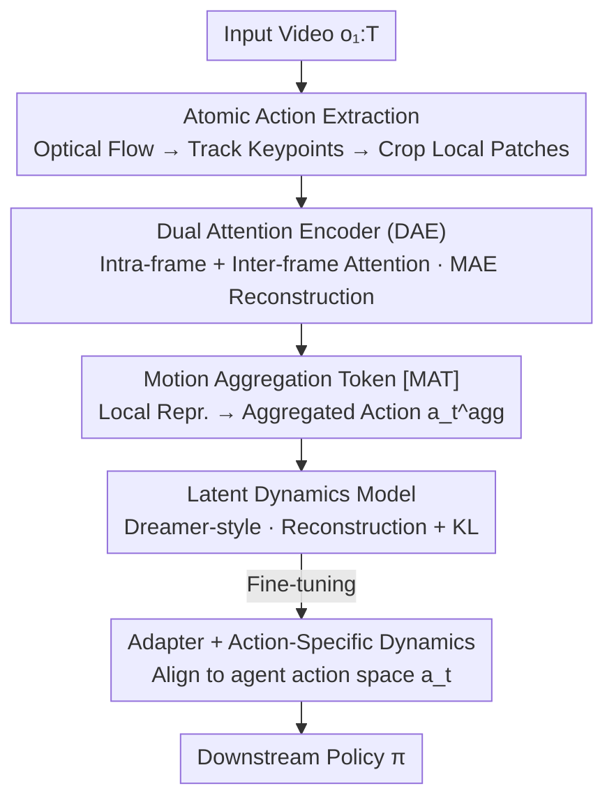

# Local Motion Matters: A Deconstruct-Recompose Paradigm for Reinforcement Learning Pre-training from Videos

**Conference**: CVPR 2026  
**Paper**: [CVF Open Access](https://openaccess.thecvf.com/content/CVPR2026/html/Wang_Local_Motion_Matters_A_Deconstruct_Recompose_Paradigm_for_Reinforcement_Learning_Pre-training_CVPR_2026_paper.html)  
**Area**: Reinforcement Learning / Video Pre-training  
**Keywords**: Video Pre-training, Reinforcement Learning, Local Motion, World Models, Cross-morphology Transfer

## TL;DR
This work deconstructs complex "global motion" in videos into morphology-agnostic "atomic actions" (local optical flow patches). A dual-attention encoder learns transferable local motion representations, which are recomposed into a world model via a learnable aggregation token. This paradigm significantly enhances RL sample efficiency and final performance on downstream robotic control tasks such as DMControl Remastered and Meta-World.

## Background & Motivation
**Background**: Pre-training reinforcement learning with large-scale unlabeled videos is a popular approach to improve efficiency. Existing methods generally fall into two categories: pre-training video prediction/world models (e.g., APV, IPV, DisWM) to understand environment dynamics, or inferring "latent actions" as dynamics factors from inter-frame relationships (e.g., PreLAR, FICC, AVDC, PVDR).

**Limitations of Prior Work**: Both categories treat the agent as an **indivisible whole**, modeling motion at a **global level**. However, global motion is **strongly coupled with morphology**—the global trajectory of a tennis player's swing differs vastly from a robotic arm opening a drawer. Consequently, motion patterns learned during pre-training fail to transfer across different physical forms.

**Key Challenge**: Pre-training requires "universal, transferable" motion knowledge, but global motion modeling inherently binds knowledge to specific morphologies, creating a fundamental conflict. The key observation of this paper is that while **global motions** of different agents vary, their **local components** are highly similar. A tennis forehand swing can be decomposed into an "arm swinging upward, torso rotating horizontally, and ball translating." These local patterns find counterparts in many downstream tasks.

**Goal**: To learn a **morphology-agnostic local motion representation** that allows pre-trained knowledge to transfer across domains. This involves: (1) stably extracting "local motion units" from videos; (2) encoding their spatiotemporal relationships; and (3) recomposing local representations into downstream RL world models aligned with specific action spaces.

**Core Idea**: Replace "global holistic modeling" with a "Deconstruct–Recompose Paradigm" (DRP). In the deconstruction stage, global optical flow is sliced into local flow patches (Atomic Actions) to learn spatiotemporal representations. In the recomposition stage, an aggregation token combines local representations back into a world model, which is then bridged to the agent's specific action space via an adapter during fine-tuning.

## Method

### Overall Architecture
DRP is a **two-stage** framework: the pre-training stage learns transferable local motion representations on unlabeled videos (Something-Something-V2), and the fine-tuning stage adapts these representations to the specific action space of a downstream agent.

The pre-training stage consists of two processes. **Deconstruct**: Given a video, dense optical flow is calculated to identify global motion. Salient keypoints on the foreground are sampled and tracked, and local optical flow patches—termed "Atomic Actions"—are cropped around each keypoint. A Dual Attention Encoder (DAE) learns the spatiotemporal relationships of these atomic actions via Masked Auto-Encoding (MAE). **Recompose**: A learnable motion aggregation token `[MAT]` is prefixed to each frame's token sequence. It aggregates all local motion representations of a frame into an "aggregated action representation" $a^{\text{agg}}_t$, which drives a Dreamer-style latent dynamics model to imbue local representations with dynamical semantics.

The fine-tuning stage (for a specific downstream agent) involves slowly fine-tuning the pre-trained DAE and the latent dynamics model while introducing an **adapter** and an **Action-Specific Dynamics Model**. The latter is conditioned on the agent's real actions $a_t$, and the adapter maps the pre-trained latent state into this new model to align "universal local motion priors" with the "agent's specific action space."

### Key Designs

**1. Atomic Action Extraction: Decomposing "Holistic Motion" into Morphology-Agnostic Local Patches**

This step addresses the coupling of global motion and morphology. Instead of modeling the entire global motion, it is decomposed into local components reusable across agents. The pipeline uses Sea-RAFT to compute dense optical flow $F_{1:T-1}$. To focus on meaningful motion, Grounded SAM segments the foreground mask $M_1$. $K$ candidate points are sampled within $M_1$ and tracked using Co-tracker. Points with low temporal motion variance are filtered and resampled to obtain stable keypoints $\{p^k_{1:T}\}$. Finally, a $P\times P$ local optical flow patch $u^k_t \in \mathbb{R}^{P\times P\times 2}$ is cropped around each tracked keypoint $p^k_t$ at every time step $t$. This "Atomic Action" describes only how a specific physical part moves, stripping away the global body structure.

**2. Dual Attention Encoder (DAE): Modeling Spatial Coordination and Temporal Evolution**

DAE is a Transformer encoder that processes atomic actions $u^k_t$ tokenized as $\tau^k_t$. Tokens include content embeddings (Patch Projection), coordinate embeddings (keypoint positions $p^k_t$), and temporal embeddings. The token sequence $\{[MAT], \tau^1_t, \dots, \tau^K_t\}_{t=1}^T$ passes through $L$ dual-attention blocks with two branches: **Intra-Frame Attention** captures **spatial relationships** between different local parts at time $t$, and **Inter-Frame Attention** performs **causal** self-attention along time for each part $k$ to capture **temporal relationships**. Decoupling space and time into independent branches improves the robustness of local motion representations. Training uses MAE to reconstruct original flow patches from masked tokens.

**3. [MAT] Aggregation + Latent Dynamics: Recomposing Local Repr. into Dynamics-Driving "Actions"**

This step connects local representations to "action signals" required for RL. The `[MAT]` token aggregates frame-wise local representations into $a^{\text{agg}}_t$. Using this as the action, a Dreamer-style latent dynamics model infers the latent state:

$$z_t \sim q_\theta\!\left(z_t \mid z_{t-1}, a^{\text{agg}}_{t-1}, o_t\right)$$

The training objective combines image reconstruction and KL regularization:

$$\mathcal{L}_{\text{dyn}} = \mathbb{E}_{q_\theta}\!\left[\sum_{t=1}^T\Big(-\ln p_\theta(o_t\mid z_t) + \beta_z\,\mathcal{L}_z\Big)\right],\quad \mathcal{L}_z = \mathrm{KL}\!\left[q_\theta(z_t\mid z_{t-1},a^{\text{agg}}_{t-1},o_t)\,\|\,p_\theta(\hat{z}_t\mid z_{t-1},a^{\text{agg}}_{t-1})\right]$$

Through dynamics learning, local motion representations gain **dynamical semantics**, which is critical for downstream transfer.

**4. Adapter + Action-Specific Dynamics: Aligning Universal Priors to Agent-Specific Action Spaces**

To bridge the gap between universal pre-trained priors and specific agent action spaces, an adapter maps the pre-trained latent state $z_t$ into an Action-Specific Dynamics Model. This model updates the agent's state $s_t$ conditioned on real actions $a_{t-1}$:

$$s_t \sim q_\phi\!\left(s_t \mid s_{s-1}, a_{t-1}, z_t\right)$$

The objective includes image reconstruction, reward prediction, and KL terms:

$$\mathcal{L}_{\text{action}} = \mathbb{E}_{q_\phi, q_\theta}\!\left[\sum_{t=1}^T\Big(-\ln p_\theta(o_t\mid s_t, c) - \beta_r\ln p_\varphi(r_t\mid s_t) + \beta_s\,\mathrm{KL}\!\left[q_\phi(s_t\mid s_{t-1},a_{t-1},z_t)\,\|\,p_\phi(\hat{s}_t\mid s_{t-1},a_{t-1})\right]\Big)\right]$$

## Loss & Training
Pre-training is performed sequentially: first Deconstruct (Atomic Action extraction + MAE reconstruction), then Recompose (Latent Dynamics $\mathcal{L}_{\text{dyn}}$). Fine-tuning progressively adapts both processes using $\mathcal{L}_{\text{action}}$ to train the adapter and the action-specific dynamics model. All baselines are pre-trained on SSV2 for a fair comparison.

## Key Experimental Results

### Main Results
Evaluations were conducted on **DMControl Remastered (DMCR)** and **Meta-World**. Baselines included DreamerV2/V3 (MBRL) and four video pre-training methods (APV, IPV, PreLAR, DisWM). DRP outperformed baselines in sample efficiency and final performance across tasks like Walker Run and Hopper Stand in DMCR. In Meta-World, DRP reached SOTA, succeeding in "Dial Turn" where baselines struggled.

| Task | DRP | IPV | Key Findings |
|------|-----|-----|---------|
| Walker Run | **681 ± 39** | 595 ± 67 | DRP significantly outperforms global modeling |
| Hopper Stand | **796 ± 114** | 634 ± 128 | Local representations yield higher final returns |

### Ablation Study

**(a) Role of Dynamics Model** (DMCR, Table 1, Return):

| Configuration | Walker Run | Hopper Stand | Gain/Decrease |
|------|-----------|-------------|------|
| DRP (Full) | 681 ± 39 | 796 ± 114 | — |
| DRP w/o dyn. | 613 ± 45 | 708 ± 106 | ↓10.0% / ↓11.1% |
| IPV | 595 ± 67 | 634 ± 128 | — |
| IPV w/o dyn. | 586 ± 61 | 628 ± 134 | ↓1.5% / ↓0.9% |

**(b) Other Ablations**:

| Configuration | Key Observation |
|------|---------|
| Global Flow | Significantly lower than DRP; confirms global modeling hinders transfer. |
| w/o Intra-Atten | Performance drops; spatial relationships are lost. |
| w/o Inter-Atten | Performance drops; temporal evolution is lost. |
| DRP w/o pre | Performance drops; confirms value of pre-trained priors. |

### Key Findings
- **Dynamics semantics are crucial**: Removing the dynamics model in DRP causes a 10–11% drop, whereas the drop is negligible in IPV, indicating DRP learns transferable dynamical patterns rather than just static features.
- **Local vs. Global distinction**: The "Global Flow" variant underperforms DRP and IPV, proving that global modeling's coupling with morphology is a bottleneck for transfer.
- **Dual branches are essential**: Spatial coordination and temporal evolution are complementary.
- **Improved zero-shot prediction**: DRP maintains agent shape and gripper visibility in cross-domain open-loop video prediction better than baselines.

## Highlights & Insights
- **Morphology-agnostic observation**: Decomposing holistic motion into local units like "arm swing" is intuitive and effective for cross-agent transfer.
- **Pragmatic vision pipeline**: Using off-the-shelf tools (Sea-RAFT, Grounded SAM, Co-tracker) for zero-label atomic action extraction is a practical approach that can be reused in other tasks.
- **Deconstruct-Recompose Architecture**: The use of decoupled spatiotemporal branches and the `[MAT]` token provides a scalable template for video representation.
- **Clean ablation logic**: Using $\Delta\text{dyn}$ to differentiate between dynamical and static representations provides strong evidence for the method's effectiveness beyond absolute scores.

## Limitations & Future Work
- **Dependency on external models**: Errors in Sea-RAFT or Co-tracker (e.g., drift) can propagate to the atomic actions.
- **Hyperparameter sensitivity**: sampling rate $K$ and patch size $P$ are manually set.
- **Tabular data**: Results rely heavily on learning curves; more tabular numerical data would improve clarity.
- **Simulation-focused**: The method has not yet been validated on physical hardware or on robots with extreme morphological differences (e.g., legged vs. aerial).

## Related Work & Insights
- **vs. IPV/APV**: DRP moves from global holistic modeling to morphology-agnostic local patches, resulting in more "dynamic" representations.
- **vs. PreLAR/FICC**: DRP uses concrete local flow patches (atomic actions) rather than abstract global latent actions, making it more interpretable.
- **vs. Dreamer**: DRP acts as a pre-trained prior that significantly boosts the sample efficiency of MBRL.

## Rating
- Novelty: ⭐⭐⭐⭐ (The deconstruct-recompose perspective for local actions is a clear and effective entry point).
- Experimental Thoroughness: ⭐⭐⭐⭐ (Extensive across two benchmarks and multiple baselines).
- Writing Quality: ⭐⭐⭐⭐ (Logic from motivation to ablation is solid).
- Value: ⭐⭐⭐⭐ (Provides a zero-label, reusable paradigm for local motion representation).

<!-- RELATED:START -->

## Related Papers

- [\[ICLR 2026\] Unsupervised Learning of Efficient Exploration: Pre-training Adaptive Policies via Self-Imposed Goals](../../ICLR2026/reinforcement_learning/unsupervised_learning_of_efficient_exploration_pre-training_adaptive_policies_vi.md)
- [\[ICML 2025\] Online Pre-Training for Offline-to-Online Reinforcement Learning](../../ICML2025/reinforcement_learning/online_pre-training_for_offline-to-online_reinforcement_learning.md)
- [\[ICLR 2026\] ReMoT: Reinforcement Learning with Motion Contrast Triplets](../../ICLR2026/reinforcement_learning/remot_reinforcement_learning_with_motion_contrast_triplets.md)
- [\[CVPR 2026\] Reinforce to Learn, Elect to Reason: A Dual Paradigm for Video Reasoning](reinforce_to_learn_elect_to_reason_a_dual_paradigm_for_video_reasoning.md)
- [\[CVPR 2026\] DreamSAC: Learning Hamiltonian World Models via Symmetry Exploration](dreamsac_learning_hamiltonian_world_models_via_symmetry_exploration.md)

<!-- RELATED:END -->
