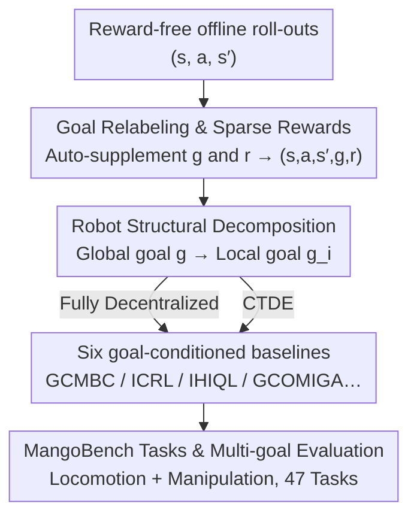

# MangoBench: A Benchmark for Multi-Agent Goal-Conditioned Offline Reinforcement Learning

**Conference**: CVPR 2026  
**Paper**: [CVF Open Access](https://openaccess.thecvf.com/content/CVPR2026/html/Wang_MangoBench_A_Benchmark_for_Multi-Agent_Goal-Conditioned_Offline_Reinforcement_Learning_CVPR_2026_paper.html)  
**Area**: Reinforcement Learning / Multi-Agent / Offline RL  
**Keywords**: Offline Multi-Agent RL, Goal-Conditioned RL, Sparse Rewards, Benchmarking, CTDE

## TL;DR
This paper extends single-agent "Offline Goal-Conditioned RL (OGCRL)" to multi-agent collaborative scenarios for the first time. It proposes a goal-conditioned offline MARL framework based on goal relabeling and robot structural decomposition, alongside MangoBench—the first fully collaborative multi-goal benchmark for this setting (3 environments, 4 agent types, 47 tasks, 6 baselines). Experiments demonstrate that hierarchical IHIQL generalizes best under sparse rewards, though no single method dominates all tasks.

## Background & Motivation
**Background**: Offline Multi-Agent Reinforcement Learning (Offline MARL) learns strategies using only pre-collected datasets, avoiding expensive and dangerous online exploration in physical environments. This is highly attractive for scenarios like autonomous driving, collaborative robotics, and smart grids.

**Limitations of Prior Work**: Existing offline MARL suffers from two persistent issues. First, **reward sensitivity**—RL aims to maximize cumulative rewards; even minor perturbations in the reward function can cause learned policies to drift significantly. Second, **weak generalization**—methods rely heavily on task-specific manual rewards, making them ineffective when goals or environments change. These factors hinder the practical deployment of offline MARL.

**Key Challenge**: Solution paradigms exist in the single-agent domain. OGCRL (Offline Goal-Conditioned RL) uses "goal relabeling + random goal sampling" to transform every trajectory in a dataset into "any state → any goal" learning samples, enriching state-goal combinations and enhancing generalization. It simplifies rewards to "0 for reaching the goal, −1 otherwise," virtually eliminating reward engineering. However, **this paradigm has not been extended to the multi-agent domain**, and no benchmarks exist to evaluate it. Existing MARL benchmarks are primarily online, dense-reward, and single-goal, which are incompatible with the "offline + sparse goal reward + multi-goal generalization" requirements.

**Goal**: To answer a natural question—can offline MARL be extended to the goal-conditioned setting to eliminate reward sensitivity and weak generalization simultaneously? This involves two sub-problems: (1) how to adapt OGCRL algorithms to multi-agent settings (supporting both fully decentralized and CTDE architectures); (2) how to build a benchmark for fair evaluation.

**Core Idea**: Decompose global goals into local goals for each agent based on robot body structure. Combined with goal relabeling and sparse goal-related rewards, this allows each agent to learn goal-conditioned policies using local information. This entire suite is packaged as the MangoBench benchmark with 6 baselines.

## Method

### Overall Architecture
This work integrates a new setting (goal-conditioned offline MARL), a set of adapted baselines, and an evaluation benchmark. The overall pipeline is: obtain reward-free offline roll-out data $(s, a, s')$ → automatically supplement goals $g$ and sparse rewards $r$ via **goal relabeling** to form the quintuple $(s, a, s', g, r)$ → split global states/goals into local observations $o_i$ and local goals $g_i$ via **robot structural decomposition** → train 6 goal-conditioned baselines under **fully decentralized** or **CTDE** paradigms → calculate success rates under the **multi-goal evaluation protocol**. MangoBench covers two main task categories: joint-controlled locomotion and multi-entity dual-arm manipulation.

### Key Designs

**1. Goal Relabeling & Sparse Rewards: Transforming reward-free data into learnable samples**

The heaviest burden in offline MARL is manual reward design, which this paper removes. Borrowing from OGCRL, it applies goal relabeling to any trajectory in the dataset: randomly sample a goal $g$, then auto-generate rewards using a minimalist rule—reward is $r_1$ if the state reaches the goal, and $r_2$ otherwise (typically $r_1=0, r_2=-1$). Thus, for any roll-out $(s, a, s')$, a complete quintuple $(s, a, s', g, r)$ can be formed without reward engineering. Formally, the problem is defined as a reward-free partially observable Markov game $M = \langle \mathcal{N}, S, \{A_i\}_{i=1}^N, P, \gamma\rangle$ with an unlabeled dataset $D$. The goal is to maximize the expected discounted return for the goal-conditioned policy $\pi_i(a_i \mid o_i, g_i)$:

$$\max_{\pi_i}\ \mathbb{E}_{(o_i^t, a_i^t, o_i^{t+1}, g_i)\sim D}\Big[\sum_{t=0}^{\infty}\gamma^t\, r(o_i^t, g_i)\Big].$$

This step is critical because it addresses two issues: sparse binary goal rewards are insensitive to perturbations, and random goal sampling expands single trajectories into massive state-goal combinations, naturally providing multi-goal generalization.

**2. Robot Structural Decomposition: Enabling decentralized execution**

The difficulty in multi-agent settings is that agents see only local observations $o_i$ but must serve a global goal. This paper performs a structural decomposition based on robot anatomy: splitting the global state/goal into local goals $g_i$ corresponding to the body parts each agent controls. For locomotion, an ant robot is split into joint groups: `2 agents × 4 joints` (left/right or front/back), `2 agents × 4 joints (D)` (diagonal groups, harder coordination), and `4 agents × 2 joints` (one agent per leg, highest coordination requirement). Global goals correspond to the full joint state, while local goals are derived from the local joints. For manipulation, local visual observations of each robotic arm are sampled as local goals, while the global goal includes the dual-arm and environment visual context.

Rewards follow this decomposition in two forms. **Multi-entity tasks** use local rewards to characterize individual contributions:

$$r(o_i, g_i) = \begin{cases} r_1, & o_i \in \mathrm{GoalStates}(g_i),\\ r_2, & \text{otherwise};\end{cases}$$

**Joint-controlled tasks** use global rewards to measure system-wide coordination, broadcasting the same scalar reward to all agents:

$$r(o, g) = \begin{cases} r_1, & o \in \mathrm{GoalStates}(g),\\ r_2, & \text{otherwise}.\end{cases}$$

This design reduces learning complexity by letting agents focus on smaller state-action subspaces while ensuring they work toward a collective goal via global reward broadcasting.

**3. Two Training Paradigms: Fully Decentralized vs. CTDE**

The work provides a unified objective for both paradigms. In **fully decentralized** training, each agent uses only local information to learn its policy; training and execution do not rely on communication. The gradient is $\nabla_{\theta_i} J_i = \mathbb{E}_{(o_i,a_i,g_i)\sim D}[\nabla_{\theta_i}\log\pi_i(a_i\mid o_i, g_i)\, Q_i(o_i, a_i, g_i)]$. In **CTDE** (Centralized Training, Decentralized Execution), execution remains local, but the critic sees joint observations/actions/goals during training via $Q_i(o, a, g)$. Experiments show that CTDE provides Marginal gains and can be unstable in this setting, leading most baselines to favor the decentralized approach.

**4. Six Baselines + MangoBench: Establishing the first benchmark**

Since no specialized algorithms existed for this setting, the paper introduces 6 baselines: GCMBC (goal-conditioned behavior cloning), ICRL (independent contrastive RL), IHIQL and HIQL-CTDE (hierarchical policies for sparse rewards), and GCOMIGA/GCOMAR (re-labeled versions of existing offline MARL algorithms).

MangoBench comprises 3 environments, 4 agent types, and 47 tasks. Locomotion tasks reuse AntMaze (medium/large/giant/teleport) and Ant-Soccer from OGBench. Manipulation tasks include dual-arm synchronization (`lift-barrier`) and asynchronous coordination (`place-food`). Each task uses **5 predefined goals** for evaluation—a core difference from older benchmarks that use a single fixed goal.

## Key Experimental Results

### Comparison with Existing Multi-Agent Environments
| Environment | Type | Multi-goal | Stochasticity | No. of Tasks | Reward Design |
|------|------|--------|--------|--------|----------|
| VMAS | Collab/Comp | No | No | 27 | Scenario-specific |
| SMACv2 | Collab | No | Yes | 15 | Damage/Kill/Win based |
| MPE | Collab/Comp | No | No | 9 | Distance-based |
| MA-MUJOCO | Collab | No | No | 14 | Single-agent dense rewards |
| **MangoBench (Ours)** | **Collab** | **Yes** | **Yes** | **47** | **Simple reach-goal check** |

MangoBench is the only benchmark combining multi-goal focus, stochasticity, and generic rewards.

### Decentralized vs. CTDE (AntMaze-navigate Success Rate %)
| Dataset | IHIQL (Decentralized) | HIQL-CTDE | IGCIVL | GCIVL-CTDE |
|--------|------|------|------|------|
| medium(2x4) | 95.1 ± 1.6 | 74.0 ± 0.6 | 76.0 ± 3.4 | 75.0 ± 4.2 |
| large(2x4d) | 92.2 ± 2.1 | 51.2 ± 1.7 | 26.0 ± 0.6 | 21.2 ± 1.1 |
| giant(2x4) | 57.3 ± 2.1 | 1.4 ± 0.8 | 0.0 ± 0.0 | 0.0 ± 0.0 |
| teleport(2x4) | 46.8 ± 1.7 | 27.6 ± 2.3 | 37.8 ± 2.0 | 37.9 ± 0.2 |

IHIQL significantly outperforms HIQL-CTDE, particularly on `giant` tasks where CTDE performance drops to near zero. This is attributed to the instability of optimizing multiple independent goal networks in hierarchical CTDE architectures.

### Single-goal vs. Multi-goal Evaluation (lift-barrier, Success Rate %)
| Evaluation Protocol | IHIQL | GCMBC | ICRL |
|----------|-------|-------|------|
| Single-goal | 78% | 22% | 37% |
| Multi-goal | 82% | 47% | 56% |

Success rates are generally higher under multi-goal evaluation, confirming that single-goal metrics may provide biased conclusions about goal-conditioned policies.

### Key Findings
- **Hierarchy is key for sparse rewards**: IHIQL uses hierarchical policies to mitigate sparse reward noise, becoming the SOTA. Standard offline MARL adaptations (GCOMIGA) largely fail due to value function noise.
- **No universal winner**: No single algorithm dominates all tasks, indicating the inherent complexity of the benchmark.
- **Multi-agent can exceed single-agent performance**: On long-horizon tasks like `teleport`, multi-agent IHIQL outperforms single-agent HIQL because decentralized agents handle smaller subspaces and estimate stochastic transitions more easily.
- **Vision can outperform state inputs**: In manipulation tasks, baselines perform better with visual inputs (64×64), possibly because vision captures environmental context necessary for interaction.
- **High efficiency**: On `lift-barrier`, IHIQL achieves higher performance than Diffusion Policy (DP) while using only 5% of the training time.

## Highlights & Insights
- **Transferring reward-free benefits to MARL**: Goal relabeling allows datasets to scale infinitely without manual annotation.
- **Physical structure as a natural goal decomposer**: Using robot anatomy to define local goals is more physically grounded than arbitrary mathematical decomposition.
- **A valuable counter-intuitive result**: The finding that CTDE provides weak or negative returns in goal-conditioned hierarchical offline settings serves as a warning for future architectural choices.
- **Quantifying evaluation necessity**: Success rates can fluctuate wildly between goals (0% to 100%), proving that multi-goal evaluation is essential for accurate benchmarking.

## Limitations & Future Work
- **Framework over novelty**: The baselines are adaptations of existing OGCRL algorithms rather than completely new native MARL methodologies.
- **Coordination remains a bottleneck**: Performance drops on tasks involving external objects (e.g., Ant-Soccer), indicating that current methods struggle with dynamic environmental coordination.
- **Task distribution**: The benchmark is heavily weighted toward locomotion (45 tasks) compared to manipulation (2 tasks).
- **Binary signals**: Simple reach-goal rewards may lack sufficient information for tasks requiring precise procedural control.

## Related Work & Insights
- **Comparison with OGBench/OGCRL**: This work adapts OGBench environments and extends algorithms like HIQL and CRL to multi-agent settings via structural decomposition.
- **Comparison with Standard MARL Benchmarks**: Unlike VMAS or SMAC, MangoBench focuses on offline data with sparse rewards and multi-goal generalization.
- **Comparison with Diffusion Policy**: In manipulation tasks, RL baselines outperform imitation learning (DP) at a fraction of the cost by utilizing suboptimal data and learning beyond the dataset's behavioral level.

## Rating
- Novelty: ⭐⭐⭐⭐ First systematic expansion of goal-conditioned offline RL to multi-agent scenarios with a dedicated benchmark.
- Experimental Thoroughness: ⭐⭐⭐⭐ Comprehensive across 47 tasks and 6 baselines with multi-dimensional analysis.
- Writing Quality: ⭐⭐⭐⭐ Clear motivation and rigorous formalization.
- Value: ⭐⭐⭐⭐ Establishes foundational baselines and metrics for a promising new research direction.

<!-- RELATED:START -->

## Related Papers

- [\[ICML 2026\] Latent Representation Alignment for Offline Goal-Conditioned Reinforcement Learning](../../ICML2026/reinforcement_learning/latent_representation_alignment_for_offline_goal-conditioned_reinforcement_learn.md)
- [\[ICML 2026\] Compositional Transduction with Latent Analogies for Offline Goal-Conditioned Reinforcement Learning](../../ICML2026/reinforcement_learning/compositional_transduction_with_latent_analogies_for_offline_goal-conditioned_re.md)
- [\[CVPR 2026\] TaskForce: Cooperative Multi-agent Reinforcement Learning for Multi-task Optimization](taskforce_cooperative_multi-agent_reinforcement_learning_for_multi-task_optimiza.md)
- [\[AAAI 2026\] First-Order Representation Languages for Goal-Conditioned RL](../../AAAI2026/reinforcement_learning/first-order_representation_languages_for_goal-conditioned_rl.md)
- [\[ICML 2026\] LLM-Guided Communication for Cooperative Multi-Agent Reinforcement Learning](../../ICML2026/reinforcement_learning/llm-guided_communication_for_cooperative_multi-agent_reinforcement_learning.md)

<!-- RELATED:END -->
