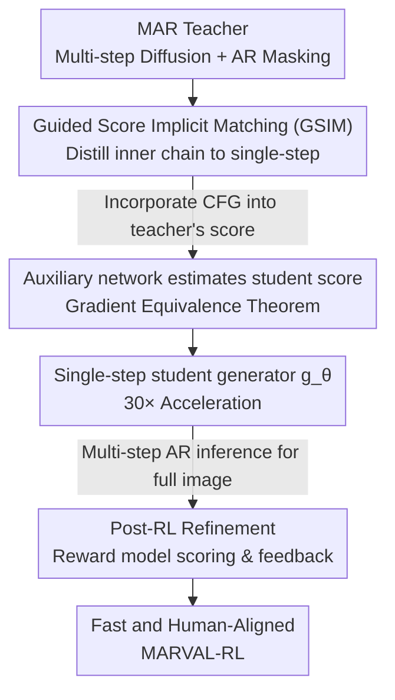

# Masked Auto-Regressive Variational Acceleration: Fast Inference Makes Practical Reinforcement Learning

**Conference**: CVPR 2026  
**Paper**: [CVF Open Access](https://openaccess.thecvf.com/content/CVPR2026/html/Gu_Masked_Auto-Regressive_Variational_Acceleration_Fast_Inference_Makes_Practical_Reinforcement_Learning_CVPR_2026_paper.html)  
**Code**: To be confirmed (Project page https://ai4scientificimaging.org/MARVAL-RL/)  
**Area**: Reinforcement Learning / Diffusion Models / Autoregressive Generation  
**Keywords**: MAR, Diffusion Distillation, Single-step Generation, Score Distillation, RLHF

## TL;DR
MARVAL utilizes Guided Score Implicit Matching (GSIM) with CFG guidance to compress the multi-step diffusion denoising chain within Masked Auto-Regressive models into "single-step generation." It achieves FID=2.00 on ImageNet 256×256—over 30 times faster than MAR—and leverages this acceleration to enable the first practical reinforcement learning post-training for MAR-like models using verifiable rewards, significantly enhancing human preference scores like CLIP and ImageReward.

## Background & Motivation

**Background**: Autoregressive (AR) models and diffusion models each have strengths and weaknesses—diffusion offers high fidelity and full mode coverage but requires hundreds of denoising steps; AR generates sequentially in discrete space and is naturally compatible with RL and language alignment frameworks, but its perceptual quality falls short of diffusion at high resolutions. Recent hybrid AR+Diffusion architectures attempt to combine the two, with Masked Auto-Regressive (MAR) as a representative work: it partitions image latents into $n$ tokens, randomly masks a subset, and trains a lightweight diffusion head conditioned on unmasked tokens to predict the masked ones, achieving flexible generation order through random masking.

**Limitations of Prior Work**: MAR inference involves a "nested dual-loop"—the outer loop is an AR process that progressively reveals masks (partitioning token indices randomly into $S_1,\dots,S_K$ and predicting them in sets), while the inner loop runs a full diffusion denoising chain for each set of tokens. The product of $N$ outer iterations and $T$ inner denoising steps results in thousands of network forward passes; MAR-B takes 20 seconds to generate a single image. This slowness is not just a user experience issue—it blocks RL post-training, as RL requires repeated sampling and gradient backpropagation based on rewards. A model taking 20 seconds per sample is infeasible for scalable preference alignment.

**Key Challenge**: The expressiveness of MAR stems exactly from the "inner diffusion chain," yet this chain is the source of slow inference and RL impracticality. Preserving the flexible masking order of AR and the high fidelity of diffusion while achieving speed and RL compatibility creates a fundamental conflict in the original MAR architecture.

**Goal**: Without sacrificing sample quality or disrupting the AR masking sequence, this work aims to: ① Compress the inner multi-step diffusion chain into a single step; ② Deploy a practical RL post-training pipeline for MAR based on this acceleration.

**Key Insight**: The authors leverage Score Implicit Matching (SIM), a data-free single-step distillation technique that aligns the score functions of teacher and student networks to distill a multi-step diffusion teacher into a single-step student. However, standard SIM aligns unguided distributions, which is inconsistent with the classifier-free guidance (CFG) used in MAR sampling. Consequently, the authors explicitly incorporate CFG guidance into the score matching objective.

**Core Idea**: Utilize "Guided Score Implicit Matching (GSIM)" to distill the inner MAR diffusion chain into a single-step student generator, then treat this fast student as a policy for an independent subsequent RL refinement stage using reward models. Distillation ensures the model is "fast and teacher-like," while RL ensures it is "better aligned with human preferences."

## Method

### Overall Architecture
MARVAL addresses the challenge of "accelerating slow multi-step AR generation and refining it with RL" via a two-stage serial pipeline: **Stage 1 Distillation** distills the $T$-step inner diffusion chain of the teacher MAR into a single-step student generator $g_\theta(z,c)$ (where $z$ is Gaussian noise and $c$ is the autoregressive context from unmasked tokens, class embeddings, and mask position embeddings); **Stage 2 RL Refinement** takes the distilled $g_\theta$ as a policy, performs multi-step AR inference to generate complete images as in MAR, and uses a reward model to score them against text prompts for gradient-based refinement. Crucially, these two stages **cannot be merged**: during distillation, only single AR iterations are run, producing low-fidelity intermediate results. If RL were applied then, the reward model would evaluate incomplete products, leading to misleading gradients and policy collapse. Thus, RL must be an independent post-processing stage applied to the distilled model.

### Key Designs

**1. Guided Score Implicit Matching (GSIM): Converting distribution alignment into optimized guided score matching**

This step targets the "inner diffusion chain bottleneck." The authors aim to make the student distribution $q_\theta(x\mid c)$ approximate the teacher distribution $p(x\mid c)$ by minimizing the KL divergence $\mathbb{E}_{c}[D_{KL}(q_\theta\Vert p)]$. Since KL is intractable, they utilize the conclusion from Uni-instruct: under mild regularity conditions, KL equals the integral of Fisher divergence along the diffusion process. The objective is rewritten as the integral over time $t$ of the score difference:

$$D_{KL}(q_\theta\Vert p)=\tfrac{1}{2}\int_0^T g^2(t)\,\mathbb{E}_{x_t\sim q_{\theta,t}}\big[\,\Vert \nabla_{x_t}\log q_{\theta,t}(x_t\mid c)-s_{p_t}(x_t,c)\Vert_2^2\,\big]\,dt$$

The student score $\nabla_{x_t}\log q_{\theta,t}$ is solved via an auxiliary network $S_\phi(x_t,t,c)$ trained using standard denoising score matching on the student's reconstructed samples. The "Guided" aspect is critical: since MAR uses CFG, the teacher's score must be the CFG-guided score rather than the bare score. The authors define $s_{p_t}(x_t,c)=(1+w)\,S_p(x_t,t,c)-w\,S_p(x_t,t,\varnothing)$ (where $w$ is the guidance scale and $\varnothing$ is the null condition). This ensures the student learns exactly the CFG distribution sampled during MAR inference, distinguishing it from standard SIM.

**2. Gradient Equivalence Theorem + Pseudo-Huber Loss: Making intractable score gradients computable and stable**

The gradient of the score divergence with respect to $\theta$ involves the student's score derivative, which is hard to compute directly. The authors employ the Gradient Equivalence Theorem (with stop-gradient denoted as $\mathrm{sg}[\cdot]$): the gradient of the objective is rewritten as a computable proxy objective $L_{GSIM}=L_1+L_2$, where:

$$L_1=-\{d'(y_t)\}^T\big(s_{q_{\mathrm{sg}[\theta]},t}(x_t,c)-\nabla_{x_t}\log p_t(x_t\mid x_0,c)\big),\quad L_2=d(y_t),\quad y_t=s_{q_{\mathrm{sg}[\theta]},t}(x_t,c)-s_{p_t}(x_t,c)$$

$s_{q_{\mathrm{sg}[\theta]},t}$ is approximated by $S_\phi$, and training alternates between updating the generator $\theta$ and updating the auxiliary network $\phi$. While square $\ell_2$ distance is theoretically required, the authors use the Pseudo-Huber distance $d(y_t)=\sqrt{\Vert y_t\Vert_2^2+r^2}-r$ ($r=10^{-5}$) to enhance stability and convergence speed. This alternating optimization enables "single-step distillation" within MAR's masked autoregressive framework.

**3. Post-RL Refinement: Policy optimization with direct reward backpropagation**

Even if the GSIM student matches the teacher, the teacher's distribution might deviate from human preferences, and multi-round AR cumulative errors can blur details. The authors treat the distilled $g_\theta$ as a policy: given a class embedding $c_{emb}$, it runs $K$ steps of AR to generate a full image $x_g=G_\theta(z,c_{emb},K)$. This full image is considered an "action." A pre-trained reward model (PickScore) then scores the image based on text prompts (e.g., "a high-quality and harmonious picture of {frog}"). The goal is to maximize the expected reward, i.e., minimize:

$$L_{RL}=-\mathbb{E}_{c_{emb},z}\big[R(G_\theta(z,c_{emb},K),\,\text{prompt}_c)\big]$$

The reason RL must wait for the full image is that single-step intermediate images are low-fidelity; scoring them would provide misleading gradients. By decoupling RL, the reward signals correspond to true perceptual quality, and gradients refine $\theta$ directly through the reward model.

### Loss & Training
The distillation stage alternates between two sets of parameters: the generator $\theta$ uses $L_{GSIM}$, and the auxiliary network $\phi$ uses denoising score matching $L_{auxiliary}$. Following MAR settings: cosine noise schedule, 1000 training steps, and a lightweight MLP denoising head to predict noise $\varepsilon$. Three scales—Base (208M), Large (479M), and Huge (943M)—are each distilled for 30 epochs on 8×A800 GPUs (approx. 3 days), followed by 5 epochs of RL refinement (approx. 2 days). The CFG scale $w$ is manually set during distillation, with $w=1.2$ chosen as the final value.

## Key Experimental Results

### Main Results
System-level comparison on ImageNet 256×256 class-conditional generation (Inference time measured on a single A100, batch=1):

| Category | Model | FID↓ | IS↑ | Inference Time |
|----------|-------|------|-----|----------------|
| Pixel Diffusion | ADM | 4.59 | 186.7 | 115.67 s |
| Continuous Token | DiT-XL/2 | 2.27 | 278.2 | 6.62 s |
| Masked AR | MAR-B (w=2.9) | 2.60 | 222.7 | 20.10 s |
| Masked AR | MAR-H (w=3.2) | **2.06** | 247.7 | 30.98 s |
| Distillation only | MARVAL-B | 3.06 | 220.2 | **0.61 s** |
| Distillation only | MARVAL-L | 2.51 | 247.1 | 0.97 s |
| Distillation only | MARVAL-H | **2.00** | 256.3 | 1.67 s |

MARVAL-H outperforms MAR-H with an FID of 2.00 compared to 2.06, while inference time drops from 30.98 s to 1.67 s. MARVAL-B is approximately 32.95× faster than MAR-B.

### Ablation Study
Influence of CFG scale on distillation (MARVAL-B) and reward metrics before/after RL:

| Configuration | Key Metrics | Note |
|---------------|-------------|------|
| MARVAL-B, $w=1$ (No CFG) | FID 3.75 / IS 182.1 | No guidance, lower fidelity |
| MARVAL-B, $w=1.2$ | FID **3.06** / IS 220.2 | Selected value, realism/fidelity balance |
| MARVAL-B, $w=2$ | FID 7.98 / IS 294.4 | Higher IS but FID collapses |
| MARVAL-B, $w=4$ | FID 13.84 / IS 316.8 | Over-guidance, FID deteriorates |
| Huge: Distill w/o RL | CLIP 29.33 / ImgR -0.107 | Before RL |
| Huge: Distill w RL | CLIP 29.78 / ImgR -0.064 | Both metrics increase after RL |

Text-to-Image (DC-AR, 50K samples) generalization: while 20-step DDIM yields ImageReward=0.5876, the single-step + RL version increases this to 0.6903.

### Key Findings
- **CFG Scale is a Double-Edged Sword**: Larger $w$ increases IS (higher fidelity) but causes FID to drop then crash. At $w=1.2$, FID is lowest (3.06); from $w=2$ onwards, FID deteriorates sharply. This suggests a need for balance between realism and fidelity.
- **Distillation Maintains Quality and Improves Perception**: Single-step MARVAL on Large/Huge configurations achieves better FID than MAR and higher IS, showing that distillation simplifies sampling while preserving or improving generation capability.
- **RL is Key for Sharpening Samples**: Purely distilled single-step images tend to be smooth with blurry faces or lost textures. After RL, details such as fur, feathers, and outlines become significantly sharper. Both CLIP and ImageReward scores improve consistently across scales, particularly in T2I tasks (ImageReward increase > 0.10).

## Highlights & Insights
- **Speed as a Key to Unlocking RL**: The core narrative is "fast inference makes practical RL." Models taking 20s per image cannot be trained with RL; by reducing this to 0.6s, RL post-training becomes feasible for MAR. This strategy of "removing computational bottlenecks to unlock new capabilities" is transferable to other slow generative models.
- **Explicit CFG in Distillation is Vital**: Standard score distillation aligns the unguided distribution. Since MAR inference relies on CFG, treating the guided score as the teacher ensure the student aligns with the actual sampling distribution—a critical refinement often missed when applying SIM to MAR.
- **Decoupling RL is Necessary**: Since distillation uses single AR iterations on partial products, reward models would provide misleading gradients. Separating RL into a post-processing stage ensures reward signals correspond to the actual perception of the full inference result.

## Limitations & Future Work
- **Dependency on Reward Models**: The quality ceiling is capped by the preference bias of PickScore/ImageReward; reward bias can be amplified. Some metrics showed minor degradations after RL.
- **High Training Cost**: The two-stage process (3 days distillation + 2 days RL on 8×A800) is resource-intensive and cannot currently be run end-to-end.
- **Domain Coverage**: Experiments focused on ImageNet and a single T2I model. Generalization to complex long prompts or combinatorial reasoning requires further verification.
- **Manual CFG Tuning**: $w$ is highly sensitive. An adaptive mechanism for selecting $w$ is currently missing.

## Related Work & Insights
- **vs MAR (Teacher)**: MAR relies on a dual-loop (AR + multi-step diffusion) for flexibility and fidelity, making it too slow for RL. Ours distills the inner chain and adds RL, achieving 30× speedup with preference alignment.
- **vs SIM / Score Implicit Matching**: SIM is data-free distillation for bare scores. MARVAL's GSIM explicitly incorporates CFG into the distillation objective and uses Pseudo-Huber loss for stability, specifically for MAR-style CFG inference.
- **vs One-step Diffusion RLHF**: While RLHF for one-step diffusion exists, it has not addressed alignment for models with random-masking autoregressive order. Ours fills this gap by evaluating rewards on the full AR-restored image.

## Rating
- Novelty: ⭐⭐⭐⭐ Accomplishes single-step distillation + RL for MAR models; the GSIM CFG modification is a tangible contribution.
- Experimental Thoroughness: ⭐⭐⭐⭐ System-level comparison across three scales plus ablations on CFG and RL.
- Writing Quality: ⭐⭐⭐⭐ Clean logic chain (speed → RL feasibility). Math is dense but well-motivated.
- Value: ⭐⭐⭐⭐ Provides the first practical path for making AR+Diffusion hybrids fast and RL-compatible.

<!-- RELATED:START -->

## Related Papers

- [\[CVPR 2026\] BuildingGPT: Auto-Regressive Building Wireframe Reconstruction Model with Reinforcement Learning](buildinggpt_auto-regressive_building_wireframe_reconstruction_model_with_reinfor.md)
- [\[ICML 2026\] Safe Reinforcement Learning with Preference-Based Constraint Inference](../../ICML2026/reinforcement_learning/safe_reinforcement_learning_with_preference-based_constraint_inference.md)
- [\[ICLR 2026\] Principled Fast and Meta Knowledge Learners for Continual Reinforcement Learning](../../ICLR2026/reinforcement_learning/principled_fast_and_meta_knowledge_learners_for_continual_reinforcement_learning.md)
- [\[ICML 2026\] Coupled Variational Reinforcement Learning for Language Model General Reasoning](../../ICML2026/reinforcement_learning/coupled_variational_reinforcement_learning_for_language_model_general_reasoning.md)
- [\[CVPR 2026\] Reading or Reasoning? Format Decoupled Reinforcement Learning for Document OCR](reading_or_reasoning_format_decoupled_reinforcement_learning_for_document_ocr.md)

<!-- RELATED:END -->
