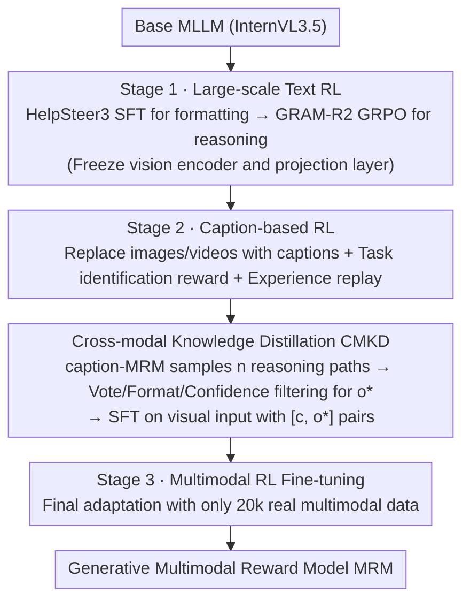

# MSRL: Scaling Generative Multimodal Reward Modeling via Multi-Stage Reinforcement Learning

**Conference**: CVPR 2026  
**arXiv**: [2603.25108](https://arxiv.org/abs/2603.25108)  
**Code**: [GitHub](https://github.com/wangclnlp/MSRL)  
**Area**: Reinforcement Learning / Multimodal Reward Modeling  
**Keywords**: Multimodal Reward Model, Reinforcement Learning, Cross-modal Transfer, Knowledge Distillation, Preference Alignment

## TL;DR

Proposes the Multi-Stage Reinforcement Learning (MSRL) method, which first learns reward reasoning capabilities on large-scale text preference data and then progressively transfers them to multimodal tasks. This addresses the bottleneck of scarce annotated data in multimodal reward model training, improving accuracy on VL-RewardBench from 66.6% to 75.9%.

## Background & Motivation

Multimodal Reward Models (MRM) are core components for aligning Multimodal Large Language Models (MLLM) with human preferences. Recent research has shifted from discriminative to generative reward modeling (generating preference predictions via CoT reasoning) and begun adopting RLVR (Reinforcement Learning from Verifiable Rewards) to further enhance MRM capabilities.

However, RLVR faces a fundamental bottleneck: **high-quality multimodal preference annotation data is extremely scarce**. High annotation costs prevent scaling RL training as extensively as in the text domain. Existing alternatives (e.g., confidence estimation, self-verification) are prone to error accumulation and rapid performance saturation.

The core insight of this paper is: **core preference reasoning capabilities can be learned from abundant plain text data and effectively transferred to multimodal scenarios**. This breaks the inherent assumption that "multimodal data insufficiency must be solved with more multimodal data."

## Method

### Overall Architecture

MSRL addresses the bottleneck of "extreme scarcity of high-quality multimodal preference annotations" during training. Its core hypothesis is that preference reasoning can be acquired from massive text data and transferred to multimodal contexts. Training is divided into a three-stage curriculum of increasing difficulty: first, large-scale text RL to establish general reward reasoning (Stage 1); then, caption-based RL + cross-modal knowledge distillation to complete preference transfer (Stage 2); and finally, adaptation using a small amount of real multimodal data (Stage 3). Stage 2 consists of two complementary designs: Caption-based RL for smooth transfer to captions, and CMKD to distill reasoning learned on captions to real visual inputs.

### Key Designs

**1. Large-scale RL on text data: Developing reward reasoning on cheap, abundant text (Stage 1)**

Text preference data is large-scale and low-cost, allowing it to fully exploit the scaling benefits of RL. Stage 1 uses 40k HelpSteer3 data for SFT to teach the model CoT output formats, followed by GRPO optimization on 400k GRAM-R2 text preference data. During training, the vision encoder and projection layer are frozen, focusing solely on the language component to solidify general reward reasoning.

**2. Caption-based RL + Preference Generalization: Using text descriptions as a bridge (Stage 2)**

Directly using multimodal data hits the scarcity bottleneck. Here, images/videos in multimodal preference data are replaced with corresponding text descriptions (captions), constructing training data that is plain text but retains multimodal semantics for continued RL. Simultaneously, a task identification reward $r_{\text{task}}$ is introduced: the model must first output a task type label (e.g., `<type>Image Understanding</type>`), receiving a 0.2 reward for correct identification to improve MRM discrimination across tasks. Experience replay with a 5:1 ratio of new to Stage 1 text samples is used to prevent forgetting.

**3. Cross-modal Knowledge Distillation (CMKD): Distilling caption-trained reasoning to visual-only models**

A modality gap remains between captions and real visual inputs. CMKD uses the caption-trained MRM to generate $n$ candidate reasoning paths for a given preference sample and caption, then filters for the optimal teacher signal $o^*$ via three steps: majority vote for pseudo-labels $\rightarrow$ format filtering $\rightarrow$ highest confidence selection. SFT is performed on $[c, o^*]$ pairs, enabling the model to replicate the distilled reasoning process even with only visual inputs. Subsequent RL stages require the model to generate a `<caption>` before performing reward reasoning.

**4. Multimodal RL Fine-tuning: Final adaptation with minimal real multimodal data (Stage 3)**

Since the previous stages have already built strong reward reasoning, this step requires only 20k multimodal data points for final adaptation (also using task identification rewards), significantly reducing the marginal demand for multimodal annotations.

### Loss & Training

- All three stages are based on GRPO optimization, with the core objective: $\mathcal{L}_{\text{RLVR}} = -\mathbb{E}[r_v(s,o)] - \beta \mathbb{D}_{\text{KL}}(\pi_\theta || \pi_{\theta_{\text{old}}})$
- Verifiable reward $r_v = r_{\text{format}} + r_{\text{accuracy}}$ (+ $r_{\text{task}}$ for Stage 2/3)
- Sample size 8, learning rate 1e-6, batch size 128

## Key Experimental Results

### Main Results

| Benchmark | Metric | MSRL (8B) | Generative MRM | Gain |
|---|---|---|---|---|
| VL-RewardBench | Avg Acc | 75.9% | 66.6% | +9.3% |
| Multimodal RewardBench | Avg Acc | 80.5% | 76.2% | +4.3% |
| GenAI-Bench (Image Gen.) | Acc | 75.7% | 70.2% | +5.5% |
| ShareGPT (Video Under.) | Acc | 85.5% | 80.6% | +4.9% |
| GenAI-Bench (Video Gen.) | Acc | 81.4% | 68.3% | +13.1% |

MSRL 8B + voting@16 reaches 77.5% on VL-RewardBench, even surpassing Claude-3.7-Sonnet (66.5%) and GPT-4o (62.4%).

### Ablation Study

| Configuration | VL-RewardBench Avg | Description |
|---|---|---|
| Generative Baseline | 66.6% | Trained only on multimodal data |
| w/o Stage 1 | 68.8% | Remove text RL $\rightarrow$ Largest drop (-7.1%) |
| w/o Stage 2 (Caption) | 74.3% | Remove caption RL $\rightarrow$ -1.6% |
| w/o Stage 2 (CMKD) | 73.4% | Remove cross-modal distillation $\rightarrow$ -2.5% |
| w/o Stage 3 | 72.6% | Remove multimodal RL $\rightarrow$ -3.3% |
| **Full MSRL** | **75.9%** | Full method |

### Key Findings

- **Text RL is the most critical stage**: Stage 1 contributes the largest performance gain (+6.9%), proving reward reasoning can be learned from pure text.
- **Consistent Scaling Behavior**: Improvements from MSRL persist from 1B to 14B models, with larger models benefiting more.
- **High Data Efficiency**: MSRL with only 5k multimodal data significantly outperforms the multimodal-only baseline, indicating that text RL capabilities lead to diminishing marginal returns for multimodal signals.
- **Highest Gain in Video Tasks**: The +13.1% jump in video generation suggests temporal visual data relies more heavily on strong reasoning capabilities.

## Highlights & Insights

1. **Ingenious approach to data bottlenecks**: Instead of seeking more multimodal data, it leverages cross-modal transfer—a dimensionality reduction solution.
2. **Caption as a Modality Bridge**: Replacing images with captions achieves a smooth "text $\rightarrow$ multimodal" transition, which is simple yet effective.
3. **Task Identification Reward**: Forcing the model to identify the task type before reasoning improves the discriminative power of a unified MRM across diverse tasks.
4. **Engineering Friendly**: Emphasizes a scalable axis—multimodal performance can be continuously improved simply by increasing text data volume without expensive multimodal annotations.

## Limitations & Future Work

- Validated only on the InternVL3.5 series; effectiveness on other architectures (e.g., Qwen-VL, LLaVA) remains to be verified.
- Reliance on caption quality, which were generated by GPT-5 in CMKD.
- Lack of thorough discussion on the optimal experience replay ratio (5:1) in Stage 2.
- Downstream effects of MSRL-trained MRMs on actual MLLM alignment (e.g., for rejection sampling / PPO) were not explored.

## Related Work & Insights

- Difference from UnifiedReward: The latter trains directly on multimodal data using RLVR and is limited by data volume; MSRL bypasses this via a multi-stage strategy.
- Inspired by LLaVA and VILA—caption-based data can effectively transfer text knowledge to visual tasks.
- Consistent with findings in LLMs that "RL can scale reasoning capabilities," extending this insight to the multimodal domain.

## Rating

- Novelty: ⭐⭐⭐⭐ — Multi-stage RL curriculum design is novel, though individual components (GRPO, caption bridging, knowledge distillation) are established.
- Experimental Thoroughness: ⭐⭐⭐⭐⭐ — Multi-scale (1B-14B), multi-task (understanding + generation), multiple benchmarks, and comprehensive ablations.
- Writing Quality: ⭐⭐⭐⭐ — Clear logic and well-articulated motivation.
- Value: ⭐⭐⭐⭐⭐ — Provides a practical and scalable path for training multimodal reward models.

<!-- RELATED:START -->

## Related Papers

- [\[CVPR 2026\] Incentivizing Generative Zero-Shot Learning via Outcome-Reward Reinforcement Learning with Visual Cues](incentivizing_generative_zero-shot_learning_via_outcome-reward_reinforcement_lea.md)
- [\[ICLR 2026\] R1-Reward: Training Multimodal Reward Model Through Stable Reinforcement Learning](../../ICLR2026/reinforcement_learning/r1-reward_training_multimodal_reward_model_through_stable_reinforcement_learning.md)
- [\[ICLR 2026\] P-GenRM: Personalized Generative Reward Model with Test-time User-based Scaling](../../ICLR2026/reinforcement_learning/p-genrm_personalized_generative_reward_model_with_test-time_user-based_scaling.md)
- [\[ICLR 2026\] RM-R1: Reward Modeling as Reasoning](../../ICLR2026/reinforcement_learning/rm-r1_reward_modeling_as_reasoning.md)
- [\[CVPR 2026\] CME-CAD: Heterogeneous Collaborative Multi-Expert Reinforcement Learning for CAD Code Generation](cme-cad_heterogeneous_collaborative_multi-expert_reinforcement_learning_for_cad_code_gen.md)

<!-- RELATED:END -->
