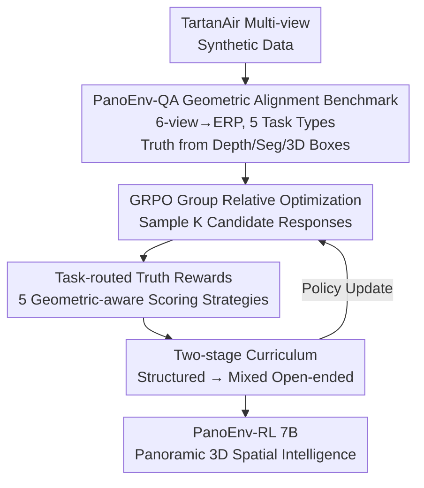

# PanoEnv: Exploring 3D Spatial Intelligence in Panoramic Environments with Reinforcement Learning

**Conference**: CVPR 2026  
**Paper**: [CVF Open Access](https://openaccess.thecvf.com/content/CVPR2026/html/Lin_PanoEnv_Exploring_3D_Spatial_Intelligence_in_Panoramic_Environments_with_Reinforcement_CVPR_2026_paper.html)  
**Code**: https://github.com/7zk1014/PanoEnv (Available)  
**Area**: Reinforcement Learning / Multi-modal VLM / Panoramic 3D Spatial Reasoning  
**Keywords**: 360° Panorama, ERP, Spatial Intelligence, GRPO, Curriculum Learning

## TL;DR
To address the near-collapse of VLM 3D spatial reasoning on 360° Equirectangular Projection (ERP) panoramas, this work constructs the PanoEnv-QA benchmark with 14.8K questions across five geometrically aligned categories. By employing GRPO post-training with "task-routed ground-truth rewards" and a "two-stage curriculum," the total accuracy of a 7B model is improved from 49.34% to 52.93%, and open-ended question accuracy rises from 6.39% to 14.83%, surpassing 32B models.

## Background & Motivation

**Background**: 360° Omni-Directional Images (ODI) cover entire scenes in a single shot and are increasingly important in VR/AR, autonomous driving, and embodied intelligence. The dominant approach is flattening spherical panoramas into ERP images for off-the-shelf Vision-Language Models (VLM) to perform spatial QA.

**Limitations of Prior Work**: ERP projections suffer from two inherent flaws. First, **geometric distortion**: pixels are stretched horizontally closer to the poles, causing the same object to vary in scale and shape across latitudes, which invalidates visual priors learned from pinhole images. Second, **lack of 3D supervision**: existing VQA datasets rarely contain aligned depth, 3D boxes, or precise geometry, making models difficult to evaluate or train for 3D relationships. Consequently, VLMs fail tasks that are trivial in perspective views, such as determining relative positions or actual volumes. Testing 14 SOTA models revealed that the strongest (Qwen2.5-VL-7B) achieved only 49.34% total accuracy, with open-ended (OE) accuracy dropping to 6.39%.

**Key Challenge**: Current training paradigms lead models to adopt "2D heuristics"—using image size as a distance proxy and 2D position for 3D relationships—rather than reconstructing a faithful 3D representation from ERP pixels. These shortcuts fail completely on distorted, stitched panoramic images.

**Goal**: Split into two sub-problems: (1) Creating a geometrically aligned panoramic 3D reasoning benchmark that serves as both an evaluation platform and an RL supervision source; (2) Designing a post-training method to inject physical ground truth into VLMs without damaging existing capabilities.

**Key Insight**: The authors observe that synthetic 3D environments (TartanAir) inherently provide pixel-accurate depth and segmentation, which are extremely difficult to obtain for real-world panoramas. Since the ground truth is "verifiable," QA pairs can be **programmatically derived from physical truth**, anchoring reward signals in geometric reality rather than noisy proxies like LLM judges.

**Core Idea**: Replace "general rewards + monolithic training" with "QA generated from geometric truth + task-routed truth rewards + two-stage curriculum GRPO" to inject 3D spatial intelligence into panoramic VLMs.

## Method

### Overall Architecture

PanoEnv consists of two components: **PanoEnv-QA Data Construction** and **3D-aware RL Post-training**. On the data side, multi-view synthetic data from TartanAir (six cubemap faces) is stitched into high-resolution ERP panoramas. Each panorama includes pixel-aligned RGB, depth, and semantic segmentation, which are used to programmatically generate 14,827 geometrically aligned questions across five categories. For training, a Qwen2.5-VL-7B backbone is used. GRPO samples candidate responses, which are scored by an **automatically routed reward system** (five strategies for five task types). Finally, a **two-stage curriculum**—starting with structured questions (Yes/No, MCQ) to stabilize formatting and short reasoning, followed by mixed open-ended questions—updates the policy to enhance 3D reasoning without catastrophic forgetting.

### Key Designs

**1. PanoEnv-QA: Programmatically Generating Five Geometric Task Types from Physical Truth**

The pain point is that existing panoramic VQA lacks both dense geometry and verifiable supervision. Starting from TartanAir, the authors merge six cubemap views into one ERP panorama, ensuring pixel-level alignment. Objects $O_i$ are identified via segmentation, filtering out small targets and amorphous backgrounds (sky, ground). For each instance, the system extracts 2D boxes, depth statistics, 3D point clouds, and volumes from masks $M_i$ to generate questions:

- **Camera View Sourcing**: Tests if the model understands ERP as a stitched multi-view projection. Directional vectors are derived from spherical coordinates $\lambda=\left(\frac{p_x}{W}-0.5\right)2\pi,\ \phi=-\left(\frac{p_y}{H}-0.5\right)\pi$.
- **Distance Estimation**: Robust depth profiles are calculated from $D_{ERP}$ (median p50, IQR) to force metric reasoning over visual size proxies.
- **Environment Recognition**: Uses TartanAir's scene attributes (indoor/outdoor, Urban/Nature) for fine-grained reasoning.
- **Relative Spatial Localization**: Back-projects object centroids to a 3D coordinate system: $x_i=-d_i\cos\phi_i\sin\lambda_i,\ y_i=d_i\sin\phi_i,\ z_i=-d_i\cos\phi_i\cos\lambda_i$. Relationships are determined by comparing components of $\vec V_{ij}=\vec P_i-\vec P_j$ against a threshold $\tau_{pos}$.
- **Intrinsic Property Comparison**: Calculates 3D box dimensions from point clouds to ask "which is larger" and defines a **flatness score** (min dimension / max dimension) for questions like "which is flatter/longer."

**2. Task-routed Truth Rewards: Five Geometric-aware Scoring Strategies**

General rewards or LLM judges are noisy for geometric tasks. The total reward is $R(s,a)=w_{acc}R_{acc}+w_{fmt}R_{fmt}$ ($w_{acc}=0.9, w_{fmt}=0.1$). Format reward is binary, requiring the `<Reasoning>...</Reasoning><Answer>...</Answer>` structure. The accuracy reward uses an **automatic router**:

- **A. Yes/No**: Case-insensitive strict string matching.
- **B. MCQ**: Subject extraction and normalization followed by matching.
- **C. Distance**: Numerical parser converts units to meters; scores based on relative error ($\le10\%$ gets 1.0, $\le20\%$ gets 0.5), encouraging precision.
- **D. Spatial Relations**: Parses direction keywords across three axes (Front-Back, Left-Right, Up-Down). Reward = ratio of correct axes.
- **E. Counting**: Exact numerical matching.

**3. Two-stage Curriculum: Stabilize Structured, then Mix Open-ended**

Directly training on mixed tasks is unstable due to heterogeneous signals. **Stage 1 (Structured Pre-training)** focuses on low-entropy tasks (Yes/No, MCQ) with reliable rewards to establish format discipline and short reasoning. **Stage 2 (Mixed Open-ended Fine-tuning)** initializes from Stage 1 and trains on a balanced mix. This prevents catastrophic forgetting of open-ended abilities while maintaining the formatting learned in Stage 1. GRPO is used for group-relative advantage estimation with KL-penalty to stabilize the policy.

### Loss & Training
Backbone: Qwen2.5-VL-7B-Instruct. Trained for 2 epochs, group size $K=4$. LoRA is applied only to the language decoder while the vision encoder is frozen. Stage 1 uses aggressive hyperparameters for formatting, while Stage 2 uses conservative ones for optimization of open-ended tasks.

## Key Experimental Results

### Main Results

Zero-shot performance of 14 baselines on the 3,040 test set (Excerpt from Table 2):

| Model | Total Acc↑ | T/F | MCQ | OE | Q-Score | P-Score |
|---|---|---|---|---|---|---|
| Qwen2.5-VL-7B (Best Baseline) | 49.34 | 65.19 | 57.24 | 6.39 | 5.60 | 5.48 |
| Qwen3-VL-8B | 47.91 | 62.85 | 55.24 | 7.70 | 5.60 | 5.35 |
| InternVL2.5-26B | 47.07 | 64.51 | 54.33 | 3.44 | 5.61 | 5.61 |
| Qwen2.5-VL-32B | 42.70 | 62.47 | 44.96 | 8.36 | 5.02 | 4.92 |
| 14-Model Average | 36.72 | 55.98 | 37.56 | 4.26 | 4.82 | 5.17 |

RL Post-training Results (Table 3): GRPO-Balanced pushes the 7B backbone to a new SOTA, nearly doubling OE accuracy and outperforming the 32B model.

| Model | Total Acc↑ | T/F | MCQ | OE | Params | Q-Score | P-Score |
|---|---|---|---|---|---|---|---|
| Qwen2.5-VL-7B (Baseline) | 49.34 | 65.19 | 57.24 | 6.39 | 7B | 5.60 | 5.48 |
| Qwen2.5-VL-32B | 42.70 | 62.47 | 44.96 | 8.36 | 32B | 5.02 | 4.92 |
| **GRPO-Balanced (Ours)** | **52.93** | 68.78 | 58.90 | **14.83** | 7B | **6.24** | **5.95** |

### Ablation Study

Comparison of five variants (Table 4) validating the curriculum:

| Variant | Total Acc | T/F | MCQ | OE | Note |
|---|---|---|---|---|---|
| Baseline (Qwen2.5-VL-7B) | 49.3 | 65.2 | 57.2 | 6.4 | Zero-shot |
| GRPO-OneStage | 50.8 | 67.6 | 56.7 | 11.8 | All tasks together, unstable |
| GRPO-Structured | 52.3 | 69.5 | 60.9 | 5.7 | Highest structured, OE failure |
| GRPO-OE | 48.6 | 66.6 | 52.3 | 13.2 | OE improved, structured drops |
| GRPO-Reverse (OE→Mixed) | 50.9 | 69.3 | 57.8 | 7.0 | Reverse curriculum, OE stalls |
| **GRPO-Balanced (Str.→Mixed)**| **52.9** | 68.8 | 58.9 | **14.8** | Most stable and optimal |

### Key Findings
- **Curriculum Order is Critical for OE**: Training only on structured tasks causes OE to drop below baseline (5.7%). Reverse curriculum also fails to lift OE significantly. Only "Structured first, then Mixed" succeeds.
- **Small Models Can Surpass Large Models**: A 7B model trained with geometric truth rewards outperforms a 32B model, proving that ERP geometric challenges can be overcome with physical anchoring rather than just scaling.
- **OE is the Biggest Bottleneck and Gain Point**: Average OE accuracy for 14 baselines is only 4.26%. This method improves 7B OE by +132% relatively.

## Highlights & Insights
- **Verifiable Supervision is Key**: Programmatically deriving QA from physical truth allows rewards to anchor in geometric reality, avoiding LLM judge noise.
- **Task-routed Rewards**: Differentiated strategies for distance (relative error) and orientation (multi-axis) convert sparse signals into dense, shapeable feedback.
- **Curriculum Answer for RL**: Starting with low-entropy structured tasks establishes reasoning discipline before tacking high-entropy generation, preventing optimization oscillation.

## Limitations & Future Work
- **Sim-to-Real Gap**: Methods are built on TartanAir synthetic data; transferability to noisy real-world panoramas remains unverified.
- **Low Absolute Accuracy**: Total accuracy at 52.93% and OE at 14.83% indicate panoramic 3D reasoning is far from solved.
- **Static vs. Video**: The work does not yet cover temporal-spatial reasoning in panoramic videos.

## Related Work & Insights
- **vs OSR-Bench / 360-R1**: OSR-Bench established the first large-scale benchmark; 360-R1 used RL with OmniVQA. Ours adds higher-order multi-object relations (volume/shape) and view-meta-reasoning with dense truth as RL supervision.
- **vs Standard Post-training**: Innovation lies in the "reward source (physical routing)" and "schedule (two-stage curriculum)" rather than the optimizer itself, proving supervision design is paramount for geometric reasoning.

## Rating
- Novelty: ⭐⭐⭐⭐ Combination of truth-routed rewards and curriculum is solid, though components exist individually.
- Experimental Thoroughness: ⭐⭐⭐⭐ Extensive baseline comparison and ablation, though tested primarily on one 7B backbone.
- Writing Quality: ⭐⭐⭐⭐ Clear geometric definitions and reward strategies with full formulas.
- Value: ⭐⭐⭐⭐ Provides a reusable "verifiable supervision + RL" paradigm for the panoramic community.

<!-- RELATED:START -->

## Related Papers

- [\[ACL 2026\] KnowRL: Exploring Knowledgeable Reinforcement Learning for Factuality](../../ACL2026/reinforcement_learning/knowrl_exploring_knowledgeable_reinforcement_learning_for_factuality.md)
- [\[ICLR 2026\] 3D-aware Disentangled Representation for Compositional Reinforcement Learning](../../ICLR2026/reinforcement_learning/3d-aware_disentangled_representation_for_compositional_reinforcement_learning.md)
- [\[ICLR 2026\] From Narrow to Panoramic Vision: Attention-Guided Cold-Start Reshapes Multimodal Reasoning](../../ICLR2026/reinforcement_learning/from_narrow_to_panoramic_vision_attention-guided_cold-start_reshapes_multimodal_.md)
- [\[ICML 2026\] RulePlanner: All-in-One Reinforcement Learner for Unifying Design Rules in 3D Floorplanning](../../ICML2026/reinforcement_learning/ruleplanner_all-in-one_reinforcement_learner_for_unifying_design_rules_in_3d_flo.md)
- [\[ICLR 2026\] OCTAX: Accelerated CHIP-8 Arcade Environments for Reinforcement Learning in JAX](../../ICLR2026/reinforcement_learning/octax_accelerated_chip-8_arcade_environments_for_reinforcement_learning_in_jax.md)

<!-- RELATED:END -->
