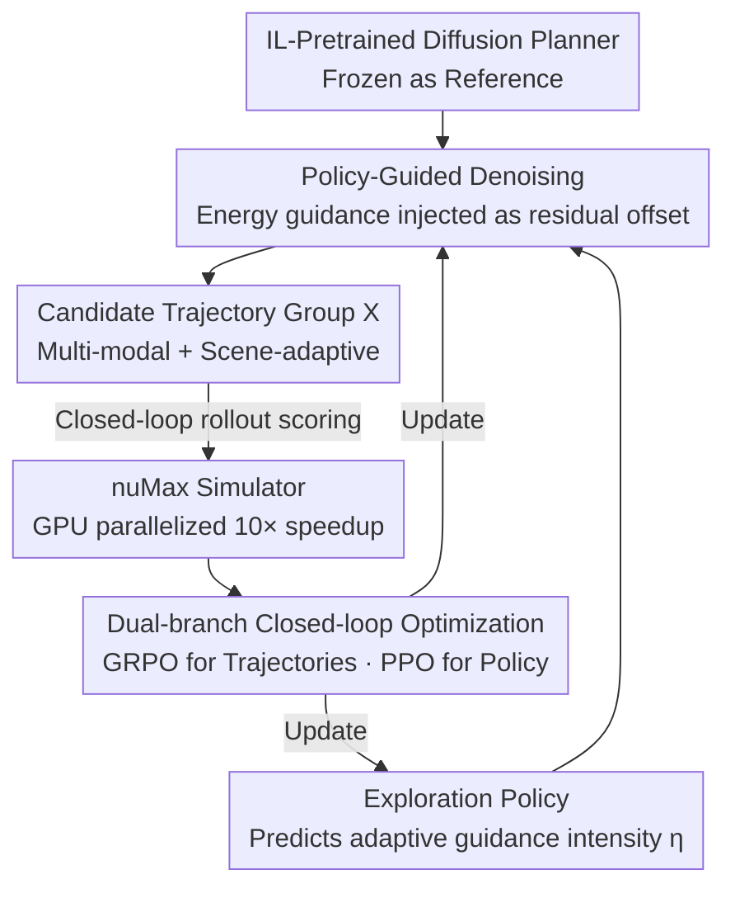

# PlannerRFT: Reinforcing Diffusion Planners through Closed-Loop and Sample-Efficient Fine-Tuning

**Conference**: CVPR 2026  
**Paper**: [CVF Open Access](https://openaccess.thecvf.com/content/CVPR2026/html/Li_PlannerRFT_Reinforcing_Diffusion_Planners_through_Closed-Loop_and_Sample-Efficient_Fine-Tuning_CVPR_2026_paper.html)  
**Code**: Project Page https://opendrivelab.com/PlannerRFT  
**Area**: Reinforcement Learning / Autonomous Driving / Diffusion Planners  
**Keywords**: Diffusion Planner, Reinforcement Fine-Tuning, Guided Denoising, GRPO, Closed-Loop Simulation

## TL;DR
PlannerRFT performs reinforcement fine-tuning for diffusion-based autonomous driving planners: it uses "policy-guided denoising" to transform modal-collapsed diffusion sampling into diverse and scene-adaptive trajectory groups, then applies a dual-branch closed-loop optimization with GRPO + PPO, supported by the self-developed 10× accelerated simulator nuMax, achieving SOTA closed-loop planning performance on nuPlan.

## Background & Motivation
**Background**: Diffusion-based planners (e.g., Diffusion Planner, DiffusionDrive) can learn human-like, socially compatible driving trajectories from large-scale human demonstrations, making them a popular probabilistic paradigm in autonomous driving motion planning. Recent work has begun using Reinforcement Fine-Tuning (RFT) to perform reward-driven optimization on diffusion planners within a "generation-evaluation" closed loop to mitigate distribution shift and objective misalignment caused by pure Imitation Learning (IL).

**Limitations of Prior Work**: The RFT paradigm of "actor generates candidate trajectories → simulation scoring → group-wise reinforcement update" depends almost entirely on the exploration capability of the generator, i.e., the distribution of candidate trajectories. However, vanilla diffusion planners suffer from **modal collapse**—different noise inputs converge to nearly identical trajectories after denoising. This lack of diversity in candidate groups fails to provide effective optimization signals for reinforcement fine-tuning.

**Key Challenge**: To alleviate collapse, anchor-based diffusion planners start from a "Gaussian distribution centered at anchors" rather than pure Gaussian noise. While this generates diverse and motion-consistent trajectories, these anchors are **fixed and scene-independent**. Some anchors produce scene-appropriate maneuvers, while others generate motions that conflict with the context, injecting noisy gradients and undermining the stability of reinforcement optimization. Thus, the challenge lies in the dual requirement for exploration: it must be both **diverse** (multi-modality) and **scene-consistent/adaptive** (adaptivity). Existing methods typically sacrifice one for the other.

**Goal**: Without changing the original inference pipeline, enable the diffusion planner during RFT to sample multi-modal candidates while adaptively shifting the exploration direction toward "more promising" regions based on the scene, thereby improving the sample efficiency of reinforcement sampling.

**Key Insight**: Replace fixed anchors with **policy-guided denoising**—injecting energy-based classifier guidance into the denoising process to generate diversity, and training an Exploration Policy to dynamically adjust guidance intensity for scene adaptivity. The overall framework uses GRPO to optimize the trajectory distribution and PPO to optimize the guidance policy, forming a dual-branch closed-loop fine-tuning setup.

## Method

### Overall Architecture
Given an IL-pretrained diffusion planner (shared scene encoder + DiT decoder), PlannerRFT duplicates and freezes one copy as a **global reference**. It then inserts an **Exploration Policy** module into the original architecture and fine-tunes the planner through closed-loop rollouts to be safer and more efficient. The workflow is: Reference trajectory + scene context → Exploration Policy provides guidance intensity → Guided denoising samples a group of diverse and scene-adaptive candidate trajectories → Closed-loop rollout scoring in the nuMax simulator → Dual-branch optimization (GRPO for trajectory distribution, PPO for guidance policy) → Updating the planner iteratively.

The overall denoising/inference structure remains unchanged; the addition is merely an "add-on" layer of "guidance term + exploration policy + closed-loop optimization." Therefore, the post-fine-tuned model remains a standard diffusion planner.

### Key Designs

**1. Policy-Guided Denoising: Expanding modal-collapsed sampling via energy guidance**

Addressing the modal collapse where different noises converge to the same trajectory, PlannerRFT maintains the denoising structure but adopts energy-based classifier guidance. It injects residual offsets into predicted trajectories at each denoising step, scattering them around the neighborhood of the reference trajectory. The guidance is **decoupled into two orthogonal components: lateral and longitudinal**. The lateral energy function measures the offset of predicted waypoints $x$ relative to reference waypoints $x_{ref}$ along the normal $n_\perp$: $\Psi_{lat.}=\frac{1}{T}\sum_{\tau=1}^{T}\big(n_\perp(x_\tau-x_{ref,\tau})-\lambda_{lat.}\eta_{lat.}\big)^2$, where $\lambda_{lat.}$ is the maximum lateral offset (meters) and $\eta_{lat.}\in[-1,1]$ is the lateral guidance intensity. The longitudinal energy function adjusts the deviation of planning speed $v$ relative to reference speed $v_{ref}$ via $\eta_{lon.}\in[-1,1]$. These energy functions yield **decoupled orthogonal gradients**. Different $(\eta_{lat.},\eta_{lon.})$ combinations correspond to different driving modes, allowing a single denoising pass to sample a diverse group of trajectories.

Notably, **no explicit map or vehicle-level collision constraints are imposed** here. The simplified guidance allows infeasible samples to enter RL optimization as negative feedback, which is better suited for reward-driven exploration than hard constraints. The denoising gradient is approximated as $\nabla_x\log p(\eta|x)\approx-\nabla_x\big(\Psi_{lat.}(x;\eta_{lat.})+\Psi_{lon.}(x;\eta_{lon.})\big)$.

**2. Exploration Policy: Making guidance intensity scene-adaptive rather than fixed**

Diversity alone is insufficient; fixed guidance can produce trajectories that conflict with the context in many scenarios. PlannerRFT trains an Exploration Policy $\pi_\phi$ to make the guidance intensity itself **conditioned on the driving context $s$ and reference trajectory**: $\eta\sim\pi_\phi(\cdot\mid s,x_{ref})$. Specifically, the reference trajectory (acting as a frozen, well-trained IL prior) is encoded into a compact token via MLP-Mixer and fused with scene embeddings through cross-attention to capture interactions between reference motion and the surroundings. The fused representation is fed into a **Guidance Head**, which predicts the parameters of two **Beta distributions** to control lateral and longitudinal guidance intensities respectively. Simultaneously, a **Value Head** $V_\psi$ estimates the state value $V(s_t)$ to assist policy optimization.

During sampling, $(\eta_{lat.}^{(k)},\eta_{lon.}^{(k)})$ are repeatedly drawn from these Beta distributions. Each pair specifies a driving mode and directs the guided denoising toward a corresponding trajectory $\hat{x}^{(k)}$. Repeating this $K$ times yields the candidate set $X=\{\hat{x}^{(k)},(\eta_{lat.}^{(k)},\eta_{lon.}^{(k)})\}_{k=1}^{K}$. Compared to uniform or fixed distributions, the learnable Beta distribution automatically tightens or expands the exploration range based on the scene. Ablations show that while uniform distributions provide the highest diversity, they cause training collapse due to exploding reward variance; this design finds a data-learned balance between diversity and stability.

**3. Dual-Branch Closed-Loop Optimization + Survival Reward: Stabilizing RFT in difficult scenarios**

PlannerRFT uses a **dual-branch** optimization: one branch uses GRPO (Group Relative Policy Optimization) to fine-tune the denoising process of the diffusion planner and directly adjust the trajectory distribution; the other uses PPO to optimize the Exploration Policy through closed-loop interaction with the simulator. A major challenge in difficult scenarios is that collisions or deviations frequently reset rewards to zero, where terminal rewards provide almost no gradient. Thus, the paper proposes a **survival reward**: accumulating stepwise rewards only on valid, non-terminal trajectory segments, $R_{surv}=\frac{1}{L}\sum R_{term}\cdot\mathbb{I}[R_{term}=0]$ (⚠️ according to the original text, the indicator function removes terminated steps). This encourages the planner to **delay failure and extend the feasible horizon**, leading to continuous improvement in long-duration closed loops. Ablations show survival reward significantly outperforms terminal reward on Test14-hard (72.21 vs 71.59 R-score).

**4. nuMax Simulator: GPU parallelization for large-scale closed-loop RL**

Unlike IL which uses offline pre-sampled data, RL requires online interaction with a simulator. The original nuPlan simulator is too slow to support training for 40 million environment steps. The authors developed **nuMax** based on Waymax: using scene caching and preprocessing to accelerate large-scale rollouts, with an LQR tracker and scorer calibrated to nuPlan (dynamics and reward alignment). A distributed pipeline bridging "PyTorch DDP worker ↔ JAX simulator" achieves a **10×** speedup over native nuPlan. While not an algorithmic innovation, it is the engineering foundation that makes this closed-loop reinforcement fine-tuning feasible.

### Loss & Training
- The IL-pretrained planner uses Diffusion Planner (trained on 1 million nuPlan clips), replacing the ODE DPM-solver denoising with a **5-step DDIM** sampler—maintaining performance while introducing stochasticity for exploration and reducing steps for RL training efficiency.
- Fine-tuning data consists of 144,494 non-overlapping scenarios from nuPlan (10 Hz, 171 frames/scenario). Three sets are constructed based on pre-training scores: Fail (10,417 collisions/deviations), Lt90 (24,691 scores < 90), and All (entire set).
- Training used 8×H100 for 40M environment steps. GRPO utilized survival reward and a 4s horizon. Optimal results were achieved with moderate maximum offset $\lambda$ (lateral 2.5m, longitudinal 25%).

## Key Experimental Results

### Main Results
Evaluated on nuPlan, Val14 tests standard driving while Test14-hard tests complex scenarios. Both Non-Reactive (NR) and Reactive (R, using IDM to adjust other vehicles) settings are used. Scores 0–100 (higher is better).

| Setting | Metric | PlannerRFT | Diffusion Planner | Flow Planner |
|------|------|-----------|-------------------|--------------|
| Val14 | NR | 89.96 | 89.87 | **90.43** |
| Val14 | R | **84.46** | 82.80 | 83.31 |
| Test14-hard | NR | **77.16** | 75.99 | 76.47 |
| Test14-hard | R | **72.21** | 69.22 | 70.42 |

Ours achieved SOTA in three out of four benchmarks. The improvement is most significant under reactive traffic: Val14-R +1.66, Test14-hard-R +2.99 (relative to pre-trained Diffusion Planner), indicating that closed-loop rollouts allow the planner to encounter broader interaction patterns and mitigate distribution shift. The limited gain in Val14-NR (non-reactive standard scenarios) is attributed by authors to inherent distribution biases in non-reactive environments.

### Ablation Study
Comparison of four exploration strategies (all using 5-step DDIM; $D$ is diversity score from DiffusionDrive, $\bar r$/$s_r$ are group reward mean/std dev for GRPO):

| Exploration Strategy | R-score↑ | NR-score↑ | Diversity D(%) | $\bar r$↑ | $s_r$ |
|---------|---------|----------|-----------|---------|------|
| IL Pretrain (DDIM) | 68.18 | 76.01 | - | - | - |
| w/o Guidance (Pure Noise) | 68.83 | 76.34 | 5.65 | 69.06 | 0.02 |
| w/ Uniform Dist. | 65.82 | 75.19 | **39.78** | 60.44 | 0.12 |
| w/ Fixed Beta Dist. | 70.65 | 76.61 | 27.73 | 71.50 | 0.07 |
| **PlannerRFT (Ours)** | **72.21** | **77.16** | 25.34 | **73.88** | 0.06 |

### Key Findings
- **More diversity is not always better**: Uniform distribution has the highest diversity (39.78%) but the lowest R-score (65.82) because scene-independent sampling introduces massive reward variance, causing repeated training collapse. Learnable Beta distributions achieved the highest mean reward with 25.34% diversity, proving "scene adaptivity" is more important than "blind diversity."
- **Fine-tuning data distribution must be balanced**: Training only on collision cases (Fail) causes the planner to forget standard driving, leading to performance drops. Using the full set (All) provides too weak a signal due to excessive easy examples. The balanced Lt90 (collisions + low scores) performs best. IL fine-tuning on the same data actually performed worse, proving gains come from exploration rather than additional training.
- **Survival Reward > Terminal Reward**; 4s/6s horizons are comparable, while 2s is too short. The maximum guidance offset $\lambda$ must be moderate—too small limits exploration, too large deviates from the human expert distribution, both harming stability.
- **Qualitative emergence of human-like behavior**: In an OOD lane-change scenario, the pre-trained planner collided at 12s between lanes. After 10M steps, it learned conservative lane-keeping (safe but inefficient). After 25M steps, it learned decisive lane changing, balancing safety and efficiency.

## Highlights & Insights
- **"Redefining Diffusion Exploration from an RL Perspective"**: Translating the modal collapse of diffusion planners into an "RL sampling lacks effective optimization signals" problem. Satisfying both multi-modality and adaptivity via learnable guidance intensity is a elegant reframing, upgrading guidance from "fixed anchors" to a "scene-conditioned policy."
- **Parameterizing guidance intensity as a Beta distribution** rather than direct scalar regression allows the policy to naturally learn both exploration mean and variance. This provides a qualitative difference in stability compared to uniform/fixed distributions and is a trick transferable to other continuous control RL tasks requiring "adaptive exploration magnitude."
- **Decoupled lateral/longitudinal energy** provides orthogonal gradients, allowing a single denoising pass to compose different modes. This avoids the expressivity loss of discrete motion tokens and the error accumulation of auto-regression, serving as a clean interface for diffusion + RL in continuous action spaces.
- **Not changing the inference pipeline** is a practical engineering choice: the fine-tuned model remains a standard diffusion planner, facilitating deployment.

## Limitations & Future Work
- **Strong dependence on simulator and nuPlan calibration**: The closed-loop RL relies on nuMax's calibration of nuPlan dynamics/rewards. The sim-to-real gap and whether recalibration is needed for different datasets are not fully discussed.
- **Minimal improvement in Val14-NR**: The authors acknowledge marginal gains in non-reactive standard scenarios, suggesting the method primarily benefits "interaction-dense / difficult" scenarios.
- **Survival reward definition** is simplified in the cache (⚠️ see original text for details); its boundary with terminal rewards and robustness in extreme long-tail scenarios requires further analysis.
- **Reference trajectory as a frozen prior** means exploration is always anchored near the IL distribution; if $\lambda$ is too large, it becomes unstable. This limits the exploration ceiling for "entirely new maneuvers" never seen by human experts.
- Future directions: Exploring replacing survival reward with smoother risk-sensitive objectives or allowing the reference prior to update slowly (teacher-student soft update) to raise the exploration ceiling.

## Related Work & Insights
- **vs Anchor-based Diffusion Planners (e.g., DiffusionDrive)**: These use fixed, scene-independent anchors from Gaussian starts for diversity, but the mismatch between anchors and scenes injects noisy gradients. PlannerRFT replaces fixed anchors with scene-conditioned learnable guidance intensity, ensuring diversity is controllable and scene-consistent.
- **vs RFT with discrete motion tokens (LLM-style RFT)**: Larger token vocabularies increase expressivity but explode optimization dimensionality and compute; diffusion naturally avoids expressivity loss from discretization in continuous action spaces.
- **vs Auto-regressive continuous trajectory generation**: The latter is prone to error accumulation and temporal instability; the probabilistic nature of diffusion denoising is better suited for temporally consistent continuous decisions.
- **vs Rule-based guided denoising**: Fixed-intensity rule guidance creates competing gradients (e.g., "collision avoidance vs comfort"), causing inconsistent performance across scenes. This work harmonizes these via a policy-learned adaptive intensity.

## Rating
- Novelty: ⭐⭐⭐⭐ Reframes the diffusion exploration problem from an RL perspective; policy-guided denoising + adaptive Beta guidance intensity provides a clear and effective new interface.
- Experimental Thoroughness: ⭐⭐⭐⭐ Solid results across nuPlan dual settings four benchmarks + multiple ablations on exploration/data/reward/offset, though limited to a single dataset without sim-to-real validation.
- Writing Quality: ⭐⭐⭐⭐ Clear motivation and good illustrations; some formulas in cache require cross-referencing with the original paper.
- Value: ⭐⭐⭐⭐ Provides a reusable paradigm and 10× speedup simulator for "Diffusion Planner + Closed-loop RL Fine-tuning," with high utility for the autonomous driving planning community.

<!-- RELATED:START -->

## Related Papers

- [\[NeurIPS 2025\] Parameter Efficient Fine-tuning via Explained Variance Adaptation](../../NeurIPS2025/reinforcement_learning/parameter_efficient_fine-tuning_via_explained_variance_adaptation.md)
- [\[NeurIPS 2025\] Reinforcing the Diffusion Chain of Lateral Thought with Diffusion Language Models](../../NeurIPS2025/reinforcement_learning/reinforcing_the_diffusion_chain_of_lateral_thought_with_diffusion_language_model.md)
- [\[CVPR 2026\] EVA: Efficient Reinforcement Learning for End-to-End Video Agent](eva_efficient_reinforcement_learning_for_end-to-end_video_agent.md)
- [\[ICLR 2026\] Sample-efficient and Scalable Exploration in Continuous-Time RL](../../ICLR2026/reinforcement_learning/sample-efficient_and_scalable_exploration_in_continuous-time_rl.md)
- [\[CVPR 2026\] Specificity-aware Reinforcement Learning for Fine-grained Open-world Classification](specificity-aware_reinforcement_learning_for_fine-grained_open-world_classificat.md)

<!-- RELATED:END -->
