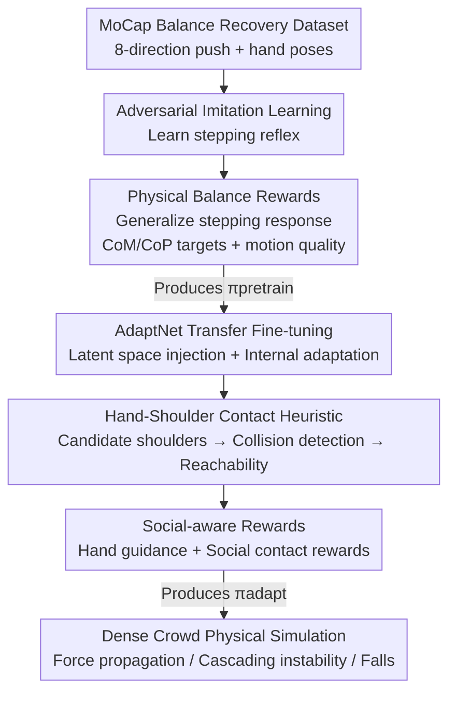

# Push-and-Step: From RL-Based Balance Recovery to Physical Simulation of Dense Crowds

**Conference**: CVPR 2026  
**Paper**: [CVF Open Access](https://openaccess.thecvf.com/content/CVPR2026/html/Jensen_Push-and-Step_From_RL-Based_Balance_Recovery_to_Physical_Simulation_of_Dense_CVPR_2026_paper.html)  
**Code**: https://github.com/alexis-jensen/Push-and-Step  
**Area**: Reinforcement Learning / Physical Simulation / Crowd Simulation  
**Keywords**: Balance recovery, dense crowds, physical simulation, two-stage RL, hand-contact heuristic

## TL;DR
A full-body simulated humanoid agent is trained using two-stage deep reinforcement learning: the first stage employs imitation learning and balance rewards to teach "stepping" for recovery after being pushed; the second stage extends this to multi-agent scenarios via AdaptNet fine-tuning and a hand-shoulder contact heuristic, ultimately simulating realistic phenomena like force propagation and cascading instability in dense crowds.

## Background & Motivation
**Background**: Traditional crowd simulations simplify humans into 2D disks, ellipses, or particles, focusing on navigation and collision avoidance in moderate densities using "local interaction rules." This paradigm fails in **extremely high-density** scenarios (e.g., peak-hour subways, front rows of concerts), where physical contact occurs and forces propagate through bodies.

**Limitations of Prior Work**: Even state-of-the-art dense crowd models rely on particle-based 2D representations. While they approximate macroscopic "force propagation waves," they fail to explain how force is transmitted and amplified **at the limb level**—whose hand is on whose shoulder, how the center of mass shifts, and when a step becomes mandatory. These mechanisms determine real-world crushing and trampling injuries. Essentially, 2D geometry misses the interaction of force, motion, and energy needed for safety analysis.

**Key Challenge**: Capturing limb-level force transmission requires **full-body physical simulation**. However, controlling humanoids in dense crowds to simultaneously maintain individual balance and avoid toppling neighbors (or utilizing neighbors for support) is a high-dimensional, multi-body, and strongly coupled control problem that traditional state machines and trajectory optimization cannot handle.

**Goal**: (1) Enable a single simulated humanoid to recover balance via stepping under arbitrary push directions, intensities, and durations; (2) Extend this to multi-agent settings, teaching agents to dissipate energy through "hand-on-shoulder" contact in a socially acceptable and mechanically efficient way; (3) Scale to large crowds to replicate force propagation trends observed in real experiments.

**Key Insight**: Humans maintain balance via three mechanisms: muscle stiffness for small disturbances, ankle/hip strategies for medium ones, and **stepping** to expand the Base of Support (BoS) for large ones. In dense crowds, a fourth mechanism is used: bracing against neighbors. Thus, "stepping + hand contact" is treated as the core behavioral vocabulary to learn a general push-and-recover behavior rather than memorizing fixed reference motions.

**Core Idea**: Two-stage RL—first training generalized stepping recovery on a single agent via imitation and physical balance rewards, then "upgrading" it into a socially interactive multi-agent strategy using AdaptNet fine-tuning and an online hand-shoulder contact heuristic.

## Method

### Overall Architecture
All agents are physically simulated humanoids driven by PD (proportional-derivative) servos. The control policy outputs "target poses" fed into the servos to calculate joint torques. The training is divided into two stages:

Stage 1 (Section 4, producing $\pi_\text{pretrain}$): Single agent imitation of a motion-captured balance recovery dataset via adversarial learning (GAN-like), supplemented with **physical balance rewards** to generalize to unseen push conditions. At this stage, the agent steps and raises its hands but does not yet utilize neighbors for support.

Stage 2 (Section 5, producing $\pi_\text{adapt}$): The $\pi_\text{pretrain}$ is **fine-tuned** using the AdaptNet architecture without retraining from scratch. The environment is extended to multiple agents, introducing an **online hand-contact heuristic** to designate target shoulders on neighbors and two new social rewards to learn the contact behavior.

### Key Designs

**1. Adversarial Imitation + Balance Reward: "Steady Stand" vs. "Looking Like Data"**

The bottleneck of Stage 1 is that pure imitation recovery only mimics fixed trajectories, failing when push direction or intensity varies. The authors use a GAN-like framework ($\pi_\text{pretrain}$ as generator, PPO for optimization, $\mathcal{L}_\pi = \mathrm{E}_t[A_t \log \pi(\mathbf{a}_t|\mathbf{s}_t)]$, where $\mathbf{s}_t$ includes a 4-frame pose history and $\mathbf{a}_t$ is the target PD pose). The reward is $r_\text{pretrain} = w_i \tfrac{1}{2}(r_\text{imit}+1) + w_g r_\text{balance} + w_q r_\text{quality}$ ($w_i=0.6, w_g=0.2, w_q=0.2$).

The physics-aware component is $r_\text{balance} = e^{-\|\text{CoM}-\text{CoM}_\text{target}\|} + e^{-\|\text{CoP}-\text{CoP}_\text{target}\|}$. The target CoM is at the BoS center at resting height (encouraging uprightness); the target CoP is calculated via a momentum-regulated model. When stepping is required, the swing foot's landing point becomes the effective CoP, placed to counteract momentum:

$$\text{CoP}_{\text{target},x} = \text{CoM}_x + \frac{d_l p_x}{f_z}\text{CoM}_z + \frac{d_h L_y}{f_z}, \quad \text{CoP}_{\text{target},y} = \text{CoM}_y + \frac{d_l p_y}{f_z}\text{CoM}_z - \frac{d_h L_x}{f_z}$$

where $p$ is linear momentum, $L$ is angular momentum, $f_z$ is the vertical ground reaction force, and $d_l=4, d_h=6$ are damping factors. By defining the landing point as a function of momentum, the policy generalizes to any push direction—ablation shows that without $r_\text{balance}$, agents withstand only 21 N, whereas the full policy withstands ~230 N.

**2. Motion Quality Reward: Preventing "Ugly but Balanced" Artifacts**

Balance rewards alone can lead to "balanced but distorted" motions—sliding feet, excessive twisting, or limb jittering. The authors add $r_\text{quality} = \tfrac{1}{3}(r_\text{foot} + r_\text{heading} + r_\text{effort})$. $r_\text{foot}=e^{-\|v_\text{foot,left}+v_\text{foot,right}\|}$ penalizes foot sliding; $r_\text{heading}=e^{-\|\theta_\text{root}-\theta_\text{original}\|}$ penalizes deviation from the initial orientation; $r_\text{effort}=e^{-E_k}$ penalizes redundant motion, where $E_k = -\tfrac{1}{M}\sum_{l\in\text{limb}}\tfrac{1}{2}m_l v_l^2$ is the total kinetic energy normalized by mass.

A "standing-still" reference is included in the dataset to anchor the state space near a neutral pose. Randomly sampled pushes (70–200 N, 0.7–1.3 s) and $\pm 10^\circ$ joint noise enhance robustness. Ablation shows that removing $r_\text{imit}$ increases heading error from $5.93^\circ$ to $44.81^\circ$, while removing $r_\text{quality}$ increases foot sliding from 22 cm to 49 cm.

**3. AdaptNet Transfer + Social Rewards: Upgrading to Multi-Agent Social Context**

Stage 2 addresses the complex multi-agent state space without losing the learned stepping ability. Using AdaptNet, $\pi_\text{pretrain}$ is frozen. $\pi_\text{adapt}$ is fine-tuned through **latent space injection** (adding an embedding layer for target hand contact positions) and **internal adaptation** (parallel small MLPs alongside the existing generator layers).

Training uses three scenarios: 3-agent lines/rows (training the middle one), single-agent pushes (no neighbors), and a no-perturbation baseline. The reward is $r_\text{adapt} = w_p r_\text{pretrain} + w_h r_\text{hands} + w_s r_\text{social}$ ($w_p=0.5, w_h=0.2, w_s=0.3$). $r_\text{hands}$ guides hands toward heuristic targets; $r_\text{social}$ penalizes contact force $F_\text{contact}$ and placement error $\Delta^\tau_\text{hand}$ during contact, emphasizing "sustainable, gentle, and precise" social interaction.

**4. Online Hand-Shoulder Contact Heuristic: Mechanics over Data Scarcity**

Since multi-human physical contact data is scarce, the authors engineer an online heuristic to determine who to support. Target points are restricted to **neighbors' shoulders**, the most frequent and mechanically efficient contact points in dense crowds.

The heuristic logic: ① **Candidates** $\mathcal{S}_\mathcal{N}$ are shoulders of neighbors within 5 m; ② **Collision Detection**—prediction of the agent’s shoulder trajectory $p_\text{shoulder}(t)$ over 1 s based on momentum; if distance to a candidate is $<\delta$ (0.25 m), it is prioritized to prevent trunk/head collision; ③ **Fall Prevention Reachability**—for remaining hands, candidates are selected by reachability ($<0.6$ m) and **collinearity** between the vector $(p_\text{shoulder}(1)-S_i)$ and momentum $\vec{L}$ to maximize energy dissipation.

### Loss & Training
PPO is the backend RL algorithm. Stage 1 uses $r_\text{pretrain}$. The discriminator uses a hinge loss trained in $[-1,1]$, shifted to $[0,1]$ for reward consistency. Stage 2 fine-tunes via AdaptNet with $r_\text{adapt}$. Scenes contain at most 3 agents during training, but generalize to arbitrary crowd sizes during inference.

## Key Experimental Results

### Main Results (Ablation validating reward design)
Evaluated on 80 push trials (16 directions × 5 force levels 50–300 N):

| Configuration | Heading Deviation↓ | Foot Sliding↓ | Kinetic Energy↓ | Note |
|------|----------|-------|-------|------|
| $\pi_\text{pretrain}$ (Full) | 5.93° | 22 cm | 933 J | Resists ~230 N |
| No $r_\text{imit}$ | 44.81° | 24 cm | 2381 J | High deviation, unnatural |
| No $r_\text{quality}$ | 13.19° | 49 cm | 1444 J | Severe foot sliding |
| No $r_\text{balance}$ | — | — | — | Resists only ~21 N (Failure) |

### Ablation Study (Stage 2 Social Contact, 90 trials)

| Configuration | Final Hand Height↓ | Max Hand Height | Impulse Transferred↓ | Note |
|------|----------|---------|----------|------|
| $\pi_\text{adapt}$ (Full) | 0.81 m | 0.85 m | 40 Ns | Contact only when needed (Neutral 0.81 m) |
| No $r_\text{hand}$ | 1.16 m | 1.16 m | 75 Ns | Hands stuck in raised position |
| No $r_\text{social}$ | 0.81 m | 0.81 m | 74 Ns | Hands don't rise; head/trunk hit |

### Key Findings
- **$r_\text{balance}$ is vital**: Removing it collapses resistance from ~230 N to 21 N, proving that the physical prior (CoM/CoP as momentum functions) provides the core generalization capability.
- **Complementary social rewards**: $r_\text{hand}$ ensures hands return to neutral (preventing constant 1.16 m height), while $r_\text{social}$ ensures hands rise when needed (preventing high impulse transfer of 74 Ns).
- **Realistic phenomena**: In a 5-person line, three real-world trends emerge based on interpersonal distance: Arm's length (0.8 m) leaves distant agents unaffected; Elbow distance (0.6 m) shows energy dissipation; Close distance (0.4 m) causes momentum accumulation and terminal instability. Impulse-speed relationships match linear regressions from real experiments.

## Highlights & Insights
- **Momentum-driven physical priors**: Explicitly calculating target CoP as a function of linear/angular momentum injects strong physics knowledge into RL, enabling generalization from a single-subject dataset to omnidirectional pushes.
- **Heuristics for data scarcity**: Instead of learning interactions from unavailable data, the authors use a mechanics-based heuristic (collinearity + reachability), which provides interpretability and bypasses data bottlenecks.
- **AdaptNet for Capability Stacking**: Fine-tuning via latent injection and parallel MLPs preserves the stepping reflex while adding social contact skills, an effective paradigm for multi-skill character control.
- **Emergent Dynamics**: The simulation does not "act" like a crowd; it calculates the mechanics. Phenomena like domino-like force propagation, momentum amplification in tight spaces, and cascading falls emerge naturally, providing a limb-level physical basis for crowd safety analysis.

## Limitations & Future Work
- **Small Dataset**: Only uses single-subject XSens MoCap data, leading to limited motion diversity and stylistic bias.
- **Static Scenes Only**: Currently only handles "pushed while standing." Locomotion is needed to integrate balance recovery with navigation, although the static case serves as a baseline for high-congestion scenarios.
- **Mesh Mismatch**: Collisions are calculated on simple geometries (spheres/boxes) while SMPL is used for rendering, occasionally causing visual artifacts like interpenetration.
- **Hard Thresholds**: The heuristic relies on fixed values (e.g., 0.25 m collision threshold, 0.6 m reachability) which might require tuning for different body sizes.

## Related Work & Insights
- **vs. Particle-based 2D Models ([14, 50, 57])**: These models replicate macroscopic waves but miss limb-level transmission. Ours uses full-body simulation to explain how forces scale through the body at the cost of higher computation.
- **vs. Motion Imitation in Physics ([39, 64])**: While those focus on visual fidelity, this work layers CoM/CoP momentum rewards to achieve physical stability beyond the dataset.
- **vs. Locomotion Recovery ([40, 66, 21])**: This work focuses on "social nudging"—impulses applied to shoulders over time with high inertia changes from a neutral stance, which is more relevant to dense crowd safety.

## Rating
- Novelty: ⭐⭐⭐⭐⭐ First to use full-body physical simulation for dense crowd contact dynamics.
- Experimental Thoroughness: ⭐⭐⭐⭐ Strong reward ablations and trend replication, though lacks cross-method quantitative comparisons.
- Writing Quality: ⭐⭐⭐⭐ Clear physics definitions and logical flow.
- Value: ⭐⭐⭐⭐⭐ Provides a limb-level physical foundation for crowd safety analysis (trampling/crushing), useful for architectural and character animation fields.

<!-- RELATED:START -->

## Related Papers

- [\[ICML 2026\] MFPO: 用 Few-step MeanFlow Policy 把 MaxEnt RL 跑到接近 Gaussian policy 的速度](../../ICML2026/reinforcement_learning/mean_flow_policy_optimization.md)
- [\[NeurIPS 2025\] CORE: Constraint-Aware One-Step Reinforcement Learning for Simulation-Guided Neural Network Accelerator Design](../../NeurIPS2025/reinforcement_learning/core_constraint-aware_one-step_reinforcement_learning_for_simulation-guided_neur.md)
- [\[AAAI 2026\] One-Step Generative Policies with Q-Learning: A Reformulation of MeanFlow](../../AAAI2026/reinforcement_learning/one-step_generative_policies_with_q-learning_a_reformulation_of_meanflow.md)
- [\[ICML 2026\] Beyond Scalar Rewards: Dense Feedback for LLM Policy Synthesis in Sequential Social Dilemmas](../../ICML2026/reinforcement_learning/beyond_scalar_rewards_dense_feedback_for_llm_policy_synthesis_in_sequential_soci.md)
- [\[CVPR 2025\] GROVE: A Generalized Reward for Learning Open-Vocabulary Physical Skill](../../CVPR2025/reinforcement_learning/grove_a_generalized_reward_for_learning_open-vocabulary_physical_skill.md)

<!-- RELATED:END -->
