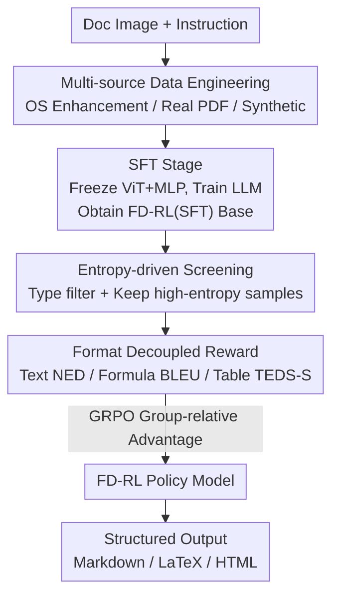

# Reading or Reasoning? Format Decoupled Reinforcement Learning for Document OCR

**Conference**: CVPR 2026  
**Paper**: [CVF Open Access](https://openaccess.thecvf.com/content/CVPR2026/html/Zhong_Reading_or_Reasoning_Format_Decoupled_Reinforcement_Learning_for_Document_OCR_CVPR_2026_paper.html)  
**Code**: https://github.com/DocTron-hub/FD-RL  
**Area**: Reinforcement Learning / Document OCR  
**Keywords**: Document OCR, Format Decoupling, Reinforcement Learning, GRPO, Entropy Screening

## TL;DR
The authors observe that the output entropy of OCR models on formatted text (formulas, tables, etc.) is an order of magnitude higher than on plain text, identifying these as the true "bottlenecks." They propose FD-RL: utilizing SFT to build a reading foundation, followed by reinforcement learning with "entropy-based data screening + format-specific decoupled rewards" to specifically target formatted content. It achieves an overall score of 90.41 on OmniDocBench, emerging as a highly competitive end-to-end solution.

## Background & Motivation

**Background**: Document OCR is transitioning from traditional pipelines (layout detection followed by regional parsing) to an end-to-end paradigm using Vision Language Models (VLMs) to directly decode images into structured text (Markdown/LaTeX/HTML), such as DeepSeek-OCR, dots.ocr, and PaddleOCR-VL. This approach is flexible with strong cross-domain generalization, typically relying on intensive data engineering and Supervised Fine-Tuning (SFT).

**Limitations of Prior Work**: It is generally assumed that "reading text is an intuitive perceptual task," leading to efforts being concentrated on data scale and cleaning. However, the authors conducted a key statistical analysis: using Qwen3-VL for inference on a large corpus, documents were categorized into five tiers (20%/40%/60%/80%/100%) based on the "proportion of formatted text." They found that **higher proportions of formatted text correlate with higher token output entropy, often an order of magnitude higher than plain text**. High entropy indicates significant model uncertainty and error proneness—formulas and tables are the actual disaster zones for end-to-end OCR. Token-level supervision in pure SFT tends to bury these "format errors" within the massive volume of "content-correct" tokens.

**Key Challenge**: Content like formulas and tables carries complex visual-structural logic requiring "reasoning" rather than simple "perception." A single formula can have multiple semantically equivalent representations (e.g., `1/2` vs. `\frac{1}{2}`). The token-by-token imitation objective of SFT naturally biases towards "memorizing one specific reference sequence," failing to reward diverse valid representations. High-entropy tokens are natural "junctions" leading the language model toward diverse reasoning paths and serve as ideal signals for reinforcement learning, yet they have been ignored in previous work.

**Goal**: (1) Precision-target RL optimization power toward high-entropy formatted content; (2) Make rewards sensitive to "format legality/structural consistency" rather than "exact token matching."

**Key Insight**: Adoption of a "reasoning-after-reading" (SFT-then-RL) two-stage paradigm, combined with **entropy-driven data screening** and **format-decoupled rewards**, focusing RL efforts on formulas and tables—performing format-level validation rather than token-level memorization.

## Method

### Overall Architecture
FD-RL uses Qwen3-VL-4B as the backbone, trained in two stages. **Stage 1: SFT**: Supervised fine-tuning on a self-constructed large-scale, format-rich corpus. The vision encoder (ViT) and projection MLP are frozen, updating only the language model to concentrate compute on sequence decoding and format generation, resulting in a strong OCR base, FD-RL(SFT). **Stage 2: RL**: The SFT model computes average entropy for candidate samples to screen for "most difficult" format-dense samples for GRPO training. After GRPO samples multiple responses, a "format-decoupled" reward function scores each response, followed by intra-group normalization into advantage values to update the policy. The core of the pipeline is **aligning data engineering, data screening, and reward design with the "formatted content" bottleneck**.

### Key Designs

**1. Multi-source Data Engineering: Building a Robust Reading Foundation**

RL optimization requires a strong SFT base, yet high-quality format-dense OCR data is scarce. The authors construct the corpus through three avenues: (a) **Quality Enhancement of Open-source Datasets**: Collected PDFA, DocStruct4M, etc., identified common issues like "missing content, wrong reading order, sentence repetition," and re-annotated them using the lightweight GOT model. Similarity filtering was applied between "original vs. VLM labels," **retaining only high-similarity samples** (while keeping original labels as ground truth to avoid overfitting to VLM styles); (b) **Real PDF Construction**: Divided into layout-aware (page-level Markdown via MinerU, LaTeX via Mathjax, deduplication via Text-Dedup; region-level Mathpix results with coordinates and color-box annotations + empty box negatives; multi-page sequences) and content-aware (formulas to LaTeX via dots.ocr, tables to HTML); (c) **Synthetic OCR Data**: Based on K12 to graduate exercises and STEM Q&A from StackExchange, using HTML templates + MathJax + CSS for layout design, rendered via Playwright. This covers nine document categories. This step is the foundation for the high performance (Table 3).

**2. Two-stage SFT-then-RL: Reading First, Then Reasoning for Format**

Why not apply RL directly to a general VLM? Because the base lacks specialized OCR capabilities, leaving RL nothing to optimize. The training is split: "SFT establishes strong reading capability $\rightarrow$ RL specializes in format correctness and structural legality." Unlike the token-level objective of SFT, RL provides **targeted feedback for format-specific errors**—malformed LaTeX syntax or broken table hierarchies are prioritized for correction, preventing "format errors" from being drowned out by massive "content tokens." Ablations (Table 4) show that direct RL (no SFT) reaches only 49.37, while SFT alone reaches 87.13. The gains from SFT+RL are concentrated on format-dense tasks: Formula +3.07, Table TEDS +6.08 / TEDS-S +7.19.

**3. Entropy-driven Data Screening: Focused RL on High Uncertainty**

For RL data collection, type filtering is applied first (removing plain text, increasing structured data), followed by using the SFT model to infer each sample and calculating the average output entropy of tokens. Samples are retained based on a threshold $\tau$:

$$D_{\text{filtered}} = \left\{ d \in D_{\text{raw}} \;\middle|\; -\frac{1}{N_d}\sum_{i=1}^{N_d} \log p_i^{(d)} \ge \tau \right\}$$

Where $N_d$ is the token count of sample $d$, and $p_i^{(d)}$ is the probability of the $i$-th token. High entropy equals complex structure and model uncertainty; focusing RL here strengthens diverse reasoning. The screening rate has a sweet spot: Table 5 shows 88.47 at 0% (no screening), peaking at 90.41 with 50% screening, but dropping to 88.58 at 75%.

**4. Format Decoupled Reward: Specialized Scoring for Content Types**

Uniform rewards (e.g., Edit Distance for the entire output) cause the model to ignore critical but sparse formulas/tables in favor of majority plain text. The authors use regex to split both model output and ground truth into plain text, formulas, and tables, **applying the most suitable reward for each**: Normalized Edit Distance (NED) for plain text (fine-grained character supervision); BLEU for formulas (n-gram matching is more sensitive to local structural errors and provides sharper feedback than NED); TEDS-S for tables (Tree Edit Distance based on HTML, specifically measuring structural consistency). Formulas and tables are normalized before scoring to tolerate equivalent representations. The overall reward is the average of categories where the ground truth is non-empty:

$$R = \frac{\sum_{c=1}^{C} \mathbb{I}[|GT_c| > 0]\cdot f_c(\text{Pred}_c, GT_c)}{\sum_{c=1}^{C} \mathbb{I}[|GT_c| > 0]}$$

Where $C$ is the number of content types, $f_c$ is the reward function for type $c$, and $\mathbb{I}[\cdot]$ is the indicator function. A **fallback mechanism** is implemented: if regex parsing fails, all rewards degrade to character-level string matching, ensuring the model still receives non-zero supervision. Ablations (Table 6) show incremental gains: Unified NED 88.64 $\rightarrow$ Format Decoupled 89.61 (+0.97) $\rightarrow$ Formula BLEU 89.80 $\rightarrow$ Table TEDS-S 90.41.

### Loss & Training
The RL stage uses GRPO: for each input $x$, $G$ responses $\{o_1,\dots,o_G\}$ are sampled from the old policy $\pi_{\theta_{old}}$. Individual rewards $R_i$ are calculated and group-normalized into advantages $A_i = \dfrac{R_i - \text{mean}(\{R_j\})}{\text{std}(\{R_j\})}$. The policy is optimized using a clipped PPO-style objective without a separate critic. SFT freezes ViT and the MLP, updating only the LLM across three data sources.

## Key Experimental Results

### Main Results (OmniDocBench, 1355 pages / 9 categories / Bilingual)
Overall score: $\text{Overall} = \frac{(1-\text{TextEdit})\times100 + \text{Formula}_{CDM} + \text{Table}_{TEDS}}{3}$. Comparison with end-to-end VLMs:

| Method | E2E | Overall↑ | TextEdit↓ | Formula CDM↑ | Table TEDS↑ | Table TEDS-S↑ | RO Edit↓ |
|------|:---:|------|------|------|------|------|------|
| GPT-4o | ✓ | 75.02 | 0.217 | 79.70 | 67.07 | 76.09 | 0.148 |
| DeepSeek-OCR | ✓ | 87.01 | 0.073 | 83.37 | 84.97 | 88.80 | 0.086 |
| dots.ocr | ✓ | 88.41 | 0.048 | 83.22 | 86.78 | 90.62 | 0.053 |
| **FD-RL (Ours)** | ✓ | **90.41** | 0.049 | **88.67** | **87.35** | **92.10** | 0.055 |
| PaddleOCR-VL (Pipeline) | ✗ | 92.56 | 0.035 | 91.43 | 89.76 | 93.52 | 0.043 |

FD-RL ranks first among end-to-end models, outperforming dots.ocr by 2.0 and DeepSeek-OCR by 3.4. Formula CDM (88.67) and Table TEDS (87.35) / TEDS-S (92.10) are all end-to-end SOTA.

### Ablation Study

| Configuration | Overall↑ | Description |
|------|------|------|
| No specialized training | 46.06 | Baseline |
| + Open-source data | 78.25 | +32.19, Basic OCR capability |
| + Real PDF | 84.16 | +5.91, Layout robustness |
| + Synthetic data | 87.13 | +2.97, Formulas/Tables |
| + RL data (Full FD-RL) | **90.41** | +3.28, SFT & RL synergy |

Entropy Screening Rate (Table 5): 0% $\rightarrow$ 88.47, 25% $\rightarrow$ 89.53, **50% $\rightarrow$ 90.41 (Best)**, 75% $\rightarrow$ 88.58.
Reward Decoupling (Table 6): Unified NED 88.64 $\rightarrow$ +Decoupling 89.61 $\rightarrow$ +Formula BLEU 89.80 $\rightarrow$ +Table TEDS-S 90.41.

### Key Findings
- **RL gains are highly concentrated on formatted content**: Compared to pure SFT (87.13), full FD-RL gains +3.07 in Formula and +6.08 in Table TEDS. Text edit distance only slightly improved (0.055 to 0.049).
- **Two-stage training is indispensable**: RL without SFT reaches only 49.37.
- **Screening rate sweet spot**: 50% is optimal, showing an inverted U-shape.
- **Decoupled rewards contribute positively**: Every step from unified NED to type-specific rewards improves scores, with decoupling providing the largest single jump (+0.97).

## Highlights & Insights
- **Redefining OCR challenges via "entropy"**: Reverses the "reading = perception" default. The statistical link between format ratio and token entropy justifies formulas/tables as high-uncertainty reasoning zones.
- **Pragmatic reward decoupling + fallback**: Using NED/BLEU/TEDS-S for different structures is intuitive, but the fallback mechanism for regex failures is a crucial engineering detail for training stability.
- **Transferable "entropy-based screening"**: Using the SFT model's own entropy as a difficulty signal to select RL training samples is a methodology applicable to code generation, math reasoning, and other RLVR tasks.

## Limitations & Future Work
- **Still trails top pipeline solutions**: FD-RL (90.41) is still lower than pipeline-based PaddleOCR-VL (92.56) and MinerU2.5 (90.67).
- **Dependency on external models for data**: Re-annotation relies on GOT and MinerU/Mathpix/dots.ocr; quality is bounded by these "teachers."
- **Threshold tuning**: 50% is empirically optimal; whether this sweet spot shifts with different data distributions or base model scales is unexplored.
- **Validation on a single benchmark**: Lacks cross-benchmark evidence for long documents, handwriting, or low-quality scans.

## Related Work & Insights
- **vs. Pipeline OCR (MinerU, PP-StructureV3)**: Pipelines are stable but less flexible; FD-RL is end-to-end with better generalization but slightly lower peak accuracy.
- **vs. Pure SFT End-to-End VLMs (dots.ocr, DeepSeek-OCR)**: They rely on data and SFT; this work argues SFT cannot handle high-entropy formats and adds a format-targeted RL layer.
- **vs. Early RL-based OCR**: Earlier works used heuristic composite rewards for layout/reading order without considering high-entropy formatted text.

## Rating
- Novelty: ⭐⭐⭐⭐ Connects data screening and reward decoupling via entropy, reframing OCR as a format reasoning problem.
- Experimental Thoroughness: ⭐⭐⭐⭐ Comprehensive ablations, though validated on a single benchmark.
- Writing Quality: ⭐⭐⭐⭐ Strong logic from motivation to experiment.
- Value: ⭐⭐⭐⭐ Strong end-to-end OCR baseline with transferable RL methodologies.

<!-- RELATED:START -->

## Related Papers

- [\[CVPR 2026\] AnyDoc: Enhancing Document Generation via Large-Scale HTML/CSS Data Synthesis and Height-Aware Reinforcement Optimization](anydoc_enhancing_document_generation_via_large-scale_htmlcss_data_synthesis_and_.md)
- [\[ICLR 2026\] AutoTool: Automatic Scaling of Tool-Use Capabilities in RL via Decoupled Entropy Constraints](../../ICLR2026/reinforcement_learning/autotool_automatic_scaling_of_tool-use_capabilities_in_rl_via_decoupled_entropy_.md)
- [\[AAAI 2026\] Vision-Language Reasoning for Geolocalization: A Reinforcement Learning Approach](../../AAAI2026/reinforcement_learning/vision-language_reasoning_for_geolocalization_a_reinforcement_learning_approach.md)
- [\[ICLR 2026\] LoongRL: Reinforcement Learning for Advanced Reasoning over Long Contexts](../../ICLR2026/reinforcement_learning/loongrl_rl_for_reasoning_long_contexts.md)
- [\[ICML 2026\] InftyThink+: Effective and Efficient Infinite-Horizon Reasoning via Reinforcement Learning](../../ICML2026/reinforcement_learning/inftythink_effective_and_efficient_infinite-horizon_reasoning_via_reinforcement_.md)

<!-- RELATED:END -->
