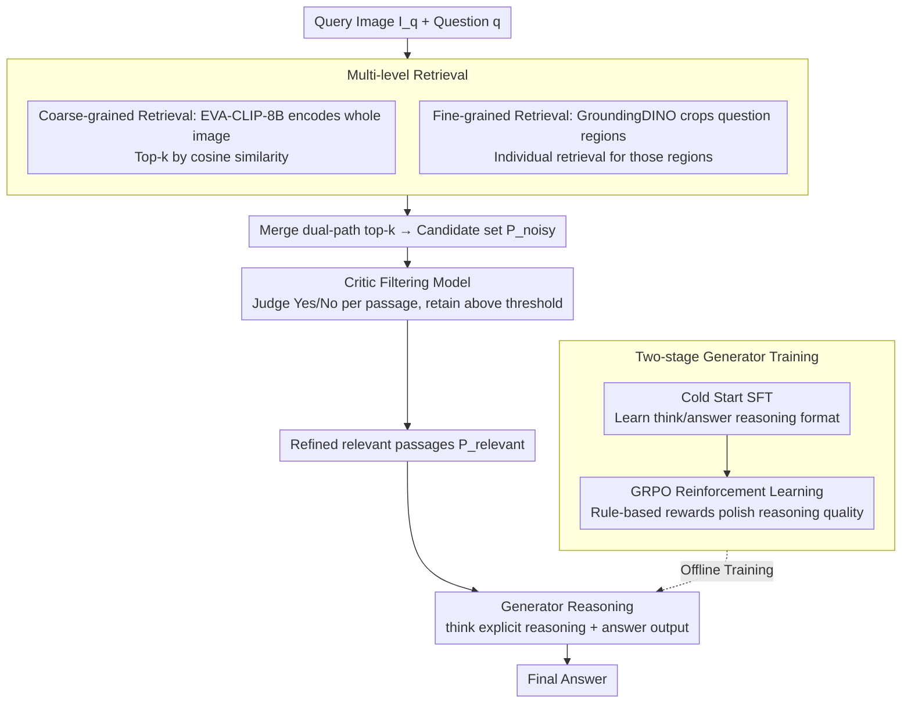

# ReAG: Reasoning-Augmented Generation for Knowledge-based Visual Question Answering

**Conference**: CVPR 2026  
**arXiv**: [2511.22715](https://arxiv.org/abs/2511.22715)  
**Code**: [aimagelab.github.io/ReAG](https://aimagelab.github.io/ReAG)  
**Area**: Reinforcement Learning  
**Keywords**: KB-VQA, RAG, Reinforcement Learning, Reasoning Augmentation, Multimodal Retrieval

## TL;DR

ReAG is proposed as a reasoning-augmented multimodal RAG method that combines coarse and fine-grained retrieval with a Critic filtering model to reduce noise. It employs GRPO reinforcement learning to train the generator for explicit reasoning, achieving a new SOTA on knowledge-intensive VQA tasks.

## Background & Motivation

Knowledge-intensive Visual Question Answering (KB-VQA) requires models to answer domain-specific questions that exceed the scope of visual content alone, necessitating the retrieval of relevant information from external knowledge bases (e.g., Wikipedia). Even state-of-the-art Multimodal Large Language Models (MLLMs) perform poorly when facing domain knowledge that is underrepresented in their pre-training data.

Existing retrieval-augmented methods face two core challenges:

**High Retrieval Noise**: User queries are highly heterogeneous, and external knowledge bases can contain millions of documents. This leads to low retrieval recall and excessive noise, providing MLLMs with numerous irrelevant passages.

**Weak Reasoning Ability**: Even with relevant documents retrieved, extracting correct information and reasoning to an answer is difficult. Existing methods lack the capacity for explicit reasoning over retrieved content.

The Core Idea of ReAG is to **"filter first, then reason"**: reducing noise via multi-level retrieval and Critic filtering, and then training the generator through reinforcement learning to possess explicit reasoning capabilities over the retrieved content.

## Method

### Overall Architecture

ReAG aims to solve two long-standing problems in KB-VQA: noisy retrieved documents and the generator's inability to reason from evidence. These issues are addressed separately: a "coarse+fine dual-level retrieval → Critic filtering" pipeline suppresses noise before reaching the generator, and a two-stage "SFT Cold Start → GRPO Reinforcement Learning" training process forces the generator to learn explicit reasoning over high-quality evidence. The data flow for a complete Q&A session involves: the query image and question undergo multi-level retrieval to obtain a set of candidate passages $\mathcal{P}^{noisy}$; the Critic model judges relevance passage-by-passage to produce a refined $\mathcal{P}^{relevant}$; finally, the generator reasons within `<think>` tags and provides the answer within `<answer>` tags. The generator itself is trained offline via SFT cold start and GRPO reinforcement learning.

### Key Designs

**1. Multi-level Retrieval: Supplementing global retrieval with fine-grained region details**

Relying solely on global image retrieval often yields insufficient recall, as the question may pertain to an inconspicuous local detail that is obscured by global embedding similarity. ReAG stacks two levels of retrieval: coarse-grained retrieval uses EVA-CLIP-8B to encode the entire query image and retrieves the top-k from the knowledge base to form $\mathcal{P}^{cg}$; fine-grained retrieval uses GroundingDINO to detect visual subjects mentioned in the question, crops the regions of interest, and retrieves separately for those regions to form $\mathcal{P}^{fg}$. The two paths are merged by relevance to retain the top-k passages, forming the $\mathcal{P}^{noisy}$ set for filtering. The value of the fine-grained path lies in shifting the retrieval focus from the "entire image" to the "specific regions of interest," recalling relevant documents that would otherwise be buried.

**2. Critic Filtering Model: Eliminating irrelevant passages before the generator**

The dilemma of retrieval is that increasing $k$ improves recall but sacrifices precision, flooding the MLLM with irrelevant passages. ReAG's solution is to insert a specialized relevance judge between retrieval and generation. Based on a fine-tuned Qwen2.5-VL-3B, this autogressive MLLM takes $(I_q, q, p)$—the query image, question, and a single candidate passage—and judges only if the passage is relevant to the question. Passages with a "Yes" prediction probability above a certain threshold are kept, resulting in a refined $\mathcal{P}^{relevant}$. This allows for high recall during initial retrieval as the Critic handles noise reduction; furthermore, the Critic is agnostic to the specific retrieval backbone.

**3. Cold Start SFT: Training the model to reason using the `<think>/<answer>` format**

Direct reinforcement learning is difficult to initiate because the model lacks a basic reasoning format and reward signals are sparse. ReAG adopts a multi-stage approach inspired by DeepSeek-R1, starting with a round of SFT for a cold start. High-quality reasoning trajectories $tr$ are collected from MLLMs, using `<think>` and `<answer>` tags to separate the reasoning process from the final answer. The training objective weights these parts separately:

$$\mathcal{L}_{SFT} = \alpha \mathcal{L}_A + (1-\alpha)\mathcal{L}_T$$

where $\mathcal{L}_A$ and $\mathcal{L}_T$ are the losses on answer and reasoning tokens, respectively. $\alpha=0.8$ places more weight on the answer to ensure the reasoning format is learned without diluting the answer's correctness with the high volume of reasoning tokens.

**4. GRPO Reinforcement Learning: Polishing reasoning quality beyond the cold start**

While SFT establishes reasoning behavior, reinforcement learning is required to ensure evidence is used effectively and the model is robust to noise. ReAG implements RL within the GRPO framework, incorporating two modifications from DAPO: removing KL divergence penalties and using token-level loss calculations. For each $(I_q, q, p)$, $N=8$ completions are sampled, and the policy is updated using the relative advantage within the group calculated via rule-based rewards. The reward is a weighted sum of task and format scores:

$$R_i = \gamma R_{task}(o_i) + \delta R_{fmt}(o_i),\quad \gamma=1.0,\ \delta=0.2$$

The task reward $R_{task}$ validates correctness by parsing the output based on question type (numeric/text, single/multiple answers). The format reward $R_{fmt}$ checks adherence to the `<think>...<answer>...` template. Unlike pure SFT, this step uses answer correctness as a direct signal to optimize the reasoning process, providing the final performance boost observed in benchmarks.

### Loss & Training

The vision encoder is frozen throughout training, with only the MLP adapter and LLM weights being updated. The RL stage utilizes the Adam optimizer with a learning rate of $1 \times 10^{-6}$, a batch size of 128 prompts, and 8 completions per prompt. SFT and RL objective functions and reward weights are as specified in the corresponding sections above.

## Key Experimental Results

### Main Results

Results using EVA-CLIP-8B as the retriever:

| Dataset | Metric | ReAG (3B) | ReflectiVA (3B) | Gain |
|--------|------|-----------|-----------------|------|
| E-VQA (All) | Accuracy | 42.9 | 35.2 | +7.7 |
| InfoSeek (All) | Accuracy | 43.3 | 38.9 | +4.3 |

| Dataset | Metric | ReAG (7B) | VLM-PRF (InternVL3-8B) | Gain |
|--------|------|-----------|------------------------|------|
| E-VQA (Single-Hop) | Accuracy | 44.9 | 40.1 | +4.8 |
| E-VQA (All) | Accuracy | 47.0 | 39.2 | +7.8 |
| InfoSeek (All) | Accuracy | 47.2 | 42.5 | +4.7 |

Performance improves further with the OMGM retriever: ReAG (7B) reaches 52.5% on E-VQA and 49.2% on InfoSeek.

Using Oracle Wikipedia pages (upper bound experiment): ReAG (7B) achieves 81.5% on E-VQA and 59.7% on InfoSeek.

### Ablation Study

| Configuration | E-VQA (Single-Hop) | InfoSeek (All) | Description |
|------|-------|---------|------|
| No Retrieval (Zero-shot) | 21.9 | 18.3 | Internal knowledge only |
| Coarse Retrieval | 19.2 | 10.1 | Noisy passages degrade performance |
| Coarse+Fine+Critic | 40.2 | 27.1 | Filtering provides significant boost |
| +SFT | 39.3 | 37.5 | Reasoning significantly boosts InfoSeek |
| +SFT + Trajectory | 38.1 | 41.3 | Explicit reasoning further improves performance |
| +SFT + RL (Full ReAG) | 41.3 | 43.3 | RL provides final gain |

### Key Findings

1. **Critic filtering is essential**: Without the Critic, noisy passages from coarse retrieval lead to performance lower than zero-shot, highlighting noise management as critical to RAG systems.
2. **RL outperforms pure SFT**: The reinforcement learning stage brings significant gains across both benchmarks, validating the effectiveness of reward-based reasoning optimization.
3. **Reasoning trajectories are interpretable**: The reasoning process reveals the utility of retrieved passages and derivation steps, providing full interpretability.
4. **ReAG is agnostic to retrieval backbones**: The Critic model can be seamlessly integrated with any retrieval engine.

## Highlights & Insights

- **Filter-First Philosophy**: Unlike most RAG methods that attempt to teach the generator to handle noise, ReAG reduces noise at the source via the Critic, allowing the generator to focus on high-quality reasoning.
- **SFT → RL Multi-stage Training Strategy**: Inspired by DeepSeek-R1, SFT serves as a cold start to establish initial reasoning behavior, while RL is responsible for truly refining reasoning quality.
- **Complementarity of Fine-Grained Retrieval**: Detecting visual subjects and cropping images captures retrieval results more relevant to the question, effectively complementing coarse-grained retrieval.
- **Quantitative Validation of Noise in RAG**: Ablation experiments clearly demonstrate that unfiltered retrieval results can actually degrade performance.

## Limitations & Future Work

1. The Critic model itself may make misjudgments; more granular relevance assessments (e.g., passage quality scores instead of binary classification) may be superior.
2. The retrieval phase uses a fixed top-k; adaptive retrieval quantities could further improve efficiency.
3. Currently validated only on the Wikipedia knowledge base; generalization to other domains (e.g., medicine, law) is unknown.
4. Reasoning trajectory generation increases inference time; practical deployment requires balancing reasoning depth with latency.

## Related Work & Insights

- **ReflectiVA**: Uses control tokens to guide retrieval and knowledge assessment but lacks explicit reasoning.
- **VLM-PRF**: Utilizes external tools for knowledge filtering, sharing the Critic concept but with a different implementation.
- **DeepSeek-R1 / GRPO**: Provides the methodological foundation for RL-enhanced reasoning.
- **Search-R1**: Integrates retrieval and reasoning for complex queries, providing inspiration for the multimodal extension of ReAG.

## Rating

- Novelty: ⭐⭐⭐⭐ (Combining Critic filtering and RL reasoning is effective, though components are not entirely new)
- Experimental Thoroughness: ⭐⭐⭐⭐⭐ (Two standard benchmarks, multiple retrievers, detailed ablations, oracle upper bounds)
- Writing Quality: ⭐⭐⭐⭐⭐ (Clear structure, comprehensive ablation, intuitive figures)
- Value: ⭐⭐⭐⭐⭐ (Provides a complete and efficient solution for knowledge-augmented VQA)

<!-- RELATED:START -->

## Related Papers

- [\[NeurIPS 2025\] Knowledge-based Visual Question Answer with Multimodal Processing, Retrieval and Filtering](../../NeurIPS2025/reinforcement_learning/knowledge-based_visual_question_answer_with_multimodal_processing_retrieval_and_.md)
- [\[AAAI 2026\] TAdaRAG: Task Adaptive Retrieval-Augmented Generation via On-the-Fly Knowledge Graph Construction](../../AAAI2026/reinforcement_learning/tadarag_task_adaptive_retrieval-augmented_generation_via_on-the-fly_knowledge_gr.md)
- [\[ICLR 2026\] A$^2$Search: Ambiguity-Aware Question Answering with Reinforcement Learning](../../ICLR2026/reinforcement_learning/a2search_ambiguity-aware_question_answering_with_reinforcement_learning.md)
- [\[ICLR 2026\] QuRL: Rubrics As Judge For Open-Ended Question Answering](../../ICLR2026/reinforcement_learning/qurl_rubrics_as_judge_for_open-ended_question_answering.md)
- [\[NeurIPS 2025\] Improving Retrieval-Augmented Generation through Multi-Agent Reinforcement Learning](../../NeurIPS2025/reinforcement_learning/improving_retrieval-augmented_generation_through_multi-agent_reinforcement_learn.md)

<!-- RELATED:END -->
