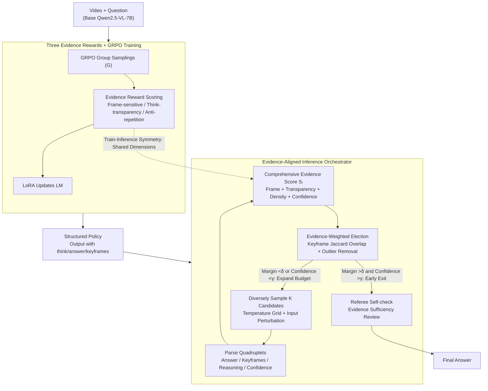

# Reinforce to Learn, Elect to Reason: A Dual Paradigm for Video Reasoning

**Conference**: CVPR 2026  
**arXiv**: [2604.04379](https://arxiv.org/abs/2604.04379)  
**Code**: None  
**Area**: Video Understanding / Multimodal Reasoning / Reinforcement Learning  
**Keywords**: Video Reasoning, Reinforcement Learning, Evidence-driven, Multi-candidate Election, Test-time Inference

## TL;DR

Ours proposes the RLER dual-paradigm framework. In the training phase, GRPO is employed with three novel rewards (Frame-sensitive, Think-transparency, Anti-repetition) to teach the model to generate structured evidence. In the inference phase, a training-free orchestrator performs weighted election and self-check among multiple candidates based on evidence consistency. This approach comprehensively outperforms open-source and RL-based LMMs on 8 video benchmarks with an average gain of 6.3%, requiring only approximately 3.1 candidates.

## Background & Motivation

1. **Background**: Large Multimodal Models (LMMs) have achieved significant progress in video understanding, but reasoning remains "single-pass"—generating an answer without verifying whether the reasoning is based on valid evidence. Even SOTA models are easily broken by minor perturbations (video changes or phrasing variations).
2. **Limitations of Prior Work**:
    - Existing RL-based training methods (such as Video-R1, VideoChat-R1) improve reasoning capabilities but rarely check for evidence consistency between multiple reasoning trajectories.
    - Test-time scaling methods (best-of-N, beam search) provide diverse candidates but lack systematic evidence-based arbitration.
    - Chain-of-Thought (CoT) is seldom systematically cross-verified against keyframes and relations.
3. **Key Challenge**: Existing methods can show that a model "can reason," but cannot prove it "reasoned using the correct evidence."
4. **Goal**: Shift video reasoning from "answer-driven" to "evidence-driven"—allowing the model to issue structured, machine-checkable evidence signals during training and electing reliable answers through evidence consistency during inference.
5. **Key Insight**: Decouple "ability to think" from "correct thinking"—training is responsible for shaping and enhancing reasoning capability (potentiation), while inference ensures reliability through evidence election.
6. **Core Idea**: Use reward shaping during training to make the model generate outputs containing keyframe references and structured reasoning; during inference, use evidence-weighted election to select the most reliable answer from multiple candidates.

## Method

### Overall Architecture

The core problem RLER addresses is that video reasoning has long remained "single-pass"—models provide answers without verifying if they are truly based on valid evidence. RLER decomposes this into two symmetric stages. At the training end (RLER-Training), the GRPO policy is optimized to make the model output structured results with `<think>`, `<answer>`, and `<keyframes>` tags. Reward shaping forces out evidence signals such as "which keyframes to cite, how long the reasoning should be, and whether it is repetitive." At the inference end (RLER-Inference), single outputs are no longer trusted. Instead, a small number of candidates are sampled using diverse inputs, each parsed into machine-checkable evidence. A weighted election is performed based on evidence consistency to select the most reliable answer, with early stopping when divergence is low and referee self-checks when necessary. The base model is Qwen2.5-VL-7B-Instruct. During training, the visual encoder and projection layers are frozen, and only the language model parameters are updated via LoRA (r=8). Both stages share the same evidence dimensions (frame-sensitivity, think-transparency, anti-repetition), forming a closed loop where "training shapes capability and inference guarantees reliability."

### Key Designs

**1. Three Evidence Rewards: Optimizing "Where to Look, How Much to Say, and How to Say It"**

A pain point of video reasoning is that CoT is rarely contrasted with keyframes and relations. RLER introduces three new rewards targeting evidence quality alongside standard accuracy and format rewards. The **Frame-sensitive Reward** compels the model to cite specific keyframes. The valid frame score is defined as $s_{fs}(o) = \text{clip}\!\left(\frac{|K(o)| - E(o)}{1 + |K(o)|}, 0, 1\right)$, where $K(o)$ is the set of cited valid frame indices and $E(o)$ is the count of invalid indices; this reward is gated by answer accuracy and format validity to prevent "citation stuffing." The **Think-transparency Reward** uses a unimodal curve $\sin^2(\pi \tilde{L}(o))$ to reward reasoning chains of moderate length—where $\tilde{L}$ is the normalized reasoning length. Short (insufficient evidence) or bloated (filler) chains receive low scores. The **Anti-repetition Reward** suppresses low-information density paraphrasing using n-gram deduplication, $R_{ar}(o) = -\rho(o)$, where $\rho$ is the repetition rate. These dimensions align directly with the scoring criteria used during the inference stage.

**2. Evidence-Aligned Inference Orchestrator: Replacing Single-Pass with Evidence Consistency Election**

Even with optimized training, a single output may encounter "evidence holes." The orchestrator (RLER-Inference) samples candidates using a temperature grid $\{0.2, 0.7, 0.9\}$ and input perturbations (e.g., five-crop, brightness). Each candidate is parsed into a quadruplet $(a_i, K_i, z_i, c_i)$—answer, keyframe set, reasoning text, and self-reported confidence. A comprehensive evidence score is then calculated:

$$S_i = \tfrac{1}{4}\big(s_{fs}(o_i) + \tau(o_i) + (1-\rho(o_i)) + c_i\big),$$

merging frame citation quality, thinking transparency, information density, and confidence. Instead of simple majority voting, it performs **Evidence-Weighted Election**: for candidates supporting the same answer, the Jaccard overlap of their keyframe sets is calculated to measure evidence alignment. After removing outliers, votes are weighted by $S_i$. Answers where evidence cross-corroborates receive higher weights. The process stops early if the lead margin exceeds $\delta=0.08$ and average confidence exceeds $\gamma=0.4$, explaining why only ~3.1 candidates are needed. Finally, a referee performs a self-check on evidence sufficiency.

**3. Train-Inference Symmetry: Global Reuse of Evidence Dimensions**

RLER deliberately aligns training rewards with inference scoring: the frame-sensitive, think-transparency, and anti-repetition rewards correspond exactly to the $s_{fs}$, $\tau$, and $1-\rho$ terms in the comprehensive evidence score. This avoids the common train-inference gap. Capabilities formed during training—citing keyframes, moderate thinking, and avoiding repetition—are directly utilized as scoring criteria for election during inference.

### Key Experimental Results

### Main Results

| Benchmark | Type | Qwen2.5-VL-7B | Video-R1 | VideoChat-R1.5 | **RLER** |
|------|------|---------------|----------|----------------|----------|
| VSIBench | Video Reasoning | 37.4 | 35.8 | - | **43.3** |
| VideoMMMU | Video Reasoning | 47.4 | 52.3 | 51.4 | **54.2** |
| VideoMME | General | 65.1 | 59.3 | 67.1 | **68.5** |
| TempCompass | General | 69.2 | 73.2 | - | **76.2** |
| MVBench | General | 67.5 | 63.9 | 70.6 | **72.9** |
| LVBench | Long Video | 42.0 | - | 48.4 | **50.7** |
| LongVideoBench | Long Video | 56.0 | - | - | **63.0** |

### Ablation Study

**Ablation of Training Rewards**

| Configuration | VSIBench | VideoMMMU |
|------|----------|-----------|
| Full RLER | **43.3** | **54.2** |
| w/o frame-sensitive | 41.0 (-2.3) | 52.1 (-2.1) |
| w/o think-transparency | 41.9 (-1.4) | 52.7 (-1.5) |
| w/o anti-repetition | 42.1 (-1.2) | 53.0 (-1.2) |
| w/o RLER-Inference | 41.7 (-1.6) | 52.5 (-1.7) |
| w/o GRPO (using SFT) | 39.2 (-4.1) | 49.8 (-4.4) |

**Ablation of Inference Components (MVBench/LVBench)**

| Configuration | MVBench | LVBench | Avg K |
|------|---------|---------|-------|
| Full RLER | **72.9** | **50.7** | 3.1 |
| w/o diversity input | 69.1 | 46.5 | 1.0 |

### Key Findings

- **Frame-sensitive Reward contributes most to reasoning tasks**: Performance on VSIBench drops by 2.3% without it, as the benchmark requires precise spatial reasoning and cross-frame association.
- **Large gap between GRPO and SFT**: SFT only learns formatting but lacks the deep reasoning triggered by reward signals, resulting in a 4.1-4.4% gap.
- **Training-only (w/o RLER-Inference) is already competitive**: Scores of 41.7/52.5 outperform most RL-based LMMs, proving that reward shaping itself enhances reasoning capability.
- **Efficient early stopping**: Benefiting from the exit mechanism, all gains are achieved with an average of only 3.1 candidates per question (budget limit K=8).
- **Emergence of "Aha moments"**: During training, the model spontaneously identifies flaws in its reasoning and initiates self-correction (e.g., "Wait. Let me re-evaluate.").

## Highlights & Insights

- **Evidence-driven train-inference loop** is the core innovation: the same dimensions (frame citation, transparency, density) serve as reward signals in training and scoring criteria in inference.
- **Outperforming GPT-4o on VideoMME (68.5 vs 67.9)** is a notable highlight for a 7B open-source model.
- **Evidence-weighted election vs. Majority voting**: Ablations show a significant performance drop when evidence weighting is removed, proving that evidence-based election is more effective than simple voting.
- **Emergence of "Aha moments"** suggests that RL training not only improves output quality but also alters the model's reasoning behavior patterns.

## Limitations & Future Work

- Generation of multiple candidates at inference increases computational cost (though stabilized at an average of 3.1).
- Validated only on Qwen2.5-VL-7B; larger models or different LMM architectures remain untested.
- Referee self-check is performed only once; iterative verification could be explored.
- Keyframe citations are currently weakly supervised (at reward level) without frame-level annotations.
- Fixed early stopping thresholds ($\delta=0.08, \gamma=0.4$) might benefit from adaptive tuning across datasets of varying difficulty.

## Related Work & Insights

- **vs Video-R1**: Video-R1 introduced video RL training but relies on single-pass inference. RLER adds fine-grained evidence rewards and an election mechanism, resulting in comprehensive superiority (VSIBench: 43.3 vs 35.8).
- **vs VideoChat-R1.5**: While both use RL training and test-time scaling, RLER's evidence-aligned election is more effective than standard beam search or best-of-N.
- **vs Test-time scaling**: Traditional methods (best-of-N, MCTS) lack video-specific evidence scoring; RLER’s frame citation and consistency scores fill this gap.

## Rating

- Novelty: ⭐⭐⭐⭐⭐ The symmetric evidence-driven loop is a fresh framework design; the three rewards are precise and complementary.
- Experimental Thoroughness: ⭐⭐⭐⭐⭐ Comprehensive evaluation across 8 benchmarks with detailed ablations and quantitative evidence metrics (EGS, TI, RR).
- Writing Quality: ⭐⭐⭐⭐ Clear framework introduction and complete mathematical derivations.
- Value: ⭐⭐⭐⭐⭐ Provides a systematic solution for reliability in video reasoning; outperforming GPT-4o with a 7B model is highly impactful.

<!-- RELATED:START -->

## Related Papers

- [\[ICLR 2026\] How LLMs Learn to Reason: A Complex Network Perspective](../../ICLR2026/reinforcement_learning/how_llms_learn_to_reason_a_complex_network_perspective.md)
- [\[CVPR 2026\] VideoSSR: Video Self-Supervised Reinforcement Learning](videossr_video_self-supervised_reinforcement_learning.md)
- [\[CVPR 2026\] EVA: Efficient Reinforcement Learning for End-to-End Video Agent](eva_efficient_reinforcement_learning_for_end-to-end_video_agent.md)
- [\[CVPR 2026\] Local Motion Matters: A Deconstruct-Recompose Paradigm for Reinforcement Learning Pre-training from Videos](local_motion_matters_a_deconstruct-recompose_paradigm_for_reinforcement_learning.md)
- [\[CVPR 2026\] CCCaption: Dual-Reward Reinforcement Learning for Complete and Correct Image Captioning](cccaption_dual-reward_reinforcement_learning_for_complete_and_correct_image_capt.md)

<!-- RELATED:END -->
