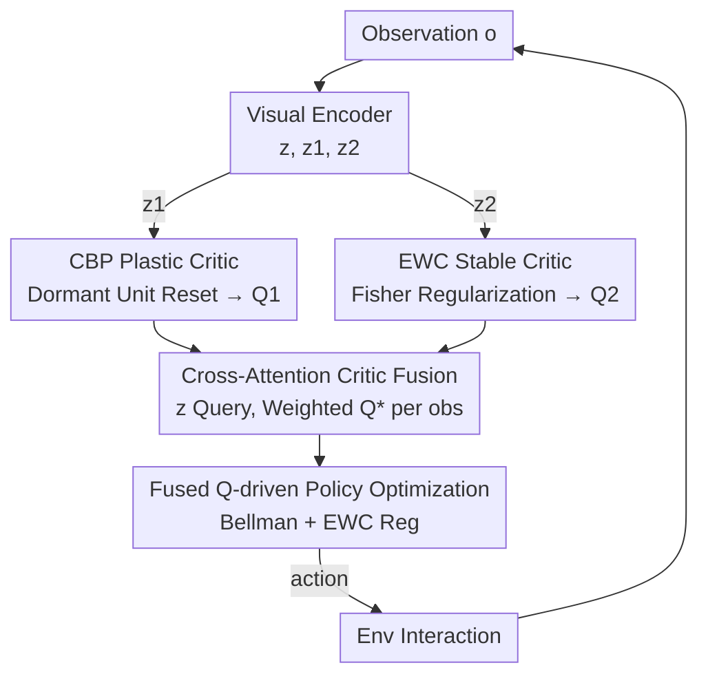

# Resolving the Stability-Plasticity Dilemma in Reinforcement Learning via Complementary Continual Critics

**Conference**: CVPR 2026  
**Paper**: [CVF Open Access](https://openaccess.thecvf.com/content/CVPR2026/html/Sun_Resolving_the_Stability_Plasticity_Dilemma_in_Reinforcement_Learning_via_Complementary_Continual_CVPR_2026_paper.html)  
**Code**: https://github.com/sunbo5202/CD-CCA  
**Area**: Reinforcement Learning  
**Keywords**: Visual RL, Stability-Plasticity Dilemma, Continual Learning, Dual Critics, Cross-Attention Fusion

## TL;DR
To address the "Stability-Plasticity Dilemma"—the need for both fast adaptation and no forgetting—in visual RL, this paper proposes CD-CCA: it equips one "plastic critic" with Continual Backpropagation (CBP) and one "stable critic" with Elastic Weight Consolidation (EWC), then adaptively fuses their Q-values based on observations via a cross-attention mechanism. It simultaneously improves sample efficiency and convergence stability on DMControl and CARLA.

## Background & Motivation
**Background**: Visual reinforcement learning allows agents to learn control policies directly from pixels. The mainstream approach involves connecting SAC/TD3-style algorithms to CNN encoders and improving representation quality through data augmentation, self-supervised auxiliary tasks, and environmental dynamics modeling.

**Limitations of Prior Work**: These methods implicitly assume that the network undergoes a "single, monolithic" learning process, trying to find a universal balance for the entire network. However, the data stream in visual RL is non-stationary—the sampling distribution continuously drifts as the agent interacts and updates its policy. Diagnostic metrics reveal two simultaneous pathologies: in standard critics, the **ratio of dormant neurons rises during training**, indicating that plasticity is degrading and the network is becoming "stiff"; meanwhile, CKA representation similarity and value consistency metrics show **severe representation drift and unstable value estimation**, indicative of catastrophic forgetting.

**Key Challenge**: There is an inherent conflict between plasticity (the ability to continuously learn from new data) and stability (the ability to consolidate old knowledge without forgetting). The "one-size-fits-all" paradigm of a single critic is forced to compromise between the two, failing to achieve the best of both worlds.

**Goal**: Resolve the stability-plasticity conflict **in-task** (within a single task), rather than only handling "task sequences" as in traditional continual learning. Specifically, this is decomposed into three sub-problems: how to maintain plasticity in one path, how to preserve stability in another, and how to make the two paths cooperate dynamically based on the scenario.

**Key Insight**: Instead of forcing a single critic to perform two contradictory tasks, it is better to construct **functionally heterogeneous dual critics**—one specialized for adaptation and one specialized for memory. Diagnostic experiments further found: CBP can suppress dormant neurons (restoring plasticity), EWC can inhibit representation drift (preserving stability), and critic reliability varies with observations, which naturally corresponds to the observation-weighted fusion of Cross-Attention Query–Key–Value.

**Core Idea**: Build a "plastic critic" and a "stable critic" using CBP and EWC mechanisms respectively, and use cross-attention to adaptively fuse their value estimates according to the current observation—replacing the passive trade-off of a single network with structural functional decoupling.

## Method

### Overall Architecture
CD-CCA modifies the actor–critic backbone of SAC and functions as a plug-and-play module for any dual-critic architecture. The visual encoder encodes observation $o$ into latent features, generating a shared embedding $z$ and critic-specific features $z_1, z_2$ through three fully connected layers. Two parallel critics learn under CBP and EWC mechanisms, outputting $Q_1$ and $Q_2$. The cross-attention module uses $z$ as the query, $z_1/z_2$ as keys, and $Q_1/Q_2$ as values to calculate the fused $Q^*$. $Q^*$ participates in both the critic Bellman error and guides policy updates, and finally, the policy decoder outputs actions to interact with the environment. Throughout this pipeline, the "plasticity-stability" balance is no longer dependent on a fixed critic but is determined dynamically per observation.

### Key Designs

**1. Complementary Dual Critics: CBP for Plasticity, EWC for Stability**

To treat both "stiffening networks" and "representation drift/forgetting," the authors decouple these conflicting objectives into two parallel critics, each enhanced by a specific continual learning mechanism. For the **plastic critic**, Continual Backpropagation (CBP) is used: the core observation is that not all hidden units contribute to computation; some become redundant, leading to representation stagnation. CBP calculates a contribution utility for each unit—the sum of the activation multiplied by the magnitude of its outgoing weights—updated via exponential sliding:

$$u_l[i] = \eta \cdot u_l[i] + (1-\eta)\cdot |h_{l,i,t}| \cdot \sum_{k=1}^{n_{l+1}} |W_{l,i,k,t}|$$

where $\eta=0.99$ is the decay rate and $n_{l+1}$ is the number of units in the next layer. Units with persistently low utility are judged redundant, reinitialized, and temporarily protected from replacement until they reach a maturity threshold $m$. Experiments show this replacement is "functionally guided": neurons with high replacement frequencies are precisely those with low current contributions. Resetting them frees up capacity to learn new knowledge, thereby suppressing the dormant neuron ratio and maintaining plasticity. For the **stable critic**, Elastic Weight Consolidation (EWC) is used: it uses the Fisher Information Matrix (FIM) to score parameter importance, imposing a quadratic penalty on important parameters drifting from old values, forcing new knowledge to be stored in unimportant parameters:

$$L_{EWC}(\phi) = L_{new} + \sum_i \frac{\gamma}{2} F_i\,(\theta_i - \theta^*_{old,i})^2$$

$L_{new}$ is the original loss for the new task, $\gamma$ controls constraint strength, $F_i$ is the FIM (estimated from mini-batches from the replay buffer), and $\theta^*_{old,i}$ is the optimal parameter value after the previous training stage. Together, the plastic critic handles fast absorption of new visual patterns while the stable critic handles locking in learned knowledge. This is also the first work to construct heterogeneous critics using "different learning rules" rather than temporal heterogeneity like different discount factors.

**2. Cross-Attention Critic Fusion: Adaptive Weighting per Observation**

How should two critics with different strengths be used? Taking the minimum or simple average (traditional homogeneous critic ensemble methods) is static and cannot adjust the influence of the two paths based on visual input—diagnostic experiments already show that critic reliability is observation-dependent. The authors designed cross-attention fusion: using the shared visual representation $z\in\mathbb{R}^d$ as the query, the dynamically adapting features $z_1$ and stable features $z_2$ from the two critics as keys, and the two scalar value estimates $Q_1, Q_2$ as values. The attention scores and fused Q are:

$$\delta_i = \mathrm{softmax}\!\left(\frac{z\cdot z_i^{T}}{\sqrt{d_k}}\right), \qquad Q^* = \delta_1 Q_1 + \delta_2 Q_2$$

This assigns higher weight to the plastic critic when the current observation requires "adaptability" and shifts toward the stable critic when it requires "memory." Ablations show that replacing this with a simple minimum significantly degrades performance, indicating that dynamic fusion is key to integrating complementary values and mitigating overestimation.

**3. Fused Q-driven Policy Optimization Target**

The fused value is integrated back into the SAC training loop. The agent learns the policy $\pi_\theta$, two critics $Q_{\phi_1}, Q_{\phi_2}$, and the cross-attention module $Q_\xi$. Critic and attention parameters $\phi, \xi$ are learned by minimizing the Bellman error with EWC regularization:

$$L_{total} = L(\phi_i, \xi, B) + L_{EWC}(\phi)$$

$$L(\phi_i, \xi, B) = \mathbb{E}_{\tau\sim B}\big[(Q_\xi(o,a) - y)^2 + \beta\,(Q_{\phi_i}(o,a) - y)^2\big],\quad y = r_t + \gamma V(o')$$.

This supervises both the fused $Q_\xi$ and each individual critic's own estimate (with coefficient $\beta$) to stabilize training; $V(o')$ follows the soft value target with entropy from SAC. This target allows "dual-critic differentiated learning + cross-attention self-compensation" to cooperate end-to-end in the same gradient loop.

### Loss & Training
The training process (Algorithm 1) involves: sampling actions using the policy and storing them in replay buffer $B$ at each step. During updates, a batch of transitions is sampled from $B$, computing the soft value target $V^{tot}$ and TD targets to obtain $Q_1$ (EWC) and $Q_2$ (CBP). After encoding $z, z_1, z_2$, cross-attention fusion $Q^*$ is performed. Parameters $\phi_{1,2}, \xi$ are updated via Eq (9), and $\theta$ via SAC policy gradients. Target critics are synchronized via exponential moving average. Key hyperparameters: CBP utility decay $\eta=0.99$, maturity threshold $m$, EWC strength $\gamma$, and critic self-supervision coefficient $\beta$. The system remains off-policy and seamlessly integrates with existing dual-critic RL (e.g., SAC, DrQ-v2, DeepMDP).

## Key Experimental Results

### Main Results
On four hard tasks in DMControl, with 84x84 images and 3-frame stacking across 5 seeds. CD-CCA as a plug-and-play module for DrQ-v2 (OURS / DrQv2+OURS) at 1M steps:

| Task (1M) | Flare | TACO | MaDi | ResAct | DrQv2 | OURS |
|-----------|-------|------|------|--------|-------|------|
| Quadruped, Walk | 488±221 | 665±144 | 621±172 | 690±128 | 871±47 | **907±25** |
| Pendulum, Swingup | 809±31 | 784±42 | 751±41 | 817+6 | 812±23 | **817±17** |
| Finger, Turn hard | 661±315 | 672±167 | 695±133 | 857±80 | 837±40 | **957±37** |
| Walker, Run | 556±93 | 582±63 | 562±68 | 554±21 | 734±32 | **747±24** |
| Average | 546.2 | 584.8 | 566.0 | 630.2 | 813.5 | **857.0** |

At 500K steps, the average of 683.0 also outperformed DrQv2's 636.8. In two CARLA driving scenarios (Highway with 20 vehicles, Jaywalk with random pedestrians), after 100K training steps on DeepMDP:

| Method | Highway Reward | Highway Dist(m) | Jaywalk Reward | Jaywalk Dist(m) |
|------|------|------|------|------|
| SAC | 121±26 | 74±17 | 121±49 | 84±78 |
| DrQ | 154±21.5 | 95±27 | 157±81 | 109±33 |
| MLR | 256±51 | 238±75 | 194±73 | 177±42 |
| ResAct | 283±25 | 299±24 | 188±22 | 133±34 |
| DeepMDP | 170±36 | 132±20 | 169±52 | 134±40 |
| DeepMDP+OURS | **343±63** | **287±45** | **204±43** | **183±58** |

CD-CCA achieved SOTA in most tasks, and the **standard deviation across seeds is significantly smaller**, indicating more stable convergence and less sensitivity to initialization.

### Ablation Study
| Configuration | Conclusion | Note |
|------|------|------|
| Full (CBP+EWC+CrossAttn) | Optimal | Plastic-stability balance, stable convergence |
| w/o EWC (CBP only) | Better than baseline but fluctuates | Fast adaptation but unstable convergence |
| w/o CBP (EWC only) | Better than baseline but unresponsive | Stable but reacts slowly to environment changes |
| w/o Cross-Attention (Min) | Performance drop | Static average cannot dynamically allocate credit |
| w/o CBP&EWC (Fusion only) | Better than baseline | Cross-attention alone alleviates overestimation |
| CBP+CBP (Homogeneous) | Weaker than full | Strong early but over-adapts, unstable later |
| EWC+EWC (Homogeneous) | Weaker than full | Excessively rigid, slow improvement |

Furthermore, extending the mechanism to standard actor–critic: four critics in SAC / TD3 (two CBP, two EWC, taking the min of each group then the lower of the two results) showed faster convergence and more consistency under non-stationarity.

### Key Findings
- **Heterogeneous > Homogeneous**: The complementary combination of CBP+EWC consistently outperforms CBP+CBP (unstable over-adaptation) and EWC+EWC (excessive rigidity), confirming that "functional decoupling" is key.
- **Cross-Attention is Essential**: Switching to a simple minimum leads to performance loss; it performs dynamic weighting and simultaneously suppresses overestimation.
- **CBP Replacement is Functionally Guided**: High-frequency replacement of neurons correlates with low current contribution; resetting them restores learning, showing dormant units are accurately recycled.
- **CARLA shows more significant advantages**: In more realistic and non-stationary environments, the benefits of dynamic fusion are further amplified.

## Highlights & Insights
- **Heterogeneous critics through "Different Learning Rules"**: While prior work achieved heterogeneity via time scales (different discount factors), this paper uses CBP/EWC rules to create functional heterogeneity, mapping the abstract "stability-plasticity" conflict directly to network structures.
- **Diagnostics as Design Basis**: Quantifying dormant neurons, CKA, and value-consistency first provides a clear target for the CBP/EWC/Cross-Attention "prescription," making the method evidence-driven rather than heuristic.
- **Natural QKV Semantics in Cross-Attention**: Since critic reliability is observation-dependent, mapping it to "weighted value via query" is more aligned with the problem's nature than static min/avg operators.
- **Plug-and-Play**: It can be added to DrQ-v2 / DeepMDP / SAC / TD3, serving as a low-cost performance booster.

## Limitations & Future Work
- **Plasticity Mechanisms**: The authors acknowledge that plastic critics are not limited to CBP and other mechanisms could be explored; future work may investigate more universal plasticity optimization.
- **Overhead**: Dual critics + Cross-attention + EWC's FIM estimation increase GPU memory and compute; training cost/throughput comparisons are not provided.
- **Hyperparameter Sensitivity**: The sensitivity of $\gamma$ (EWC strength), $\beta$ (self-supervision), and $m$ (CBP maturity) was not systematically analyzed across all tasks.
- **Scalability of Fusion**: The four-critic extension reverted to minimum-based fusion rather than extending cross-attention to more than 2 paths.
- **Evaluation Domain**: Only verified on DMControl and CARLA continuous control; discrete actions, real robotics, or long-horizon tasks are not yet covered.

## Related Work & Insights
- **Vs. Representation Learning (DrQ, CURL, MLR, TACO)**: These focus on data augmentations/self-supervision for a monolithic network; this work decouples targets via architecture to improve exploration efficiency at the source of value estimation.
- **Vs. Homogeneous Critics (Double Q, TD3, SAC)**: These use min/avg to reduce overestimation bias but the critics remain homogeneous; this work creates functional heterogeneity.
- **Vs. Conventional Continual Learning in RL**: Regularization (EWC) / Replay / Isolation are usually for "task-switching"; this paper brings them "in-task" to treat the stability-plasticity dilemma under non-stationary data streams.

## Rating
- Novelty: ⭐⭐⭐⭐ First use of CBP/EWC rules for functional heterogeneity with cross-attention fusion.
- Experimental Thoroughness: ⭐⭐⭐⭐ Solid results on DMControl + CARLA with 5 seeds and multi-angle ablations, though lacking cost analysis.
- Writing Quality: ⭐⭐⭐⭐ Clear logic from diagnostics to motivation to method, well-supported by figures.
- Value: ⭐⭐⭐⭐ Plug-and-play with clear stability improvements, providing a reusable paradigm for resolving the stability-plasticity dilemma.

<!-- RELATED:START -->

## Related Papers

- [\[ICML 2025\] Mitigating Plasticity Loss in Continual Reinforcement Learning by Reducing Churn](../../ICML2025/reinforcement_learning/mitigating_plasticity_loss_in_continual_reinforcement_learning_by_reducing_churn.md)
- [\[ICML 2026\] Position: Deployed Reinforcement Learning should be Continual](../../ICML2026/reinforcement_learning/position_deployed_reinforcement_learning_should_be_continual.md)
- [\[CVPR 2026\] TSTM: Temporal Segmentation for Task-relevant Mask in Visual Reinforcement Learning Generalization](tstm_temporal_segmentation_for_task-relevant_mask_in_visual_reinforcement_learni.md)
- [\[ICML 2026\] SPHERE: Mitigating the Loss of Spectral Plasticity in Mixture-of-Experts for Deep Reinforcement Learning](../../ICML2026/reinforcement_learning/sphere_mitigating_the_loss_of_spectral_plasticity_in_mixture-of-experts_for_deep.md)
- [\[ICML 2026\] Shapley Neuron Values for Continual Learning: Which Neurons Matter Most?](../../ICML2026/reinforcement_learning/shapley_neuron_values_for_continual_learning_which_neurons_matter_most.md)

<!-- RELATED:END -->
