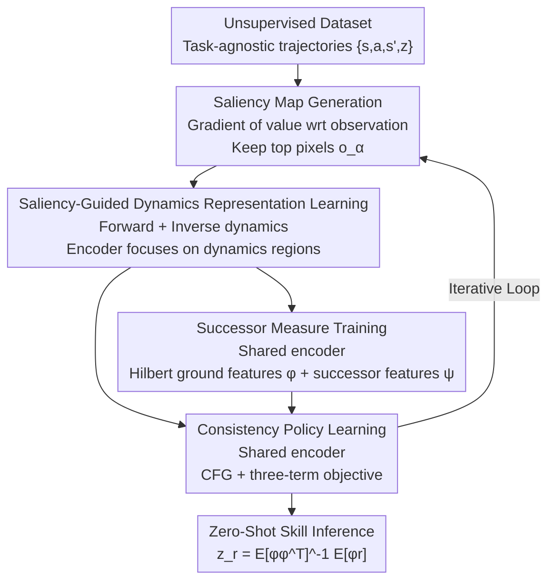

# Saliency-Guided Representation with Consistency Policy Learning for Visual Unsupervised Reinforcement Learning

**Conference**: CVPR 2026  
**Paper**: [CVF Open Access](https://openaccess.thecvf.com/content/CVPR2026/html/Sun_Saliency-Guided_Representation_with_Consistency_Policy_Learning_for_Visual_Unsupervised_Reinforcement_CVPR_2026_paper.html)  
**Code**: https://github.com/bofusun/SRCP  
**Area**: Reinforcement Learning / Unsupervised Reinforcement Learning / Zero-Shot Generalization  
**Keywords**: Successor Representation, Visual URL, Saliency-Guided Representation, Consistency Policy, Zero-Shot Generalization

## TL;DR
To address the failure of successor representation (SR) methods in high-dimensional visual unsupervised reinforcement learning (URL), SRCP decouples representation learning from the SR objective using saliency-guided dynamics tasks, forcing the encoder to focus on dynamics-relevant regions. It models multimodal skills using a consistency policy with classifier-free guidance, achieving SOTA zero-shot generalization across 16 visual control tasks in ExORL.

## Background & Motivation

**Background**: Unsupervised reinforcement learning (URL) aims to pre-train a generalist agent on reward-free data that can generalize to new tasks in a zero-shot manner. Successor representation (SR) methods—including successor features (SF) and forward-backward representations (FB)—can infer approximately optimal skills $z_r$ from small datasets containing reward signals by decoupling reward learning from environment dynamics (successor feature factorization), thereby showing prominent zero-shot generalization capabilities.

**Limitations of Prior Work**: While SR performs exceptionally well with low-dimensional state inputs, its performance plummets when transferred to high-dimensional visual inputs (image observations). The authors' empirical analysis identifies two root causes: (1) In visual SR, the encoder and the successor network are **jointly optimized**. The SR objective biases the representation toward dynamics-irrelevant regions (attention heatmaps show the model focusing on the background rather than the agent's body), leading to inaccurate estimates of the successor measure; (2) This poor-quality representation further hinders policy learning. Visual URL needs to learn skill-conditioned policies from the learned latent representations, and low-quality representations make it difficult for the policy to model multimodal skills and maintain skill controllability.

**Key Challenge**: The **entangled optimization** of the encoder and SR training is the root of the problem. By comparing three variants of HILP (HILP-state, HILP-pixel, HILP-SDE-pixel) on Walker Stand, the authors found that the **ground features** (reward estimation) of all methods are reasonable, but only the state input and the version with the saliency encoder allow the **value estimation** to track the trajectory returns. The value-return correlation of the purely visual HILP-pixel is significantly weaker. In other words, poor representations primarily damage the successor measure rather than the ground features. Theoretically, the deviation of the policy $\pi_{z_r}$ from the optimal value is bounded by the approximation error of the successor features:

$$\|\hat V^{\pi_{z_r}} - V^\star\|_\infty \le \frac{3\|z_r\|_*}{1-\gamma}\sup_{s,a}\|\epsilon\|,\quad \epsilon = \hat\psi^{z_r}(s,a) - \psi^{\pi_{z_r}}(s,a)$$

The quality of the successor features directly determines the upper bound of generalization.

**Goal**: Decouple representation learning from the SR objective to force the encoder to focus on dynamics-relevant features, while providing visual URL with a policy network that can model multimodal skills, ensure controllability, and perform fast inference.

**Key Insight**: Representation side—since the SR objective biases the representation, an auxiliary task is introduced to supervise the encoder to focus on "which pixels affect dynamics/value". Policy side—traditional policy networks struggle to balance multimodal expressiveness and controllability, and while diffusion models are expressive, they suffer from slow inference. **Consistency models** emerge as a lightweight compromise capable of expressing multimodality.

**Core Idea**: Use "saliency-guided dynamical representation learning" to replace the representation task in the SR objective, and use a "consistency policy with classifier-free guidance tailored for URL" instead of traditional policies. The two share the same encoder, forming a unified framework (SRCP) that can be plugged into various SR methods.

## Method

### Overall Architecture
SRCP is a visual SR pre-training framework consisting of five components collaborating in an iterative training loop: (1) **Unsupervised dataset** providing task-agnostic trajectories; (2) **Saliency map generation**—calculates the saliency map in each round based on the gradient of the value function with respect to the input observations, highlighting the regions the encoder should actually focus on; (3) **Representation learning**—updates the encoder using saliency-guided forward/inverse dynamics tasks, forcing it to focus on dynamics-relevant features; (4) **Successor measure training**—jointly optimizes ground features $\varphi$ and successor features $\psi$ using the updated encoder; (5) **Consistency policy learning**—trains a skill-conditioned consistency policy with classifier-free guidance to model multimodal skills and guarantee controllability. The key is that once the encoder is trained specifically by the "representation learning" task, it is **shared** for both successor measure training and policy learning. This simultaneously improves the successor measure and supports expressive policy behaviors.

### Key Designs

**1. Saliency Map Generation: Telling the Encoder "Where to Look"**

The core issue in visual SR is that the encoder focuses on dynamics-irrelevant regions (background, texture) under the SR objective. Therefore, the authors use the gradient of the value function to locate truly important pixels. Given an observation $o$, the encoder $f$ extracts representation $s = f(o)$, which is then used to compute the ground feature $\varphi(f(o))$ and successor feature $\psi(f(o),a,z)$. The value function is defined as $Q = \psi(f(o),a,z)^\top z$. Taking the gradient of $Q$ with respect to the input observation $o$, only the top pixels with the largest gradient magnitudes are kept, and the remaining regions are masked out to obtain the saliency-masked observation $o_\alpha$. This step does not introduce extra annotations and relies solely on the model's own value gradient for unsupervised "attention localization", providing supervision signals for the subsequent representation learning.

**2. Saliency-Guided Dynamics Representation Learning: Decoupling Representation from the SR Objective**

The saliency map alone is insufficient; a task must force the encoder to learn dynamics-relevant features. The authors employ forward and inverse dynamics models. The forward model $D$ predicts the next state representation from the current representation and action, while the inverse model $I$ reconstructs the action from current and next representations:

$$\mathcal{L}_{D1} = \|D(f(o),a)-s'\|^2,\qquad \mathcal{L}_{I1} = \|I(f(o),s')-a\|^2$$

The key "saliency guidance" lies in replacing the input observations of the above two tasks with saliency-masked observations $o_\alpha$, yielding $\mathcal{L}_{D2} = \|D(f(o_\alpha),a)-s'\|^2$ and $\mathcal{L}_{I2} = \|I(f(o_\alpha),s')-a\|^2$. That is, "the agent must predict dynamics even when shown only the salient regions". This forces the encoder to compress information into the pixels relevant to the dynamics. The total representation loss is:

$$\mathcal{L}_{\text{rep}} = \mathcal{L}_{D1} + \mathcal{L}_{I1} + \beta(\mathcal{L}_{D2}+\mathcal{L}_{I2})$$

where $\beta$ controls the weight of the saliency term. Since this loss is completely independent of the SR objective, representation learning is no longer biased by successor training, fundamentally resolving the inaccurate estimation of the successor measure.

**3. Successor Measure Training: Learning Successor Features with the Decoupled Encoder**

The encoder trained by the representation module is shared for this stage. Hilbert space representations (following HILP) are used for ground features $\varphi$, which are then used to update successor features $\psi$. The latter is trained via Bellman consistency constraints:

$$\mathcal{L}_\psi = \|\psi(s,a,z) - \varphi(s') - \gamma\bar\psi(s',a',z)\|^2$$

where $\bar\psi$ is the target successor feature network. Since the encoder has already been fine-tuned by the saliency tasks, the quality of successor measure estimation improves. Though this step remains a standard training of SR, "standing on the shoulders of good representations" is the prerequisite for its effectiveness. SRCP is plug-and-play for this stage—replacing HILP with FB also holds.

**4. Consistency Policy Learning: Modeling Multimodal Controllable Skills with Consistency Models + URL-Tailored Classifier-Free Guidance**

In visual URL, the policy needs to model multimodal skill-conditioned action distributions from latent representations while maintaining controllability. Traditional policy networks fail to balance both, and diffusion policies suffer from slow inference. The authors use a **consistency policy**: the network $g_\theta(s,a_t,z)\approx a_0$ learns to recover the clean action $a_0$ in a single step from any noise level $a_t$, allowing fast sampling and modeling of the conditional distribution $p(a_0 \mid s,z)$. To balance diversity and controllability, a URL-tailored classifier-free guidance (CFG) is introduced:

$$a = g_\theta(s,a_t,\varnothing) + \omega\big(g_\theta(s,a_t,z) - g_\theta(s,a_t,\varnothing)\big)$$

where $\varnothing$ is the unconditional skill input and $\omega$ is the guidance strength. **Key detail**: State $s$ is fed into both unconditional and conditional branches, enabling the model to capture state-dependent multimodal action distributions while ensuring actions are predominantly driven by skill $z$. The policy is trained with a three-term objective: the skill-conditioned value objective $\mathcal{L}^\pi_Q = \mathbb{E}[-\psi(s,\pi(s,z),z)^\top z]$ encourages maximizing skill returns and improving controllability; the skill-conditioned behavioral consistency $\mathcal{L}^\pi_{bc1}$ adds Gaussian noise to dataset actions and enforces consistent outputs across different noise levels to stabilize offline training and mitigate distribution shift; and the unconditional behavioral consistency $\mathcal{L}^\pi_{bc2}$ applies consistency constraints on actions sampled from random skill policies to promote multimodal expression. The combined loss is:

$$\mathcal{L}_\pi = \mathcal{L}^\pi_Q + \lambda_1\mathcal{L}^\pi_{bc1} + \lambda_2\mathcal{L}^\pi_{bc2}$$

### Loss & Training
During the pre-training stage, three sets of losses are iteratively optimized in parallel: representation $\mathcal{L}_{\text{rep}}$ (with saliency weight $\beta$), successor measure $\mathcal{L}_\psi$, and policy $\mathcal{L}_\pi$ (with CFG guidance weight $\omega$ and consistency weights $\lambda_1, \lambda_2$). During zero-shot deployment, the skill vector is directly inferred as $z_r = \mathbb{E}_\rho[\varphi\varphi^\top]^{-1}\mathbb{E}_\rho[\varphi r]$ using a small amount of data containing rewards, without requiring further training.

## Key Experimental Results

### Main Results
ExORL / URL Benchmark, covering 16 visual continuous control tasks across 4 domains. Each domain is pre-trained on 4 datasets (RND, PROTO, APS, APT). Each result is the average of 16 runs (4 datasets × 4 random seeds). SRCP uses Hilbert representation for ground features.

| Domain (4-task mean) | FB | HILP | FDM | AE | SRCP | Gain over strongest baseline |
|--------|------|------|------|------|------|------|
| Walker | 115 | 238 | 401 | 317 | **453** | +13% |
| Quadruped | 183 | 232 | 231 | 234 | **355** | +33% |
| Cheetah | 184 | 454 | 303 | 218 | **543** | +11% |
| Jaco | 40 | 32 | 32 | 25 | **41** | On par / Slightly better |

SRCP achieves optimal or near-optimal performance on almost all tasks and is robust to dataset variations.

### Ablation Study
Mean of 4 domains on RND dataset, with 4 tasks × 4 seeds per domain:

| Configuration | Walker | Quadruped | Cheetah | Jaco | Description |
|------|--------|-----------|---------|------|------|
| HILP | 231 | 305 | 599 | 34 | Baseline with joint training of encoder and successor |
| SRCP w/o SE | 345 | 352 | 600 | 44 | Sans saliency representation, keeping consistency policy |
| SRCP w/o CP | 396 | 406 | 598 | 43 | Sans consistency policy, keeping saliency representation |
| SRCP (Full) | **439** | **485** | 602 | **50** | Full model |

Individually adding either component outperforms HILP, and combining both yields the best performance, indicating that both "good representation" and "strong policy modeling" are indispensable.

### Key Findings
- **Solid root-cause diagnostics**: The weak value-return correlation of HILP-pixel coupled with its normal ground features proves that entangled optimization mainly harms successor measures, which directly corresponds to the theoretical bound where successor feature errors dictate the generalization upper limit.
- **Saliency representation vs. general contrastive representation**: Replacing HILP with SOTA contrastive representations (TACO/Premier-TACO) only helps in some domains and harms performance in others. This indicates that "decoupled representation learning" must be paired with dynamics-relevant saliency tasks rather than just swapping in any modern representation method.
- **Transferability to FB**: SRCP(FB) outpaces the original FB on all eight Walker/Quadruped tasks (achieving over +200% improvements on some), proving that SRCP is a general framework not tied to HILP.
- **Sensitivity to Hyperparameters**: The guidance weight $\omega$ performs best around 3 (performance plummets when $\omega=0$, and also drops when $\omega$ is too large); the saliency weight $\beta$ is optimal at 0.5, justifying that optimal trade-offs exist for both diversity-controllability and representation focus.

## Highlights & Insights
- **Using value gradients for unsupervised saliency, which is then fed back into representation learning**: It tells the encoder "where to look" without any human annotations, successfully converting the abstract "attention drift" problem into an optimizable mask-dynamics prediction task with a clean and self-consistent logic.
- **The detail of feeding state $s$ into both branches in CFG is crucial**: It ensures that actions are primarily driven by skills while retaining state-dependent multimodality, which is a non-trivial adaptation of CFG from the diffusion community to URL skill-conditioned policies.
- **Diagnostic-driven design**: Concretizing the causal chain of "representation $\to$ successor measure $\to$ generalization" using three HILP variants and theoretical bounds before designing the solution makes the narrative much more convincing than merely stacking modules.
- **Plug-and-play**: Neither the representation nor the policy module is bound to a specific SR algorithm; they can be integrated with both HILP and FB, entailing low migration costs.

## Limitations & Future Work
- The authors acknowledge that SRCP is the **first** framework specifically addressing zero-shot generalization in visual URL, meaning that most comparable baselines are visual adaptations of state-based URL methods, which limits the maturity of horizontal comparisons.
- Saliency maps rely on value function gradients, but value estimation is inaccurate in the early training phases. This introduces a "chicken-and-egg" cold-start risk, which is not thoroughly discussed in the paper regarding coupling stability.
- All experiments are conducted in simulation domains of DMC/ExORL (Walker/Quadruped/Cheetah/Jaco). Extension to real robots or more complex visual scenes remains to be verified.
- Despite consistency policies being faster than diffusion, the three losses + CFG introduce multiple hyperparameters ($\omega, \beta, \lambda_1, \lambda_2$). The tuning cost and sensitivity (e.g., performance drop when $\omega$ deviates from 3) present practical concerns.

## Related Work & Insights
- **vs. HILP/FB (SR methods)**: They are strong in state URL but weak in visual URL because joint training of the encoder and SR biases the representation. SRCP decouples representation learning, trains the encoder specifically with saliency-guided dynamics tasks, and directly plugs into HILP/FB.
- **vs. USD (Unsupervised Skill Discovery)**: USD learns diverse skills by maximizing the divergence between skills and the average state distribution, but struggles with zero-shot generalization due to the misalignment between skills and task goals. The SR/SRCP path associates skills with rewards, leading to more direct generalization.
- **vs. Diffusion Policies**: Diffusion models are expressive but slow at inference. SRCP employs consistency models for single-step sampling to balance multimodal expression and low latency, incorporating a URL-tailored CFG to solve skill controllability.
- **vs. TACO/Premier-TACO (Contrastive Representation)**: They also aim to decouple representation but use general temporal contrastive learning, yielding unstable results in visual URL. SRCP proves that "dynamics-relevant + saliency-guided" representation tasks are required to guarantee consistent benefits.

## Rating
- Novelty: ⭐⭐⭐⭐ First to target zero-shot generalization in visual URL; the combination of saliency-guided representation and URL-tailored consistency policy is novel.
- Experimental Thoroughness: ⭐⭐⭐⭐ Covers 16 tasks, 4 datasets, and 4 seeds alongside ablation/hyperparameter/transferability studies, though restricted to simulated domains.
- Writing Quality: ⭐⭐⭐⭐ Clear diagnostic-theory-methodology pipeline, with complete tables and figures.
- Value: ⭐⭐⭐⭐ A plug-and-play framework with practical importance for scaling SR methods to high-dimensional visual environments.

<!-- RELATED:START -->

## Related Papers

- [\[ICLR 2026\] Reasoning as Representation: Rethinking Visual Reinforcement Learning in Image Quality Assessment](../../ICLR2026/reinforcement_learning/reasoning_as_representation_rethinking_visual_reinforcement_learning_in_image_qu.md)
- [\[CVPR 2026\] Incentivizing Generative Zero-Shot Learning via Outcome-Reward Reinforcement Learning with Visual Cues](incentivizing_generative_zero-shot_learning_via_outcome-reward_reinforcement_lea.md)
- [\[CVPR 2026\] TSTM: Temporal Segmentation for Task-relevant Mask in Visual Reinforcement Learning Generalization](tstm_temporal_segmentation_for_task-relevant_mask_in_visual_reinforcement_learni.md)
- [\[ICLR 2026\] Learn More with Less: Uncertainty Consistency Guided Query Selection for RLVR](../../ICLR2026/reinforcement_learning/learn_more_with_less_uncertainty_consistency_guided_query_selection_for_rlvr.md)
- [\[ICLR 2026\] Exploratory Diffusion Model for Unsupervised Reinforcement Learning](../../ICLR2026/reinforcement_learning/exploratory_diffusion_model_for_unsupervised_reinforcement_learning.md)

<!-- RELATED:END -->
