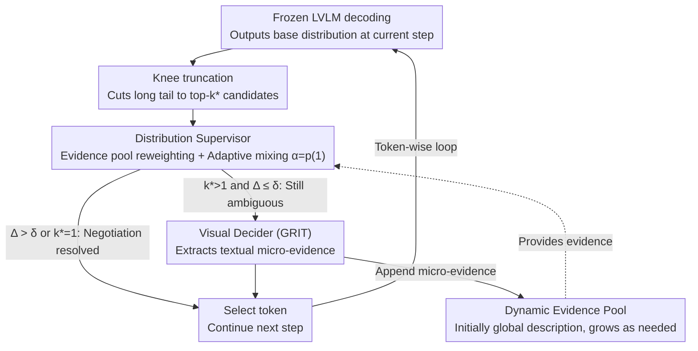

# See It, Say It, Sorted: An Iterative Training-Free Framework for Visually-Grounded Multimodal Reasoning in LVLMs

**Conference**: CVPR 2026  
**arXiv**: [2602.21497](https://arxiv.org/abs/2602.21497)  
**Code**: [GitHub](https://github.com/uuuuZYC/See-It-Say-It-Sorted)  
**Area**: Reinforcement Learning  
**Keywords**: ECRD, visual grounding, hallucination mitigation, training-free, evidence pool

## TL;DR

Ours proposes the Evidence-Constrained Reweighting Decoding (ECRD) framework: it maintains a dynamic textual evidence pool during LVLM decoding, reweights candidate tokens via distribution negotiation, and automatically invokes a lightweight visual decider to extract micro-evidence when uncertain. It significantly reduces visual hallucinations and improves reasoning accuracy across multiple LVLMs without training.

## Background & Motivation

**Large Vision-Language Models (LVLMs)** are capable of generating long Chain-of-Thought (CoT) reasoning, but suffer from a fundamental issue: **reasoning-perception drift**. During long-text decoding, the model must balance three competing contexts: the image, the growing textual context, and the instructions. As the context lengthens, subtle but critical visual cues are easily overwhelmed by language priors. Once an intermediate reasoning step deviates from visual evidence, the final answer remains incorrect even if subsequent reasoning is logically sound—this is **visual hallucination propagation**.

**Limitations of Prior Work** primarily attempt to teach models to "think with images" via RL training—training models to learn when to zoom/crop images and re-inject cropped regions into the reasoning context. Representative works include PixelReasoner and DeepEyes. However, these methods face three pain points: (1) high training costs due to the need for large-scale annotated data and reward design; (2) tight coupling of policies with specific backbones, making transfer difficult; (3) significant inference latency caused by repeated encoding of cropped regions.

**Key Insight**: Ours takes a fundamentally different approach: instead of learning when to look at images during training, it uses visual evidence to supervise each reasoning step at **test-time**. The **Core Idea** is to reconstruct the decoding process as a series of "evidence-driven token selections": maintaining an evidence pool in textual form and negotiating with the model's original distribution at each decoding step, using uncertainty signals to trigger the acquisition of new evidence.

## Method

### Overall Architecture

ECRD shifts hallucination suppression from "learning to look at images during training" to "monitoring every token with evidence during decoding." It wraps a lightweight supervision logic around a **frozen** LVLM, intervening in token-wise sampling without modifying model weights. First, it uses knee truncation to remove the long, flat tail of the base distribution, keeping only a few truly competitive candidates. Then, the Distribution Supervisor re-scores these candidates using the Dynamic Evidence Pool and negotiates a final probability with the original distribution. Only when negotiation fails to resolve ambiguity is the Visual Decider (GRIT) awakened to extract a new piece of textual micro-evidence from the image for the pool. Throughout the chain, evidence is accumulated in **textual** form, allowing subsequent tokens to reuse previously seen information without repeated image re-encoding. This process repeats token-by-token, with the evidence pool growing as needed.

### Key Designs

**1. Knee truncation: Converging the candidate set to "worth negotiating" items**

LVLM output distributions often feature a sharp peak followed by a long tail of low probabilities. Reweighting the entire vocabulary with evidence would be expensive and prone to noise. ECRD first sorts probabilities to find the "knee point"—where curvature drops sharply—truncating the candidate count to $k^*$ to retain only the head tokens. While this step alone provides gains, its primary function is to limit expensive negotiation and visual decisions to a small set, keeping overhead controllable.

**2. Distribution Supervisor: Re-scoring candidates with the evidence pool and deciding based on confidence**

This is the core mechanism for suppressing hallucinations caused by language priors. For each evidence $\mathcal{E}$ in the pool, it calculates the average generation probability of candidate token $w$ at each position of the evidence prefix:

$$q_\mathcal{E}(w) = \frac{1}{L}\sum_{j=1}^{L}p_{\text{VLM}}(w \mid e_{<j}),$$

The results are averaged across all evidence and softmax-normalized to obtain an evidence-induced distribution $r_i$, representing "what the next token should be based solely on evidence." The crucial step is **adaptive mixing**: using the maximum probability of the base distribution $p_{(1)}$ as the mixing weight $\alpha_i = p_{(1)}$:

$$p_i^{\text{mix}} = \alpha_i\, p_i + (1-\alpha_i)\, \tilde{r}_i.$$

The logic is straightforward: a sharper base distribution (higher $p_{(1)}$) indicates higher confidence, preserving original behavior; a flatter distribution (lower $p_{(1)}$) indicates hesitation and high hallucination risk, shifting weight to the evidence. This "hands-off when confident, intervene when hesitant" rule requires no learnable parameters.

**3. Visual Decider: Extracting textual micro-evidence when negotiation is insufficient**

If candidates remain indistinguishable after reweighting, it indicates insufficient evidence. The trigger condition is $k^* > 1$ and the top-2 probability margin $\Delta_i \leq \delta$ (where $\delta$ is an uncertainty threshold). The framework then calls the GRIT decider (based on Qwen2.5-VL-3B), feeding it the image, the textual prefix tail, and the candidate set. It outputs two things: the chosen token $w^*$ and a human-readable micro-evidence sentence $\mathcal{E}_i$. Representing evidence as **textual sentences** rather than pixel crops allows it to be appended to the pool and referenced by any future token, keeping intervention lightweight and verifiable while avoiding the re-encoding latency of RL methods.

**4. Dynamic Evidence Pool: Growing evidence based on reasoning demand**

The pool is initialized with a single global description $d_{\text{global}}$ for broad coverage and grows **only when triggered by uncertainty**: $E_{i+1} \leftarrow E_i \cup \{\mathcal{E}_i\}$. Each new piece of evidence corresponds semantically to a local sub-view of the image but is stored uniformly as text for reuse in token space. This allows early visual disambiguation to benefit later reasoning without re-processing pixels.

### Loss & Training

Ours is completely training-free. The framework wraps around a frozen LVLM, and the GRIT decider uses a pre-trained model without gradient updates. The primary hyperparameter is the uncertainty threshold $\delta$: increasing it reduces triggers for speed, while decreasing it encourages more frequent image looks for accuracy, allowing flexible control over the accuracy-latency trade-off.

## Key Experimental Results

### Main Results

| Model | TreeBench Gain | RH-Bench RH-AUC Gain | Remarks |
|------|-------------|---------------------|------|
| Qwen2.5-VL-7B + ECRD | +10.9 Overall | - | Attribute +17.2, Physical +17.4 |
| Qwen2.5-VL-32B + ECRD | +6.1 Overall | - | Consistently effective |
| Qwen2.5-VL-72B + ECRD | +7.7 Overall | - | Large models also benefit |
| LLaVA-OneVision-7B + ECRD | +6.2 Overall | - | Cross-backbone |
| LLaVA-OneVision-72B + ECRD | +6.4 Overall | - | Cross-backbone |
| InternVL3-8B + ECRD | +6.4 Overall | - | Cross-backbone |

### Ablation Study

| Configuration | Effect | Description |
|------|------|------|
| Knee truncation only | Partial gain | Restricting candidates is inherently helpful |
| +Distribution Supervisor | Significant gain | Evidence negotiation is core |
| +Visual Decider | Optimal | On-demand evidence further reduces hallucinations |
| Fixed Global Desc (No dynamic growth) | Moderate | Highlights importance of dynamic evidence |

### Key Findings

- ECRD improves performance on both perception tasks (Attribute, Material, Physical) and reasoning tasks (Containment, Comparison), with larger gains in perception, indicating visual grounding is the primary benefit.
- Even strong models like Qwen2.5-VL-72B show a 7.7% improvement, proving reasoning-perception drift exists in the largest models.
- ECRD does not degrade performance on tasks where models are already confident (e.g., OCR), as adaptive weights automatically preserve the base distribution.
- ECRD allows open-source LVLMs to significantly close the gap with proprietary models like GPT-4o and Gemini on multiple tasks.

## Highlights & Insights

- The design of the adaptive mixing weight $\alpha_i = p_{(1)}$ is simple yet effective: it requires no learnable hyperparameters and automatically adjusts intervention intensity based on the base distribution's confidence.
- Using text instead of pixels for evidence representation is a critical design choice—it maintains the model's native token space, avoids repeated image encoding, and allows evidence to be reused throughout the reasoning chain.

## Limitations & Future Work

- The Visual Decider (GRIT/Qwen2.5-VL-3B) may itself produce hallucinations; the current framework does not verify decider outputs.
- The uncertainty threshold $\delta$ must be preset, and optimal thresholds may vary by task or model.
- Each decider trigger requires an additional LVLM forward pass, which may increase latency in scenarios with frequent triggers.

## Related Work & Insights

- **vs PixelReasoner/DeepEyes**: These methods require RL training for zoom/crop strategies; ECRD is training-free and backbone-agnostic at the cost of not learning task-specific observation policies.
- **vs VDGD**: ECRD is a significant upgrade to VDGD, replacing a single static description with a dynamic evidence pool and replacing logit overriding with probability negotiation while preserving base model behavior in high-confidence steps.

## Rating

- Novelty: ⭐⭐⭐⭐ The comprehensive design of distribution negotiation, dynamic pools, and uncertainty triggers is highly original.
- Experimental Thoroughness: ⭐⭐⭐⭐ Validated across 6 backbones and multiple benchmarks with strong cross-model generalization.
- Writing Quality: ⭐⭐⭐⭐ Rigorous mathematical derivation and clear comparisons with VDGD.
- Value: ⭐⭐⭐⭐ High practical value for deployment as a training-free, plug-and-play solution.

<!-- RELATED:START -->

## Related Papers

- [\[ICML 2026\] Perceptual Flow Network for Visually Grounded Reasoning](../../ICML2026/reinforcement_learning/perceptual_flow_network_for_visually_grounded_reasoning.md)
- [\[ACL 2026\] Visually-Guided Policy Optimization for Multimodal Reasoning](../../ACL2026/reinforcement_learning/visually-guided_policy_optimization_for_multimodal_reasoning.md)
- [\[ICLR 2026\] Divide, Harmonize, Then Conquer It: Shooting Multi-Commodity Flow Problems with Multimodal Language Models](../../ICLR2026/reinforcement_learning/divide_harmonize_then_conquer_it_shooting_multi-commodity_flow_problems_with_mul.md)
- [\[ICML 2026\] CPMöbius: Iterative Coach–Player Reasoning for Data-Free Reinforcement Learning](../../ICML2026/reinforcement_learning/cpmobius_iterative_coach-player_reasoning_for_data-free_reinforcement_learning.md)
- [\[CVPR 2026\] Seeing is Improving: Visual Feedback for Iterative Text Layout Refinement](seeing_is_improving_visual_feedback_for_iterative_text_layout_refinement.md)

<!-- RELATED:END -->
## Related Papers

- [\[ICML 2026\] Perceptual Flow Network for Visually Grounded Reasoning](../../ICML2026/reinforcement_learning/perceptual_flow_network_for_visually_grounded_reasoning.md)
- [\[ACL 2026\] Visually-Guided Policy Optimization for Multimodal Reasoning](../../ACL2026/reinforcement_learning/visually-guided_policy_optimization_for_multimodal_reasoning.md)
- [\[ICLR 2026\] Divide, Harmonize, Then Conquer It: Shooting Multi-Commodity Flow Problems with Multimodal Language Models](../../ICLR2026/reinforcement_learning/divide_harmonize_then_conquer_it_shooting_multi-commodity_flow_problems_with_mul.md)
- [\[ICML 2026\] CPMöbius: Iterative Coach–Player Reasoning for Data-Free Reinforcement Learning](../../ICML2026/reinforcement_learning/cpmobius_iterative_coach-player_reasoning_for_data-free_reinforcement_learning.md)
- [\[CVPR 2026\] Seeing is Improving: Visual Feedback for Iterative Text Layout Refinement](seeing_is_improving_visual_feedback_for_iterative_text_layout_refinement.md)

<!-- RELATED:END -->
