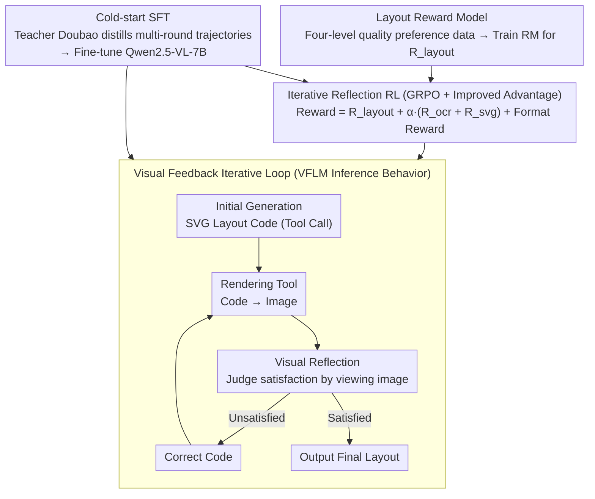

# Seeing is Improving: Visual Feedback for Iterative Text Layout Refinement

**Conference**: CVPR 2026  
**arXiv**: [2603.22187](https://arxiv.org/abs/2603.22187)  
**Code**: [https://github.com/FolSpark/VFLM](https://github.com/FolSpark/VFLM)  
**Area**: Reinforcement Learning / Multimodal Generation  
**Keywords**: Visual feedback, text layout, layout generation, reinforcement learning, iterative optimization

## TL;DR

VFLM proposes a layout generation framework that utilizes visual feedback for iterative optimization. By combining a visual reward model based on OCR accuracy with reinforcement learning, the framework enables Multimodal Large Language Models (MLLMs) to "see" rendering results and repeatedly correct them, significantly outperforming code-only generation methods in text layout quality.

## Background & Motivation

**Background**: Multimodal Large Language Models (MLLMs) can automatically generate structured layouts from natural language descriptions. A typical approach involves the model generating code (e.g., HTML/CSS/SVG) to represent the layout, which is then rendered into a final image by a graphics engine.

**Limitations of Prior Work**: Existing methods follow a "code-only" paradigm where the model is completely "blind" to the rendered visual outcome. This leads to several critical issues: (1) text may overflow bounding boxes or overlap, hindering readability; (2) aesthetic factors such as font size and color coordination cannot be guaranteed; (3) once code generation is complete, there is no opportunity for correction, allowing errors to propagate directly to the final output.

**Key Challenge**: While the ultimate objective of layout generation is visual readability and aesthetics, there is a disconnection between the optimization target of existing methods (code correctness) and the final evaluation criteria (visual quality). Syntactic correctness in code does not guarantee high-quality rendering.

**Goal**: To introduce a visual feedback mechanism that allows the model to "see" rendering results, identify problems, and iteratively refine them, achieving self-improving layout generation.

**Key Insight**: Transform layout generation from "one-time code generation" into an iterative "visual-reflection-correction" process, using reinforcement learning to enable the model to learn self-improvement via visual feedback.

**Core Idea**: Close the "code → rendering → evaluation → correction" loop with visual feedback, using RL training to provide the model with adaptive reflective generation capabilities.

## Method

### Overall Architecture

VFLM transforms layout generation from a code-only "one-shot" process into a stateful visual feedback closed loop. Given a background image and target text, the model first generates an initial SVG layout code (issued as a structured tool call). A rendering tool converts the code into an image and feeds it back to the same model. The model performs "visual reflection" on the rendered image to judge if the typography is satisfactory. If not, it reasons through necessary changes, rewrites the code, and rerenders; if satisfied, it outputs the result. This cycle continues for up to $N_{\max}$ rounds. The fundamental difference from code-only approaches is that the model sees its actual rendering results at each step rather than being blind to the final visual effect.

To enable the model to learn this "reflect-and-refine" capability, VFLM employs a two-stage training process. **Cold-start SFT**: Since natural multi-round reflection data is scarce, a teacher model (Doubao-Seed-1.6) is used to distill synthetic trajectories consisting of "initial reasoning + multi-round reflection," which are used to fine-tune Qwen2.5-VL-7B to master the basic paradigm of iterative reflection and tool calling. **Iterative Reflection RL**: Building on this, GRPO is applied to perform policy optimization over complete "generation-rendering-reflection-correction" trajectories. The reward consists of three weighted components: a dedicated layout reward model $R_{\text{layout}}$, OCR text accuracy $R_{\text{ocr}}$, and SVG-layer text accuracy $R_{\text{svg}}$ (plus format rewards). Crucially, score rewards are only assigned to the final output of the iteration chain, encouraging the model to autonomously determine when the result is "good enough" to stop.

### Key Designs

**1. Visual Feedback Iterative Loop: Allowing the model to refine based on rendering results rather than writing blindly**

The fundamental flaw of the code-only paradigm is that issues like text overflow and overlap only surface after rendering, at which point the model cannot correct them. VFLM establishes multi-round interaction between the model and the rendering environment (Algorithm 1). The model generates SVG code, the renderer converts it to an image and returns it, and the model then performs visual reflection to judge the quality. If unsatisfied, it reasons a modification plan and rewrites the code. This "generation → rendering → reflection → correction" cycle replicates the workflow of a human designer, allowing errors visible only at the pixel level to be resolved in a closed loop.

**2. Cold-start SFT: Distilling multi-round reflection trajectories to teach the model "how to iterate"**

To equip the model with iterative capabilities, training data featuring "initial failure followed by visual correction" is required. As such data is naturally rare, VFLM uses Doubao-Seed-1.6 as a teacher to synthesize it in four steps (Fig. 2A): ① Initial reasoning synthesis—providing the teacher with background and ground-truth (GT) layouts to generate reasoning for SVG code; ② Sub-optimal layout generation—using distilled data to fine-tune Qwen2.5-VL-7B and collecting its outputs as "sub-optimal attempts"; ③ Multi-round reflection synthesis—pairing sub-optimal attempts with GT and having the teacher iteratively reflect/correct until meeting GT; ④ Data combination—organizing rounds with structured tags. During fine-tuning, the **loss on initial (sub-optimal) answers in the sequence is masked**, ensuring the model learns "how to correct" rather than imitating errors.

**3. Layout Reward Model: Training an RM using four-level quality preference data**

Layout quality is not binary; it involves fine-grained evaluations of aesthetics, readability, and coherence. Since no ready-made dataset exists, VFLM trains a specific layout reward model $r_\theta$ that takes a triplet $(B, T, I)$ (background, target text, rendered image) and outputs a scalar score. Preference data is constructed across four quality tiers: Level-I (High-quality GT), Level-II (Reasonable output from SFT Qwen2.5-VL-7B), Level-III (Moderate spatial perturbations applied to Level-II), and Level-IV (Aggressive perturbations: large displacements, random font sizes, missing text/images, arbitrary scaling). Pairing these tiers yields 6 preference pairs per prompt, forcing the RM to learn the subtle differences between "excellent" and "merely passible." The RM is initialized with Qwen2.5-VL-3B and trained with a paired negative log-likelihood loss, with outputs normalized to produce $R_{\text{layout}}$.

**4. Iterative Reflection RL (GRPO + Improved Advantage): Learning "how to fix what you see" through trial and error**

Correction strategies are highly dependent on specific error types (e.g., shrinking font for overflow, moving elements for overlap), which is difficult to teach exhaustively via supervised learning. Thus, VFLM uses GRPO for policy optimization on full trajectories. The reward is weighted: $R_{\text{score}} = R_{\text{layout}} + \alpha \cdot (R_{\text{ocr}} + R_{\text{svg}})$. Here, $R_{\text{ocr}}$ measures pixel-level readability via OCR, and $R_{\text{svg}}$ ensures code-level correctness. An additional format reward $R_{\text{format}} \in \{+1, -1\}$ constrains output structure. Since format rewards are given **per round** and may cause inconsistencies in reward levels, VFLM utilizes an advantage reshaping technique similar to REINFORCE++: it uses the group mean of $R_{\text{score}}$ as a baseline and incorporates format rewards with a coefficient $\gamma$: $A_{\text{raw}} = R_{\text{score}} - \text{mean}_{\text{group}}(R_{\text{score}}) + \gamma \cdot R_{\text{format}}$, finally normalizing across the global batch. Score rewards are only recognized for the final output, prompting the model to decide for itself when to stop iterating.

### Mechanism: An Example of Fixing an Overflowing Poster

Consider generating an event poster with a centered title, a subtitle below, and contact info at the bottom. In the first round, the model generates SVG code. The rendering shows the contact info font is too large, causing it to overflow the canvas, and the title is too close to the subtitle. After the image is fed back, the model visually locates these issues and rewrites the code—reducing the bottom font size and adding spacing between titles. The second round shows no overflow and clear hierarchy. The model's reflection deems the layout satisfactory and outputs the final draft. The model reacts purely to **what it actually rendered**, not to a guess of what the code might show.

### Loss & Training

- **Two-stage Training**: Cold-start SFT followed by iterative reflection RL. SFT uses causal language modeling on synthetic trajectories while masking loss on initial sub-optimal answers.
- **RL Algorithm**: GRPO with an improved advantage function: $A_{\text{raw}} = R_{\text{score}} - \text{mean}_{\text{group}}(R_{\text{score}}) + \gamma \cdot R_{\text{format}}$.
- **Tri-component Reward**: $R_{\text{score}} = R_{\text{layout}} + \alpha \cdot (R_{\text{ocr}} + R_{\text{svg}})$, where $R_{\text{layout}}$ comes from the layout RM, $R_{\text{ocr}}$ is OCR accuracy, and $R_{\text{svg}}$ is code-level text accuracy. A format reward $R_{\text{format}}$ is also applied.
- **Delayed Reward Strategy**: Score rewards are applied only to the final output of the iteration chain to prevent premature termination.
- **Reward Model Loss**: Paired preference negative log-likelihood $L_{\text{RM}} = -\mathbb{E}[\log \sigma(r_\theta(B,T,I^+) - r_\theta(B,T,I^-))]$.
- **Training Data**: ~8K multi-round trajectories for SFT; ~32K samples for RL; ~1.2M preference pairs across four quality levels for the Reward Model.

## Key Experimental Results

### Main Results

| Method | OCR Accuracy | Layout Quality | Iterative Ability | Category |
|------|-------------|---------|---------|------|
| GPT-4V (code-only) | Medium | Medium | None | General MLLM |
| Canva-GPT | Good | Good | None | Task-specific Layout |
| Code-only baseline | Low | Low | None | Code Paradigm |
| VFLM (1 Round) | Good | Good | Good Initial | Ours |
| VFLM (Multi-round) | Best | Best | Effective Improvement | Ours |

### Ablation Study

| Configuration | OCR Accuracy | Description |
|------|-------------|------|
| Full VFLM | Best | Visual feedback + RL + Iteration |
| w/o Visual Feedback | Significant Drop | Degrades to code-only paradigm |
| w/o RL (SFT only) | Noticeable Drop | Lacks exploratory correction |
| w/o OCR Reward | Readability Drop | Increased overflow/overlap |
| Fixed 1 Round | Lower than Multi | Unable to fix initial errors |

### Key Findings

- Visual feedback is the most critical factor; removing it causes a drop to code-only performance levels.
- RL training significantly outperforms SFT because RL enables the model to explore and learn various correction strategies.
- The benefit of iterations follows a diminishing returns pattern, typically stabilizing after 2-3 rounds.
- OCR accuracy as a reward signal contributes most to the improvement of text readability.

## Highlights & Insights

- **Natural and Effective Closed-Loop Design**: Integrating the "view → reflect → correct" workflow into the model is highly intuitive. This approach is transferable to any task involving code-to-rendering, such as web design or data visualization.
- **Delayed Reward Strategy**: Only rewarding the final output bypasses the difficulty of designing intermediate rewards and lets the model autonomously decide when to stop.
- **OCR as a Readability Metric**: Utilizing OCR recognition rates to quantify layout quality is a practical and objective metric choice.

## Limitations & Future Work

- Iterative refinement increases inference time as each round requires full rendering and model inference.
- The current focus is on text layout; generalization to complex graphic design (mixing images, charts, etc.) remains to be verified.
- The reward model components (OCR + Aesthetics) are relatively simple and may not support complex brand guidelines or accessibility standards yet.
- Future work could incorporate direct user feedback into the loop for human-AI collaborative design.

## Related Work & Insights

- **vs LayoutGPT/LayoutDiffusion**: These methods use a "one-shot" paradigm and lack visual feedback mechanisms.
- **vs Self-Refine/Reflexion**: These self-improvement methods primarily rely on textual feedback; VFLM introduces visual modality feedback, which is more suited for design tasks.
- **vs HTML/CSS Generation**: Pure code models cannot "see" rendering outcomes; VFLM bridges this gap via visual feedback.

## Rating

- Novelty: ⭐⭐⭐⭐ The visual feedback + RL iterative optimization for layout is novel and intuitive.
- Experimental Thoroughness: ⭐⭐⭐⭐ Comprehensive benchmarking and ablation.
- Writing Quality: ⭐⭐⭐⭐ Clear problem definition and motivation.
- Value: ⭐⭐⭐⭐ Open-sourced code; significant potential for design automation.

<!-- RELATED:START -->

## Related Papers

- [\[ACL 2026\] SpiralThinker: Latent Reasoning through an Iterative Process with Text-Latent Interleaving](../../ACL2026/reinforcement_learning/spiralthinker_latent_reasoning_through_an_iterative_process_with_text-latent_int.md)
- [\[CVPR 2026\] Talk2Move: Reinforcement Learning for Text-Instructed Object-Level Geometric Transformation in Scenes](talk2move_reinforcement_learning_for_text-instructed_object-level_geometric_tran.md)
- [\[CVPR 2026\] ReAG: Reasoning-Augmented Generation for Knowledge-based Visual Question Answering](reag_reasoning-augmented_generation_for_knowledge-based_visual_question_answerin.md)
- [\[CVPR 2026\] See It, Say It, Sorted: An Iterative Training-Free Framework for Visually-Grounded Multimodal Reasoning in LVLMs](see_it_say_it_sorted_an_iterative_training-free_framework_for_visually-grounded_.md)
- [\[CVPR 2026\] TSTM: Temporal Segmentation for Task-relevant Mask in Visual Reinforcement Learning Generalization](tstm_temporal_segmentation_for_task-relevant_mask_in_visual_reinforcement_learni.md)

<!-- RELATED:END -->
