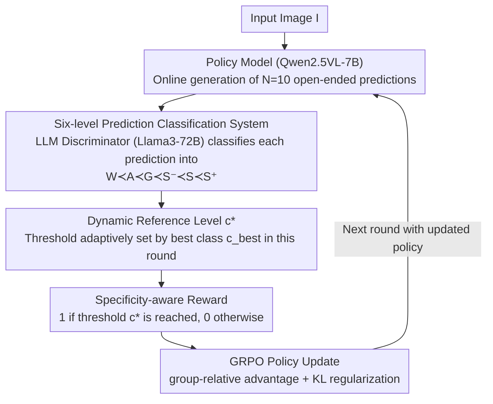

# Specificity-aware Reinforcement Learning for Fine-grained Open-world Classification

**Conference**: CVPR2026  
**arXiv**: [2603.03197](https://arxiv.org/abs/2603.03197)  
**Code**: [s-angheben/SpeciaRL](https://github.com/s-angheben/SpeciaRL)  
**Area**: Reinforcement Learning  
**Keywords**: Open-world Classification, Fine-grained Recognition, Reinforcement Learning, Large Multimodal Models, GRPO, Specificity-aware Reward

## TL;DR

SpeciaRL is proposed — a specificity-aware reinforcement learning framework that simultaneously improves the specificity and correctness of predictions in open-world fine-grained image classification by guiding reasoning-based Large Multimodal Models (LMMs) with dynamic reward signals based on the best prediction from online rollouts.

## Background & Motivation

**Growing demand for open-world classification**: Traditional image classification operates under a closed vocabulary. However, real-world scenarios require handling emerging categories and new concepts, rendering the fixed vocabulary assumption invalid.

**LMMs have strong reasoning but tend to generalize**: Latest reasoning-based LMMs (e.g., Qwen2.5VL) exhibit robust visual understanding but often provide overly broad predictions (e.g., outputting "flower" instead of "daisy") when faced with fine-grained classification tasks.

**Naive improvement of specificity hurts correctness**: Directly requesting "be more specific" in prompts or fine-tuning with SFT/standard RFT can increase specificity but simultaneously increases the proportion of incorrect predictions, representing a non-trivial trade-off.

**Models do not lack knowledge**: Best-of-N analysis shows that the correctness and specificity of the best predictions from Qwen2.5VL-7B in 64 rollouts far exceed those from single inference. This indicates that the model already possesses fine-grained prior knowledge but cannot reliably express it in a single sampling.

**Existing RLVR methods are unsuitable for the open world**: Standard RLVR uses binary rewards based on exact matches, which fails to provide appropriate signals for predictions that are "correct but insufficiently specific," easily pushing the model toward overconfidence.

**Lack of systematic research**: How to improve specificity without compromising correctness in an open-world setting is a significantly underestimated and nearly unexplored problem.

## Method

### Overall Architecture

SpeciaRL aims to resolve a specific contradiction in open-world fine-grained classification: reasoning-based multimodal models have sufficient knowledge but tend to provide overly broad predictions during a single sampling (saying "flower" instead of "daisy"), while forcing them to be "more specific" can degrade accuracy. It is based on GRPO online policy optimization: for each image $I$, the policy model (Qwen2.5VL-7B) generates $N=10$ open-ended predictions $\rightarrow$ an LLM discriminator (Llama3-72B) classifies each prediction into a six-level category system relative to the ground-truth $\rightarrow$ a "dynamic reference level" $c^*$ (the minimum specificity threshold) is adaptively set based on the best category among the $N$ rollouts $\rightarrow$ predictions reaching $c^*$ receive a positive reward, or zero otherwise $\rightarrow$ the policy is updated using GRPO to push the model toward the maximum specificity it can reliably express within its capability. The key lies in the threshold being adaptive per sample rather than a one-size-fits-all approach; the next round of rollouts is re-generated using the updated policy, forming a training loop.

### Key Designs

**1. Six-level Prediction Classification System: Quantifying "Correctness + Specificity"**

The binary rewards of standard RLVR only judge correctness and cannot distinguish "correct but too general." SpeciaRL defines an ordered set of categories $W \prec A \prec G \prec S^- \prec S \prec S^+$ (Wrong, Abstention, Generic, Less Specific, Specific, More Specific), and uses LLM-as-a-judge to automatically assign each prediction to a level, thus making specificity a comparable and rewardable metric.

**2. Dynamic Reference Level: Aligning Thresholds with Current Model Capability**

If maximum specificity is demanded for all samples, the model will be forced to guess blindly on difficult samples where it can only achieve a Generic level of correctness, thereby generating errors. SpeciaRL allows the minimum requirement $c^*$ to adapt according to the best category $c_{best}$ in the current round of rollouts:

$$c^* = \begin{cases} S, & \text{if } c_{best} = S^+ \\ A, & \text{if } c_{best} = W \\ c_{best}, & \text{otherwise} \end{cases}$$

That is, if the model's best performance at the moment only reaches a certain level, that level (or slightly lower) is used as the criterion, without forcing unattainable specificity.

**3. Specificity-aware Reward Function: Rewarding Maximum Specificity within Capability**

With dynamic thresholds, the reward becomes simple—if the prediction category reaches or exceeds $c^*$, a reward of 1 is given; otherwise, it is 0:

$$r_I^*(p, y) = \begin{cases} 1, & \text{if } c_y(p) \succeq c^* \\ 0, & \text{otherwise} \end{cases}$$

The core intuition behind this design is as follows: if the best prediction for a sample is inherently Generic, the model should not be penalized for being insufficiently specific, as this would push the model to output more errors. Dynamic rewards ensure that maximum specificity is encouraged only within the model's reach, allowing both specificity and correctness to improve simultaneously.

### Loss & Training

The standard GRPO objective function is employed, embedding the aforementioned dynamic rewards into group-relative advantage estimation, with an additional KL divergence regularization term ($\lambda = 0.01$) to prevent policy drift. During training, $N=10$ rollouts are used simultaneously for reward calculation and policy updates, requiring no additional inference overhead.

## Key Experimental Results

### Main Results

**Cross-domain fine-grained classification (Train: CUB Birds $\to$ Test: Flowers/Food/Pets/Cars/Aircraft)**:

| Method | Specificity↑ | Correctness↑ | HM↑ |
|------|---------|---------|-----|
| Qwen2.5VL-7B (Zero-shot) | 0.742 | 0.846 | 0.790 |
| Qwen2.5VL-7B ("Be specific") | 0.816 | 0.832 | 0.822 |
| Qwen2.5VL-7B (SFT) | 0.935 | 0.807 | 0.866 |
| Qwen2.5VL-7B (RFT) | 0.875 | 0.785 | 0.825 |
| **SpeciaRL-7B** | **0.920** | **0.848** | **0.883** |
| BoN-64 (Upper Bound) | 0.889 | 0.984 | 0.933 |

On ultra-fine-grained sets (StanfordCars, FGVCAircraft), SpeciaRL also achieves the best HM (0.830), surpassing SFT (0.814) and RFT (0.821).

### Ablation Study

**Static vs. Dynamic Rewards**: Compared to 4 static reward schemes, SpeciaRL's dynamic reward achieves the best overall performance with HM=0.883. Standard binary reward only yields HM=0.825, indicating that providing graded rewards for "correct but insufficiently specific" predictions is crucial.

**Number of Rollouts $N$**: Performance for $N=5$ and $N=10$ is similar (HM=0.883), while performance decreases at $N=15$ (HM=0.824), likely due to limitations in the batch-based grouping strategy.

**Cross-RL Algorithm Compatibility**: Across three online policy optimization algorithms—GRPO, Dr.GRPO, and DAPO—SpeciaRL's dynamic reward consistently improves HM (+1.5% to +5.8%), proving the method's universality.

### Key Findings

- SpeciaRL simultaneously improves specificity (+0.178) and correctness (+0.002) on fine-grained sets, being the only method to achieve joint improvement in both.
- While SFT exhibits extremely high specificity (0.935), its correctness significantly declines (0.807), resulting in an HM lower than that of SpeciaRL.
- Training with only 3,000 samples from a single domain (Birds) allows for generalization to completely different domains such as flowers, food, pets, cars, and aircraft.
- On the general evaluation protocol [10] (TI/LI/SS/CS), SpeciaRL achieves the best performance in 6 out of 8 metrics.

## Highlights & Insights

1. **Novel and Clear Problem Definition**: Successfully identifies the "specificity-correctness trade-off" in open-world classification as a distinct research problem for the first time.
2. **Exquisite Dynamic Reward Design**: Adaptively adjusts reward thresholds based on online rollouts, leveraging existing multi-sampling in GRPO without additional computational overhead.
3. **Excellent Cross-domain Generalization**: Training on bird data generalizes to disparate domains like food and cars, indicating the model learns reasoning strategies rather than domain-specific knowledge.
4. **Practical Six-level Classification System**: The $\{W, A, G, S^-, S, S^+\}$ category system comprehensively covers possible relationships in open-world predictions, providing a reusable evaluation protocol.

## Limitations & Future Work

1. **Dependence on LLM Discriminator Quality**: Reward signals originate from LLM-as-a-judge; if the discriminator fails in certain fine-grained domains (e.g., confusing similar species), it may propagate erroneous signals.
2. **Verification Limited to Classification**: Has not yet been extended to more complex vision tasks like detection or segmentation.
3. **Restricted Base Models**: Verified only on Qwen2.5VL-7B, without exploring larger or different architectures.
4. **Small Training Data Scale**: Trained with only 3,000 samples; a gap still exists compared to the BoN-64 upper bound on ultra-fine-grained sets (HM 0.830 vs. 0.868).
5. **Sensitivity to Rollout Count**: Performance declines at $N=15$, suggesting the method relies on GRPO's batch grouping strategy.

## Related Work & Insights

- **Visual-RFT [34]**: Applies RLVR to closed-set classification using exact-match binary rewards—SpeciaRL extends this to the open world and introduces graded rewards.
- **Conti et al. [10]**: Proposed an open-world classification benchmark revealing LMM generalization tendencies—Ours proposes a solution based on this foundation.
- **DeepSeek-R1 [16]**: A classic application of the GRPO algorithm—SpeciaRL integrates specificity-aware rewards into this framework.
- **Hierarchical precision/recall [44]**: Evaluates prediction quality based on an explicit taxonomy—Ours does not assume a predefined hierarchy and uses an LLM discriminator instead.
- **CaSED [9]**: CLIP retrieval-based open-world classification—Good specificity but correctness is inferior to reasoning-based LMMs.

## Rating

- Novelty: ⭐⭐⭐⭐ (Novel dynamic reward design, clear problem definition)
- Experimental Thoroughness: ⭐⭐⭐⭐ (Cross-domain evaluation + multiple ablations + verification across RL algorithms, but limited to one base model)
- Writing Quality: ⭐⭐⭐⭐⭐ (Complete and smooth logical chain: analysis $\rightarrow$ insight $\rightarrow$ method $\rightarrow$ verification)
- Value: ⭐⭐⭐⭐ (Practical framework for open-world fine-grained classification, strong cross-domain generalization)

<!-- RELATED:START -->

## Related Papers

- [\[ICLR 2026\] DiVE-k: Differential Visual Reasoning for Fine-grained Image Recognition](../../ICLR2026/reinforcement_learning/dive-k_differential_visual_reasoning_for_fine-grained_image_recognition.md)
- [\[ICLR 2026\] Q-Learning with Fine-Grained Gap-Dependent Regret](../../ICLR2026/reinforcement_learning/q-learning_with_fine-grained_gap-dependent_regret.md)
- [\[ICLR 2026\] RewardMap: Tackling Sparse Rewards in Fine-grained Visual Reasoning via Multi-Stage Reinforcement Learning](../../ICLR2026/reinforcement_learning/rewardmap_tackling_sparse_rewards_in_fine-grained_visual_reasoning_via_multi-sta.md)
- [\[ACL 2026\] Beyond Majority Voting: Towards Fine-grained and More Reliable Reward Signal for Test-Time Reinforcement Learning](../../ACL2026/reinforcement_learning/beyond_majority_voting_towards_fine-grained_and_more_reliable_reward_signal_for_.md)
- [\[ICLR 2026\] From Observations to Events: Event-Aware World Models for Reinforcement Learning](../../ICLR2026/reinforcement_learning/from_observations_to_events_event-aware_world_models_for_reinforcement_learning.md)

<!-- RELATED:END -->
