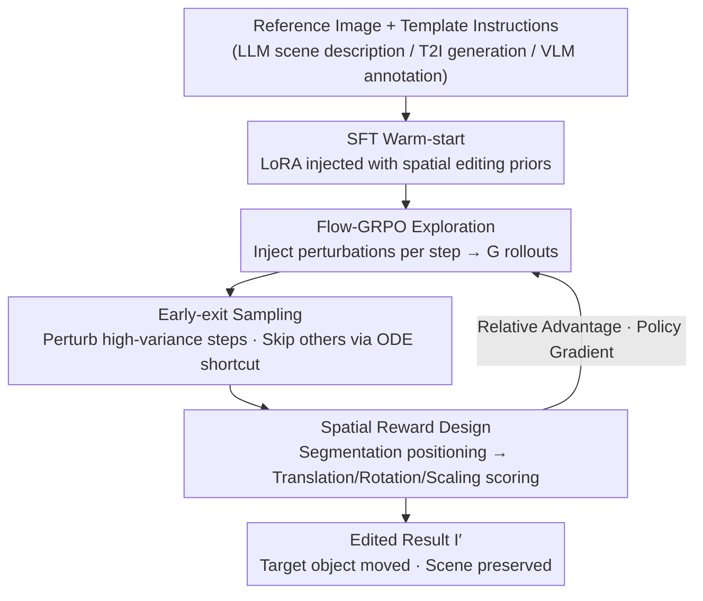

# Talk2Move: Reinforcement Learning for Text-Instructed Object-Level Geometric Transformation in Scenes

**Conference**: CVPR 2026  
**Paper**: [CVF Open Access](https://openaccess.thecvf.com/content/CVPR2026/html/Tan_Talk2Move_Reinforcement_Learning_for_Text-Instructed_Object-Level_Geometric_Transformation_in_Scenes_CVPR_2026_paper.html)  
**Code**: None  
**Area**: Reinforcement Learning / Diffusion Models / Image Editing  
**Keywords**: Text-guided editing, geometric transformation, Flow-GRPO, spatial reward, early-exit sampling

## TL;DR
Talk2Move models "translating/rotating/scaling an object in a scene based on text instructions" as an RL problem. It utilizes Flow-GRPO for exploration on diffusion trajectories with spatial rewards, eliminating the need for paired supervision data. By employing early-exit sampling, it accelerates training by $2\times$. It significantly outperforms existing editing models like GPT-Image-1, Flux-Kontext, and QwenImageEdit in terms of spatial accuracy and scene consistency.

## Background & Motivation

**Background**: Text-driven image editing has gained significant attention in recent years. Diffusion models (Flux, Flux.1 Kontext) and VLM-based diffusion decoders (QwenImageEdit, Bagel, Emu2, etc.) are capable of modifying appearance, changing styles, and altering semantic content.

**Limitations of Prior Work**: However, these models struggle with "object-level geometric transformations"—such as moving a cup left onto a laptop, rotating a person $90^\circ$ counter-clockwise along the z-axis, or shrinking a person to $0.5\times$. The reasons are twofold: first, **paired supervision is extremely scarce**; "before/after" paired samples are difficult to collect, and examples provided by video or 3D simulations are rare and expensive. Second, SFT relies on **pixel-level MSE loss**, which fails to decouple the "object" from the "scene." Consequently, objects are either moved inaccurately or the background is modified alongside the object.

**Key Challenge**: Geometric editing requires **spatial-level** supervision signals regarding "how much an object shifted, rotated, or scaled relative to the scene." Pixel-level reconstruction loss only focuses on whether the whole image matches a "ground truth" pixel-by-pixel, which is poorly aligned with the objective—even if an object is moved to the correct position, MSE will still penalize it if the pixels at the new location differ from the target.

**Goal**: To enable editing models to follow instructions like "move left/rotate $90^\circ$/zoom $2\times$" and accurately transform only the target object while maintaining scene consistency, without relying on paired data.

**Key Insight**: The authors observe that the diffusion denoising process can be modeled as an MDP, where each denoising step is an action and the entire trajectory is a rollout. Given a reward function that directly evaluates whether the object moved correctly, RL (GRPO) can be used to explore geometric actions. GRPO requires only single-sided samples (input image + instruction), naturally bypassing the need for paired supervision.

**Core Idea**: Utilize "Flow-GRPO + object-level spatial reward" instead of "paired data + pixel MSE" to learn geometric editing, and reduce training overhead by half using "early-exit sampling."

## Method

### Overall Architecture

The Talk2Move pipeline is divided into two major components: **data construction** and **GRPO training**. On the data side, since GRPO only requires single-sided input (a reference image + an instruction), samples can be cheaply generated in bulk: LLMs provide scene descriptions, T2I models generate reference images, and VLMs annotate instructions based on templates. Only a small amount of paired data for SFT warm-starting requires expensive synthesis (simulating object motion with video models + filtering). For training, LoRA is first used for SFT warm-starting to inject basic spatial editing priors. Then, the process enters RL: starting from pure noise, random perturbations are injected at each diffusion step to generate a group of $G$ different rollouts. Several "expert reward models" evaluate whether the translation/rotation/scaling conforms to the instruction to calculate relative advantages for policy gradient updates. **Early-exit sampling** performs perturbation and optimization only on the most informative steps, using ODE shortcuts for the remaining steps to save time.

### Key Designs

**1. Flow-GRPO turns geometric editing into explorable RL, discarding paired data**  
Addressing the scarcity of paired supervision and non-decoupled pixel loss, the authors model diffusion denoising as an MDP: state $s_t=(c, x_t)$, where $x_t$ is the current latent and $c$ is the condition; the predicted velocity vector at each step is the action. Traditional flow-matching follows a deterministic ODE $dx=v_\theta(x,t,c)\,dt$, yielding only one trajectory. Following FlowGRPO/DanceGRPO, they inject random terms into the velocity field, transforming the ODE into an SDE $dx=v_\theta(x,t,c)\,dt+\sigma(t)\,dw$. This allows sampling a group of $G$ different rollouts for the same condition $c$. The key benefit is that training only requires "reference image + instruction," enabling cheap data scaling via prompt rewriting.

**2. Object-level spatial reward: directly measuring transformation accuracy**  
This is the core for RL to learn geometric actions. Unlike standard GRPO using image-level rewards (aesthetic scores, CLIP alignment), Talk2Move uses **spatial grounded rewards**. First, text-driven segmentation locates the target object in both reference and edited images to obtain masks and bounding boxes. Then, scoring is performed per task: translation is calculated via relative center displacement (GenEval protocol); rotation uses Orient-Anything to estimate orientation and check alignment with axes; scaling compares the normalized size ratio of bounding boxes. These rewards decouple the object from the background, making the optimization objective interpretable and sensitive to geometry.

**3. Early-exit sampling: performing RL on the "most informative steps"**  
Flow-GRPO typically optimizes at every denoising step, which is computationally expensive. The authors utilize **off-policy step evaluation**, measuring the exploration value of a step by the "variance of rewards when exiting at that step." High variance indicates high learning potential. An **optimal exit step $K$** is selected where reward variance is maximized. Then, **active step sampling** uses an ODE shortcut to denoise directly from step $K$ to the destination $T$, reducing complexity from $T$ steps to approximately $K$ steps ($K \le T$). This accelerates training by approximately $2\times$ with minimal performance loss.

### Loss & Training
- **Warm-start**: Fine-tune Qwen-Image-Edit for 3000 steps using rank-64 LoRA ($lr=1e-4$). LoRA is applied to attention projections, normalization, and linear layers, while the text encoder, VAE, and ViT are frozen. Paired data for three tasks are merged into a unified SFT checkpoint.
- **RL**: Based on the FlowGRPO baseline, with a sample noise level of 1.0 and a clip range of 2e-4. Training utilized 16 H200 GPUs, taking approximately 160 GPU-hours per sub-task.
- **Data Scale**: The translation task uses 800 unique images expanded to 3200 samples. SFT paired data was synthesized via video generation models and filtered, resulting in 800 pairs for translation, 43 for rotation, and 110 for scaling.

## Key Experimental Results

### Main Results (Synthetic benchmark, 100 samples per task)

| Task | Metric | Ours | QwenImageEdit | GPT-Image-1 | Flux-Kontext |
|------|------|------|---------------|-------------|--------------|
| Translation | Trans. Dist.↑ | **0.6667** | 0.2551 | 0.5416 | 0.0499 |
| Translation | Acc.↑ | **76.67%** | 32.86% | 64.29% | 4.41% |
| Translation | Human Win↑ | **57.50%** | 12.50% | 26.25% | 1.25% |
| Rotation | Rot. Err.↓ | **0.2861** | 0.4129 | 0.4293 | 0.4259 |
| Rotation | Acc.↑ | **29.55%** | 9.30% | 2.33% | 6.82% |
| Scaling | Acc.↑ | **9.17%** | 7.50% | 5.08% | 1.67% |
| Scaling | Human Win↑ | **63.89%** | 11.11% | 1.39% | 15.28% |

Real-world results (OpenImages-V6) show consistent conclusions: Translation Acc. 53.85% (runner-up QwenImageEdit 42.31%), Rotation Acc. 31.25%. ⚠️ Accuracy for the scaling task remains low for all methods, indicating it remains a significant challenge.

### Ablation Study

| Configuration (Translation) | Trans. Dist.↑ | Acc.↑ | L1↓ |
|------|------|------|------|
| QwenImageEdit (Raw backbone) | 0.2551 | 32.86% | 0.5834 |
| QwenImageEdit + SFT | 0.5953 | 67.14% | 0.2562 |
| Ours (SFT+RL) | **0.6667** | **73.13%** | **0.2012** |
| Ours (1/10 training samples) | 0.6507 | 73.33% | 0.2629 |

| Sampling Strategy | NFE (old/new) | Total (s) | Trans. Dist. | Acc. |
|------|------|------|------|------|
| Full (Whole trajectory) | 10/10 | 172.32 | 0.6602 | 69.12% |
| Sliding window | 10/4 | 101.61 | 0.5983 | 67.14% |
| Ours (Early-exit) | 4/4 | **87.27** | **0.6667** | **76.67%** |

### Key Findings
- **SFT warm-start is the foundation, RL is the refinement**: Adding SFT to the raw backbone improved translation Acc. from 32.86% to 67.14%; RL further increased it to 73.13% and reduced L1 error, improving scene consistency.
- **High data efficiency**: Using only 1/10 of the training samples, translation Acc. remained high at 73.33%, confirming that the "GRPO single-sided samples + prompt expansion" strategy relies minimally on paired data.
- **Early-exit sampling is "faster and better"**: Compared to Full sampling, it reduced total time from 172s to 87s while Acc. actually increased from 69.12% to 76.67%.

## Highlights & Insights
- **Reformulates geometric editing from a regression problem to an RL problem**, bypassing the bottleneck of paired data. This paradigm shift is transferable to other tasks where supervision is hard to collect but rewards are easy to verify.
- **Spatial grounded rewards = Expert models as judges**: Using segmentation, orientation estimation, and bounding box ratios to decompose abstract instructions into computable scores is a versatile approach in visual RL.
- **Early-exit sampling applies the "high-entropy token" concept to diffusion steps**: Using rollout reward variance to measure exploration value provides a clean and efficient criterion for step selection.

## Limitations & Future Work
- The data scale is relatively small (800 unique images for translation); large-scale data expansion is left for future work.
- The scaling task remains weak across all methods; the inability of video generation models to produce reliable scaling is a bottleneck.
- ⚠️ The transformation space is constrained by templates (e.g., 4 directions, 4 levels of rotation). Generalization to continuous/arbitrary instructions like "move 37 pixels" is not fully verified.
- Currently, one GRPO is trained per task; unifying them into a single strategy and handling multi-object transformations are yet to be explored.

## Related Work & Insights
- **vs. Geometric conditional editing (e.g., ORIGEN)**: These depend on explicit 2D/3D primitives or manual layouts, requiring human expertise. Talk2Move uses only natural language, making it more user-friendly and scalable.
- **vs. Pure text editing (e.g., QwenImageEdit)**: While they handle appearance/style well, they fail on fine-grained spatial instructions. Ours uses QwenImageEdit as a backbone and specifically addresses geometry via RL.
- **vs. Diffusion RL (e.g., DDPO, FlowGRPO)**: Most use image-level rewards and expensive full trajectories. Talk2Move introduces object-level spatial rewards and early-exit sampling to reduce costs and target task-relevant transformation steps.

## Rating
- Novelty: ⭐⭐⭐⭐⭐ First to integrate text-guided object-level geometric transformation into an RL framework.
- Experimental Thoroughness: ⭐⭐⭐⭐ Includes synthetic/real data, human evaluation, and ablation, though scaling is weak.
- Writing Quality: ⭐⭐⭐⭐ Clear motivation and methodology.
- Value: ⭐⭐⭐⭐⭐ Decoupling from paired data and using early-exit acceleration makes this highly reusable for other editing tasks.

<!-- RELATED:START -->

## Related Papers

- [\[CVPR 2026\] GeoWorld: Geometric World Models](geoworld_geometric_world_models.md)
- [\[ECCV 2024\] Visual Grounding for Object-Level Generalization in Reinforcement Learning](../../ECCV2024/reinforcement_learning/visual_grounding_for_object-level_generalization_in_reinforcement_learning.md)
- [\[CVPR 2026\] Seeing is Improving: Visual Feedback for Iterative Text Layout Refinement](seeing_is_improving_visual_feedback_for_iterative_text_layout_refinement.md)
- [\[AAAI 2026\] Object-Centric World Models for Causality-Aware Reinforcement Learning](../../AAAI2026/reinforcement_learning/object-centric_world_models_for_causality-aware_reinforcement_learning.md)
- [\[ICLR 2026\] Beyond Distributions: Geometric Action Control for Continuous Reinforcement Learning](../../ICLR2026/reinforcement_learning/beyond_distributions_geometric_action_control_for_continuous_reinforcement_learn.md)

<!-- RELATED:END -->
