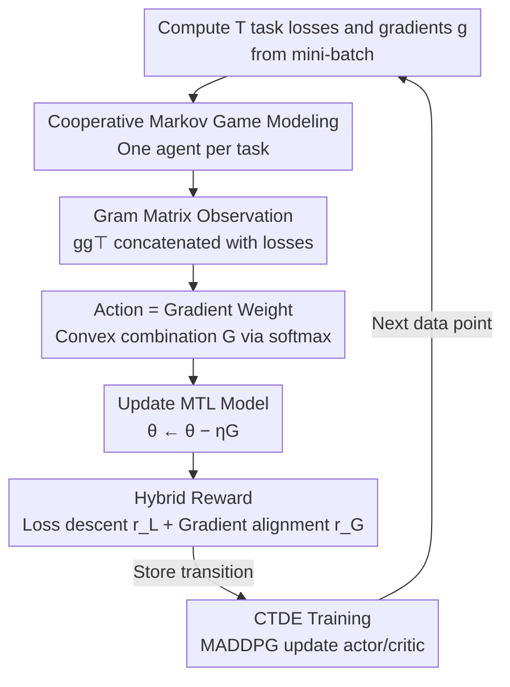

# TaskForce: Cooperative Multi-agent Reinforcement Learning for Multi-task Optimization

**Conference**: CVPR 2026  
**Paper**: [CVF Open Access](https://openaccess.thecvf.com/content/CVPR2026/html/Choi_TaskForce_Cooperative_Multi-agent_Reinforcement_Learning_for_Multi-task_Optimization_CVPR_2026_paper.html)  
**Code**: None  
**Area**: Reinforcement Learning / Multi-task Optimization  
**Keywords**: Multi-task learning, gradient conflict, multi-agent reinforcement learning, gradient aggregation, hybrid reward  

## TL;DR
TaskForce models the process of weighting task-specific gradients into a unified update direction as a cooperative multi-agent reinforcement learning (MARL) problem. Each task is assigned an agent that observes a compressed gradient summary via a Gram matrix and outputs a weight for its own gradient. The learning is driven by a hybrid reward encoding both "gradient alignment" and "loss descent." The method consistently outperforms existing SOTA multi-task optimization (MTO) methods on NYU-v2, Cityscapes, and QM9.

## Background & Motivation
**Background**: Multi-task learning (MTL) involves optimizing multiple task losses simultaneously, where shared representations enable knowledge transfer and computational efficiency. However, backpropagating multiple loss gradients often leads to two issues: **gradient conflict** (divergent or opposing gradient directions) and **scale imbalance** (certain tasks dominating updates due to larger gradient magnitudes). Both result in negative transfer, where learning one task harms the performance of others. MTO methods are designed to address these problems.

**Limitations of Prior Work**: Existing MTO methods are generally divided into two categories, each with critical flaws. **Gradient-based methods** (PCGrad, CAGrad, NashMTL, Aligned-MTL, etc.) directly aggregate gradients using heuristic rules such as projection into conflict-free subspaces, reweighting, or seeking Pareto stationary solutions. These typically offer convergence guarantees but are **deterministic and lack stochastic exploration**, making them prone to getting stuck in poor local minima. **Loss-based methods** (DWA, UW, RLW, IGBv2, etc.) focus on reweighting losses based on convergence rates or task difficulty. While intuitive, they **completely ignore gradient information** and cannot explicitly resolve the root cause of negative transfer—gradient conflict. Consequently, they generally underperform compared to gradient-based methods.

**Key Challenge**: An ideal optimization strategy should utilize **gradient-level** information to resolve conflicts (the strength of gradient-based methods) while maintaining **stochastic exploration** capabilities to escape local minima and account for actual loss reduction (the intuition of loss-based methods). Existing methods are either exploration-free deterministic heuristics or loss-reweighting schemes blind to gradients. While IGBv2 introduced single-agent RL for loss weighting, it still operates purely at the loss level.

**Goal**: To design an **adaptive** gradient aggregation strategy that considers both gradient and loss signals based on the current optimization state, incorporating stochastic exploration to avoid suboptimal convergence points.

**Key Insight**: The aggregation of task gradients at each step can be viewed as a **sequential decision-making problem**. By assigning an agent to each task, they can learn cooperative aggregation strategies through trial and error within the "environment" of the shared network. RL reward functions are flexible and can be non-differentiable, allowing the integration of convergence objectives from the gradient-based school and descent signals from the loss-based school. Furthermore, the inherent exploration in MARL mitigates local minima issues.

**Core Idea**: Replace deterministic heuristics with cooperative multi-agent reinforcement learning (MARL) for gradient aggregation. Each task agent observes a compressed gradient summary, outputs its gradient weight, and is driven by a hybrid reward of "gradient alignment + loss descent."

## Method

### Overall Architecture
TaskForce models multi-task optimization as a **cooperative Markov game**. The MTL model being trained serves as the evolving "environment." Each task is assigned an independent agent, and all agents collaboratively determine the joint update direction at each step. The workflow for one iteration is: compute $T$ task losses and gradients from a mini-batch $\rightarrow$ concatenate the gradient Gram matrix $gg^\top$ and losses into a compact **observation** $\rightarrow$ each agent outputs an **action** (a scalar normalized via softmax to a weight) $\rightarrow$ perform a convex combination of task gradients into an aggregated gradient $G$ to update the MTL model $\rightarrow$ evaluate the aggregation via a **hybrid reward** $\rightarrow$ store transitions in a replay buffer and update actors/critics following the Centralized Training, Decentralized Execution (CTDE) paradigm. The next observation is generated using the subsequent data point to avoid redundant forward/backward passes.

### Key Designs

**1. Modeling Multi-task Optimization as a Cooperative Markov Game: Learning Aggregation Weights**

This design directly addresses the lack of exploration in deterministic heuristics. By assigning an agent to each of the $T$ tasks, the game is defined by three elements: observation $\mathcal{O}$, action $\mathcal{A}$, and reward $\mathcal{R}$. Each agent outputs a scalar action $a_t = \mu_t(o_t;\phi_t)$, which is normalized into a weight $w_t = \frac{\exp(a_t)}{\sum_k \exp(a_k)}$. The final update direction is the convex combination $G = \sum_{t=1}^{T} w_t g_t$. The convex combination constraints ($\sum_t w_t=1,\ w_t\ge 0$) ensure the update remains within the convex hull of task gradients. Unlike deterministic methods, the weights stem from a **stochastic policy** learned through trial and error, helping escape poor convergence points. Unlike IGBv2's loss-RL, these agents make decisions directly at the **gradient level**.

**2. Gram Matrix Observation: Compressing High-dimensional Gradients into a $T\times T$ Summary**

Feeding raw gradients $g\in\mathbb{R}^{T\times|\theta|}$ into agents is computationally infeasible as the dimension scales with network parameters $|\theta|$ (e.g., MTAN has ~44.1M parameters). TaskForce uses the **Gram matrix** of task gradients $gg^\top\in\mathbb{R}^{T\times T}$ combined with the loss vector as the observation: $\mathcal{O}=\{gg^\top\,|\,\mathcal{L}(\theta)\}$. Each agent receives one row $o_t\in\mathbb{R}^{T+1}$. This representation **losslessly preserves the key information required to resolve conflicts**: diagonal elements $g_t\cdot g_t$ encode gradient magnitudes (addressing scale imbalance), while off-diagonal elements $g_i\cdot g_j$ encode pairwise alignment/conflict. Since $T \ll |\theta|$, the observation dimension is reduced from $O(|\theta|)$ to $O(T)$, making MARL training feasible.

**3. Hybrid Reward: Encoding "Gradient Alignment" and "Loss Descent"**

Relying solely on loss signals is myopic, while relying only on gradient signals ignores actual loss reduction. The authors design a hybrid reward $\mathcal{R}=\lambda_\mathcal{L} r_\mathcal{L}+\lambda_\mathcal{G} r_\mathcal{G}$. The **loss term** $r_\mathcal{L}=\sum_t \log(1+\mathcal{L}_t^{\text{prev}})-\sum_t \log(1+\mathcal{L}_t')$ measures relative improvement, using a log transform for scale invariance and immediate feedback. The **gradient term** $r_\mathcal{G}=-\|\sum_t w_t g_t\|_2^2$ reformulates the convex minimization problem used in multi-objective optimization to find a common descent direction (Pareto optimality) into a reward maximization objective. This encourages agents to choose policies aligned with **provably convergent directions**. The reward $\mathcal{R}$ is shared among all agents to ensure full cooperation.

**4. CTDE Training: Centralized Critic for Credit Assignment, Decentralized Actor for Efficiency**

Simultaneous learning by multiple agents can break the Markov assumption, causing non-stationarity. TaskForce employs MADDPG's CTDE paradigm: each agent has a **decentralized** actor $\mu_t(\cdot;\phi_t)$ (observing only its local row $o_t$ during execution) and a **centralized** critic $Q_t^\mu(\mathcal{O},\mathcal{A};\psi_t)$ (observing all agents' info during training to mitigate non-stationarity). Training is off-policy using a replay buffer. Ablations show that centralized training (CT) improves optimization via global information, while decentralized execution (DE) reduces training overhead from $\times3.21$ back to $\times1.00$ with negligible performance loss.

### Loss & Training
The MTL main network uses standard gradient descent $\theta\leftarrow\theta-\eta G$. On the RL side, critics minimize TD error, and actors are updated via deterministic policy gradients. Target networks are updated via soft updates (coefficient $\tau$). To save computation, the "next observation" is reused from the subsequent training step.

## Key Experimental Results

### Main Results
Comparison with 12 MTO baselines across three distinct benchmarks (lower $\Delta_m$ / $\Delta_t$ indicates less degradation relative to Single-Task Learning STL):

| Dataset (Network) | Tasks | Metric | Ours | Best Baseline | Remarks |
| :--- | :--- | :--- | :--- | :--- | :--- |
| NYU-v2 (MTAN) | 3 | $\Delta_m\downarrow$ | **−6.47%** | −4.93% (Aligned-MTL) | Seg/Depth/Normals |
| NYU-v2 (MTAN) | 3 | $\Delta_t\downarrow$ | **−9.96%** | −8.40% (Aligned-MTL) | Task-level degradation |
| Cityscapes (PSPNet) | 3 | $\Delta_m\downarrow$ | **−0.65%** | −0.02% (Aligned-MTL) | Outdoor scene tasks |
| QM9 (MPNN) | 11 | $\Delta_m\downarrow$ | **+59.0%** | +62.0% (NashMTL) | 11 molecule properties |

Negative $\Delta_m$ implies multi-task performance superior to single-task. QM9 is particularly challenging due to the high task count and loss scale variance; TaskForce remains the most robust here, whereas previous SOTA Aligned-MTL degrades to +81.9%.

### Ablation Study
Ablation on NYU-v2 showing the cumulative effect of components (Training cost relative to final config; $r_\mathcal{L}$ used as default reward):

| gg⊤ | MA | CT | DE | rG | Training Cost | $\Delta_m\downarrow$ | $\Delta_t\downarrow$ |
|---|---|---|---|---|---|------|------|
| ✗ | — | — | ✓ | | ×2.59M* | −2.89% | −4.05% |
| ✓ | ✓ |  |  | | ×0.95 | −4.26% | −7.19% |
| ✓ | ✓ | ✓ |  | | ×3.21 | −5.23% | −8.31% |
| ✓ | ✓ | ✓ | ✓ | | ×1.00 | −5.18% | −8.26% |
| ✓ | ✓ | ✓ | ✓ | ✓ | ×1.00 | **−6.47%** | **−9.96%** |

(*Estimated cost due to OOM without Gram matrix compression)

### Key Findings
- **Gram Matrix is Essential**: Attempting to feed raw gradients (44.1M parameters) results in a $\times2.59M$ cost increase and triggers OOM; observation compression is a prerequisite for making MARL viable in MTL.
- **Gradient Reward $r_\mathcal{G}$ is Significant**: Adding $r_\mathcal{G}$ improves $\Delta_m$ from −5.18% to −6.47%, proving that signals aligned with provable convergence directions are effective.
- **DE Gains Efficiency for Free**: Switching to decentralized execution reduces training cost from $\times3.21$ to $\times1.00$ with negligible drop in performance.
- **Manageable Overhead**: In terms of wall-clock time, TaskForce is competitive with other gradient/hybrid baselines. Even on the 11-task QM9, the MARL overhead remains much smaller than the MTL gradient computation itself.

## Highlights & Insights
- **Gram Matrix as "Gradient Fingerprints"**: The $gg^\top$ matrix cleverly encodes scale imbalance (diagonal) and gradient conflict (off-diagonal) into a $T\times T$ space.
- **Reward Function as a Fusion Vessel**: RL rewards provide an elegant way to merge the convex minimization goals of gradient-based methods with the loss improvement goals of loss-based methods.
- **Transferable Paradigm**: The framework of "modeling deterministic heuristic problems as cooperative MARL with compact state summaries" can be transferred to other domains like client weighting in Federated Learning or routing in MoE.

## Limitations & Future Work
- **Scaling Complexity**: The number of agents grows linearly with the number of tasks. Scalability beyond 11 tasks remains a concern discussed primarily in the appendix.
- **Reward Weight Sensitivity**: The scale difference between $\lambda_\mathcal{L}$ and $\lambda_\mathcal{G}$ (1.0 vs 1e-3) suggests a need for task-specific tuning.
- **Implementation Complexity**: While wall-clock time is competitive, the architecture requires replay buffers, centralized critics, and target networks, making it more complex than one-line aggregation rules.

## Related Work & Insights
- **vs Gradient-based**: Methods like Aligned-MTL use deterministic rules with no exploration; TaskForce uses learned stochastic policies to avoid local minima.
- **vs Loss-based**: Methods like DWA ignore gradient signals; TaskForce explicitly feeds gradient interaction info to agents.
- **vs IGBv2**: IGBv2 uses single-agent RL for loss weights; TaskForce advances this to **multi-agent + gradient-level** aggregation.

## Rating
- Novelty: ⭐⭐⭐⭐⭐ Systematic modeling of MTO as cooperative MARL with effective Gram matrix compression.
- Experimental Thoroughness: ⭐⭐⭐⭐ Strong baseline comparisons across diverse benchmarks; however, lacks extensive sensitivity analysis for reward weights.
- Writing Quality: ⭐⭐⭐⭐ Clear logical flow from motivation to reward design.
- Value: ⭐⭐⭐⭐ Provides a new paradigm for "learning aggregation strategies" applicable to multi-source weighting problems.

<!-- RELATED:START -->

## Related Papers

- [\[ICML 2026\] LLM-Guided Communication for Cooperative Multi-Agent Reinforcement Learning](../../ICML2026/reinforcement_learning/llm-guided_communication_for_cooperative_multi-agent_reinforcement_learning.md)
- [\[CVPR 2026\] MangoBench: A Benchmark for Multi-Agent Goal-Conditioned Offline Reinforcement Learning](mangobench_a_benchmark_for_multi-agent_goal-conditioned_offline_reinforcement_le.md)
- [\[ICML 2025\] Enhancing Cooperative Multi-Agent Reinforcement Learning with State Modelling and Adversarial Exploration](../../ICML2025/reinforcement_learning/enhancing_cooperative_multi-agent_reinforcement_learning_with_state_modelling_an.md)
- [\[AAAI 2026\] Explaining Decentralized Multi-Agent Reinforcement Learning Policies](../../AAAI2026/reinforcement_learning/explaining_decentralized_multi-agent_reinforcement_learning_policies.md)
- [\[NeurIPS 2025\] Mean-Field Sampling for Cooperative Multi-Agent Reinforcement Learning](../../NeurIPS2025/reinforcement_learning/mean-field_sampling_for_cooperative_multi-agent_reinforcement_learning.md)

<!-- RELATED:END -->
