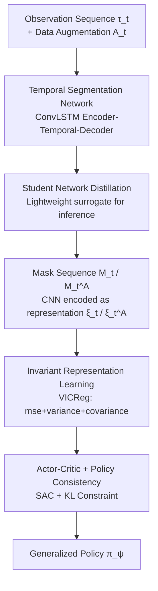

# TSTM: Temporal Segmentation for Task-relevant Mask in Visual Reinforcement Learning Generalization

**Conference**: CVPR 2026  
**Paper**: [CVF Open Access](https://openaccess.thecvf.com/content/CVPR2026/html/Du_TSTM_Temporal_Segmentation_for_Task-relevant_Mask_in_Visual_Reinforcement_Learning_CVPR_2026_paper.html)  
**Code**: https://github.com/sduwcdd/tstm  
**Area**: Reinforcement Learning / Visual Generalization  
**Keywords**: Visual Reinforcement Learning, Generalization, Task-relevant Mask, Temporal Segmentation, Invariant Representation Learning

## TL;DR
TSTM utilizes an "encoder-temporal-decoder" segmentation network with ConvLSTM to extract task-relevant regions (masks) from continuous multi-frame observations. Combined with VICReg-style invariant representation learning and policy consistency constraints for SAC training, it achieves SOTA generalization performance on the DMC-GB video easy/hard benchmarks.

## Background & Motivation
**Background**: Visual reinforcement learning (visual RL) learns control policies directly from pixels. However, policy performance collapses when the training and testing environments are inconsistent in background, lighting, or object textures. The three mainstream categories of generalization methods—data augmentation, representation learning, and regularization—all attempt to make policies more robust to visual perturbations.

**Limitations of Prior Work**: These methods do not explicitly distinguish between "task-relevant regions" and "task-irrelevant regions," leaving policies susceptible to distractor information in the background. Later works like SGQN and MaDi recognized this and began using consistency regularization or pixel-level masks (maskers) to emphasize task-relevant pixels and suppress interference, moving toward "segmenting task-relevant areas."

**Key Challenge**: However, methods like SGQN/MaDi only perform segmentation based on the **current single-frame observation**, lacking temporal information. When the agent and background have similar colors (e.g., a yellow agent against a yellow background in the paper’s Figure 1), a single frame cannot distinguish the agent from the background. If the mask is incorrect, the downstream policy learns distorted information.

**Goal**: To make segmentation no longer dependent on an isolated frame, but instead leverage temporal cues (motion, deformation) within continuous observation sequences to produce more reliable task-relevant masks, thereby improving policy generalization.

**Key Insight**: The authors observe that while an agent moves, the background (even with similar colors) remains relatively static or follows different motion patterns. Temporal differences provide a strong signal for distinguishing the two, which is precisely what single-frame methods discard.

**Core Idea**: Replace "single-frame segmentation" with "temporal segmentation." Use ConvLSTM to capture temporal dependencies between adjacent frames to generate mask sequences, followed by a lightweight student network for distillation and inference. Finally, perform actor-critic training using representations overlaid with invariant representation learning on the masks.

## Method

### Overall Architecture
The input to TSTM is an observation sequence of length $k$, denoted as $\tau_t=\{o_i\}_{i=t-k+1}^{t}$, and the output is a SAC policy robust to visual perturbations and transferable to unseen backgrounds. The pipeline consists of three stages: first, **offline training of the temporal segmentation network** (Teacher → Student distillation); second, during the RL phase, the student network segments both original and augmented sequences into mask sequences, encoding them into representations aligned via **invariant representation loss**; finally, these representations are used as states to train the actor and critic with an additional **policy consistency constraint**. During testing, only the lightweight chain of "student segmentation → encoding → action selection" is executed.

### Key Designs

**1. Temporal Segmentation Network (Teacher): Integrating multi-frame temporal information via ConvLSTM**

This addresses the failure of single-frame segmentation when the "agent and background are the same color." The teacher network $S_T$ adopts an encoder-temporal-decoder structure: the encoder extracts features frame-by-frame (Conv + MaxPool), a central **ConvLSTM** module passes hidden states $h$ and cell states $c$ along the time axis—allowing the $i$-th frame segmentation to reference motion cues from the previous $i-1$ frames—and the decoder upsamples back to pixel-level masks. Formally, $U_t=S_T(\tau_t)$, outputting segmentations $u_i$ frame-by-frame. Supervision is synthesized from two losses: pixel-level binary cross-entropy $\mathcal{L}_{\text{BCE}}=-\frac{1}{H\times W}\big(y_i\odot\log u_i+(1-y_i)\odot\log(1-u_i)\big)$ for pixel alignment, and a Sørensen–Dice coefficient-based loss $\mathcal{L}_{\text{Dice}}=1-\frac{2\langle y_i,u_i\rangle+\epsilon}{\|y_i\|_1+\|u_i\|_1+\epsilon}$ to optimize mask overlap (robust for small targets). Total objective: $\mathcal{L}_{S_T}=\nu\cdot\mathcal{L}_{\text{BCE}}+(1-\nu)\cdot\mathcal{L}_{\text{Dice}}$. The effectiveness lies in the ConvLSTM’s temporal prior ("where the agent was/moved"), which resolves ambiguities when single-frame colors are identical.

**2. Student Network Distillation: Compressing inference costs with a lightweight surrogate**

The teacher network, involving ConvLSTM and sequence processing, incurs high inference overhead, whereas RL requires calling the segmentation network at every step. The authors therefore train a compact student network $S_S$ for deployment. Distillation aligns **penultimate layer features** rather than final masks: given teacher/student penultimate mappings $s^T=S_T^{(L-1)}(\tau_t)$ and $s^S=S_S^{(L-1)}(\tau_t)$, a sigmoid softened with temperature $\zeta$ is used for L2 distillation: $\mathcal{L}_{\text{KD}}=\frac{1}{k\times H\times W}\big\|\sigma(\frac{s^S}{\zeta})-\sigma(\frac{s^T}{\zeta})\big\|_2^2$. The total student loss combines the distillation term with its own segmentation supervision $\mathcal{L}_S=\beta\cdot\mathcal{L}_{\text{KD}}+(1-\beta)\cdot\mathcal{L}_{S_S}$. Aligning intermediate features allows the student to inherit temporal representations, maintaining segmentation quality on a smaller model—the key to "maintaining precision while reducing cost." Only the frozen student network $S_S$ is used in the RL and testing phases.

**3. Invariant Representation Learning: Applying VICReg-style constraints to mask representations**

Clean masks alone are insufficient; encoders may still be sensitive to residual visual changes and prone to representation collapse. The authors apply the student network to both the original sequence $\tau_t$ and its augmented version $A_t=\{\text{aug}(o_i)\}$ to obtain mask sequences $M_t=S_S(\tau_t)$ and $M_t^A=S_S(A_t)$. A CNN encoder extracts representations $\xi_t=\text{Enc}(M_t;\theta)$ and $\xi_t^A=\text{Enc}(M_t^A;\theta)$, which are passed through a two-layer MLP projector to obtain $z_t, z_t^A$. Three VICReg terms are applied in the projection space:

$$\mathcal{L}_{\text{mse}}=\|z_t-z_t^A\|_2^2,\quad \mathcal{L}_{\text{var}}=\frac{1}{d}\sum_{i=1}^{d}\big[\max(0,\Gamma-\sqrt{\text{Var}(z_{t,i})+\eta})+\max(0,\Gamma-\sqrt{\text{Var}(z_{t,i}^A)+\eta})\big]$$

The invariance term $\mathcal{L}_{\text{mse}}$ enforces consistency before and after augmentation; the variance term $\mathcal{L}_{\text{var}}$ uses a hinge loss to keep the standard deviation of each dimension above threshold $\Gamma$, **preventing representation collapse**; the covariance term $\mathcal{L}_{\text{cov}}=\frac{1}{d}\sum_{i\neq j}[C(z_t)_{ij}^2+C(z_t^A)_{ij}^2]$ decorrelates dimensions. The weighted sum $\mathcal{L}_{\text{INV}}=\lambda\mathcal{L}_{\text{mse}}+\mu\mathcal{L}_{\text{var}}+\rho\mathcal{L}_{\text{cov}}$ optimizes the encoder and projector. Using VICReg instead of contrastive loss avoids reliance on negative samples or large batches, making it friendlier to on-policy RL scenarios.

**4. Actor-Critic Learning + Policy Consistency Constraint: Propagating robustness to policy outputs**

Mask representations $\xi_t$ directly serve as the SAC state $s_t$. The critic follows the standard SAC TD objective $\mathcal{L}_C=\mathbb{E}[(Q_\theta(s_t,a_t)-(r_t+\gamma V_{\bar\theta}(s_{t+1})))^2]$, where $V_{\bar\theta}(s_{t+1})=\mathbb{E}_{a_{t+1}\sim\pi_\psi}[Q_{\bar\theta}(s_{t+1},a_{t+1})-\alpha\log\pi_\psi(a_{t+1}\mid s_{t+1})]$. The actor, in addition to the standard objective $\mathcal{L}_\pi$, includes a **policy consistency constraint**: the policy is evaluated on both $\xi_t$ and $\xi_t^A$, and their distributions are aligned using KL divergence with stop-gradient: $\mathcal{L}_{\text{PC}}=\mathbb{E}[D_{\text{KL}}(\text{sg}(\pi_\psi(\cdot\mid\xi_t))\,\|\,\pi_\psi(\cdot\mid\xi_t^A))]$, resulting in $\mathcal{L}_A=\mathcal{L}_\pi+\varsigma\mathcal{L}_{\text{PC}}$. While invariant representation constrains "features," policy consistency constrains "action distributions," ensuring robustness is maintained from representation to decision-making.

### Loss & Training
The process is split into three serial stages: ① Train the teacher segmentation network using ground-truth mask sequences (BCE+Dice), then freeze it; ② Train the student network via teacher-guided distillation (KD+supervision), then freeze it; ③ Joint optimization in the RL phase—for each step, sample and augment sequences, generate masks via the student network, and update the encoder+projector ($\mathcal{L}_{\text{INV}}$), followed by the critic ($\mathcal{L}_C$), and finally the actor+encoder ($\mathcal{L}_A$).

## Key Experimental Results

### Main Results
Benchmarked on **DMC-GB** across 5 tasks (Walker Walk/Stand, Ball in cup Catch, Finger Spin, Cartpole Swingup) with video easy/hard settings. Comparison with SAC, SODA, SVEA, SGQN, MaDi, and SimGRL. Metric: Final episode return (3 seeds).

| Setting | Task | SGQN | MaDi | SimGRL | TSTM (Ours) |
|------|------|------|------|--------|-------------|
| video easy | Walker Walk | 910±24 | 895±24 | 910±21 | **912±42** |
| video easy | Ball in cup Catch | 950±24 | 807±144 | 964±7 | **969±2** |
| video easy | Finger Spin | 610±61 | 679±17 | 957±16 | **971±12** |
| video easy | Cartpole Swingup | 717±35 | 848±6 | 775±60 | **851±19** |
| video easy | **Average** | 828 | 839 | 916 | **934** |
| video hard | Walker Walk | 739±21 | 504±33 | 773±31 | **821±36** |
| video hard | Ball in cup Catch | 782±57 | 758±135 | 902±19 | **903±27** |
| video hard | Finger Spin | 541±53 | — | — | **906±10** |
| video hard | Cartpole Swingup | — | — | — | **741±22** |
| video hard | **Average** | — | — | — | **859** |

TSTM achieves the highest returns in most tasks across both settings. The exception is Walker Stand, where it ranks second—the authors attribute this to the agent's relative lack of movement, which minimizes the advantages of temporal cues.

### Ablation Study
Ablation on Walker Walk and Cartpole Swingup removing the three core components:

| Configuration | Walker Walk (easy) | Cartpole (easy) | Walker Walk (hard) | Cartpole (hard) |
|------|--------------------|-----------------|--------------------|-----------------|
| TSTM (Full) | 912±42 | 851±19 | 821±36 | 741±22 |
| No Seg | 788±47 | 733±42 | 391±25 | 333±33 |
| No INV | 859±78 | 834±29 | 770±73 | 720±44 |
| No PC | 908±34 | 752±120 | 777±22 | 469±44 |

### Key Findings
- **Temporal segmentation is the most critical component**: Removing it (No Seg) leads to a 12-14% drop in video easy, but a near-50% collapse in video hard. This validates the core thesis: temporal cues are indispensable when background complexity increases.
- **Policy consistency is vital for hard settings and Cartpole**: No PC results in a drop from 741 to 469 on Cartpole video hard, showing that feature-level invariance must be reinforced at the action distribution level.
- **Invariant representation learning provides stable gains**: Removing it leads to consistent but non-catastrophic performance drops.
- **Qualitative visualization**: Compared to SGQN and MaDi, TSTM masks better preserve the agent’s complete structure and posture without background leakage.

## Highlights & Insights
- **Introducing "time" into task-relevant segmentation** is the core insight: Previous works like SGQN/MaDi were stuck in single frames. TSTM demonstrates that while single frames are inherently ambiguous during same-color interference, motion provides a natural discriminatory signal.
- **Distilling penultimate features** is a valuable trick: In RL scenarios where segmentation is called frequently, feature distillation preserves temporal representation quality while reducing overhead.
- **VICReg combined with Policy Consistency** provides a robust dual-layer defense: The former handles feature-layer invariance and anti-collapse, while the latter preserves action distributions.

## Limitations & Future Work
- **Reliance on ground-truth masks**: The teacher network requires GT masks $Y_t$ for supervision, which is difficult to obtain in many real-world robotics or navigation scenarios.
- **Failure in static tasks**: On tasks like Walker Stand where the agent is nearly static, temporal advantages disappear, and performance is comparable to or slightly worse than baselines.
- **Complexity and Hyperparameters**: The three-stage pipeline involves numerous loss terms and hyperparameters ($\nu, \beta, \zeta, \Gamma, \lambda, \mu, \rho, \varsigma$), making reproduction and tuning potentially costly.

## Related Work & Insights
- **vs SGQN**: SGQN uses consistency to highlight pixels but operates frame-by-frame. TSTM’s explicit temporal segmentation resolves same-color ambiguity, outperforming it significantly in hard settings.
- **vs MaDi**: MaDi uses a single-frame masker. TSTM’s masks benefit from temporal sequences, avoiding "background leakage" seen in MaDi (e.g., reflections).
- **vs SVEA / SODA**: These use indirect methods (augmentation/consistency) to resist noise. TSTM "purifies" the input via segmentation before learning representations, making the two approaches complementary.

## Rating
- Novelty: ⭐⭐⭐⭐ Introducing temporal information for segmentation is a significant innovation.
- Experimental Thoroughness: ⭐⭐⭐⭐ Solid results on DMC-GB and ablation studies, though limited to a few tasks.
- Writing Quality: ⭐⭐⭐⭐ Clear structure and honest discussion of failures.
- Value: ⭐⭐⭐⭐ Provides a reusable "temporal segmentation" direction for visual RL generalization.

<!-- RELATED:START -->

## Related Papers

- [\[ECCV 2024\] Visual Grounding for Object-Level Generalization in Reinforcement Learning](../../ECCV2024/reinforcement_learning/visual_grounding_for_object-level_generalization_in_reinforcement_learning.md)
- [\[CVPR 2026\] Saliency-Guided Representation with Consistency Policy Learning for Visual Unsupervised Reinforcement Learning](saliency-guided_representation_with_consistency_policy_learning_for_visual_unsup.md)
- [\[CVPR 2026\] TaskForce: Cooperative Multi-agent Reinforcement Learning for Multi-task Optimization](taskforce_cooperative_multi-agent_reinforcement_learning_for_multi-task_optimiza.md)
- [\[CVPR 2026\] Incentivizing Generative Zero-Shot Learning via Outcome-Reward Reinforcement Learning with Visual Cues](incentivizing_generative_zero-shot_learning_via_outcome-reward_reinforcement_lea.md)
- [\[ICLR 2026\] Leveraging Explanation to Improve Generalization of Meta Reinforcement Learning](../../ICLR2026/reinforcement_learning/leveraging_explanation_to_improve_generalization_of_meta_reinforcement_learning.md)

<!-- RELATED:END -->
