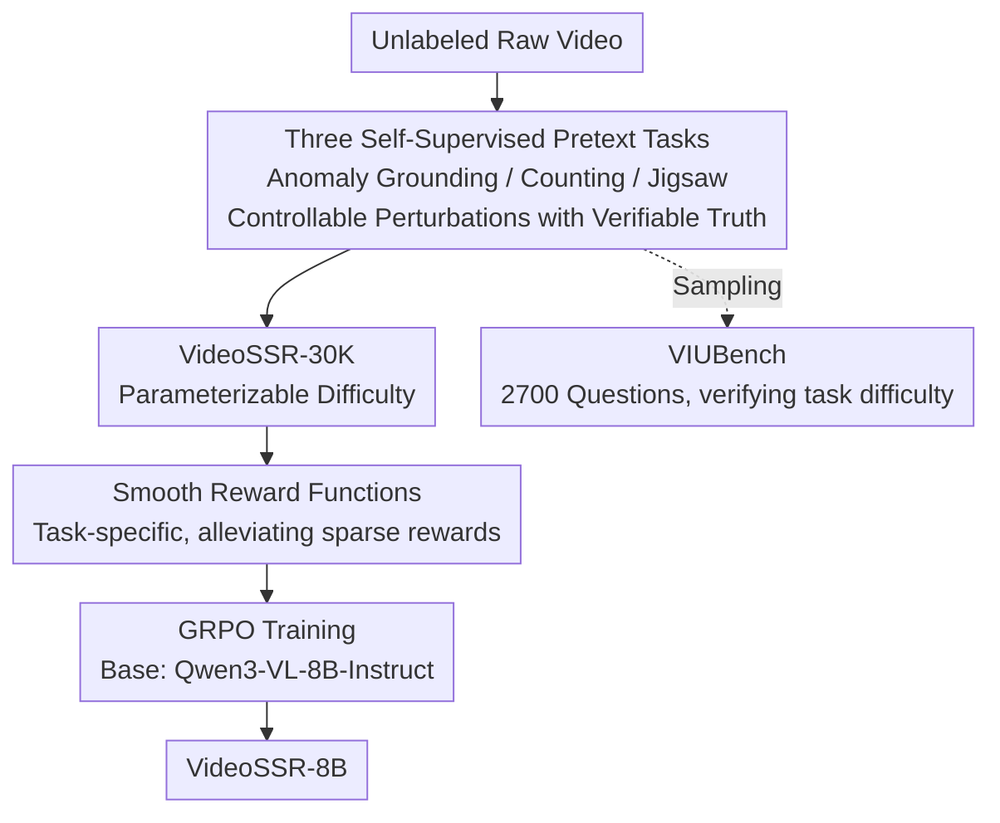

# VideoSSR: Video Self-Supervised Reinforcement Learning

**Conference**: CVPR 2026  
**Paper**: [CVF Open Access](https://openaccess.thecvf.com/content/CVPR2026/html/He_Video_Video_Self-Supervised_Reinforcement_Learning_CVPR_2026_paper.html)  
**Code**: https://github.com/lcqysl/VideoSSR  
**Keywords**: Video Understanding, RLVR, GRPO, Self-supervised, Smooth Reward

## TL;DR
To address the dilemma where strong models are saturated by existing video RLVR datasets and manual annotation is too costly, VideoSSR automatically generates training data with verifiable answers from raw videos using three parameterizable self-supervised pretext tasks (anomaly grounding / object counting / temporal jigsaw). Combined with task-specific smooth reward functions for GRPO training, it improves Qwen3-VL-8B by an average of over 5% across 17 benchmarks.

## Background & Motivation

**Background**: RLVR (Reinforcement Learning with Verifiable Reward) has become the primary route for enhancing the video understanding capabilities of Multimodal Large Language Models (MLLMs), with GRPO being the most commonly used algorithm. It requires video datasets containing "questions + automatically verifiable ground truth answers." Current mainstream approaches (e.g., LongVideoReason, ReWatch) rely on multi-agent collaboration to annotate and generate such high-quality data.

**Limitations of Prior Work**: The authors point out two critical issues. First, for strong models like Qwen3-VL, many questions in existing datasets are too simple—independent sampling of 8 responses per question reveals a bimodal distribution where most questions are either all correct or all incorrect. Second, multi-agent annotation processes introduce systematic bias and noise; when the annotating model is weaker than the target model being trained, it produces flawed or incorrect "ground truth answers," leading to the "all incorrect" peak.

**Key Challenge**: GRPO updates policies based on the **advantage** (difference in rewards) between multiple sampled responses for the same question. When a question is all correct or all incorrect, the reward variance within the group is zero, and the advantage is always zero. Such samples provide **no gradient contribution** to training. Consequently, the combination of "too easy" and "annotation errors" turns the dataset into a collection of zero-variance samples, resulting in marginal gains or even performance degradation for strong models. Compounded by the high cost of manual video annotation, the current path is unsustainable.

**Key Insight**: The authors draw inspiration from traditional video self-supervised learning—videos contain rich intrinsic signals (temporal, spatial, fine-grained appearance). One can **manually construct** a perturbation and require the model to identify or restore it. The ground truth of the perturbation is naturally provided by the construction process, requiring no human or model annotation, and the perturbation intensity can be directly adjusted via parameters to "infinitely increase" difficulty.

**Core Idea**: Replace "multi-agent/manual annotation" with "automatically generated verifiable training data from self-supervised pretext tasks." Design smooth rewards for these inherently difficult tasks to feed GRPO, bypassing annotation bias and ensuring difficulty consistently matches model capability.

## Method

### Overall Architecture
The VideoSSR pipeline transforms unlabeled raw videos into RLVR training data for GRPO to train VideoSSR-8B. It consists of three steps: applying controllable perturbations via three pretext tasks to produce "question + verifiable answer" pairs (forming the VideoSSR-30K dataset); using task-specific **smooth reward** functions during GRPO training to allow rewards to vary continuously as responses approach the ground truth; and finally training Qwen3-VL-8B-Instruct for one epoch to obtain VideoSSR-8B. The authors also sampled these tasks to create VIUBench to verify that these tasks are sufficiently challenging even for state-of-the-art models.

### Key Designs

**1. Three Self-Supervised Pretext Tasks with Parameterizable Difficulty: Verifiable QA from Scratch**

This is the foundation of the work, addressing "expensive annotation, biased annotation, and uncontrollable difficulty." The tasks share a common philosophy: perturbations are applied via code, and truths are provided by the perturbation process itself, making it independent of any annotator and allowing difficulty to be directly tuned.

- **Anomaly Grounding**: Given a video $V=\{f_1,\dots,f_T\}$, a random interval $[t_s,t_e]$ is selected, and a perturbation function $P$ (e.g., swapping red/blue channels, 180° rotation, scaling, horizontal mirroring, shuffling frames within the segment) is applied to get $S'=P(S)$, which is then replaced back. The model must predict the start and end timestamps $(t_s,t_e)$ of the anomalous interval in $V'$. This tests fine-grained, spatial, and temporal perception simultaneously.
- **Object Counting**: Geometric shapes (circles, rectangles, triangles) are programmatically overlaid on randomly selected frames (random size, color, rotation, position). The model must count the total for each shape category. The ground truth is $N_k=\sum_{f_i\in F_{sub}}|\{o\in O_i\mid \text{type}(o)=c_k\}|$. Difficulty is tuned by the maximum number of frames and shapes per category.
- **Temporal Jigsaw**: The video is divided into $n$ segments $[S_1,\dots,S_n]$, shuffled by a random permutation $\pi$ to get $V'=[S_{\pi(1)},\dots,S_{\pi(n)}]$. The model must recover the original order, with the answer being the inverse permutation $\pi^{-1}$. Difficulty is controlled by the number of segments $n$ (Easy 6, Hard 8).

Adjustable difficulty was validated by VIUBench: switching from Easy to Hard in counting caused GPT-5 to drop from 88.4 to 70.3; in jigsaw, increasing segments from 6 to 8 dropped scores from 39.0 to 27.0. This ensures training data remains challenging as models improve.

**2. Task-Specific Smooth Reward Functions: Converting Sparse Rewards into Dense Signals**

Pretext tasks are inherently difficult. Using a strict reward (1 for correct, 0 for incorrect) would cause GRPO sampling to frequently result in zero advantages (all 0s), making training inefficient. The authors designed continuous rewards based on the degree of proximity to the ground truth:

- **Anomaly Grounding** uses IoU: $R_{ground}=\mathrm{IoU}(T_{pred},T_{gt})=\frac{|T_{pred}\cap T_{gt}|}{|T_{pred}\cup T_{gt}|}$, ranging from 0 to 1.
- **Object Counting** uses relative error: $R_{count,k}=\max\!\big(0,\,1-\frac{|\hat y_k-y_k|}{y_k+\varepsilon}\big)$, with the average across $K$ classes $R_{count}=\frac{1}{K}\sum_k R_{count,k}$.
- **Temporal Jigsaw** uses normalized displacement: $E_{jigsaw}=\sum_{k=1}^{n}|\mathrm{pos}(k,\hat P)-\mathrm{pos}(k,P_{gt})|$, then $R_{jigsaw}=1-\frac{E_{jigsaw}}{E_{max}}$, where $E_{max}$ is the maximum possible displacement.

Ablations (Table 4) show that without smooth rewards, models revert to baseline performance as strict rewards trigger zero advantages, hindering optimization.

**3. Mixed Task Training: Generalization through Diversity**

The authors focus on the **data paradigm** rather than modifying the GRPO algorithm. Comparing 30K samples of a single task versus the mixed VideoSSR-30K shows that scaling a single task leads to diminishing returns or performance drops, whereas multi-task training significantly improves general video understanding.

### Loss & Training
The base model is Qwen3-VL-8B-Instruct, trained for 1 epoch using GRPO on VideoSSR-30K. The learning rate is $1\times10^{-6}$, global batch size is 64, rollout number per question is $N=8$, and KL coefficient is $1\times10^{-3}$. Training uses MAX_FRAMES=48 and MAX_PIXELS=256×256, taking approximately 16 hours on 8 H200 GPUs. Inference uses FPS=2 and greedy decoding. Chain-of-Thought (CoT) is omitted to reduce hallucinations and ensure format consistency.

## Key Experimental Results

### VIUBench: Proving Task Difficulty
| Model | VIUBench Avg. Score |
|------|------|
| GPT-5 (Closed-source SOTA) | 58.7 |
| Gemini-2.5-Pro | 56.7 |
| Qwen3-VL-235B-A22B | 30.5 |
| Qwen3-VL-8B-Instruct (Base) | 19.5 |
| **VideoSSR-8B (Ours)** | **51.9** |

Key Finding: Even GPT-5 only achieves 58.7, while the base Qwen3-VL-8B scores 19.5, indicating that understanding intrinsic video properties is a real bottleneck. VideoSSR-8B pushes this to 51.9, approaching closed-source models.

### Main Results: 17 Benchmarks Across 4 Task Categories
| Task Category | Representative Benchmark | Qwen3-VL-8B(64f) | VideoSSR-8B(64f) | Gain |
|--------|------|------|------|------|
| General Video QA | VinoGround | 45.0 | 55.6 | +10.6 |
| Long Video QA | LVBench | 43.0 | 44.0 | +1.0 |
| Temporal Grounding | QVHighlights | 48.6 | 62.6 | +14.0 |
| Temporal Grounding | ActivityNet | 39.8 | 43.7 | +3.9 |
| Complex Reasoning | VCRBench | 8.8 | 17.8 | +9.0 |

Across all 17 benchmarks including VIUBench, VideoSSR achieves an average improvement of 5.1%. The largest gains align with specific pretext tasks (e.g., Anomaly Grounding significantly boosts Temporal Grounding benchmarks).

### Ablation Study (Table 4)
| Training Config | Video-MME(All) | CharadesSTA mIoU | VCRBench Acc |
|--------|------|------|------|
| Baseline | 64.1 | 50.3 | 7.4 |
| 3 Tasks + Strict Reward | 64.8 | 51.3 | 10.7 |
| 3 Tasks + **Smooth Reward** | **65.2** | **52.1** | 10.7 |

### Comparison with Human-Annotated Datasets (Table 5)
| Training Data | Scale | Video-MME | CharadesSTA mIoU | VCRBench Acc |
|--------|------|------|------|------|
| None (Base) | – | 64.1 | 50.3 | 7.4 |
| LongVideoReason | 32k | 63.6 | 51.7 | 7.1 |
| ReWatch | 27k | 64.7 | 51.6 | 2.7 |
| **VideoSSR-30K** | 30k | **65.2** | **52.1** | **10.7** |

### Key Findings
- **Annotated data can be detrimental**: Training on LongVideoReason (annotated by models weaker than Qwen3-VL) caused Video-MME and VCRBench scores to drop, confirming that biased rewards from weak annotators hurt strong models.
- **Diversity > Scale**: At a fixed scale (30K), mixing tasks is superior to scaling any single task.
- **Perturbation Selection Matters**: For anomaly grounding, 4 effective perturbation types were identified; however, temporal perturbations like "fast-forward" had a negative impact, likely because Qwen3-VL relies on textual timestamps for temporal perception, and artificial visual jittering confused the model.

## Highlights & Insights
- **Transferring Self-Supervised Advantages to RLVR**: Self-supervision provides inherent truth, no annotation cost, and controllable difficulty, effectively solving the "expensive, biased, and saturated data" triad of RLVR.
- **Zero Variance Perspective**: Explaining data failure through "all correct/all wrong sampling leading to zero advantages" provides a useful diagnostic tool for RLVR dataset utility.
- **Smooth Rewards as a General Solution**: The construction logic for IoU, relative error, and normalized displacement can be adapted to other RLVR tasks where answers are structured objects.
- **Pretext Task Mapping**: Clear correspondence between specific perturbations and downstream benchmark gains provides a recipe for targeted capability enhancement.

## Limitations & Future Work
- **Long Video Gap**: Training and evaluation were limited to $\le64$ frames; a significant gap remains compared to closed-source models on long video QA.
- **Synthetic vs. Real Distribution**: Perturbations like geometric overlays and frame shuffling are synthetic; generalization to real-world natural anomalies or complex counting scenarios remains to be fully verified.
- **Dependence on Base Model Biases**: The negative impact of fast-forward perturbations suggests that pretext task effectiveness is coupled with the base model's perception mechanism.
- **Manual Reward Design**: Each smooth reward requires manual formulation; a unified automated reward generation mechanism for new tasks is missing.

## Related Work & Insights
- **vs. LongVideoReason / ReWatch**: These rely on multi-agent labeling, whereas VideoSSR uses self-supervised perturbations. VideoSSR is zero-cost, controllable, and shows higher performance on strong models.
- **vs. Video-R1 / SpaceR**: While specific works enhance individual capabilities (spatial or temporal), VideoSSR uses task mixing to pursue broad-spectrum generalization.
- **vs. VideoJigsaw**: Unlike prior work limited to a single jigsaw task, this work expands self-supervision to a diverse set of tasks and demonstrates that diversity is more critical than scale.

## Rating
- Novelty: ⭐⭐⭐⭐⭐ Successfully introduces self-supervised pretext tasks into RLVR data generation, solving three pain points simultaneously.
- Experimental Thoroughness: ⭐⭐⭐⭐⭐ 17 benchmarks, multiple frame settings, and comprehensive ablations across rewards, tasks, and perturbations.
- Writing Quality: ⭐⭐⭐⭐ Excellent explanation of motivation via variance; math is solid; discussion on long-form video could be deeper.
- Value: ⭐⭐⭐⭐⭐ Provides a zero-cost, difficulty-adaptive RLVR data paradigm that is highly relevant for the era of strong models.

<!-- RELATED:START -->

## Related Papers

- [\[CVPR 2026\] EVA: Efficient Reinforcement Learning for End-to-End Video Agent](eva_efficient_reinforcement_learning_for_end-to-end_video_agent.md)
- [\[NeurIPS 2025\] RoiRL: Efficient, Self-Supervised Reasoning with Offline Iterative Reinforcement Learning](../../NeurIPS2025/reinforcement_learning/roirl_efficient_self-supervised_reasoning_with_offline_iterative_reinforcement_l.md)
- [\[ICCV 2025\] Progressor: A Perceptually Guided Reward Estimator with Self-Supervised Online Refinement](../../ICCV2025/reinforcement_learning/progressor_a_perceptually_guided_reward_estimator_with_self-supervised_online_re.md)
- [\[CVPR 2026\] Reinforce to Learn, Elect to Reason: A Dual Paradigm for Video Reasoning](reinforce_to_learn_elect_to_reason_a_dual_paradigm_for_video_reasoning.md)
- [\[ICLR 2026\] Self-Harmony: Learning to Harmonize Self-Supervision and Self-Play in Test-Time Reinforcement Learning](../../ICLR2026/reinforcement_learning/self-harmony_learning_to_harmonize_self-supervision_and_self-play_in_test-time_r.md)

<!-- RELATED:END -->
