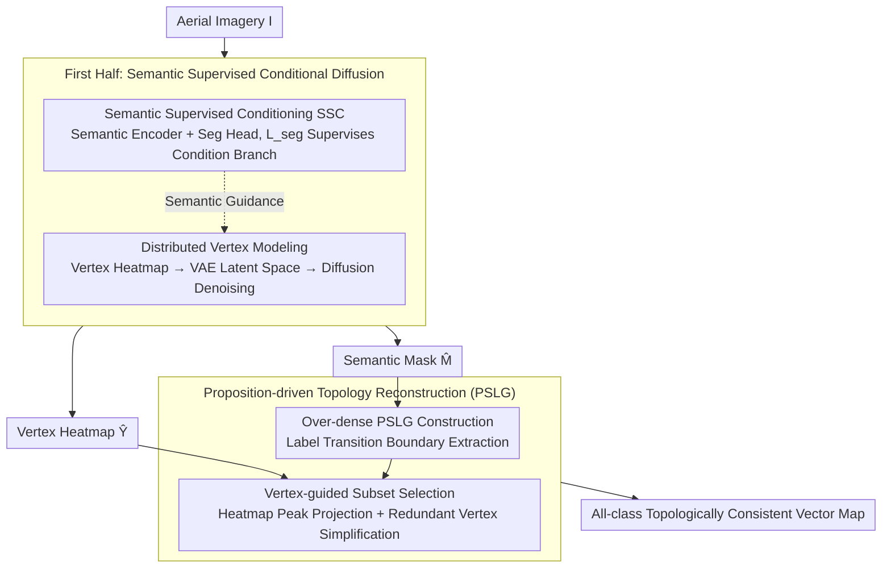

# ACPV-Net: All-Class Polygonal Vectorization for Seamless Vector Map Generation from Aerial Imagery

**Conference**: CVPR 2026  
**arXiv**: [2603.16616](https://arxiv.org/abs/2603.16616)  
**Code**: [HeinzJiao/ACPV-Net](https://github.com/HeinzJiao/ACPV-Net)  
**Area**: Remote Sensing  
**Keywords**: polygonal vectorization, vector map generation, planar partition, conditional diffusion, topological consistency, aerial imagery

## TL;DR

Ours proposes ACPV-Net, the first framework to generate topologically consistent all-class polygonal vector maps from aerial imagery in a single pass. It utilizes a Semantic Supervised Conditioning (SSC) diffusion model to generate vertex heatmaps and ensures zero-gap/zero-overlap through proposition-driven PSLG reconstruction.

## Background & Motivation

**Importance of Vector Base Maps**: Vector base maps (topographic maps) are the core of national geospatial data infrastructure, widely used in cadastral management and land planning. They require adjacent polygons to share precise boundaries without gaps or overlaps.

**Limitations of Prior Work**: Current polygonization methods (DeepSnake, FFL, TopDiG, HiSup, GCP) are designed for single-class tasks. They require class-by-class inference followed by merging, which inevitably introduces topological inconsistencies such as duplicate boundaries, gaps, and overlaps.

**Key Challenge**: (i) Semantic-geometric heterogeneity (raster discrete semantics vs. vector continuous geometry); (ii) Requirement for strict alignment between semantic regions and geometric boundaries; (iii) Weak or ambiguous visual cues (shadows, occlusions, blurred boundaries); (iv) Explicitly encoding mapping conventions (vertex sampling density, simplification strategies); (v) Global topological reconstruction beyond single-category geometry.

**Lack of Benchmarks**: Existing datasets either contain only single-class vector annotations (WHU-Building) or multi-class raster masks (LoveDA, ISPRS), lacking public benchmarks that support all-class polygonal vectorization and global topological consistency evaluation.

**Limitation of Discriminative Methods**: Existing discriminative vertex detection methods produce broad or band-like responses under weak visual cues and lack the capability to learn mapping conventions.

**Deficiencies in Conditional Diffusion Pipelines**: Existing conditional diffusion pipelines (e.g., ControlNet) inject external conditions but lack explicit semantic supervision on the condition branch, failing to guarantee semantic-geometric alignment.

## Method

### Overall Architecture

ACPV-Net aims to "generate an all-class, topologically seamless vector map from aerial imagery in one go." The pipeline consists of two tightly coupled components. The first part is the **Semantic Supervised Conditioning (SSC) diffusion stage**: the diffusion model reconstructs Gaussian mixture heatmaps of vertices in the latent space (**Distributed Vertex Modeling**), while its condition branch is explicitly supervised by a semantic segmentation loss (**Semantic Supervised Conditioning (SSC)**). These components collaboratively output vertex heatmaps $\hat{Y}$ and semantic masks $\hat{M}$, ensuring vertex generation is guided by semantics. The second part is the **Proposition-driven Topology Reconstruction**: given $\hat{M}$ and $\hat{Y}$, a PSLG algorithm deterministically reconstructs a vector map satisfying all ACPV constraints. The former handles "where to place points," while the latter handles "how to assemble a seamless map."

### Key Designs

**1. Distributed Vertex Modeling: Translating "Point Detection" into "Distribution Generation"**

**Limitations of Prior Work**: Discriminative vertex detection is essentially pixel-wise classification. When encountering shadows, occlusions, or blurred boundaries, it often produces broad band-like responses. ACPV-Net encodes each polygon vertex into a Gaussian mixture heatmap $y \in [0,1]^{H \times W}$, compresses it into latent space $z_0 = \mathcal{E}(y)$ using a frozen pre-trained VAE, and lets the diffusion model reconstruct it. This treats discrete point detection as a continuous distribution generation problem. The probabilistic modeling capability of diffusion allows it to infer sharp, compact vertex peaks even with thin evidence, implicitly learning mapping conventions (e.g., vertex sampling density along smooth boundaries). Comparative experiments show that discriminative decoders (ViTPose baseline) produce broad responses, whereas diffusion reconstruction achieves lower Full Width at Half Maximum (FWHM), lower Area@0.5, and higher Sharpness.

**2. Semantic Supervised Conditioning (SSC): Proactive Semantic Guidance**

Generic conditional diffusion pipelines like ControlNet inject external conditions into the backbone without supervising the condition branch itself, resulting in "passive" condition signals that cannot guarantee vertex placement on class-consistent boundaries. SSC adds task supervision to the condition branch: a semantic encoder $S_\psi(I)$ produces features at the same scale as the latent space, followed by a lightweight segmentation head constrained by a semantic segmentation loss $\mathcal{L}_{\text{seg}}$. This upgrades the condition branch from "passive injection" to "proactive guidance," forcing vertex generation onto boundaries defined by discriminative semantics. Ablation studies show that removing $\mathcal{L}_{\text{seg}}$ (No-SSC) causes the vertex-to-boundary alignment rate (V2B@2) to drop from 0.78 to 0.38, with many false positive vertices appearing inside homogeneous regions.

**3. Proposition-driven Topology Reconstruction: Constructive Guarantees**

With semantic masks $\hat{M}$ and vertex heatmaps $\hat{Y}$, heuristic post-processing often leaves gaps. Ours first proves Proposition 1: if every edge of a Planar Straight-Line Graph (PSLG) lies on a label transition boundary and the vertex set consists of geometric keypoints, then the resulting polygonal partition must satisfy all ACPV constraints. The reconstruction is then divided into two deterministic steps: **Over-dense PSLG Construction**, which extracts all label transition pixels from multi-class masks to form a superset of edges, and **Vertex-guided Subset Selection**, which projects discrete vertex peaks from heatmaps onto the PSLG, retaining anchor/key points and simplifying redundant ones. Since topological consistency is backed by this constructive proof rather than post-hoc stitching, gaps and overlaps are fundamentally eliminated.

### Loss & Training

Unified Loss Function:

$$\mathcal{L}_{\text{SSC}} = \lambda_\epsilon \mathbb{E}\|\epsilon - \epsilon_\theta(\cdot)\|_1 + \lambda_0 \mathbb{E}\|z_0 - \hat{z}_0\|_1 + \lambda_{\text{seg}} \mathcal{L}_{\text{seg}}(\hat{M}, M)$$

The first two terms are the noise prediction L1 loss and latent space reconstruction L1 loss (standard diffusion objectives), and the third is the semantic segmentation loss. All are trained end-to-end. The VAE encoder/decoder remains frozen.

## Key Experimental Results

**Table 1: Global Topology Consistency on Deventer-512**

| Method | Gap ↓ | Inter-Overlap ↓ | Intra-Overlap ↓ | Shared-Edge ↑ |
|:---|:---:|:---:|:---:|:---:|
| DeepSnake (CVPR'20) | 12.41 | 68.86 | 51.16 | 38.73 |
| FFL (CVPR'21) | 5.48 | 29.17 | 0.08 | 9.20 |
| TopDiG (CVPR'23) | 8.47 | 13.57 | 0.00 | 10.81 |
| HiSup (ISPRS'23) | 5.43 | 4.50 | 0.00 | 25.73 |
| GCP (TGRS'25) | 8.75 | 10.39 | 41.91 | 20.25 |
| **ACPV-Net (Ours)** | **0.00** | **0.00** | **0.00** | **100.00** |

ACPV-Net is the only method to achieve zero gaps, zero overlaps, and 100% shared-edge consistency.

**Table 2: Comparison on Core Categories (Deventer-512)**

| Category | Method | IoU ↑ | C-IoU ↑ | PoLiS ↓ | MTA ↓ | N-ratio →1 |
|:---|:---|:---:|:---:|:---:|:---:|:---:|
| Building | HiSup | 81.22 | 70.60 | 2.23 | 42.59 | 1.55 |
| Building | **Ours** | **82.08** | **77.24** | **1.76** | **39.39** | **1.00** |
| Road | HiSup | 73.92 | 57.36 | 4.97 | 44.84 | 2.00 |
| Road | **Ours** | **76.01** | **68.22** | **4.44** | **43.85** | **1.07** |

ACPV-Net outperforms single-class SOTA baselines across all five categories (IoU, C-IoU, PoLiS, topological fidelity), with an N-ratio close to 1.0 indicating high vertex efficiency.

**Table 3: Single-class Polygonization on WHU-Building**

| Method | IoU ↑ | C-IoU ↑ | PoLiS ↓ | MTA ↓ | N-ratio →1 |
|:---|:---:|:---:|:---:|:---:|:---:|
| HiSup | 87.63 | 67.15 | 1.40 | 35.27 | 1.93 |
| **ACPV-Net** | **88.50** | **81.45** | **1.38** | **34.85** | **1.07** |

The framework applies to single-class scenarios without architectural changes, achieving SOTA on WHU-Building.

## Highlights & Insights

1. **Foundational Task Definition**: First to formalize the ACPV task with six strict constraints (a)–(f), theoretically characterizing vector base map requirements.
2. **Constructive Topological Guarantee**: Guarantees consistency by design through Proposition 1 and deterministic PSLG algorithms rather than heuristic repairs—an elegant theoretical contribution.
3. **Ingenious SSC Mechanism**: Upgrading the condition branch to proactive semantic guidance improved V2B alignment from 0.46 to 0.85, effectively eliminating false positive vertices.
4. **Universality**: Handles multi-class (Deventer-512) and single-class (WHU-Building) scenarios within the same architecture with strong cross-regional generalization.
5. **Benchmark Contribution**: Released Deventer-512, the first ACPV evaluation benchmark with ~2k patches and 84k+ instances.

## Limitations & Future Work

1. **Dataset Scale**: Deventer-512 is relatively small (2k patches) and sourced from a single region, which may limit generalization in high-density urban or industrial areas.
2. **Diffusion Inference Efficiency**: Iterative sampling for latent space diffusion can be a bottleneck for real-time deployment.
3. **Fixed Radius $\tau$**: Using a fixed radius for vertex projection may lead to mismatches in complex, dense areas.
4. **Expression of Curved Boundaries**: Piecewise linear approximation for curved natural boundaries may require excessive vertices; the N-ratio for the "water" class is higher.
5. **Incremental Updates**: Current framework reconstructs the whole map and does not yet support incremental updates to existing vector layers.

## Related Work & Insights

- **Relation to TopDiG/HiSup**: These represent vertex-adjacency learning and hierarchical attraction field paradigms, respectively. ACPV-Net's breakthrough lies in unifying semantics and geometry.
- **Contrast with ControlNet**: Unlike generic conditional diffusions that lack explicit supervision on the condition branch, SSC introduces task-specific semantic losses.
- **Insights for Remote Sensing**: The approach of proving sufficient conditions before algorithm design serves as a template for other tasks requiring topological constraints.
- **Insights for Structured Prediction**: The SSC concept can be extended to tasks like floorplan or CAD sketch generation.

## Rating

- **Novelty**: ⭐⭐⭐⭐⭐ — First formalization of the ACPV task; highly original SSC and proposition-driven design.
- **Experimental Thoroughness**: ⭐⭐⭐⭐ — Comprehensive multi/single-class evaluation, though dataset scale is limited.
- **Writing Quality**: ⭐⭐⭐⭐⭐ — Rigorous definitions, standardized mathematical notation, and clear proof logic.
- **Value**: ⭐⭐⭐⭐⭐ — Addresses the gap in topologically consistent all-class vectorization with theoretical and engineering merit.

<!-- RELATED:START -->

## Related Papers

- [\[ICLR 2026\] SatDreamer360: Multiview-Consistent Generation of Ground-Level Scenes from Satellite Imagery](../../ICLR2026/remote_sensing/satdreamer360_multiview-consistent_generation_of_ground-level_scenes_from_satell.md)
- [\[CVPR 2026\] ChangeBridge: Spatiotemporal Image Generation with Multimodal Controls for Remote Sensing](changebridge_spatiotemporal_image_generation_with_multimodal_controls_for_remote.md)
- [\[CVPR 2026\] Prompt-Free Unknown Label Generation for Open World Detection in Remote Sensing](prompt-free_unknown_label_generation_for_open_world_detection_in_remote_sensing.md)
- [\[CVPR 2026\] Spectrally Distilled Representations Aligned with Instruction-Augmented LLMs for Satellite Imagery](spectrally_distilled_representations_aligned_with_instruction-augmented_llms_for.md)
- [\[CVPR 2026\] SkySense-VITA: Towards Universal In-context Segmentation of Multi-modal Remote Sensing Imagery](skysense-vita_towards_universal_in-context_segmentation_of_multi-modal_remote_se.md)

<!-- RELATED:END -->
