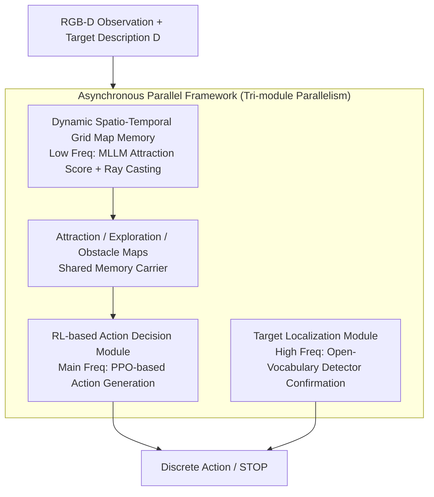

# APEX: A Decoupled Memory-based Explorer for Asynchronous Aerial Object Goal Navigation

**Conference**: CVPR 2026  
**Paper**: [CVF Open Access](https://openaccess.thecvf.com/content/CVPR2026/html/Zhang_APEX_A_Decoupled_Memory-based_Explorer_for_Asynchronous_Aerial_Object_Goal_CVPR_2026_paper.html)  
**Code**: Available (The paper states that the source code has been open-sourced on GitHub, though no specific URL is provided)  
**Area**: Aerial Embodied Navigation / Remote Sensing UAV  
**Keywords**: Aerial Object Navigation, UAV, 3D Spatio-Temporal Semantic Map, Reinforcement Learning, Asynchronous Parallel Framework

## TL;DR
APEX decomposes the "UAV target search" task into three decoupled modules—using MLLMs to dynamically construct 3D spatio-temporal semantic maps as memory, PPO-based reinforcement learning to translate maps into actions, and an open-vocabulary detector for final target confirmation. These modules run at different frequencies via an asynchronous parallel framework to bypass the inference latency of large models, achieving a $+4.2\%$ SR and $+2.8\%$ SPL improvement over the Prev. SOTA on the UAV-ON benchmark.

## Background & Motivation
**Background**: With the advancement of Unmanned Aerial Vehicles (UAVs) and Vision-Language Models (VLMs), Vision-Language Navigation (VLN) is expanding from indoor ground scenes to aerial environments (Aerial VLN, AVLN). This paper focuses on a more practical task category—Aerial Object Navigation (Aerial ObjectNav): a UAV must autonomously explore, reason about spatial relationships, and actively search to locate a target based solely on a high-level text description (e.g., "a red tent") and onboard visual sensors.

**Limitations of Prior Work**: The authors identify three critical flaws ignored by previous research. First is the **ineffective integration of spatio-temporal information**—sensing data grows exponentially from ground to air, and long-range tasks require reliable long-term memory. Previous methods either fail to integrate historical observations, leading to repetitive errors, or use abstract memories like topological graphs, which lose the geometric/metric fidelity needed for fine-grained reasoning and obstacle avoidance. Second is the **gap between semantic understanding and executable control**—using VLMs directly as end-to-end decision-makers (Image + Language $\rightarrow$ Action) requires massive high-quality demonstration data and results in unstable, uninterpretable policies, which is particularly dangerous for safety-critical aerial scenarios. Third is **computational latency and real-time constraints**—running large VLMs is slow. Most frameworks default to a "stop-and-think" execution model, where latency disrupts the real-time continuity required for smooth UAV flight.

**Key Challenge**: There is a forced trade-off between "memory fidelity / decision reliability / real-time efficiency." Prior methods sacrifice either high-quality decision-making for speed or real-time efficiency for complex reasoning.

**Goal**: To simultaneously address memory, decision-making, and efficiency, constructing an aerial object navigation agent that is reliable, interpretable, and real-time efficient.

**Key Insight**: Instead of letting a single VLM handle everything end-to-end, the system should be **decoupled**. Slow but intelligent semantic mapping, fast but reliable action decision-making, and high-frequency target confirmation should each perform their specific roles. An asynchronous parallel framework can then decouple "slow reasoning" from the main control loop.

**Core Idea**: Decompose the task into "dynamic 3D semantic map memory + RL action decision + target localization." By running these at different frequencies within an asynchronous framework, the agent maintains safety with rapidly updated obstacle maps and tolerates slight semantic lag, thereby bypassing VLM latency and enhancing proactive exploration.

## Method

### Overall Architecture
APEX (Aerial Parallel Explorer) is a hierarchical agent that decouples aerial object navigation into three dedicated modules linked by an asynchronous parallel framework. The task is modeled as sequential decision-making: at each time step $t$, the agent receives visual observations $O_t$, its state $S_t$, and a text description $D$, and outputs a discrete action $A_t$. To support long-range exploration, a memory module accumulates spatio-temporal semantic information as $\text{MEM}_t = f_{\text{update}}(\text{MEM}_{t-1}, O_t, S_t)$, and the policy makes decisions based on this memory: $A_t = \pi(O_t, S_t, \text{MEM}_t, D)$.

The three modules are: **① Dynamic Spatio-Temporal Semantic Mapping Module** uses MLLMs and segmentation models to convert visual/textual inputs into three 3D maps (Attraction Map for guidance, Obstacle Map for safety, and Exploration Map for proactive search), serving as interpretable memory; **② RL-based Action Decision Module** feeds these three maps into a policy network trained via PPO to translate high-level spatial understanding into low-level actions; **③ Target Localization Module** utilizes an open-vocabulary detector for "last-mile" target confirmation. Crucially, these are integrated into an asynchronous framework where the mapping module runs at a low frequency, the decision module at the main control frequency, and the detection module at a high frequency.

### Key Designs

**1. Dynamic Spatio-Temporal Grid Map Memory: Replacing abstract topological memory with three 3D grid maps to preserve geometric fidelity and semantics.**

Addressing "ineffective integration of spatio-temporal info," APEX uses a 3D grid map $M$ as a persistent memory carrier. It follows two steps: 3D back-projection and map generation. **3D back-projection** (denoted as $RP(\cdot)$) takes the depth map, camera intrinsics $K$, and agent state $S_t$ to project 2D pixels into 3D points in the world coordinate system, then discretizes them into grid indices. Three semantic/geometric channels are generated:

- **Attraction Map $M_{attr}$**: Quantifies semantic relevance between observed objects and the target. An MLLM performs visual grounding and reasoning to output $N$ object descriptions and attraction scores $\{(c_i, s_i)\}_{i=1}^N = \text{CAP}(O_t, D)$ for the current observation $O_t$. An open-vocabulary segmentation model then generates masks $\text{Mask}_i = \text{SEG}(O_t, c_i)$, which are projected into the 3D grid. Each voxel $v$ follows **majority assignment** (voxel belongs to the object with the most projected pixels) and **nearest observation priority**:
$$\begin{cases} M_{attr}(v) \leftarrow s_{new} \\ M_{depth}(v) \leftarrow d_{new} \end{cases} \quad \text{if } d_{new} < M_{depth}(v).$$
- **Exploration Map $M_{expl}$**: Quantifies observation density (exploration score). Using ray casting from the camera position $t_t$ toward each depth point, the set of visible voxels $V_{visible}=\bigcup_{r} V(r)$ is identified. Gains are calculated using exponential distance decay $\Delta M_{expl}(v) = \exp(-\lambda \cdot \|p_v - t_t\|_2)$ and accumulated: $M_{expl,t}(v) \leftarrow M_{expl,t-1}(v) + \Delta M_{expl}(v)$.
- **Obstacle Map $M_{obst}$**: A persistent representation of occupied space where any voxel containing a back-projected point is marked as $M_{obst}(v) \leftarrow 1$.

**2. RL-based Action Decision Module: Using PPO to translate three maps into low-level actions, avoiding unreliable end-to-end VLMs.**

Addressing the "gap between semantics and control," this module passes the three 3D maps through independent CNN feature extractors. The concatenated representations are fed into a policy network shared by an actor and critic, trained via PPO. The composite reward is $R_t = R_{attr} + \alpha R_{expl} + R_{spar}$. The **Attraction Reward** encourages semantic guidance:
$$R_{attr} = \sum_{v \in V_{visible}} M_{attr}(v) \cdot \left(1 - \frac{\|p_v - t_t\|_2}{d_{thresh}}\right).$$
The **Exploration Reward** encourages movement toward unknown areas (inversely proportional to the exploration score, with $\epsilon$ as saturation):
$$R_{expl} = \sum_{v \in V_{visible}} (\epsilon - M_{expl}(v)) \cdot \left(1 - \frac{\|p_v - t_t\|_2}{d_{thresh}}\right).$$
Training employs a **two-stage curriculum**: pre-training a target-agnostic exploration policy with $R_{expl} + R_{penalty}$, then fine-tuning with $R_{attr} + R_{success}$.

**3. Target Localization Module: Open-vocabulary detector for "last-mile" target confirmation.**

Addressing the limitation that attraction maps only guide the agent to a "general area," this module runs an open-vocabulary detector $\{(\text{bbox}_j, \text{conf}_j)\}_{j=1}^K = GD(O_t, D)$ in parallel at high frequency. If the highest confidence exceeds a threshold, grounding is successful, and the 3D coordinates $P_{target}$ are calculated via back-projection.

**4. Asynchronous Parallel Framework: Running modules at different frequencies to remove slow VLM inference from the main control loop.**

Addressing "computational latency," attraction and exploration maps serve as **shared data structures**. The **Mapping Module** (slowest) performs VLM reasoning and ray casting asynchronously. The **Action Decision Module** runs at the main control frequency, utilizing the latest sensor data to update the obstacle map instantly while reading the most recent attraction/exploration maps from shared memory. This "always-fresh obstacle map, slightly-lagged semantic map" design ensures safety while maintaining continuous, smooth flight.

## Key Experimental Results

### Main Results
Evaluated on the UAV-ON benchmark (14 realistic large-scale outdoor environments, 10,000 episodes).

| Method | SR↑ | NE↓ | OSR↑ | SPL↑ |
|------|-----|-----|------|------|
| FBE | 5.00 | 65.38 | 11.67 | 3.50 |
| CLIP-H | 5.83 | 47.19 | 13.33 | 4.34 |
| TravelUAV | 7.48 | 55.75 | 14.17 | 5.54 |
| AOA-F (UAV-ON Baseline) | 7.50 | 47.90 | 17.50 | 4.15 |
| L3MVN-Z (Ground ObjectNav) | 9.17 | 62.01 | 15.83 | 7.37 |
| **APEX (Ours)** | **13.33** | 54.59 | **20.00** | **10.14** |

Ours achieves SOTA across SR, OSR, and SPL. Gain in SR is $+4.2\%$ and SPL is $+2.8\%$ over the strongest baseline. Higher NE is interpreted as a side-effect of proactive exploration.

Efficiency and Safety (Tab. 2):

| Method | Step Latency (s)↓ | Safe Distance (m)↑ |
|------|--------------|---------------|
| L3MVN-Z | 1.26 | 330.64 |
| TravelUAV | 1.71 | 223.17 |
| **APEX (Ours)** | **0.97** | **345.51** |

APEX has the lowest latency (0.97s, vs 5.29s for AOA-F) and the highest safe distance.

### Ablation Study

Module Ablation (Tab. 4):

| Configuration | SR↑ | NE↓ | OSR↑ | SPL↑ |
|------|-----|-----|------|------|
| w/o 3D-Map | 1.67 | 45.62 | 4.17 | 0.73 |
| w/o RL-AD | 12.50 | 42.08 | 19.17 | 10.11 |
| w/o TG | 5.00 | 48.33 | 9.17 | 4.17 |
| **APEX (Full)** | **13.33** | 54.59 | **20.00** | **10.14** |

### Key Findings
- **3D Map is critical**: Removing it capsules SR from 13.33 to 1.67, proving metric 3D grids are essential for convergence.
- **Target Localization is the second most impactful**: Without it, SR drops significantly (5.00), as attraction maps only provide directional guidance.
- **RL Decision Module improves robustness**: Replacing it with heuristics results in a drop to 12.50 SR due to local optima.
- **$\alpha$ follows an inverted U-curve**: The optimal balance between exploration and attraction is found at $\alpha = 0.2$.

## Highlights & Insights
- **Asynchronous Decoupling**: The design exploits the asymmetry between the need for real-time safety and the tolerance for slight semantic delay, allowing a 0.97s step latency without compromising guidance quality.
- **Explicit Map Decomposition**: Splitting "where to look (attraction)," "where to explore (exploration)," and "what to avoid (obstacle)" makes RL reward design physically intuitive and the agent's behavior interpretable.
- **Curriculum Learning**: Separating "flight and obstacle avoidance" from "target search" effectively mitigates the difficulty of convergence under sparse rewards.

## Limitations & Future Work
- **Absolute Success Rate**: The overall SR remains low (13.33%), indicating that Aerial ObjectNav is still far from solved.
- **Trade-off of High NE**: Proactive exploration leads to higher navigation errors when failing; the cost of this in battery-limited UAV missions requires further analysis.
- **Reliance on Multiple Models**: The system depends on several off-the-shelf black-box models (MLLM, Segmentation, Detection), which dictate overall reliability.
- **Lack of Real-world Verification**: Experiments were conducted solely within simulations, leaving the sim-to-real gap unexplored.

## Related Work & Insights
- **vs AOA-F / UAV-ON**: AOA-F uses an end-to-end LLM; APEX’s decoupled design improves SR from 7.50 to 13.33 and reduces latency by over $80\%$.
- **vs Topological Memory (SkyVLN)**: While topological graphs are efficient for planning, APEX’s metric 3D grid provides the geometric detail necessary for aerial obstacle avoidance.
- **vs L3MVN**: APEX generalizes semantic/frontier mapping to 3D aerial environments and adds asynchronous parallelization, outperforming ground-based methods by $+4.16\%$ SR.

## Rating
- Novelty: ⭐⭐⭐⭐ The combination of asynchronous parallelism, tri-module decoupling, and 3D metric semantic mapping is a cohesive and innovative system-level design.
- Experimental Thoroughness: ⭐⭐⭐⭐ Extensive multi-dimensional comparisons and ablations on the UAV-ON benchmark, though lacking real-world tests.
- Writing Quality: ⭐⭐⭐⭐ Clear narrative mapping challenges to modules, with complete formulas and diagrams.
- Value: ⭐⭐⭐⭐ Practical asynchronous framework for "slow sensing/fast control" that has significant implications for real-time embodied agents.

<!-- RELATED:START -->

## Related Papers

- [\[CVPR 2026\] LookasideVLN: Direction-Aware Aerial Vision-and-Language Navigation](lookasidevln_direction-aware_aerial_vision-and-language_navigation.md)
- [\[CVPR 2026\] Beyond Matching to Tiles: Bridging Unaligned Aerial and Satellite Views for Vision-Only UAV Navigation](beyond_matching_to_tiles_bridging_unaligned_aerial_and_satellite_views_for_visio.md)
- [\[ICCV 2025\] CityNav: A Large-Scale Dataset for Real-World Aerial Navigation](../../ICCV2025/remote_sensing/citynav_a_large-scale_dataset_for_real-world_aerial_navigation.md)
- [\[CVPR 2026\] FUSAR-GPT: A Spatiotemporal Feature-Embedded and Two-Stage Decoupled Visual Language Model for SAR Imagery](fusar-gpt_a_spatiotemporal_feature-embedded_and_two-stage_decoupled_visual_langu.md)
- [\[CVPR 2026\] Cross-modal Fuzzy Alignment Network for Text-Aerial Person Retrieval and A Large-scale Benchmark](cross-modal_fuzzy_alignment_network_for_text-aerial_person_retrieval_and_a_large.md)

<!-- RELATED:END -->
