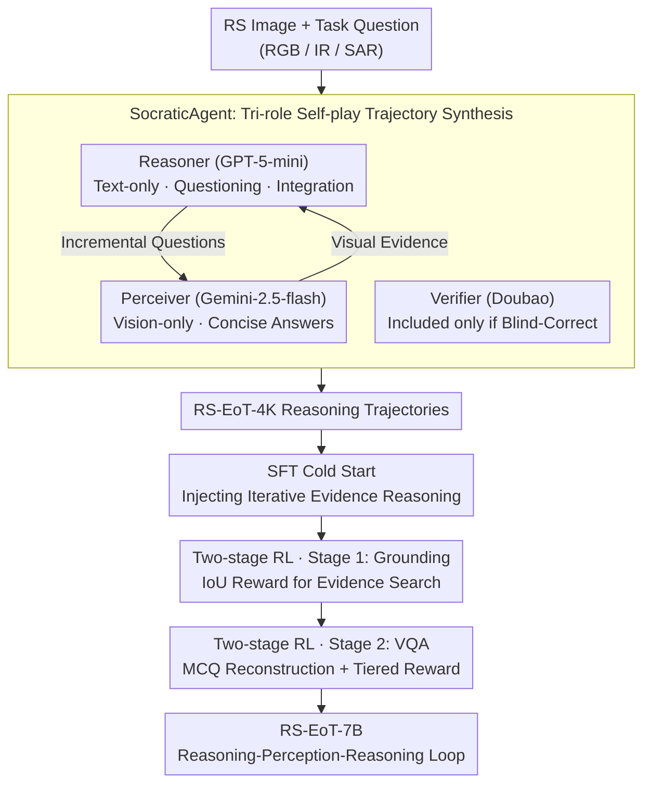

# Asking like Socrates: Socrates helps VLMs understand remote sensing images

**Conference**: CVPR 2026  
**arXiv**: [2511.22396](https://arxiv.org/abs/2511.22396)  
**Code**: [https://geox-lab.github.io/Asking_like_Socrates](https://geox-lab.github.io/Asking_like_Socrates)  
**Area**: Remote Sensing / Multimodal Reasoning  
**Keywords**: Remote Sensing Image Understanding, Chain-of-Evidence Reasoning, Pseudo-reasoning, Socratic Method, Two-stage Reinforcement Learning

## TL;DR
This work reveals the "pseudo-reasoning" phenomenon in remote sensing VLMs (where explicit reasoning chains lead to performance degradation), attributed to the "glance effect" (insufficient single coarse-grained perception). It proposes the RS-EoT (Evidence-of-Thought) iterative evidence search paradigm. The method uses SocraticAgent self-play to synthesize reasoning trajectories for SFT cold startup, followed by two-stage progressive RL (grounding → VQA) for enhancement and generalization. RS-EoT-7B achieves SOTA on multiple remote sensing VQA and grounding benchmarks.

## Background & Motivation

**Background**: Deep reasoning models (DeepSeek-R1 style SFT-RL paradigm) have achieved breakthroughs in mathematics/code and have been extended to multimodal domains (Vision-R1, WeThink, R1-OneVision, etc.). However, anomalous phenomena occur in remote sensing tasks.

**Limitations of Prior Work**: Remote sensing VLMs generate explicit reasoning chains, but performance **stagnates or decreases**. Models merely "narrate the reasoning process" rather than performing "actual reasoning."

**Glance Effect**: Remote sensing images involve large spatial extents, significant scale variations, and sparse, subtle visual cues. Models start reasoning after a single coarse perception ("glance") $\rightarrow$ based on incomplete visual evidence $\rightarrow$ reasoning degrades into linguistically self-consistent narration rather than logic grounded in visual evidence.

**Key Challenge**: Remote sensing reasoning requires iterative, non-static evidence acquisition, yet existing models adopt a "glance-and-reason" paradigm. Human remote sensing analysts utilize repeated check-refinement loops.

**Key Insight**: RS-EoT — Let reasoning guide perception, dynamically searching for new visual evidence during the reasoning process (reasoning $\rightarrow$ perception $\rightarrow$ reasoning $\rightarrow$ perception... loop), rather than relying on a fixed initial perspective.

## Method

### Overall Architecture
To address "pseudo-reasoning," RS-EoT replaces "glance-and-reason" with an iterative "reasoning $\rightarrow$ evidence search $\rightarrow$ re-reasoning" loop. The reasoning process drives perception to find new evidence as needed.

The pipeline consists of three steps to produce RS-EoT-7B (base: Qwen2.5-VL-7B). Step 1 is SFT cold startup: a three-role self-play SocraticAgent synthesizes reasoning trajectories featuring iterative evidence search (RS-EoT-4K dataset). This is followed by two-stage progressive RL—Stage 1 utilizes IoU rewards on grounding tasks to sharpen evidence search capabilities, and Stage 2 generalizes these capabilities to general remote sensing VQA.

### Key Designs

**1. SocraticAgent: Tri-role Self-play for Iterative Evidence Search Trajectories**

The SocraticAgent synthesizes trajectories using three roles: The Reasoner (GPT-5-mini) only reads text and manages reasoning/questioning; the Perceiver (Gemini-2.5-flash) only sees the image and answers specific questions; the Verifier (Doubao-seed-1.6-thinking) ensures that if the blind Reasoner can reach the correct answer through the dialogue, the evidence is reliable. This "information isolation" decouples reasoning from perception. Self-play prompts (e.g., telling the Reasoner the Perceiver is "weak") force the decomposition of complex tasks into incremental questions, resulting in the RS-EoT-4K dataset.

**2. Two-stage Progressive RL: Grounding First, VQA Generalization Second**

Stage 1 uses grounding tasks because they require precise, iterative visual evidence search. Rewards utilize IoU scores and format rewards based on DIOR-RSVG and VRSBench data. Stage 2 generalizes to general VQA. To prevent reward hacking in simple Yes/No questions, Multiple-Choice Question (MCQ) reconstruction is used, forcing the model to verify each option. The hierarchical reward is defined as:

$$r_{qa} = 1 - \frac{1}{N}\sum_i |y_i - \hat{y}_i|$$

**3. RS-EoT Paradigm: Language-Driven Reasoning and On-demand Evidence**

The paradigm follows two principles: reasoning is driven by natural language as a "control signal" for perception, and visual information serves as on-demand evidence. This replaces the "glance" with iterative evidence acquisition to eliminate pseudo-reasoning.

### Loss & Training
SFT uses RS-EoT-4K (5 epochs, lr=3e-5). Both RL stages employ GRPO (2 epochs each, lr=1e-6, batch=512) based on Qwen2.5-VL-7B.

## Key Experimental Results

### Main Results (RS VQA + Grounding)

| Benchmark | Metric | RS-EoT-7B | Qwen2.5VL | WeThink | VL-Rethinker | Geo-R1 |
|------|------|-----------|-----------|---------|-------------|--------|
| RSFG-VQA | Avg@5 | **67.85** | 62.45 | 55.04 | 58.80 | 45.03 |
| RSFG-SC | Object@F1 | **56.52** | 36.78 | 38.35 | 34.84 | 20.82 |
| VRSBench | Avg@5 | **63.09** | 62.45 | 62.17 | 55.04 | 57.00 |
| RSVQA | Avg@5 | **75.16** | 67.20 | 40.74 | 65.57 | 34.50 |
| DIOR-RSVG | mIoU | **45.29** | 35.64 | 33.96 | 25.48 | 20.97 |
| VRSBench-Ref | mIoU | **48.04** | 21.99 | 34.07 | 25.29 | 4.51 |

RS-EoT-7B achieves **SOTA across all VQA and Grounding tasks**, notably improving Object@F1 from 36.78 to 56.52 (+53.7%) and Grounding mIoU from 35.64 to 45.29 (+27.1%).

### Ablation Study

| Stage | RSFG-VQA | DIOR mIoU | Explanation |
|------|----------|-----------|------|
| Qwen2.5-VL Baseline | 62.45 | 35.64 | No reasoning |
| + SFT Cold Start | + Gain | + Gain | Injection of RS-EoT mode |
| + RL-Grounding | + Further Gain | **Massive Gain** | Enhanced evidence search |
| + RL-VQA | **Optimal** | Maintained | Generalization to VQA |

### Key Findings
- **Quantification of Pseudo-reasoning**: Reasoning models like WeThink performed worse than non-reasoning baselines on RS tasks, confirming the issue.
- Attention map analysis shows clear alternating cycles of "reasoning $\rightarrow$ evidence search $\rightarrow$ reasoning."
- Grounding RL exhibits positive transfer to VQA tasks.
- MCQ reconstruction effectively avoids reward hacking.

## Highlights & Insights
- **Diagnosis of Pseudo-reasoning**: Systematically identifies and explains why reasoning can decrease performance in RS VLMs.
- **SocraticAgent Mechanism**: The "mutual depreciation" prompt strategy effectively decouples reasoning and perception for high-quality data synthesis.
- **Progressive RL Strategy**: Starting with the most difficult evidence-seeking task (grounding) before generalizing to VQA follows an intuitive skill-learning curriculum.
- **MCQ Reconstruction**: A practical solution to reward hacking in RS RL training with simple ground-truth labels.

## Limitations & Future Work
- The current loop is within the language domain; it does not yet explicitly crop image sub-regions.
- SocraticAgent relies on expensive APIs for data synthesis.
- Scaling effects for models larger than 7B are not yet verified.
- Expansion to hyperspectral and other modalities is needed.

## Related Work & Insights
- **vs Geo-R1/VHM-RL**: These use SFT-RL but rely on single global perception, leading to pseudo-reasoning in RS. RS-EoT solves this through iterative search.
- **vs EagleVision**: RS-EoT shares the "reasoning-driven perception" philosophy but applies it to iterative local evidence search within single remote sensing images.

## Rating
- Novelty: ⭐⭐⭐⭐⭐ 
- Experimental Thoroughness: ⭐⭐⭐⭐⭐ 
- Writing Quality: ⭐⭐⭐⭐⭐ 
- Value: ⭐⭐⭐⭐⭐

## Related Papers

- [\[CVPR 2026\] Token Warping Helps MLLMs Look from Nearby Viewpoints](token_warping_helps_mllms_look_from_nearby_viewpoints.md)
- [\[NeurIPS 2025\] CHOICE: Benchmarking the Remote Sensing Capabilities of Large Vision-Language Models](../../NeurIPS2025/multimodal_vlm/choice_benchmarking_the_remote_sensing_capabilities_of_large_vision-language_mod.md)
- [\[CVPR 2026\] Enhancing Video Vision Language Model with Hippocampal Sensing](enhancing_video_vision_language_model_with_hippocampal_sensing.md)
- [\[CVPR 2026\] A More Word-like Image Tokenization for MLLMs](a_more_word-like_image_tokenization_for_mllms.md)
- [\[CVPR 2026\] CLIP-like Model as a Foundational Density Ratio Estimator](clip-like_model_as_a_foundational_density_ratio_estimator.md)

<!-- RELATED:END -->

<!-- RELATED:START -->

## Related Papers

- [\[CVPR 2026\] SegEarth-R2: Towards Comprehensive Language-guided Segmentation for Remote Sensing Images](segearth-r2_towards_comprehensive_language-guided_segmentation_for_remote_sensin.md)
- [\[ECCV 2024\] Masked Angle-Aware Autoencoder for Remote Sensing Images](../../ECCV2024/remote_sensing/masked_angle-aware_autoencoder_for_remote_sensing_images.md)
- [\[CVPR 2026\] GeoCoT: Towards Reliable Remote Sensing Reasoning with Manifold Perspective](geocot_towards_reliable_remote_sensing_reasoning_with_manifold_perspective.md)
- [\[CVPR 2026\] ChangeBridge: Spatiotemporal Image Generation with Multimodal Controls for Remote Sensing](changebridge_spatiotemporal_image_generation_with_multimodal_controls_for_remote.md)
- [\[CVPR 2026\] RECS4R: Bridging Semantics and Geometry for Referring Remote Sensing Interpretation](recs4r_bridging_semantics_and_geometry_for_referring_remote_sensing_interpretati.md)

<!-- RELATED:END -->
