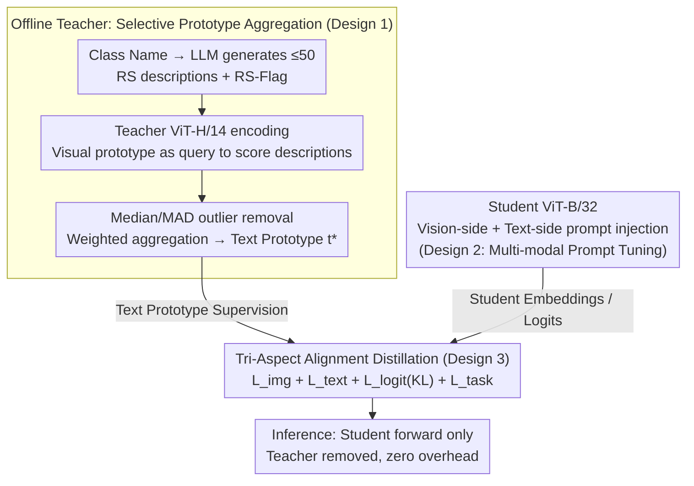

# AVION: Aerial Vision-Language Instruction from Offline Teacher to Prompt-Tuned Network

**Conference**: CVPR 2026  
**arXiv**: [2603.12659](https://arxiv.org/abs/2603.12659)  
**Code**: [https://github.com/yuhu990424/AVION](https://github.com/yuhu990424/AVION)  
**Area**: Remote Sensing / Vision-Language Models  
**Keywords**: Remote Sensing, Knowledge Distillation, prompt tuning, Vision-Language Models, Cross-modal Retrieval

## TL;DR

AVION proposes a knowledge distillation framework that utilizes semantic-rich remote sensing text prototypes generated by an LLM as a Teacher for supervision. Simultaneously, it injects learnable prompts into both the vision and text encoders of the Student model to achieve tri-aspect alignment distillation. It significantly outperforms existing PEFT methods in few-shot classification and cross-modal retrieval.

## Background & Motivation

**Background**: Remote-sensing-specific VLMs such as RemoteCLIP and GeoRSCLIP exhibit excellent performance on downstream tasks, but full fine-tuning is extremely costly. PEFT methods (e.g., CoOp, MaPLe) adapt to new tasks by learning only a small number of parameters.

**Limitations of Prior Work**: (1) **Semantic Poverty**—Remote sensing datasets typically only provide class name labels (e.g., "airport"), which fail to describe the massive visual variance within the same class (across different regions, seasons, and sensors). (2) **Visual Rigidity**—Most PEFT methods only update text-side prompts while freezing the visual encoder, failing to capture remote sensing-specific characteristics such as top-down perspectives and scale variations.

**Key Challenge**: The gap between simple class names and the rich visual patterns of remote sensing images, as well as the inability of frozen visual encoders to adapt to the remote sensing domain.

**Goal**: To address both semantic poverty and visual rigidity simultaneously, allowing PEFT methods to function effectively in remote sensing scenarios.

**Key Insight**: Leverage rich class descriptions generated by LLMs as text-side supervision and achieve robust adaptation through vision-text-logit tri-aspect distillation constraints.

**Core Idea**: Enrich text prototypes with LLMs to solve semantic poverty, utilize dual-ended prompts + tri-aspect distillation to address visual rigidity, and employ a Teacher-Student framework to ensure zero extra overhead during inference.

## Method

### Overall Architecture

AVION addresses the contradiction where "remote sensing data only provides class name labels" but "PEFT only modifies the text side" by distilling rich knowledge from a large offline Teacher model into a smaller Student model. The workflow consists of three stages: In the offline stage, the GeoRSCLIP ViT-H/14 Teacher model encodes semantic descriptions generated by an LLM for each class; after verification against visual prototypes, these are aggregated into high-quality text prototypes $\mathbf{t}_k^{T*}$. This step is performed once and results are cached. In the training stage, the GeoRSCLIP ViT-B/32 Student model injects learnable prompts into both vision and text encoders, supervised by the Teacher’s text prototypes and visual embeddings across vision, text, and logit dimensions. In the inference stage, only the Student model is used for forward passes, and the Teacher is entirely removed, ensuring zero deployment overhead. The data flow across these stages is illustrated below:

### Key Designs

**1. Selective Prototype Aggregation: Ensuring LLM descriptions reflect RS vision rather than hallucinations**

Remote sensing datasets often contain simple class names like "airport," which do not capture the visual variance across regions, seasons, and sensors. The first step involves using Gemini 2.5 Flash to generate up to 50 remote sensing descriptions per class, each accompanied by an RS-Flag. Since LLMs may produce non-visual or irrelevant sentences, AVION uses the Teacher’s visual prototype as a reference: it first calculates the visual prototype $\hat{\mathbf{v}}_k^T = \frac{1}{|\mathcal{B}_k|}\sum_i \mathbf{v}_{k,i}^T$ for a class, and then computes the similarity $s_{k,j} = (\hat{\mathbf{v}}_k^T)^\top \mathbf{t}_{k,j}^T$ for each description. Outliers are removed via Median/MAD z-scores, and the remaining descriptions are aggregated using weights:

$$w_{k,j} \propto \exp(\beta s_{k,j} + \gamma \cdot \text{RS-Flag}_{k,j})$$

Conceptually, this acts as a parameter-free cross-attention mechanism where the visual prototype is the query and text descriptions are key/values. Descriptions that fit the actual visual data and are flagged as RS-relevant receive higher weights.

**2. Multi-modal Prompt Tuning: Enabling the "eyes" to adapt to remote sensing**

Most PEFT methods only learn text-side prompts and freeze the visual encoder, which prevents the model from capturing remote sensing-specific top-down views and scale changes. AVION injects prompts at both ends: the text side follows the CoOp approach with learnable context tokens, while the visual side follows VPT by inserting prompt tokens into every layer of the ViT. This allows the visual encoder to adapt to RS-specific tilts and scales while keeping the backbone frozen, maintaining low PEFT costs.

**3. Tri-Aspect Alignment: Aligning inter-class relationships beyond embeddings**

To supervise the Student properly, AVION aligns features across three dimensions: visual embeddings are aligned via $\mathcal{L}_{\text{img}} = 1 - (\mathbf{v}_i^S)^\top \mathbf{v}_i^T$, text prototypes via $\mathcal{L}_{\text{text}} = 1 - (\mathbf{t}_k^S)^\top \mathbf{t}_k^{T*}$, and cross-modal similarity distributions via KL distillation:

$$\mathcal{L}_{\text{logit}} = \tau^2 \, \text{KL}\!\left(\sigma(\mathbf{s}^T/\tau) \,\|\, \sigma(\mathbf{s}^S/\tau)\right)$$

at temperature $\tau=2$. While the first two terms align individual class representations, logit distillation transfers information regarding how similar an image is to all classes. This enables the Student to learn the inter-class structural manifold, preventing performance degradation on novel classes. The total loss is $\mathcal{L} = \mathcal{L}_{\text{task}} + 0.5\mathcal{L}_{\text{img}} + 0.5\mathcal{L}_{\text{text}} + \mathcal{L}_{\text{logit}}$, with a linear warmup for the logit term during the first 30% of training.

### Loss & Training

Training is conducted using AdamW with a learning rate of 5e-4. The few-shot setting runs for 100 epochs, while the base-to-novel setting runs for 50 epochs. The distillation temperature is fixed at $\tau=2$. The logit alignment weight is set to 1 with a linear warmup for the first 30% of steps, while vision and text alignment weights are set to 0.5 each. These are optimized jointly with the task-specific cross-entropy loss.

## Key Experimental Results

### Main Results (Average few-shot classification accuracy across 6 datasets)

| Method | 1-shot | 2-shot | 4-shot | 8-shot | 16-shot |
|------|--------|--------|--------|--------|---------|
| GeoRSCLIP (zero-shot) | 72.95 | — | — | — | — |
| CoOp | 69.98 | 78.95 | 84.52 | 87.57 | 90.24 |
| CoCoOp | 70.27 | 80.56 | 85.74 | 88.93 | 91.41 |
| MMRL | 70.57 | 79.47 | — | — | — |
| **AVION** | **73.12** | **82.34** | **87.21** | **90.48** | **92.85** |

### Ablation Study (AID dataset 16-shot)

| Configuration | Base Acc | Novel Acc | HM | Remarks |
|------|----------|-----------|------|------|
| AVION (Complete) | 95.2 | 88.7 | 91.8 | Only method exceeding baseline in both base and novel |
| w/o Text Alignment | 94.1 | 85.3 | 89.5 | Text prototype supervision is key for novel class generalization |
| w/o Vision Prompt | 94.8 | 86.1 | 90.3 | Vision-side prompts improve domain adaptation |
| w/o Logit Alignment | 94.5 | 87.2 | 90.7 | Logit distillation provides inter-class relationships |
| w/o RS-Flag | 94.9 | 87.5 | 91.1 | RS flag filtering improves prototype quality |

### Key Findings
- AVION is the only method to exceed the GeoRSCLIP zero-shot baseline in both base and novel categories in a base-to-novel setup, demonstrating that distillation does not impair generalization.
- Both RS-Flag and visual verification are essential for text prototype aggregation; removing either leads to a drop in Novel Acc.
- Improvements in Mean Recall (mR) for cross-modal retrieval indicate that tri-aspect distillation improves overall modality alignment.

## Highlights & Insights
- **Precise diagnosis of semantic poverty**: Identifying that simple class names are the root cause of PEFT failure in RS datasets is crucial, and LLM-based description enrichment provides an elegant solution.
- **Clever aggregation mechanism**: Using visual prototypes as queries for text descriptions effectively acts as a parameter-free cross-attention, filtering low-quality descriptions.
- **Tri-aspect distillation preserves generalization**: Aligning logits preserves the structural relationship between classes, which is the key reason why AVION does not regress on novel classes.

## Limitations & Future Work
- Performance depends on LLM description quality; non-English or highly specialized RS categories might yield lower-quality descriptions.
- The Teacher model is fixed as GeoRSCLIP ViT-H/14; changing backbones requires re-constructing prototypes.
- Validation is currently limited to classification/retrieval; more complex RS downstream tasks like detection or segmentation remain to be explored.

## Related Work & Insights
- **vs CoOp/CoCoOp**: These methods only learn text prompts and lack rich semantic supervision, and are severely limited by "semantic poverty" in RS.
- **vs PromptKD**: Albeit using distillation for prompts, PromptKD relies on unlabeled image logits and does not address text-side semantic poverty.
- **vs MaPLe**: While MaPLe also uses dual-ended prompts, it lacks LLM-based text enhancement and selective aggregation.

## Rating
- Novelty: ⭐⭐⭐⭐ Accurate diagnosis and systemic solution.
- Experimental Thoroughness: ⭐⭐⭐⭐ Six datasets + three task settings + comprehensive ablation.
- Writing Quality: ⭐⭐⭐⭐ Clear motivation and well-designed visuals.
- Value: ⭐⭐⭐⭐ A practical scheme for RM VLM adaptation.

<!-- RELATED:START -->

- **GeoRSCLIP**: [arXiv:2403.01353](https://arxiv.org/abs/2403.01353) (Strong baseline for Remote Sensing VLM)
- **CoOp**: [arXiv:2109.01134](https://arxiv.org/abs/2109.01134) (Original text prompt tuning)
- **MaPLe**: [arXiv:2210.03117](https://arxiv.org/abs/2210.03117) (Multi-modal prompt tuning foundation)

<!-- RELATED:END -->

## Related Papers

- [\[CVPR 2026\] LookasideVLN: Direction-Aware Aerial Vision-and-Language Navigation](lookasidevln_direction-aware_aerial_vision-and-language_navigation.md)
- [\[CVPR 2026\] VLM4RSDet: Collaborative Optimization with Vision-Language Model for Enhancing Remote Sensing Object Detection](vlm4rsdet_collaborative_optimization_with_vision-language_model_for_enhancing_re.md)
- [\[CVPR 2026\] CF-IPT: Cross-Modal Fusion Interactive Prompt Tuning of Vision-Language Pre-Trained Model for Multisource Remote Sensing Data Classification](cf-ipt_cross-modal_fusion_interactive_prompt_tuning_of_vision-language_pre-train.md)
- [\[CVPR 2026\] GeoDiT: A Diffusion-based Vision-Language Model for Geospatial Understanding](geodit_a_diffusion-based_vision-language_model_for_geospatial_understanding.md)
- [\[CVPR 2026\] ZoomEarth: Active Perception for Ultra-High-Resolution Geospatial Vision-Language Tasks](zoomearth_active_perception_for_ultra-high-resolution_geospatial_vision-language.md)

<!-- RELATED:END -->
