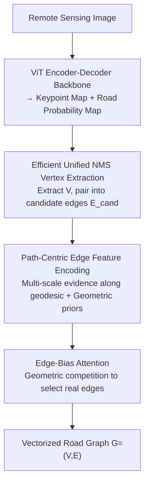

# Beyond Endpoints: Path-Centric Reasoning for Vectorized Off-Road Network Extraction

**Conference**: CVPR 2026  
**Paper**: [CVF Open Access](https://openaccess.thecvf.com/content/CVPR2026/html/Guan_Beyond_Endpoints_Path-Centric_Reasoning_for_Vectorized_Off-Road_Network_Extraction_CVPR_2026_paper.html)  
**Code**: Yes (The paper states it will be open-sourced with the dataset; see the paper for the repository URL)  
**Area**: Remote Sensing / Vectorized Road Network Extraction  
**Keywords**: Off-road extraction, Path-centric reasoning, Vectorized road network, Geodesic features, Remote sensing imagery  

## TL;DR
Addressing the frequent fragmentation and incorrect connections of urban road models in wilderness/off-road scenarios, this paper proposes "path-centric" connectivity reasoning. Instead of relying solely on local features of two endpoints, the method samples multi-scale road evidence along the entire geodesic of candidate edges to determine connectivity. The authors also release WildRoad, the first intercontinental vectorized off-road road dataset, achieving SOTA on off-road benchmarks while generalizing well to urban datasets.

## Background & Motivation
**Background**: Vectorized road network extraction (directly outputting graph structures of nodes and edges from satellite/aerial imagery rather than pixel masks) has reached a high level with single-shot methods like SAM-Road and SAM-Road++, which perform strongly on urban benchmarks such as City-Scale, SpaceNet, and Global-Scale.

**Limitations of Prior Work**: Directly applying models trained on urban data to off-road/wilderness scenarios leads to severe degradation, resulting in fragmented graphs, incorrect intersection topologies, and missed low-contrast narrow dirt roads. This is due to: (1) The lack of large-scale **vectorized** off-road datasets (datasets like DeepGlobe only provide binary masks, which are unsuitable for topological evaluation); (2) Structural weaknesses in mainstream methods.

**Key Challenge**: The SAM-Road series adopts a **node-centric** paradigm—inferring connectivity features only at sparse endpoints. In off-road scenarios, roads are often obscured by tree shadows, and intersections lack clear geometric structures, making endpoint features **similar and ambiguous**. As shown in Fig.1(b), endpoint features for two different candidate pairs might be equally plausible, making it impossible for the model to distinguish real roads from false connections using endpoints alone.

**Goal**: (1) Fill the gap in vectorized off-road datasets; (2) Design a connectivity reasoning mechanism robust to occlusions and ambiguous intersections.

**Key Insight**: Evidence for whether an edge should be connected is distributed **along the entire path**, not just at the endpoints. Following a candidate edge, a real road provides continuous evidence, whereas a false connection will show "cliffs" or gaps in road probability.

**Core Idea**: Shift connectivity reasoning from "endpoints-only" to "multi-scale evidence sampling along the geodesic" (path-centric), using path-length statistics instead of endpoint features for connection decisions.

## Method

### Overall Architecture
The proposed MaGRoad (Mask-aware Geodesic Road network extractor) is a single-shot vectorized extraction pipeline. Inputting high-resolution remote sensing imagery, it outputs a road graph $G=(V,E)$. The process involves: a ViT encoder-decoder backbone (SAM pre-trained ViT-B) first predicts a **keypoint probability map** and a **road probability map**. Vertices $V$ are extracted from these masks via NMS and paired into candidate edges $E_{cand}$ based on proximity. The core module, **MaGTopoNet**, calculates connectivity scores for each candidate edge by fusing geometric features with multi-scale path features sampled along the route. Finally, an attention classifier with geometric competition bias outputs the verified edge set $E$. An **interactive prompt branch** is used solely for data labeling (encoding user clicks as spatial prompts) and does not participate in inference.

### Key Designs

**1. Path-Centric Edge Feature Encoding: Replacing Endpoint Features with Path Evidence**

Addressing the "ambiguous and inseparable" nature of endpoint features, MaGTopoNet calculates connectivity based on two complementary signals: **geodesic path features** and **geometric priors**.

For path features, the predicted road mask $M_{road}\in[0,1]^{H\times W}$ is processed with average pooling at scales $\{3,9,15\}$ to generate $L=3$ scales for robustness against noise. Along the linear segment connecting endpoints $s=(x_s,y_s)$ and $t=(x_t,y_t)$, $N_s=32$ points $\{p_i\}$ are **uniformly sampled**, and probability values $P_i^\ell$ are extracted via bilinear interpolation. Three statistics are calculated per scale:

$$\mu_{st}^\ell=\frac{1}{N_s}\sum_{i=1}^{N_s}P_i^\ell,\quad \sigma_{st}^\ell=\sqrt{\frac{1}{N_s}\sum_{i=1}^{N_s}(P_i^\ell-\mu_{st}^\ell)^2},\quad \text{softmin}_{st}^\ell=-\frac{1}{\tau}\log\sum_{i=1}^{N_s}\exp\big(-\tau(1-P_i^\ell)\big)$$

Where $\mu$ measures average traversability, $\sigma$ measures consistency (low values indicate uniform probability), and $\text{softmin}$ ($\tau=5.0$) specifically **amplifies bottleneck points**. Any low-probability segment along the path (e.g., a break) significantly penalizes the score. Concatenating across scales yields $f_{path}^{st}\in\mathbb{R}^{3L}$. This allows the model to distinguish pairs that are indistinguishable at endpoints but differ along the path.

Geometric features encode spatial attributes: normalized offsets $\Delta x, \Delta y$, Euclidean distance $d_{st}$, and azimuth $\theta_{st}$ encoded via Fourier features $\{\sin(m\theta),\cos(m\theta)\}_{m=1}^4$, resulting in $f_{geo}^{st}\in\mathbb{R}^{11}$.

**2. Edge-Bias Attention: Introducing Geometric Competition for Sparse Selection**

Multiple candidate edges often originate from the same source vertex. To select the "correct" connection, self-attention is applied **within the candidate set of each source vertex**. Edge tokens (concatenated $f_{geo}$ and $f_{path}$) are projected to $D_h=256$. An additive bias matrix $B$ is added to the attention:

$$A=\text{softmax}\Big(\frac{QK^\top}{\sqrt{d}}+B\Big),\qquad B_{ij}=-\lambda_{comp}\,\mathbb{I}[i\neq j]$$

The bias $B$ imposes a uniform negative penalty on all non-diagonal elements (i.e., between different candidate edges). This **competition term** discourages multiple candidates from being activated simultaneously, encouraging sparse selection and suppressing false pairings.

**3. Efficient Unified NMS: 2.5× Acceleration via Integrated Suppression**

Prior methods (SAM-Road++) performed NMS on keypoint masks and road masks separately, then again after merging. MaGRoad unifies this into a **single-pass NMS** by concatenating candidates and adding a $+0.9$ score bias to keypoints to ensure their priority. The NMS inner loop is rewritten using **scalar operations** to avoid the overhead of heavy array allocations and fancy indexing, achieving significant acceleration on the WildRoad dataset.

**4. WildRoad Dataset and Interactive Labeling Pipeline**

The authors developed an **interactive labeling pipeline** where annotators provide sparse clicks at intersections. An interactive prompt branch generates an initial road graph draft, which is then refined manually. Using **bootstrapping** (iteratively training on corrected drafts), the authors produced WildRoad: 221 high-resolution images (0.3 m/px) covering 2,100 km² across six continents, including forests, farmlands, deserts, and mountains.

### Loss & Training
The backbone uses a SAM pre-trained ViT-B. The segmentation branch uses Dice + Weighted BCE (positive weight 10), and the topology head uses standard BCE. Optimized via Adam with a learning rate of 1e-3 for random components and 1e-4 for the pre-trained ViT, decaying by 0.1 at 80% epochs.

## Key Experimental Results

### Main Results (WildRoad Off-Road Benchmark)
Metrics include APLS (path length similarity) and TOPO (precision, recall, F1).

| Method | P↑ | R↑ | F1↑ | APLS↑ | Inf. (min)↓ |
|--------|----|----|-----|-------|-------------|
| Sat2Graph | 83.92 | 57.50 | 68.11 | 48.73 | 133.1 |
| SAM-Road | 87.20 | 68.65 | 76.61 | 68.71 | 73.3 |
| SAM-Road++ | 87.52 | 68.69 | 76.74 | 69.72 | 76.1 |
| **MaGRoad** | **88.45** | 71.48 | 78.85 | **72.56** | 74.9 |
| MaGRoad-fast| 90.93 | 75.43 | **82.22** | 69.29 | **27.8** |

MaGRoad outperforms SAM-Road++ in F1 and APLS. MaGRoad-fast achieves a significant F1 boost and 2.5× speedup through efficient vertex extraction, albeit with a slight drop in APLS.

### Ablation Study
Analysis of features: Node (N), Path (P), Geometry (G), and Edge Bias Attention (E).

| Exp | Config | F1↑ | APLS↑ | Notes |
|-----|--------|-----|-------|-------|
| 1 | N only | 74.27 | 53.90 | Node-centric baseline |
| 4 | N+G | 71.24 | 63.07 | Removing P causes ~10pt APLS drop |
| 5 | P+G | 75.36 | 68.10 | Removing E leads to drop |
| 6 | **P+G+E (Full)** | **78.85** | **72.56** | Complete path-centric model |
| 8 | N+P+G+E | 77.23 | 69.07 | Adding N back degrades performance |

### Key Findings
- **Path features are critical**: Removing path evidence (P) leads to a substantial performance collapse, proving that along-path evidence is key for off-road topology.
- **Path-centric > Node-centric**: Explicit path signals are more reliable than implicit endpoint features in visually ambiguous scenes.
- **Multiple scales are essential**: Kernels $\{3,9,15\}$ provide the best balance between detail and context, outperforming single-scale setups.

## Highlights & Insights
- **Bottleneck detection via softmin**: Using the softmin statistic to amplify low-probability "cliffs" effectively identifies false connections that appear valid at the endpoints.
- **Geometric competition bias**: The additive negative bias in attention is a lightweight yet effective prior for encouraging sparse edge selection.
- **Paradigm Shift**: Moving connectivity reasoning from endpoints to the entire path addresses the fundamental ambiguity of off-road road extraction.

## Limitations & Future Work
- **Linear sampling**: Though termed "geodesic," current implementation samples along **straight lines**, which may fail for highly curved roads.
- **Dataset Scale**: WildRoad, while high-quality, is relatively small (221 images) compared to massive urban datasets.
- **Mask Dependency**: Path-centric reasoning relies on the quality of the initial segmentation. If the mask is entirely incorrect in low-texture areas, path evidence fails.

## Related Work & Insights
Compared to **node-centric** methods (SAM-Road), MaGRoad is more robust to occlusions and ambiguous intersections by aggregating evidence along the path. Unlike **iterative** methods (RoadTracer), it uses a single-shot parallel scoring approach, avoiding cumulative errors and improving speed.

## Rating
- Novelty: ⭐⭐⭐⭐⭐ 
- Experimental Thoroughness: ⭐⭐⭐⭐ 
- Writing Quality: ⭐⭐⭐⭐ 
- Value: ⭐⭐⭐⭐ 

<!-- RELATED:START -->

<!-- RELATED:END -->

## Related Papers

- [\[CVPR 2026\] RoadGIE: Towards A Global-Scale Aerial Benchmark for Generalizable Interactive Road Extraction](roadgie_towards_a_global-scale_aerial_benchmark_for_generalizable_interactive_ro.md)
- [\[CVPR 2026\] GeoCoT: Towards Reliable Remote Sensing Reasoning with Manifold Perspective](geocot_towards_reliable_remote_sensing_reasoning_with_manifold_perspective.md)
- [\[CVPR 2026\] MOGeo: Beyond One-to-One Cross-View Object Geo-localization](mogeo_beyond_one-to-one_cross-view_object_geo-localization.md)
- [\[ICML 2025\] Neural Augmented Kalman Filters for Road Network Assisted GNSS Positioning](../../ICML2025/remote_sensing/neural_augmented_kalman_filters_for_road_network_assisted_gnss_positioning.md)
- [\[CVPR 2026\] Beyond Tie Points: Satellite Image Block Adjustment based on Dense Feature Consistency](beyond_tie_points_satellite_image_block_adjustment_based_on_dense_feature_consis.md)

<!-- RELATED:END -->
