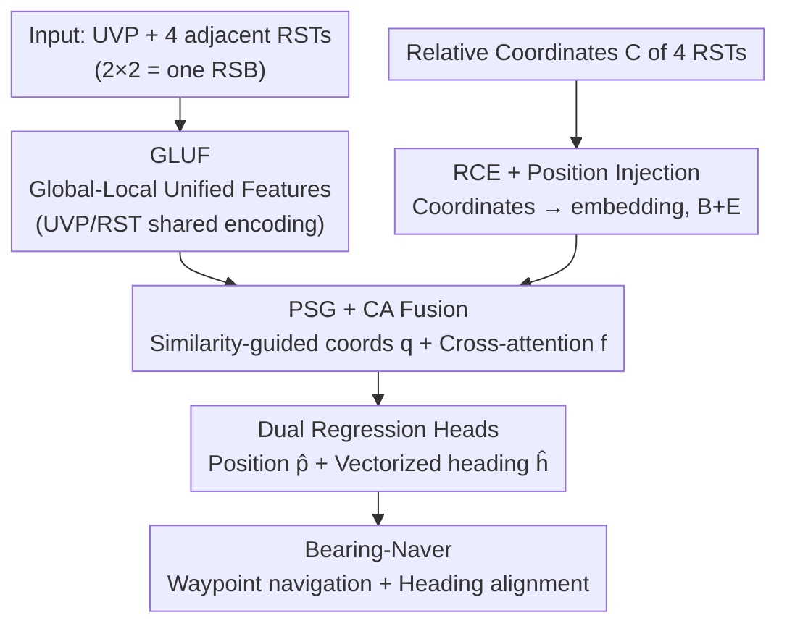

# Beyond Matching to Tiles: Bridging Unaligned Aerial and Satellite Views for Vision-Only UAV Navigation

**Conference**: CVPR 2026  
**Paper**: [CVF Open Access](https://openaccess.thecvf.com/content/CVPR2026/html/Liu_Beyond_Matching_to_Tiles_Bridging_Unaligned_Aerial_and_Satellite_Views_CVPR_2026_paper.html)  
**Code**: https://github.com/liukejia121/bearinguav  
**Area**: Remote Sensing / Cross-View Geo-localization  
**Keywords**: Cross-View Geo-localization, UAV Navigation, Joint Position-Heading Regression, Cross-Attention, GNSS-denied  

## TL;DR
Bearing-UAV abandons the "matching a UAV view to a specific satellite tile" paradigm. Instead, it utilizes 4 adjacent satellite tiles and 1 UAV view to directly **regress** the absolute coordinates and heading angle of the UAV. In scenarios with misalignment, sparse features, and cross-view discrepancies, it reduces errors by an order of magnitude compared to retrieval/matching methods (UAV view MLE reduced from ~30 m to 8.6 m) and integrates heading prediction into end-to-end navigation.

## Background & Motivation

**Background**: In GNSS-denied environments, Cross-View Geo-Localization (CVGL) is a mainstream route for UAV vision-only navigation—matching low-altitude oblique views from onboard cameras with georeferenced satellite tiles. Existing methods follow the matching-to-tile (M2T) paradigm, categorized into two types: one repeatedly encodes onboard satellite tiles using deep models for matching, which is computationally expensive and incurs storage costs that grow quadratically with area; the other pre-encodes satellite tiles into lightweight discrete feature vectors for similarity retrieval, saving storage and computation but limiting localization accuracy by tile/grid density.

**Limitations of Prior Work**: The M2T paradigm suffers from three unavoidable issues. First, there is a **natural trade-off between accuracy and storage/computation**—improving accuracy requires dense tile coverage, which consumes storage; saving resources requires coarsening the grid, which reduces accuracy. Second, navigation requires not only position but also a reliable **heading** to suppress horizontal rotation drift during long-distance flight, yet almost all CVGL methods only focus on localization; the few works estimating heading (e.g., AngleRobust) are limited to single densely sampled corridors or use a two-stage "localize-then-orient" approach that propagates localization errors to orientation. Third, most existing datasets ignore the **inherent parallax, misalignment, and variable Intersection over Union (IoU)** between UAV views and satellite tiles, making models difficult to generalize to real-world scenarios.

**Key Challenge**: Tying localization accuracy to "matching which tile" essentially approximates continuous real-world positions with discrete tile centers. When misalignment is large or IoU changes, performance collapses, and heading is treated as a secondary step after localization.

**Goal**: (1) Enable localization accuracy to break through tile resolution; (2) Provide heading simultaneously rather than serially; (3) Ensure robustness under misalignment, sparse features, weather changes, and varying tile densities to drive true end-to-end navigation.

**Core Idea**: Instead of matching a single tile, use the **features and relative coordinates of 4 adjacent tiles** as a reference frame to directly regress a bounded, dimensionless relative position and vectorized heading—"Beyond tiles, regress position and heading."

## Method

### Overall Architecture

Bearing-UAV segments satellite maps into 16×16 Remote Sensing Tiles (RST). Any adjacent 2×2 tiles form a Remote Sensing Block (RSB, containing 4 RSTs with fixed relative coordinates at the four corners $\{(-1,1),(-1,-1),(1,1),(1,-1)\}$). Given a UAV View Patch (UVP) falling within an RSB and these 4 RSTs, the model directly regresses the relative coordinates $\hat{\bm p}\in\mathbb{R}^2$ and the heading vector $\hat{\bm h}=(\cos\hat\theta,\sin\hat\theta)$ of the UVP within that RSB. Since the RSB index and the coordinates of the four corners are known, the network only needs to regress a bounded, dimensionless target, then deterministically restores the absolute longitude and latitude using the RSB index—this bypasses the optimization difficulty of "directly regressing high-precision coordinates."

The pipeline consists of three stages: **Feature Extraction** (two GLUF sub-modules with shared parameters encode the UVP and 4 RSTs; RCE encodes the relative coordinates of each RST into embeddings) → **Cross-View Fusion** (coordinate embeddings are injected into RST features, followed by PSG for similarity-guided coordinates and CA for overlap-aware cross-attention) → **Dual Regression Heads** (two independent MLPs output position and heading from the same fused feature). Finally, Bearing-UAV is embedded into the Bearing-Naver navigation scheme for waypoint-by-waypoint flight.

### Key Designs

**1. GLUF: Global-Local Unified Features for Misalignment and Sparse Features**

The challenge stems directly from the cross-view nature—UAV oblique views and satellite orthophotos may only partially overlap at the same location. Relying solely on global descriptors leads to bias from misalignment, while relying only on local points fails in texture-sparse areas. GLUF combines both: first, a backbone (VGG-16 by default) extracts feature maps $\bm F\in\mathbb{R}^{H\times W\times D}$; a non-local block generates semi-global feature maps $\bm X=\mathrm{NLConv}(\bm F)$ capturing long-range dependencies. Following the clustering scheme of SGMNet, $K$ learnable cluster centers $\{\bm a_k\}$ are used for soft assignment of local descriptors $\bm x_p$ at each position—assignment weights $\bm w_p=\mathrm{softmax}([\bm a_k^\top\bm x_p-\|\bm a_k\|_2]_k)$ and similarity $\rho_{k,p}=\mathrm{ReLU}(\bm a_k^\top\bm x_p)$ result in clustered features $\bm X^*_{k,p}=w_{k,p}\,\rho_{k,p}\,\bm x_p$. Aggregating and normalizing over space $\Omega$ yields cluster-level descriptors $\tilde{\bm d}_k$, which are concatenated and normalized into the final GLUF vector:

$$\bm u := \mathrm{norm}\big([\tilde{\bm d}_1 : \cdots : \tilde{\bm d}_K]\big)\in\mathbb{R}^{KD}.$$

This preserves global similarity cues for tile matching while maintaining ordered, position-aware local feature segments for subsequent cross-attention.

**2. RCE + Position Injection: Explicitly Informing the Network of Tile Layouts**

Regression requires the network to know the spatial layout of the 4 RSTs; otherwise, it cannot determine which tile the UVP leans toward. RCE is a lightweight MLP (input dimension $d_0=2$, output $d_L=KD$) that maps the 2D coordinates $\bm c_j$ of each RST relative to the RSB center layer-by-layer: $\bm y_j^{(\ell)}=\sigma(\bm W_\ell^{RCE}\bm y_j^{(\ell-1)}+\bm b_\ell^{RCE})$. The final layer outputs coordinate embeddings $\bm e_j$. Since GLUF vectors are normalized, simple addition is used for position injection: the GLUF tensors $\bm B$ of the 4 RSTs are added to the coordinate embedding tensors $\bm E$, $\tilde{\bm B}:=\bm B+\bm E$. This allows the fusion stage to directly see the relative layout, enabling the model to learn "position-angle" relationships under supervision.

**3. PSG + CA: Similarity-Guided Coordinates + Overlap-Aware Cross-Attention**

The UVP typically overlaps with the 4 RSTs to different degrees. Relying solely on attention might cause drift in sparse areas, so two complementary cues are used. **PSG (Patch Similarity-Guided)** provides a strong prior: it calculates the cosine similarity between the UVP's GLUF vector $\bm u$ and each RST ($\tilde{\bm b}_j$), resulting in weights $\bm\alpha=\mathrm{softmax}([\cos(\bm u,\tilde{\bm b}_j)]_{j=1}^4)$. Weighted summation of the 4 relative coordinates yields similarity-guided coordinates $\bm q:=\sum_j\alpha_j\bm c_j$. **CA (Cross-Attention)** captures fine-grained overlap correspondences: with UVP as the query and 4 RSTs as keys/values, $\bm f:=\mathrm{softmax}(\bm Q\bm K^\top/\sqrt d)\bm V$ allows the model to focus on regions of true overlap. Finally, these are concatenated into the fused feature $\bm\phi:=\mathrm{concat}(\bm u,\bm f,\bm q)\in\mathbb{R}^{KD+KD+2}$.

**4. Dual Regression Heads + Vectorized Heading + Bearing-Naver**

The fused feature $\bm\phi$ is fed into two **independent but parallel** $M$-layer MLP heads to regress position $\hat{\bm p}\in\mathbb{R}^2$ and heading $\hat{\bm h}\in\mathbb{R}^2$. The key design is that the heading **does not regress the raw angle $\hat\theta$, but the direction vector $(\cos\hat\theta,\sin\hat\theta)$**—this avoids the periodic ambiguity of angles (discontinuity at 0° and 360°), providing a continuous, well-posed target. Parallel dual heads allow localization and orientation to be produced synchronously. Bearing-Naver then uses Bearing-UAV to regress $(\hat{\bm p}_i,\hat{\bm h}_i)=\mathcal{F}(\bm I_i^U,\bm B_i,\bm{\mathcal C})$, calculates the azimuth to the next waypoint, and aligns the heading for step-by-step state updates.

### Loss & Training
The dataset is split 7:2:1. Training uses Adam (lr=5×10⁻⁵, batch size 16) for 100 epochs. The loss is a weighted sum of Smooth L1: $L_{sum}=0.8L_p+0.2L_h$. GLUF uses $K=4$ clusters with base dimension $D=256$. RCE layers are $[2,64,256,KD]$. Dual regression MLP dimensions are $[2050,1024,256,64,2]$. Training was conducted on an H100, and Bearing-Naver was deployed on a laptop with an RTX 4000.

## Key Experimental Results

**Bearing-UAV-90K Dataset**: Collected from 4 cities via Google Earth. 2D mode downloaded continuous satellite imagery (4096×4096, 0.25 m/px) split into 16×16 RSTs. 3D mode sampled random camera poses and yaw angles to generate 90k UVPs with fine-grained geo-labels and **heading labels**.

### Main Results (U-S Cross-View Localization and Navigation, excerpt from Tab. 2)

| Method | Recall@1↑ (UAV) | LSR@15↑ (UAV) | MLE↓ (UAV) | MHE↓ (UAV) | SR@20↑ (UAV) | NE↓ (UAV) |
|------|------|------|------|------|------|------|
| University-1652 | 60.20 | 15.11 | 33.15 | – | 0.00 | 602.96 |
| SUES-200 | 66.60 | 15.76 | 30.83 | – | 0.00 | 618.85 |
| DenseUAV | 73.43 | 16.54 | 28.79 | – | 0.00 | 651.93 |
| GTA-UAV | 70.71 | 27.96 | 28.43 | – | 0.00 | 661.91 |
| **Ours (VGG-16)** | **83.17** | **89.36** | **8.61** | 12.90 | **50.00** | 275.61 |
| Ours (VGG-16 + Weather Aug.) | 86.52 | 92.88 | 7.48 | **9.63** | 25.00 | 248.77 |

Localization errors of the four matching/retrieval baselines are around ~30 m because they treat the center of the retrieved tile as the final position. Ours achieves a regression error of 8.6 m (approximately an order of magnitude smaller). All baselines lack heading capability (SR@20 = 0), while our model achieves a navigation Success Rate (SR) of 50%.

### Ablation Study (Data Scale / Multi-City / Weather)

| Experiment | Configuration | Key Findings |
|------|------|----------|
| Data Scale (Fig. 5) | 10% → 100% | Performance improves monotonically, saturating after 60% (54k): UAV MLE < 10 m, MHE < 17°. |
| Multi-City (Tab. 3) | 1/2/3/4 Cities | Performance slightly improves as cities increase from 1 to 4, indicating benefits from geographic diversity. |
| Weather Aug. (Tab. 4) | Diverse conditions | Weather-augmented models outperform baselines across conditions; **lighting augmentation yields the highest gain**. |

### Key Findings
- **Regression vs. Matching**: The core of reducing error from ~30 m to 8.6 m is the paradigm shift to "direct regression of bounded relative coordinates using 4 adjacent tiles."
- **Heading is Critical for Navigation**: Baselines fail navigation (SR=0) with high Navigation Error (NE). With vectorized heading, NE drops to ~250 m.
- **Efficiency**: The model size is 66 MB with 133.5 ms latency, making it the most lightweight among compared methods and suitable for onboard deployment.

## Highlights & Insights
- **Paradigm Shift**: Reformulating cross-view localization from "classification/retrieval" to "regression within a 4-tile reference frame" breaks the accuracy-storage trade-off.
- **Bounded Dimensionless Targets**: Deterministic restoration of coordinates via RSB indices avoids the difficulty of regressing high-precision absolute longitude/latitude.
- **Vectorized Heading**: Using $(\cos\theta, \sin\theta)$ solves periodic ambiguity, a trick widely applicable to angle regression tasks.
- **PSG & CA Complementarity**: Combining strong position priors with fine-grained attention corrections ensures robustness against misalignment.

## Limitations & Future Work
- **Domain Gap**: Data is from **Google Earth**; gaps remains with real UAV camera imaging, motion blur, and temporal differences (no real-world UAV experiments provided).
- **Initialization Dependence**: Relies on a **known starting position** and pre-stored RST features; the solution fails if initial localization is wrong or maps are missing.
- **Evaluation Scope**: Multi-city experiments are limited to 4 cities; robustness to global-scale terrains and seasons is an open question.

## Related Work & Insights
- **vs. M2T Matching (University-1652 / DenseUAV)**: These methods are constrained by grid density and lack heading; Ours uses 4-tile regression for higher accuracy and navigability.
- **vs. GTA-UAV**: Also addresses non-alignment but stays within the matching paradigm and lacks heading; Ours uses regression and includes heading.
- **vs. AngleRobust**: It predicts azimuth from sequences but is limited to dense corridors; Ours估 performs single-step joint position-heading estimation from adjacent tiles.

## Rating
- Novelty: ⭐⭐⭐⭐⭐ Reformulating localization as multi-tile reference regression and integrating heading into end-to-end navigation is a paradigm-level contribution.
- Experimental Thoroughness: ⭐⭐⭐⭐ Extensive ablations on scale/city/weather/navigation, though lacks real-flight verification.
- Writing Quality: ⭐⭐⭐⭐ Clear modules and consistent notation; some details are deferred to the appendix.
- Value: ⭐⭐⭐⭐⭐ Lightweight, high-precision, and navigable; significant for autonomous UAV flight in GNSS-denied areas.

<!-- RELATED:START -->

1. **University-1652**: A Multi-View Multi-Source Benchmark for Vehicle Retrieval and Localization, ACM MM 2020.
2. **DenseUAV**: High-precision localization via dense cross-view matching, CVPR 2023.
3. **SGMNet**: Semantic Geometric Matching Network for Cross-View Remote Sensing Image Geo-Localization, TGRS 2022.

<!-- RELATED:END -->

## Related Papers

- [\[CVPR 2026\] LookasideVLN: Direction-Aware Aerial Vision-and-Language Navigation](lookasidevln_direction-aware_aerial_vision-and-language_navigation.md)
- [\[CVPR 2026\] APEX: A Decoupled Memory-based Explorer for Asynchronous Aerial Object Goal Navigation](apex_a_decoupled_memory-based_explorer_for_asynchronous_aerial_object_goal_navig.md)
- [\[CVPR 2026\] Beyond Tie Points: Satellite Image Block Adjustment based on Dense Feature Consistency](beyond_tie_points_satellite_image_block_adjustment_based_on_dense_feature_consis.md)
- [\[CVPR 2026\] AVION: Aerial Vision-Language Instruction from Offline Teacher to Prompt-Tuned Network](avion_aerial_visionlanguage_instruction_from_offli.md)
- [\[CVPR 2026\] GeoBridge: A Semantic-Anchored Multi-View Foundation Model Bridging Images and Text for Geo-Localization](geobridge_a_semantic-anchored_multi-view_foundation_model_bridging_images_and_te.md)

<!-- RELATED:END -->
