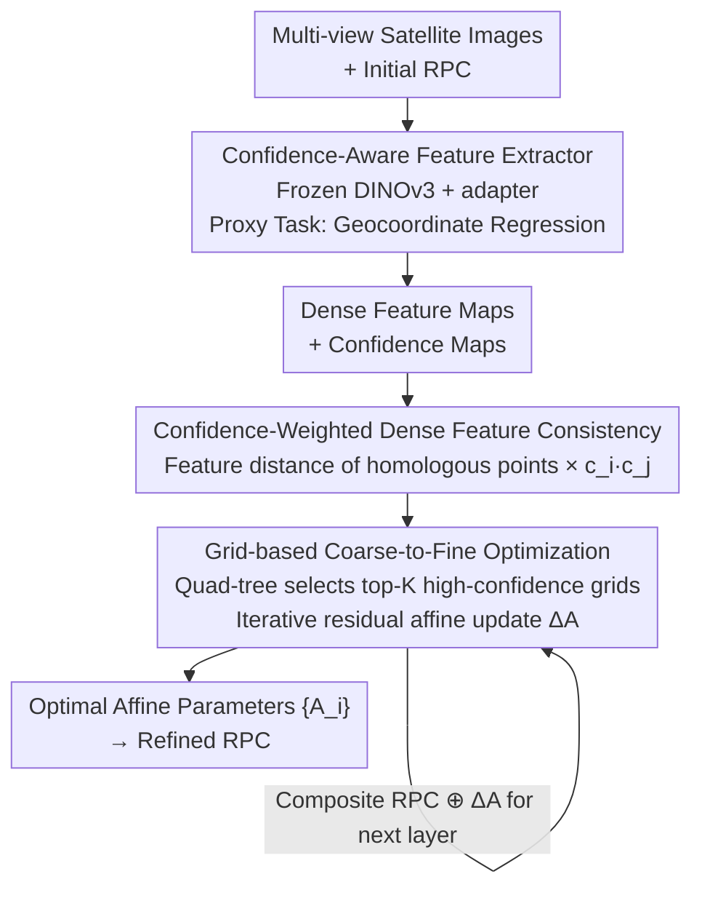

# Beyond Tie Points: Satellite Image Block Adjustment based on Dense Feature Consistency

**Conference**: CVPR 2026  
**Paper**: [CVF Open Access](https://openaccess.thecvf.com/content/CVPR2026/html/Liu_Beyond_Tie_Points_Satellite_Image_Block_Adjustment_based_on_Dense_CVPR_2026_paper.html)  
**Code**: https://github.com/YiLiu-AndyLau/BeyondTiePoints  
**Area**: Remote Sensing / Satellite Image Block Adjustment  
**Keywords**: Planar Block Adjustment, Dense Feature Consistency, Confidence Weighting, RPC Model, DINOv3

## TL;DR
Addressing the long-standing limitation of Planar Block Adjustment (PBA) relying on sparse tie points and accumulating errors in high-disparity regions such as tall buildings, this paper proposes the "Beyond Tie Points" paradigm. It utilizes a pre-trained feature extractor to generate dense features and confidence maps, reformulating block adjustment as a self-supervised optimization problem to "minimize the dense feature distance of homologous object points." Combined with a grid-based coarse-to-fine solver, it reduces average errors by up to 75.43% on data from Beijing, Guangzhou, and San Jose.

## Background & Motivation
**Background**: Due to the weak stereo geometry of high-resolution satellite imagery (small base-to-height ratio), mainstream methods often avoid full 3D adjustment and instead adopt Planar Block Adjustment (PBA). This treats elevation as a known constraint and optimizes only the geometric corrections in the horizontal plane. For decades, PBA has been dominated by the "tie points" paradigm. Whether using handcrafted features like SIFT or deep matchers like SuperGlue/LoFTR, the workflow follows a "match-then-adjust" cascaded pipeline: first detecting discrete pairs of homologous points between images, then using these as geometric constraints to optimize adjustment parameters.

**Limitations of Prior Work**: The authors identify three inherent defects in this tie-point paradigm. First, areas with inaccurate elevation (e.g., near tall buildings) produce points with large disparity, leading to high back-projection errors that significantly degrade adjustment accuracy. Second, "hard removal" of outliers via RANSAC and empirical thresholds can either mistakenly include outliers or delete valid inliers. Third, it forms a unidirectional error propagation chain where errors from the front-end (feature extraction, matching, outlier removal) accumulate irreversibly into the back-end. Advanced matchers only optimize specific steps within the cascade without addressing the fragility of the paradigm itself.

**Key Challenge**: Sparse tie points act as both the source of constraints and the source of errors—adjustment accuracy is staked on the matching quality of a few discrete points, which are most likely to fail in high-disparity or weak-texture regions.

**Goal**: Instead of treating PBA as a multi-stage process dependent on sparse tie points, the paper reformulates it as an integrated, self-supervised optimization problem to directly estimate the adjustment parameters of all images simultaneously.

**Key Insight**: The authors draw inspiration from "direct methods" in SLAM/SfM (such as DTAM or DSO using dense/semi-dense photometric consistency, and Lindenberger et al. using featuremetric objectives for deep features). However, since satellite imagery involving complex camera models, anisotropy, extreme disparity, and ultra-large formats, directly minimizing raw photometric errors or statistics is unreliable.

**Core Idea**: The optimization objective is shifted from "back-projection errors of sparse tie points" to the "feature distance of homologous object points in a dense feature space." A learnable confidence map is introduced to "softly suppress" geometrically unstable regions (e.g., tall buildings, clouds, water), transforming the entire block adjustment into a global feature consistency optimization problem.

## Method

### Overall Architecture
The method consists of two stages. In the first stage, a **scene-independent** robust feature extractor is trained offline. Using a frozen DINOv3 ViT-L as the backbone with a lightweight adapter, it is trained via a "geographic coordinate regression" proxy task to output dense feature maps and pixel-level confidence maps for each image. In the second stage, an online solver is employed. The adjustment is formulated as a large-scale nonlinear least squares problem. For all overlapping image pairs, the current geometric models (original RPC ⊕ current adjustment parameters) project object points onto the images to extract features at the corresponding locations. The objective is to minimize the confidence-weighted feature distances. A grid-based coarse-to-fine strategy is used to iteratively update the affine adjustment parameters for each image.

The parameters to be solved are rigorously defined: modern high-resolution satellite imagery uses the Rational Polynomial Coefficient (RPC) model to describe the mapping from object coordinates $(\phi,\lambda,h)$ to pixels $(l,s)$, where $l=P_1/P_2,\ s=P_3/P_4$ ($P_i$ are 3rd-order polynomials with 20 coefficients). The primary error in RPC is systematic geometric distortion, which can be compensated by an affine transformation in image space:

$$\begin{bmatrix} l'_i \\ s'_i \end{bmatrix} = \begin{bmatrix} a_0 & a_1 & a_2 \\ b_0 & b_1 & b_2 \end{bmatrix}\begin{bmatrix} l_i \\ s_i \\ 1 \end{bmatrix}$$

Thus, the task is defined as solving for the optimal set of affine parameters $A_i=\{a_0,a_1,a_2,b_0,b_1,b_2\}_i$ for every image $I_i$ to ensure global consistency.

### Key Designs

**1. "Beyond Tie Points" Paradigm: Reformulating Adjustment from Discrete Constraints to Dense Consistency**

This design directly addresses the core issue where sparse tie points serve as both constraints and error sources. The optimization objective is changed from "minimizing back-projection errors of sparse tie points" to "minimizing the distance between dense feature representations of the same object point under different views." Formally, the block adjustment is written as a nonlinear least squares problem:

$$A^* = \arg\min_A \sum_{(i,j)\in \text{Pairs}} \sum_{p\in O_{ij}} w(p_i,p_j)\cdot \big\| f_i(\text{proj}(P,A_i)) - f_j(\text{proj}(P,A_j)) \big\|_2^2$$

Where $O_{ij}$ represents all homologous pixel pairs within the overlapping region of images $(I_i,I_j)$, $\text{proj}(P,A_k)$ is the projection of object point $P$ onto image $k$ (using the original RPC compounded with current affine parameters), and $w(p_i,p_j)$ is the confidence weighting (see Design 2). Initially, all affine parameters are set to identity. Compared to the "match-then-adjust" paradigm, there is no explicit matching or RANSAC. All overlapping pixels contribute to the consistency constraint, and errors no longer accumulate unidirectionally; instead, they are solved simultaneously in a unified global optimization, making the system naturally more robust to initial mismatches.

**2. Confidence-Aware Feature Extractor + Geocoordinate Regression Proxy Task: Soft Suppression instead of Hard Removal**

To enable feature distance to drive adjustment, the features must possess three capabilities: high geospatial discriminability, high invariance for homologous points, and the ability to evaluate terrain disparity or stability. The authors use a frozen DINOv3 ViT-L/16 (pre-trained on SAT-493M) as the backbone, keeping its parameters fixed while adding a lightweight trainable adapter. A feature fusion module concatenates shallow and deep features from the backbone, feeding them into a self-attention layer and a confidence prediction head to output dense feature maps and confidence maps.

Why not train end-to-end? The solving phase involves an iterative optimizer; backpropagating through hundreds of iterations would lead to unstable gradients. Furthermore, the global optimization graph covering all images is computationally and memory-wise prohibitive for full-image backpropagation. Thus, the authors design a proxy task: training the adapter to learn a feature space intrinsically aligned with geographic position by **regressing the geographic coordinates (e.g., UTM coordinates) corresponding to each feature**. The training uses over 200 groups of multi-satellite, multi-terrain (city, forest, water, farmland) images, each equipped with ground-truth 3D coordinate maps and confidence maps. In each iteration, pairs of overlapping windows are randomly cropped and passed through the extractor. A lightweight decoder maps features back to 3D geographic coordinates. The total loss is a weighted sum: $L=\lambda_{reg}L_{reg}+\lambda_{cons}L_{cons}+\lambda_{feat}L_{feat}+\lambda_{conf}L_{conf}$:

- **Coordinate Regression Loss** $L_{reg}=\frac1N\sum_p\|\hat G(f(p))-G(p)\|_2^2$ establishes the mapping between feature and geographic space;
- **Coordinate Consistency Loss** $L_{cons}=\frac1M\sum_{(p_i,p_j)}\|\hat G(f_i(p_i))-\hat G(f_j(p_j))\|_2^2$ ensures homologous pixels predict identical geographic coordinates;
- **Feature Consistency Loss** employs triplet loss: $L_{feat}=\max(0,\,\text{Sim}(f_a,f_n)-\text{Sim}(f_a,f_p)+\alpha)$ to pull homologous features closer and push non-homologous ones away;
- **Confidence Loss** uses BCE supervision, where ground-truth confidence $C_{gt}$ is generated from pre-computed dense disparity maps.

The final confidence map quantifies the unreliability of geometrically unstable regions (buildings, clouds, water), adaptively lowering their weights during optimization.

**3. Grid-based Coarse-to-Fine Optimization: Enabling Feasible Global Optimization resistant to Large Initial Errors**

Directly performing dense optimization over an entire region at full resolution is computationally infeasible and difficult to converge due to high-resolution features being sensitive to large initial errors. The authors use a quad-tree for hierarchical solving: the overlapping area is first divided into initial grids, and the top-$K$ grids with the highest average confidence are selected. For each selected grid, corresponding image patches are cropped and resampled to $1024\times1024$. Features and confidence are extracted, and the consistency loss across all overlapping image pairs is aggregated to update affine parameters via gradient descent. The grids are then refined recursively. Coarse layers correct low-frequency geometric errors, while fine layers estimate smaller, higher-frequency residual affine corrections $\Delta A_{i,k}$. Each layer's parameters are **compounded** with the current RPC to form a more accurate baseline for the next layer.

## Key Experimental Results

### Data & Protocols
Evaluations are conducted on multi-view satellite imagery from Beijing, Guangzhou, and San Jose, covering diverse terrains such as plains, mountains, skyscrapers, and water networks. Satellite sources include SuperView-2 and WorldView-2. Manual Checkpoints (MCPs) are used to evaluate accuracy. Metrics include the mean/median distance (meters) between homologous MCPs projected into object space, and accuracy @1m/@3m/@5m. To test robustness, two levels of simulated initial errors are applied: small (≈5 m, suffix -a) and large (≈10 m, suffix -b).

### Main Results
The method is compared against SIFT-based PBA (PBA-SI), LoFTR-based PBA (PBA-Lo), and an enhanced PBA-Lo† using the proposed confidence maps (confidence < 0.5 removal). The table below showcases the mean error (meters, lower is better):

| Dataset (Difficulty) | Error Level | PBA-SI | PBA-Lo | PBA-Lo† | Ours |
|----------------------|-------------|--------|--------|---------|------|
| San Jose (Easy)      | Small -a    | 1.07   | 0.76   | 0.53    | **0.50** |
| San Jose (Easy)      | Large -b    | 1.18   | 0.87   | **0.56** | 0.75 |
| Guangzhou (Hard)     | Small -a    | 5.78   | 5.06   | 1.97    | **1.42** |
| Guangzhou (Hard)     | Large -b    | 6.41   | 5.19   | 2.42    | **1.84** |
| Beijing (Hard)       | Small -a    | 6.19   | 5.87   | 4.03    | **2.24** |
| Beijing (Hard)       | Large -b    | 6.26   | 6.01   | 4.39    | **2.41** |

In Guangzhou (small error), Ours reduces the mean error from 5.78 m (SIFT) to 1.42 m (approx. 75.4% reduction). For accuracy @3m in Guangzhou, Ours improves the rate from 16.67% (PBA-Lo) to 93.33%. The only case where it is slightly inferior to PBA-Lo† is San Jose with large errors (0.75 vs 0.56), attributed to the lack of discriminative features in smooth terrains at low-resolution pyramid levels.

### Ablation Study
Ablations on Guangzhou-b (large initial error, high disparity):

| Configuration | Mean | Median | @1m | @3m | @5m |
|---------------|------|--------|-----|-----|-----|
| Base (Frozen ViT only) | 5.57 | 5.74 | 0 | 5.00 | 33.33 |
| w/ Confidence (No adapter) | 5.55 | 5.98 | 0 | 8.33 | 33.33 |
| w/ Adapter (No weight) | 4.66 | 4.98 | 0 | 18.33 | 50.00 |
| Ours (Full) | **1.84** | **1.77** | **30.00** | **88.33** | **98.33** |

### Key Findings
- **The adapter (Geocoordinate Regression) is essential**: Removing the adapter and using only frozen ViT features keeps the mean error at 5.57 m; adding the adapter drops it to 4.66 m. This proves that aligning the feature space with geographic coordinates is critical.
- **Confidence weighting relies on the adapter**: Adding confidence without the adapter yields almost no gain (5.57 → 5.55). However, the full model (Adapter + Confidence) jumps from 4.66 to 1.84, showing that soft suppression is key to releasing the power of feature consistency in high-disparity scenarios.
- **Value correlates with difficulty**: In high-disparity regions (Beijing/Guangzhou) where traditional PBA fails, Ours shows the most significant advantage. In flat regions, the advantage narrows.

## Highlights & Insights
- **Dissolving Matching into Optimization**: Traditional PBA fragility stems from relying on discrete matches. This work uses dense feature consistency + soft confidence to merge matching, outlier handling, and adjustment into a unified differentiable objective, bypassing unidirectional error propagation.
- **Proxy Task for End-to-End Infeasibility**: Direct end-to-end training is hindered by iterative solvers and global computation graphs. The authors skillfully use "geocoordinate regression" to offline-train geometric consistency into the feature space, decoupling training from the solving process.
- **Confidence Maps as Soft Outliers**: Implementing pixel-level weighting $w=c_i\cdot c_j$ for "geometric instability = low confidence" is more elegant than RANSAC thresholds and can even enhance existing tie-point methods (PBA-Lo†).
- **Quad-tree Coarse-to-Fine + RPC Compounding**: Using hierarchical grids to decompose dense optimization into low-frequency correction followed by high-frequency residual solving is a practical key to handling large formats and initial errors.

## Limitations & Future Work
- The reliance on an iterative solver prevents a truly end-to-end training of the feature extractor. The method is currently limited to Planar Adjustment (PBA) and does not support full 3D adjustment.
- ⚠️ In smooth, weak-texture regions (San Jose large error), the method is outperformed by enhanced tie-point methods, suggesting a dependency on discriminative terrain textures.
- The evaluation scale is relatively small (3–8 images per site, 20–35 MCPs), and the dependency of the ground-truth confidence on pre-computed disparity maps is not fully discussed in the main text.
- Future Work: Development of end-to-end block adjustment for directly predicting global parameters and high-precision 3D adjustment without elevation constraints.

## Related Work & Insights
- **vs. Tie-point PBA (SIFT / LoFTR / SuperGlue)**: These follow a "match-then-adjust" pipeline with hard RANSAC removal and unidirectional error accumulation. Ours uses unified dense consistency + soft suppression, providing a clear accuracy advantage in difficult regions.
- **vs. Direct Methods in SLAM/SfM (DTAM, DSO, featuremetric BA)**: While sharing the "align directly" philosophy, those methods often minimize raw photometry in general scenes. Ours adapts to satellite RPC models, anisotropy, and extreme disparity by minimizing feature distances in a specially trained space with confidence aware of disparity.
- **vs. Scene Coordinate Regression (SCR)**: Borrowing the "feature-to-coordinate" supervision, but treating it as an offline proxy task to shape a consistent feature space for downstream iterative refinement rather than for direct localization.

## Rating
- Novelty: ⭐⭐⭐⭐⭐ Paradigm-level shift from tie-point cascades to dense feature optimization.
- Experimental Thoroughness: ⭐⭐⭐⭐ Solid multi-site/multi-level error tests and strong baselines, though number of images/checkpoints is limited.
- Writing Quality: ⭐⭐⭐⭐⭐ Clear logic from pain points to paradigm to two-stage methodology.
- Value: ⭐⭐⭐⭐⭐ Significant error reduction (up to 75.43%) and high practical utility with plug-and-play confidence maps.

<!-- RELATED:START -->

## Related Papers

- [\[CVPR 2026\] Beyond Matching to Tiles: Bridging Unaligned Aerial and Satellite Views for Vision-Only UAV Navigation](beyond_matching_to_tiles_bridging_unaligned_aerial_and_satellite_views_for_visio.md)
- [\[CVPR 2026\] HarmoniDiff-RS: Training-Free Diffusion Harmonization for Satellite Image Composition](harmonidiff-rs_training-free_diffusion_harmonization_for_satellite_image_composi.md)
- [\[CVPR 2026\] Exploring Spatiotemporal Feature Propagation for Video-Level Compressive Spectral Reconstruction](exploring_spatiotemporal_feature_propagation_for_video-level_compressive_spectra.md)
- [\[CVPR 2026\] MOGeo: Beyond One-to-One Cross-View Object Geo-localization](mogeo_beyond_one-to-one_cross-view_object_geo-localization.md)
- [\[CVPR 2026\] Beyond Endpoints: Path-Centric Reasoning for Vectorized Off-Road Network Extraction](beyond_endpoints_path-centric_reasoning_for_vectorized_off-road_network_extracti.md)

<!-- RELATED:END -->
