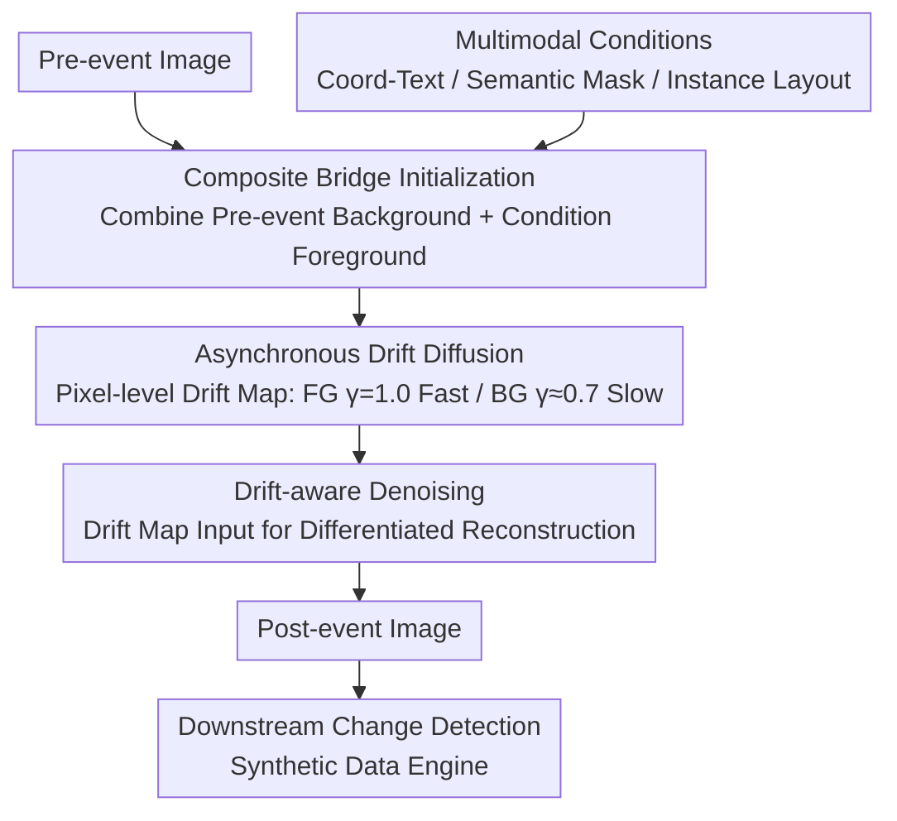

# ChangeBridge: Spatiotemporal Image Generation with Multimodal Controls for Remote Sensing

**Conference**: CVPR 2026  
**arXiv**: [2507.04678](https://arxiv.org/abs/2507.04678)  
**Code**: [https://github.com/zhenghuizhao/ChangeBridge](https://github.com/zhenghuizhao/ChangeBridge)  
**Area**: Remote Sensing / Image Generation  
**Keywords**: Spatiotemporal Image Generation, Diffusion Bridge, Asynchronous Drift, Change Detection, Remote Sensing

## TL;DR
Ours proposes ChangeBridge, the first conditional spatiotemporal image generation model for remote sensing. Based on asymmetrically drifting diffusion bridges, it generates post-event images from pre-event images and multimodal conditions (coordinate-text/semantic masks/instance layouts), simultaneously modeling foreground event-driven changes and background temporal evolution, while serving as a data engine for downstream change detection tasks.

## Background & Motivation

1. **Background**: Remote sensing generation methods cover layout-to-image and modality conversion, but conditional spatiotemporal image generation (simulating future scenes based on past observations and multimodal conditions) remains largely unexplored.
2. **Limitations of Prior Work**: Existing change generation methods only handle event-driven changes (e.g., appearance of new buildings) and cannot model gradual transitions over time (e.g., seasonal changes, vegetation growth).
3. **Key Challenge**: Two heterogeneous evolutions must be generated simultaneously—intense event-driven changes in the foreground and subtle temporal dynamics in the background. Traditional noise-initialized diffusion models cannot distinguish between the two.
4. **Core Idea**: (1) Establish a diffusion bridge starting from a composite pre-event state (rather than starting from noise); (2) Assign high drift to the foreground and low drift to the background via a pixel-level drift map (asynchronous diffusion); (3) Employ a drift-aware denoising network.

## Method

### Overall Architecture

ChangeBridge addresses conditional spatiotemporal image generation in remote sensing: given a pre-event image and multimodal conditions (coordinate-text/semantic masks/instance layouts), it generates a corresponding post-event image. It characterizes two distinct types of changes—foreground intense event-driven changes (e.g., new buildings) and background gradual temporal evolution (e.g., seasonal cycles, vegetation growth). The process does not start from noise but combines the pre-event background and condition-driven foreground as the starting point of the diffusion bridge. Denoising proceeds via a pixel-level drift map allowing fast foreground and slow background changes, finally reconstructing the post-event image through a drift-aware network.

### Key Designs

**1. Composite Bridge Initialization: Starting from Pre-event state instead of Noise**

Traditional diffusion initializes from pure noise, which destroys background structural information and leads to spatial inconsistency between pre- and post-event states. ChangeBridge combines the pre-event background with the condition-driven foreground as the bridge starting point, ensuring the background spatial structure is preserved throughout the generation process for natural alignment.

**2. Asynchronous Drift Diffusion: Multi-speed Fore/Background Evolution**

The intensities of foreground event changes and background temporal evolution differ significantly. Uniform drift cannot distinguish between them. The authors assign different drift intensities to each pixel to construct a pixel-level drift map $\tilde{m}_t(i,j) = m_t \cdot \mathbf{z}_d(i,j)$, using $\gamma^{fg}=1.0$ for the foreground and $\gamma^{bg}=0.7\sim0.8$ for the background. This generalizes the Brownian Bridge from uniform drift to spatial asynchronous drift.

**3. Drift-aware Denoising: Differential Reconstruction via Drift Maps**

Differentiating foreground and background in the forward process is insufficient; the denoising network must also know the target change rate for each pixel. The authors embed the drift map $\mathbf{z}_d$ into the denoising network to guide differentiated reconstruction, preventing the background from being distorted by intense foreground changes.

**4. Multimodal Conditions: Unified Access for Three Control Modes**

To support varying granularities of control, the framework integrates three types of conditions: coordinate-text (using rotated bboxes for positioning), semantic masks (color channel mapping for categories), and instance layouts, covering coarse-to-fine multimodal control.

### Loss & Training

$$\mathcal{L}_{asy} = \mathbb{E}[\|\tilde{m}_t(\mathbf{z}_a - \mathbf{z}_b) + \sqrt{\delta_t}\boldsymbol{\epsilon} - \boldsymbol{\epsilon}_\theta(\mathbf{z}_t, t, \mathbf{z}_a, \mathbf{z}_c, \mathbf{z}_d)\|^2]$$

The asynchronous drift loss forces the network to predict the transition from pre-event state $\mathbf{z}_a$ to post-event state $\mathbf{z}_b$ under the modulation of the drift map $\mathbf{z}_d$.

## Key Experimental Results

### Main Results (DiT Variants)

| Condition | Dataset | FID↓ | IS↑ | Spatial Metrics↑ |
|------|--------|:---:|:---:|:---:|
| Coord-Text | LEVIR-CC | **31.45** | **5.14** | CosSim 0.85 |
| Instance Layout | WHU-CD | **40.12** | **6.77** | IoU 78.13 |
| Semantic Mask | SECOND | **Best** | **Best** | mIoU **Best** |

Ours outperforms all baselines across all conditions and datasets.

### Value as a Data Engine
Training downstream change detection models with synthetic data from ChangeBridge yields significant performance gains, verifying the practical utility of the generated data.

### Key Findings
- **Asynchronous vs. Uniform Drift**: Asynchronous drift significantly improves background temporal consistency.
- **Composite Bridge vs. Noise Initialization**: Composite bridge preserves spatial structure, enhancing spatiotemporal consistency.
- **UNet vs. DiT Variants**: DiT variants consistently outperform UNet across all metrics.

## Highlights & Insights
- **First combination of Diffusion Bridge and Asynchronous Drift**: Generalizes Brownian Bridge diffusion to pixel-level asynchronous drift, perfectly matching the design of foreground-fast/background-slow spatiotemporal evolution in remote sensing.
- **Validation as Synthetic Data Engine**: Demonstrates that ChangeBridge can alleviate the scarcity of training data in change detection tasks.
- **Multimodal Condition Framework**: Unified support for coordinate-text, semantic masks, and instance layouts.

## Limitations & Future Work
- The parameters $\gamma^{fg}/\gamma^{bg}$ require manual per-dataset tuning.
- Currently only validated in remote sensing scenarios; generalization to natural scenes like street views remains to be explored.
- Spatial resolution of generated images is limited by the reconstruction accuracy of the VQGAN.

## Rating
- Novelty: ⭐⭐⭐⭐⭐ The mathematical framework of the asynchronous drift diffusion bridge is elegant with clear physical intuition.
- Experimental Thoroughness: ⭐⭐⭐⭐ Validated on 4 datasets, 3 condition types, UNet/DiT variants, and downstream tasks.
- Writing Quality: ⭐⭐⭐⭐⭐ Complete mathematical derivation and clear illustrations.
- Value: ⭐⭐⭐⭐⭐ Highly significant for remote sensing spatiotemporal simulation and data augmentation for change detection.

<!-- RELATED:START -->

## Related Papers

- [\[ICLR 2026\] Object Fidelity Diffusion for Remote Sensing Image Generation](../../ICLR2026/remote_sensing/object_fidelity_diffusion_for_remote_sensing_image_generation.md)
- [\[CVPR 2026\] Prompt-Free Unknown Label Generation for Open World Detection in Remote Sensing](prompt-free_unknown_label_generation_for_open_world_detection_in_remote_sensing.md)
- [\[CVPR 2026\] Robust Remote Sensing Image–Text Retrieval with Noisy Correspondence](robust_remote_sensing_image-text_retrieval_with_noisy_correspondence.md)
- [\[CVPR 2026\] MM-OVSeg: Multimodal Optical-SAR Fusion for Open-Vocabulary Segmentation in Remote Sensing](mm-ovseg_multimodal_optical-sar_fusion_for_open-vocabulary_segmentation_in_remot.md)
- [\[CVPR 2026\] OlmoEarth: Stable Latent Image Modeling for Multimodal Earth Observation](olmoearth_stable_latent_image_modeling_for_multimodal_earth_observation.md)

<!-- RELATED:END -->
