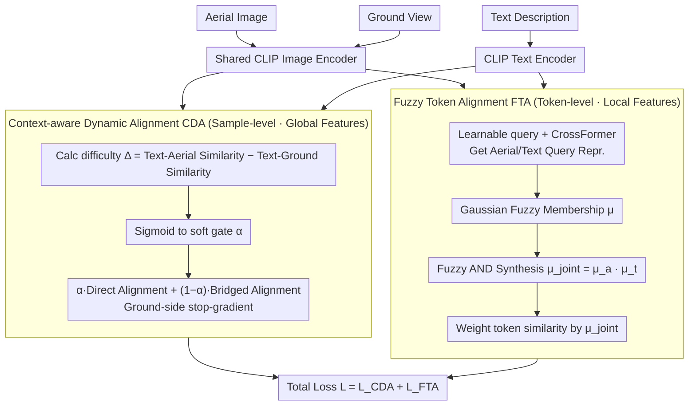

# Cross-modal Fuzzy Alignment Network for Text-Aerial Person Retrieval and A Large-scale Benchmark

**Conference**: CVPR 2026  
**arXiv**: [2603.20721](https://arxiv.org/abs/2603.20721)  
**Code**: [https://github.com/Yifei-AHU/AERI-PEDES](https://github.com/Yifei-AHU/AERI-PEDES)  
**Area**: Remote Sensing / Person Retrieval  
**Keywords**: Text-Aerial Person Retrieval, Fuzzy Logic, Cross-modal Alignment, UAV, Chain-of-Thought Annotation

## TL;DR
The Cross-modal Fuzzy Alignment Network (CFAN) is proposed, utilizing fuzzy logic to quantify token-level reliability for fine-grained alignment. It introduces the ground view as a bridging proxy to mitigate the semantic gap between aerial images and text, alongside the construction of a large-scale text-aerial person retrieval benchmark, AERI-PEDES.

## Background & Motivation

**Background**: Text-Image Person Retrieval (TIPR) has achieved significant progress, but existing works rely on fixed ground-based camera data. Unmanned Aerial Vehicles (UAVs) offer unique advantages for dynamic multi-angle surveillance, making the extension of TIPR to aerial scenarios highly valuable.

**Limitations of Prior Work**: (1) Aerial images suffer from non-linear person appearance distortion due to drastic changes in shooting angles and altitudes; (2) Visual cues in aerial views are sparse or partially missing (e.g., only the top of the head being visible), meaning complete attributes in text descriptions cannot fully correspond to the aerial image; (3) During token-level fine-grained alignment, unobservable tokens introduce erroneous cross-modal matching.

**Key Challenge**: Witness descriptions are typically detailed and complete, whereas aerial images only cover partial semantic regions—this visibility inconsistency leads to significant noise during fine-grained alignment.

**Goal**: How to achieve robust text-aerial person cross-modal retrieval when aerial visual cues are incomplete?

**Key Insight**: (1) Utilize fuzzy logic to quantify the reliability of each token, suppressing the influence of unobservable or noisy tokens; (2) Use the ground view as an intermediate bridge to adaptively balance direct and bridged alignment.

**Core Idea**: Fuzzy membership modeling for token reliability + context-aware dynamic alignment = robust text-aerial alignment.

## Method

### Overall Architecture
CFAN addresses "information asymmetry" where text descriptions are complete but aerial images show only partial views. It employs two alignment paths: direct text-to-aerial alignment and bridged alignment via a ground view of the same person. A shared CLIP image encoder processes both aerial and ground images, while the CLIP text encoder processes descriptions. Two sequential modules follow: Context-aware Dynamic Alignment (CDA) determines the weights of the two paths at the sample level, and Fuzzy Token Alignment (FTA) selects reliable local details at the token level for precision alignment.

### Key Designs

**1. Context-aware Dynamic Alignment (CDA): Image-specific selection of ground bridging**

The reliability of direct versus bridged alignment varies per image: low-altitude aerial images are clear enough for direct alignment, while high-altitude distant shots require the ground view as a reliable proxy. CDA computes a "difficulty signal"—the difference between text-aerial and text-ground similarity $\Delta_i = \text{sim}(T_i^C, A_i^C) - \text{sim}(T_i^C, G_i^C)$—and maps it to a soft gate $\alpha_i = \frac{1}{1 + \exp[-k \cdot \Delta_i]}$ via a sigmoid function. A larger $\Delta_i$ indicates superior direct alignment, moving $\alpha_i$ closer to 1 and increasing the weight of direct alignment in the loss:

$$\mathcal{L}_{\text{CDA}} = \frac{1}{B} \sum_{i=1}^B \left[\alpha_i \cdot \mathcal{L}_{\text{direct}} + (1-\alpha_i) \cdot \mathcal{L}_{\text{bridge}}\right]$$

Weights are adaptively assigned per sample rather than using a fixed batch-wide weight. A stop-gradient is applied to ground features in the bridged path to ensure the text aligns with the ground without allow aerial gradients to contaminate ground representations.

**2. Fuzzy Token Alignment (FTA): Identifying "visible and matchable" tokens via fuzzy membership**

Many tokens in aerial images correspond to unobservable regions (occluded or out of view). FTA assigns a "reliability score" to each token so only reliable parts contribute to alignment. It uses shared learnable queries $\mathbf{Q} \in \mathbb{R}^{K \times D}$ to perform cross-attention with both modalities. A Gaussian fuzzy membership function measures the reliability of each query token $\mu_j^a = \exp\left(-\frac{(1-r_j)^2}{2\sigma^2}\right)$, where $r_j$ is the cosine similarity between the query token and the global class token. Scores are synthesized using a fuzzy AND operation (multiplication) $\mu_j^{\text{joint}} = \mu_j^a \cdot \mu_j^t$. Similarity is then aggregated as $\text{sim}(Q_a, Q_t) = \frac{1}{K} \sum_{j=1}^K \mu_j^{\text{joint}} s_j$.

Unlike standard attention, fuzzy membership indicates whether a token is visible and matchable across both modalities. Unobservable or noisy tokens are suppressed as their joint membership approaches zero. The Gaussian scale $\sigma$ is adaptively predicted from the global class token.

**3. AERI-PEDES Benchmark Construction: Chain-of-Thought decomposition**

The AERI-PEDES dataset was constructed using a three-step Chain-of-Thought (CoT) pipeline—attribute parsing, initial caption generation, and audit refinement. This breaks down full-sentence generation into verifiable sub-tasks, reducing the risk of hallucination by Vision-Language Models (VLMs). The training set utilizes automatic VLM annotation for scale, while the test set is entirely manually annotated to ensure reliability.

### Loss & Training
- CDA uses Similarity Distribution Matching (SDM) loss for both direct and bridged alignment.
- FTA uses KL divergence for similarity distribution matching.
- Total Loss: $\mathcal{L} = \mathcal{L}_{\text{CDA}} + \mathcal{L}_{\text{FTA}}$.
- Adam optimizer, initial learning rate $5 \times 10^{-6}$ with cosine decay, 60 epochs.

## Key Experimental Results

### Main Results

| Method | AERI-PEDES R1↑ | AERI-PEDES mAP↑ | TBAPR R1↑ | TBAPR mAP↑ |
|------|---------------|-----------------|-----------|------------|
| IRRA (CVPR23) | 35.14 | 33.42 | 39.63 | 35.31 |
| HAM (CVPR25) | 44.58 | 42.45 | 47.81 | 41.86 |
| CFAN (w/o Ground) | 45.06 | 43.27 | 49.15 | 42.89 |
| **CFAN (w/ Ground)** | **47.16** | **44.79** | **49.47** | **43.96** |

### Ablation Study

| Configuration | R1 | mAP | RSum | Notes |
|------|-----|------|------|------|
| Baseline (Bridged only) | 43.88 | 41.58 | 174.84 | Baseline |
| + CDA | 46.18 | 43.98 | 183.04 | RSum +8.2% |
| + FTA | 44.55 | 41.89 | 176.64 | R1 +0.67% |
| + CDA + FTA | **47.16** | **44.79** | **186.65** | Full Model |

Bridging Modality Comparison:

| Bridge Type | R1 | mAP | Notes |
|---------|-----|------|------|
| None | 45.06 | 43.27 | FTA only |
| Aerial (Low-alt bridge) | 46.08 | 44.20 | Effective but limited |
| Ground (Ground view bridge) | **47.16** | **44.79** | Optimal |

### Key Findings
- CDA is the primary contributor (RSum +8.2%), highlighting the importance of adaptive direct/bridging balance.
- FTA provides complementary fine-grained alignment improvements.
- Even without ground images, CFAN using only FTA outperforms existing competitors.

## Highlights & Insights
- **Fuzzy Logic Integration**: Quantifying token reliability with fuzzy membership functions provides a stronger theoretical foundation than simple attention weights.
- **Benchmark Contribution**: AERI-PEDES (112K+ images) fills the data gap in text-aerial person retrieval.
- **CoT Annotation Pipeline**: The structured reasoning approach for labeling can be generalized to other dataset construction tasks.

## Limitations & Future Work
- Requirements for paired aerial and ground images may be difficult to meet in some practical deployments.
- The Gaussian form of the fuzzy membership function could be replaced with more flexible parameterizations.
- Performance could be further enhanced by moving beyond CLIP to larger, more powerful VLMs.

## Related Work & Insights
- Fuzzy deep learning, previously used in medical imaging, is successfully extended here to cross-modal retrieval.
- The dynamic difficulty estimation in CDA can be applied to other retrieval scenarios involving incomplete visual information (e.g., fog, occlusions).

## Rating
- Novelty: ⭐⭐⭐⭐ Combination of fuzzy logic and dynamic bridged alignment is novel.
- Experimental Thoroughness: ⭐⭐⭐⭐⭐ Two datasets + complete ablation + parameter sensitivity.
- Writing Quality: ⭐⭐⭐⭐ Clear formulas and well-structured.
- Value: ⭐⭐⭐⭐ Significant pushes the field of text-aerial person retrieval forward.

<!-- RELATED:START -->

## Related Papers

- [\[CVPR 2026\] Cross-Scale Pansharpening via ScaleFormer and the PanScale Benchmark](cross-scale_pansharpening_via_scaleformer_and_the_panscale_benchmark.md)
- [\[CVPR 2026\] Olbedo: An Albedo and Shading Aerial Dataset for Large-Scale Outdoor Environments](olbedo_an_albedo_and_shading_aerial_dataset_for_large-scale_outdoor_environments.md)
- [\[CVPR 2026\] RoadGIE: Towards A Global-Scale Aerial Benchmark for Generalizable Interactive Road Extraction](roadgie_towards_a_global-scale_aerial_benchmark_for_generalizable_interactive_ro.md)
- [\[CVPR 2026\] Robust Remote Sensing Image–Text Retrieval with Noisy Correspondence](robust_remote_sensing_image-text_retrieval_with_noisy_correspondence.md)
- [\[ICCV 2025\] CityNav: A Large-Scale Dataset for Real-World Aerial Navigation](../../ICCV2025/remote_sensing/citynav_a_large-scale_dataset_for_real-world_aerial_navigation.md)

<!-- RELATED:END -->
