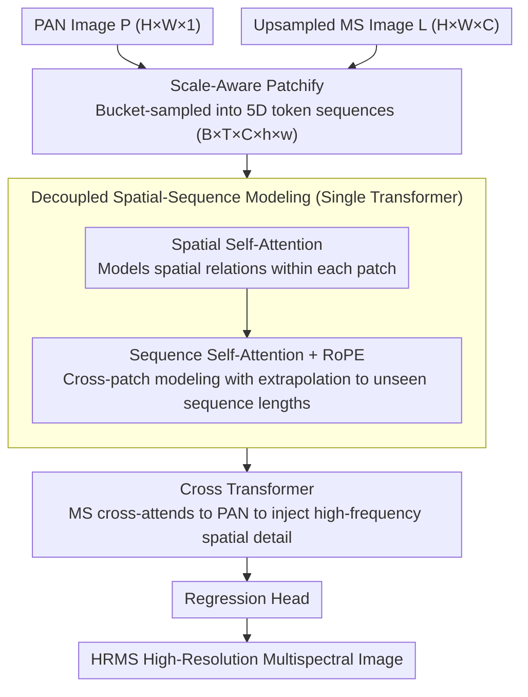

# Cross-Scale Pansharpening via ScaleFormer and the PanScale Benchmark

**Conference**: CVPR 2026  
**arXiv**: [2603.00543](https://arxiv.org/abs/2603.00543)  
**Code**: [GitHub](https://github.com/caoke-963/ScaleFormer)  
**Area**: Remote Sensing  
**Keywords**: Remote sensing image fusion, cross-scale generalization, Transformer, Rotary Position Embedding, Pansharpening

## TL;DR
This paper proposes PanScale, the first cross-scale pansharpening dataset and evaluation benchmark (PanScale-Bench), along with the ScaleFormer framework. The method reinterprets resolution changes as sequence length variations, achieving cross-scale generalization through Scale-Aware Patchify bucketed sampling, decoupled spatial-sequence modeling, and RoPE.

## Background & Motivation
**Background**: Pansharpening utilizes high-resolution panchromatic (PAN) images and low-resolution multispectral (LRMS) images to generate high-resolution multispectral (HRMS) images, serving as a core task in remote sensing. CNN and Transformer-based methods (MSDCNN, HFIN, ARConv, etc.) have made significant progress.

**Limitations of Prior Work**: (i) **Computational and Memory Bottlenecks**—when transitioning from training crop sizes (200-256px) to inference at 800/1600/2000px, Transformer memory usage surges, often causing OOM on standard GPUs at 800px; (ii) **Tiling Artifacts**—forced tiled inference introduces boundary discontinuities and obvious blocky artifacts; (iii) **Weak Cross-Scale Generalization**—training on a single low resolution leads to scale-induced distribution shifts, where luminance distributions shift significantly as resolution increases.

**Key Challenge**: Existing datasets (PanCollection, NBU, PAirMax) provide limited scale diversity and resolution, lacking a standardized multi-scale and high-resolution evaluation protocol.

**Goal**: To systematically address cross-scale pansharpening challenges across data, algorithms, and computation.

**Key Insight**: Reformulate resolution changes as sequence length changes—using fixed spatial size patches as tokens, where only the sequence length grows linearly with the image scale.

**Core Idea**: Introduce a sequence axis using Scale-Aware Patchify, decoupling spatial modeling from scale modeling, and employ RoPE to achieve extrapolation generalization to unseen scales.

## Method

### Overall Architecture
ScaleFormer addresses the cross-scale generalization problem of training on small 200–256px images while performing inference on large 800–2000px images. Its core mechanism reinterprets resolution changes as sequence length variations: by fixing the spatial size of each patch, an increase in image size only results in a longer token sequence. Given a PAN image $\mathbf{P} \in \mathbb{R}^{H \times W \times 1}$ and an upsampled MS image $\mathbf{L} \in \mathbb{R}^{H \times W \times C}$, they are first processed by Scale-Aware Patchify into a 5D tensor $\mathbf{P}_{5d} \in \mathbb{R}^{B \times T \times C \times h \times w}$ (where $T$ is the sequence length). The data then passes through a Single Transformer (decoupled spatial and sequence modeling) and a Cross Transformer (PAN-MS cross-modal fusion), finally regressing the HRMS image.

### Key Designs

**1. Scale-Aware Patchify: Transforming Resolution Generalization into Sequence Length Generalization**

Directly training on small images and inferring on large images encounters scale-induced distribution shifts—luminance statistics drift with resolution, causing models to fail on unseen scales. SAP addresses this by randomly sampling bucket indices $t$ during training to determine the window size $w(t)$. Using a Patch-to-Sequence Tokenizer, the input is cut into token sequences of varying lengths, exposing the model to multiple effective sequence lengths during training. During inference, the window size is fixed, and high resolution is handled simply by extending the sequence. Since the spatial size of each token remains constant, its mean and variance stabilize and do not drift with the full image size, which is the prerequisite for cross-scale extrapolation.

**2. Decoupled Spatial-Sequence Modeling: Independent Scale and Spatial Modeling**

If spatial relationships and scale variations are coupled in the same attention mechanism, generalization becomes difficult as sequences lengthen. This approach separates the two: the Spatial Transformer only models spatial relationships within each patch:
$$\mathbf{f}_{i,1} = \mathbf{f}_i + SA_{spa}(LN(\mathbf{f}_i))$$
The Sequence Transformer models cross-patch correlations along the sequence dimension:
$$\mathbf{f}_{i+1,1} = \mathbf{f}_{i+1} + SA_{seq}(LN(\mathbf{f}_{i+1}))$$
In $SA_{seq}$, the batch and spatial dimensions are merged, and **RoPE** is injected to encode continuous relative positions. The advantage of RoPE is that relative positions can smoothly extrapolate to sequence lengths not seen during training, allowing the model to remain position-aware even on long sequences such as 1600/2000px.

**3. Cross Transformer: PAN-MS Fusion via Cross-Attention**

PAN provides high-frequency spatial details while MS provides spectral information; the two must be fused rather than simply added. The Cross Transformer uses the same decoupled structure but replaces self-attention with cross-attention, allowing MS features to query PAN features:
$$\mathbf{f}_{i,1}^{ms} = \mathbf{f}_i^{ms} + CA_{spa}(LN(\mathbf{f}_i^{ms}), LN(\mathbf{f}^{pan}))$$
This injects spatial details from PAN into MS while maintaining the patch-by-patch, variable-length sequence processing, thus ensuring cross-scale consistency.

### Loss & Training
The L1 loss is used: $\mathbf{L} = \|\mathbf{H}_{out} - \mathbf{G}\|_1$. Optimization uses the Adam optimizer with an initial learning rate of $5 \times 10^{-4}$, decaying to $5 \times 10^{-8}$ via cosine annealing over 500 epochs on an NVIDIA 3090 with 32 channels.

## Key Experimental Results

### Main Results: Average Results Across Three Subsets of PanScale

| Method | Jilin PSNR/SSIM | Landsat PSNR/SSIM | Skysat PSNR/SSIM |
|------|-----------------|-------------------|-------------------|
| HFIN | 38.00/0.9698 | 40.21/0.9666 | 43.96/0.9658 |
| ARConv | 38.23/0.9697 | 39.66/0.9638 | 43.40/0.9797 |
| Pan-mamba | 35.55/0.9480 | 36.73/0.9206 | 41.39/0.9493 |
| **Ours** | **39.29/0.9761** | **41.04/0.9711** | **44.65/0.9827** |

ScaleFormer leads SOTA across all datasets and maintains stable performance as resolution increases.

### Ablation Study: Landsat Dataset

| Ablation Config | 200px PSNR | 400px PSNR | 800px PSNR | 1600px PSNR |
|---------|-----------|-----------|-----------|------------|
| w/o RoPE | 40.46 | 40.95 | 40.76 | 40.69 |
| SeqT→SpaT | 40.91 | 41.30 | 40.72 | 40.51 |
| w/o SAP | 40.53 | 40.93 | 40.62 | 40.39 |
| **Full Model** | **40.61** | **41.37** | **41.13** | **41.03** |

All ablation variants show significant performance degradation at large resolutions, confirming each component's necessity for cross-scale generalization.

### Key Findings
- Model parameters are only 0.52M (1/4 of HFIN, 1/9 of ARConv), showing a significant efficiency advantage.
- As resolution increases, ScaleFormer's GFLOPs and memory growth are much slower than HFIN/ARConv.
- ARConv exhibits severe block artifacts (significant DDC-IoU drop) during tiled inference.
- ScaleFormer remains competitive in full-resolution real-world scene evaluations (without GT).

## Highlights & Insights
- **Clever Problem Reformulation**: Generalizing resolution is transformed into generalizing sequence length, borrowing ideas from sequence modeling in NLP/video models.
- **Outstanding Computational Efficiency**: Leads SOTA significantly in parameters and GFLOPs, with the advantage widening as resolution increases.
- **Dataset Contribution**: PanScale is the first cross-scale pansharpening dataset covering three satellite platforms (0.5~15m resolution).
- **Innovative RoPE Application**: Introduces RoPE from text/video domains into remote sensing fusion to achieve scale extrapolation.

## Limitations & Future Work
- Focuses only on pansharpening; generalization to other remote sensing fusion tasks (hyperspectral, SAR-optical) is unverified.
- The SAP bucket strategy uses a predefined set of fixed window sizes; an adaptive strategy might be superior.
- Only uses L1 loss; perceptual or GAN losses might further improve visual quality.
- Self-attention in the Sequence Transformer remains $O(T^2)$, presenting bottlenecks for ultra-large inputs.

## Related Work & Insights
- Traditional methods (GS, IHS, GFPCA) perform poorly in cross-scale scenarios (PSNR lower by 10+dB).
- CNN methods (MSDCNN, SFINet, MSDDN) have limited cross-scale generalization.
- HFIN/ARConv are current SOTA but suffer from severe memory and computational bottlenecks.
- Pan-mamba uses the Mamba architecture but performs worse than Transformer-based solutions.
- SAP is inspired by the multi-resolution training of FlexViT and the bucketed training strategies in video generation.

## PanScale Dataset Details
- **Three Sub-datasets**: Jilin (Jilin-1, 0.5~1m resolution), Landsat (Landsat-8, 15m resolution), Skysat (Planet SkySat, ~1m resolution).
- **Test Set Design**: Each sub-dataset includes reduced-resolution (200×200 to 2000×2000) and full-resolution multi-scale test sets.
- **Data Source**: Acquired and preprocessed via the Google Earth Engine (GEE) system.
- **Evaluation Metrics**: PanScale-Bench integrates reference metrics (PSNR/SSIM/ERGAS/Q) and no-reference metrics ($D_\lambda$/$D_S$/QNR).

## Efficiency Comparison

| Method | Parameters (M) | GFLOPs (G) |
|------|-----------|----------|
| ARConv | 4.4147 | 38.32 |
| HFIN | 1.9836 | 46.21 |
| **Ours** | **0.5151** | **20.57** |

## Rating ⭐
- Novelty: ⭐⭐⭐⭐ — The resolution-to-sequence reformulation is novel; the SAP+RoPE combination is effective.
- Experimental Thoroughness: ⭐⭐⭐⭐⭐ — Comprehensive coverage of three datasets, multi-scale, full-resolution, ablation, efficiency, and visualization.
- Writing Quality: ⭐⭐⭐⭐ — Excellent diagram design; Fig 1/2 clearly contrast the problem and solution.
- Value: ⭐⭐⭐⭐⭐ — A triple contribution of dataset, benchmark, and method, advancing the field of remote sensing fusion.

<!-- RELATED:START -->

## Related Papers

- [\[CVPR 2026\] Cross-modal Fuzzy Alignment Network for Text-Aerial Person Retrieval and A Large-scale Benchmark](cross-modal_fuzzy_alignment_network_for_text-aerial_person_retrieval_and_a_large.md)
- [\[CVPR 2026\] RoadGIE: Towards A Global-Scale Aerial Benchmark for Generalizable Interactive Road Extraction](roadgie_towards_a_global-scale_aerial_benchmark_for_generalizable_interactive_ro.md)
- [\[CVPR 2026\] Regulating Rather than Constraining: Adaptive Guidance for Complex Spectral Reconstruction in Pansharpening](regulating_rather_than_constraining_adaptive_guidance_for_complex_spectral_recon.md)
- [\[CVPR 2026\] UniGeoRS: A Unified Benchmark for Tri-view Geo-Localization](unigeors_a_unified_benchmark_for_tri-view_geo-localization.md)
- [\[CVPR 2026\] YieldSAT: A Multimodal Benchmark Dataset for High-Resolution Crop Yield Prediction](yieldsat_a_multimodal_benchmark_dataset_for_high-resolution_crop_yield_predictio.md)

<!-- RELATED:END -->
