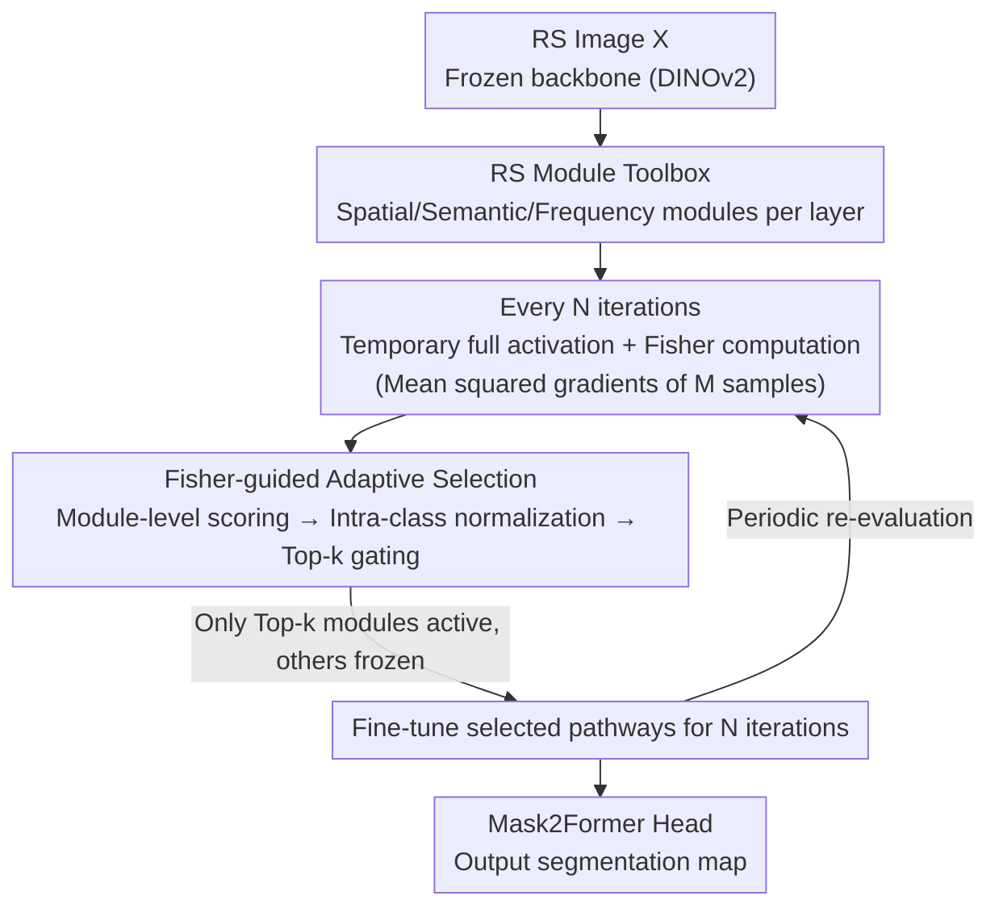

# CrossEarth-Gate: Fisher-Guided Adaptive Tuning Engine for Efficient Adaptation of Cross-Domain Remote Sensing Semantic Segmentation

**Conference**: CVPR 2026  
**Paper**: [CVF Open Access](https://openaccess.thecvf.com/content/CVPR2026/html/Cao_CrossEarth-Gate_Fisher-Guided_Adaptive_Tuning_Engine_for_Efficient_Adaptation_of_Cross-Domain_CVPR_2026_paper.html)  
**Code**: None (No repository link provided in the paper)  
**Area**: Remote Sensing / Cross-Domain Semantic Segmentation / Parameter-Efficient Fine-Tuning  
**Keywords**: RS Segmentation, Parameter-Efficient Fine-Tuning (PEFT), Domain Generalization/Adaptation, Fisher Information, Dynamic Module Selection

## TL;DR
To address the concurrent spatial, semantic, and frequency domain shifts in remote sensing (RS) imagery, CrossEarth-Gate integrates three types of PEFT modules (LoRA / Adapter / Earth-Adapter) as a "toolbox" into every backbone layer. By periodically measuring the contribution of each module to the task's gradient flow using Fisher information and activating only the Top-k most critical ones, it achieves 16 SOTAs across 18 RS cross-domain benchmarks with only 3-4M trainable parameters.

## Background & Motivation
**Background**: As Remote Sensing Geo-Foundation Models (GFMs) grow in scale, the prevailing approach involves using Parameter-Efficient Fine-Tuning (PEFT) to update a small subset of parameters for downstream tasks. Common PEFT methods target specific "functional pathways" of the Transformer: LoRA modifies Multi-Head Self-Attention (MSA) to enhance spatial dependency modeling; AdaptFormer modifies the MLP for high-level semantic refinement; and Earth-Adapter suppresses high-amplitude artifacts in the frequency domain.

**Limitations of Prior Work**: Domain shifts in RS are **multi-faceted**—variations in spectral ranges, geography, and climate zones simultaneously trigger three types of shifts: (1) spatial shifts (object scale/structural changes requiring geometric integrity); (2) semantic shifts (class appearance and conceptual differences); and (3) frequency shifts (high-frequency artifacts/texture noise from varying land covers). Existing PEFT methods focus on single pathways and can only address one aspect. For instance, the paper demonstrates that LoRA misclassifies water with high-frequency ripples as forests (failure in frequency), AdaptFormer fragments roads and loses spatial continuity (failure in space), and Earth-Adapter misidentifies waves as forests (failure in semantics).

**Key Challenge**: There is a fundamental conflict between the single-pathway, static module placement strategies and the "multi-faceted and unpredictable" nature of RS domain shifts. Methods specialized in one aspect fail when transferred to different domains. Furthermore, simply activating all three modules leads to performance degradation due to the explosion of trainable parameters and conflicting gradient updates (the "all-on without selection" configuration dropped points significantly in experiments).

**Goal**: To design a unified framework that simultaneously covers spatial, semantic, and frequency aspects without training all modules—achieving both "versatility" and "efficiency."

**Key Insight**: The adaptation process can be viewed as a **gradient flow**, where different modules provide different pathways for this flow. By periodically measuring "which pathway currently has the highest flow and greatest impact on output," one can "hook" into those specific paths and direct the gradients accordingly. The tool used to measure this "flow" is Fisher information.

**Core Idea**: First, construct an RS toolbox containing the three module types across every layer. Then, utilize a data-driven dynamic gating mechanism based on Fisher information to **activate only the Top-k modules most critical for the current task**, allowing the framework to "reconfigure" itself adaptively based on the domain.

## Method

### Overall Architecture
CrossEarth-Gate operates on a frozen ViT/DINOv2 backbone with two synergistic components: **① RS Module Toolbox**—Spacial (LoRA on MSA), Semantic (Adapter in parallel with MLP), and Frequency (Earth-Adapter at block output) PEFT modules are **initially inserted into every layer**, equipping the model with a "full kit" to combat three-way shifts. **② Fisher-guided Adaptive Selection**—Every $N$ training iterations, all modules in the toolbox are temporarily activated to compute Fisher information using a small batch of samples. An importance score is assigned to each "module × layer." Following intra-class normalization, only the Top-k modules are kept active while others are frozen. Gradients follow these selected pathways for the next $N$ iterations. This periodic re-evaluation forms a multi-stage, task-dynamic fine-tuning process.

### Key Designs

**1. RS Module Toolbox: Governing Spatial, Semantic, and Frequency Pathways via Three PEFT Types**

This design addresses the limitation where "single-pathway PEFT only treats one aspect." Rather than statically choosing a method for certain layers, CrossEarth-Gate blankets every layer with complementary modules:

- **Spatial Module (LoRA on MSA)**: Since MSA handles token relationships and captures multi-scale spatial dependencies, low-rank matrices are injected into the query/value projections of MSA. For pre-trained weights $W_0 \in \mathbb{R}^{d \times d}$, the update is assumed to have a low "intrinsic rank" and is represented as $W = W_0 + \Delta W = W_0 + BA$ ($A \in \mathbb{R}^{d \times r}, B \in \mathbb{R}^{r \times d}, r \ll d$). This adjusts the understanding of spatial context and object scales without altering frozen weights $W_Q, W_V$.
- **Semantic Module (Adapter on MLP)**: MLPs are considered the repository of factual/semantic knowledge. Generalizing concepts (e.g., "buildings" in rural vs. urban areas) requires modifying this knowledge. An Adapter ($W^{down}_i \in \mathbb{R}^{d \times \hat{d}}$ + GELU + $W^{up}_i \in \mathbb{R}^{\hat{d} \times d}, \hat{d} \ll d$) is added in parallel to each MLP. The block output becomes $\hat T_{i+1} = \mathrm{MLP}(\hat T^{attn}_i) + \mathrm{Adapter}_i(\hat T^{attn}_i) + \hat T^{attn}_i$, refining semantic transformations without disrupting the original knowledge flow.
- **Frequency Module (Earth-Adapter on Block Output)**: RS images frequently exhibit high-amplitude artifacts. Earth-Adapter uses Fourier Transforms to decompose features into low-frequency (structure) and high-frequency (detail/texture) components, processed by specialized lightweight adapter experts. A mixture-of-adapters router recombines them to suppress artifacts while preserving features, added via residual: $\tilde T_{i+1} = \hat T_{i+1} + \text{Earth-Adapter}_i(\hat T_{i+1})$.

**2. Fisher-guided Adaptive Selection: Using Fisher Information as a "Flow Meter" for Top-k Gating**

To avoid gradient conflicts and inefficiency, the framework uses the Fisher Information Matrix (FIM) to quantify the impact of perturbing a parameter on the model's output distribution. For a small perturbation $\delta$ to parameter $\theta$, the KL divergence is approximated as $\mathbb{E}_X[D_{KL}(P_\theta\|P_{\theta+\delta})] = \delta^\top F_\theta \delta + O(\delta^3)$. Since the full FIM is intractable, an empirical diagonal approximation is used, which equals the mean of the squared gradients:

$$\hat F_\theta = \frac{1}{N} \sum_{j=1}^{N} \big(\nabla_\theta \log P_\theta(Y_j|X_j)\big)^2$$

High $\hat F_\theta$ indicates a "high-flow channel" where gradients are large and impact on output is significant. Importance scores for a module $z$ at layer $i$ (parameters $\zeta^z_i$) are calculated by summing the Fisher scores: $\hat S^z_i = \sum_{\zeta^z_i} \hat F_{\zeta^z_i}$. **Intra-class normalization** is then applied: $S^z_i = \hat S^z_i / \sum_i^I \hat S^z_i$ ($I$ is the number of layers), ensuring different module types are comparable and preventing inherent bias from certain module types. 

### Loss & Training
The optimization objective is $\arg\min_{\zeta, \phi} \mathbb{E}_{(X,Y) \in D} \, \mathcal{L}(H_\phi(B_{\alpha, \zeta}(X)), Y)$, where only PEFT weights $\zeta$ and the decoding head $\phi$ are updated, while backbone $\alpha$ remains frozen. Mask2Former is used for the head with DINOv2 as the backbone. Standard supervised training is used for DG, while the DACS self-training framework is used for DA.

## Key Experimental Results

### Main Results
Across 18 benchmarks (12 CASID climate DG + 2 Potsdam/RescueNet disaster DG + 4 DA), the method achieves 16 SOTAs, with up to +3.2% mIoU over PEFT baselines.

| Benchmark (mIoU%) | Frozen | LoRA | AdaptFormer | Earth-Adapter | CrossEarth-Gate |
|---|---|---|---|---|---|
| CASID Sub→* Avg | 55.2 | 57.2 | 56.1 | 56.8 | **60.6 (+1.6)** |
| CASID Tem→* Avg | 63.6 | 64.0 | 64.1 | 64.5 | **65.1 (+0.6)** |
| CASID Tms→* Avg | 54.4 | 54.5 | 58.0 | 56.2 | **59.3 (+1.3)** |
| CASID Trf→* Avg | 59.2 | 59.8 | 61.8 | 60.6 | **62.4 (+0.6)** |
| DA Average | 56.4 | 57.6 | 57.7 | 58.1 | **59.1 (+1.0)** |
| Trainable Params (M) | 0 | 6.4 | 3.2 | 9.6 | **3.0~4.4** |

### Ablation Study
Ablation of core components (CASID, Mean is the average mIoU% across four source domains):

| Configuration | Sub | Tem | Tms | Trf | Mean | Insight |
|---|---|---|---|---|---|---|
| Full CrossEarth-Gate | 60.6 | 65.1 | 59.3 | 62.4 | **61.9** | — |
| w/o Spatial | 56.7 | 64.8 | 58.6 | 61.9 | 60.5 | Significant drop in Sub |
| w/o Semantic | 59.4 | 64.2 | 57.6 | 60.4 | 60.4 | Trf most affected |
| w/o Frequency | 57.5 | 63.8 | 59.3 | 60.9 | 60.4 | Sub clearly affected |
| w/o Selection (All-on) | 57.8 | 63.5 | 57.3 | 61.1 | **59.6** | Largest drop, most params |

### Key Findings
- **"All-on without Selection" performs worst (61.9 → 59.6)**: Blindly increasing parameters triggers gradient conflicts; dynamic gating is essential.
- **Three module types are non-expendable**: Removing any type leads to performance loss, confirming that RS domain shifts are multi-faceted.
- **Full-Tuning suffers catastrophic degradation in DG**: It overfits the source domain, performing worse than the Frozen baseline on DINOv2.

## Highlights & Insights
- **Formalizing PEFT module choice as Fisher flow gating**: Using empirical diagonal FIM combined with intra-class normalization creates a balanced selection mechanism that prevents specific modules from dominating.
- **Decoupling capability and efficiency**: The "toolbox + dynamic selection" paradigm ensures a high performance ceiling via a comprehensive set of modules while maintaining efficiency through sparse activation.
- **Adaptation in DA via Pseudo-labels**: Computing Fisher information for target domains using pseudo-labels extends the dynamic adaptation from DG to DA naturally.

## Limitations & Future Work
- **Omitted Hyperparameters in Main Text**: Specific values for $N$, $M$, and $k$ are relegated to the appendix, making sensitivity analysis difficult from the main paper alone.
- **Computational Overhead of Fisher Scoring**: Periodically activating all modules and calculating gradients involves additional training-time costs that are not fully quantified.
- **Static Module Types**: The toolbox is limited to the three predefined types; new types of shifts (e.g., temporal or multi-spectral specificities) would require manual expansions.

## Related Work & Insights
- **vs. Baseline PEFTs**: While LoRA/AdaptFormer/Earth-Adapter focus on single pathways, CrossEarth-Gate upgrades from "single-faceted static" to "multi-faceted dynamic" placement.
- **vs. Fisher-based Parameter Selection**: Existing methods typically select sparse **parameters**; this work elevates the selection to the **module** level, making it more suitable for heterogeneous adapter ensembles in RS.

## Rating
- Novelty: ⭐⭐⭐⭐ 
- Experimental Thoroughness: ⭐⭐⭐⭐⭐ 
- Writing Quality: ⭐⭐⭐⭐ 
- Value: ⭐⭐⭐⭐ 

<!-- RELATED:START -->

## Related Papers

- [\[CVPR 2026\] SegEarth-R2: Towards Comprehensive Language-guided Segmentation for Remote Sensing Images](segearth-r2_towards_comprehensive_language-guided_segmentation_for_remote_sensin.md)
- [\[CVPR 2026\] Semantic-Adaptive Diffusion for Dynamic Spatiotemporal Fusion](semantic-adaptive_diffusion_for_dynamic_spatiotemporal_fusion.md)
- [\[CVPR 2026\] HySeg: Learning Generative Priors for Structure-Aware Remote Sensing Segmentation](hyseg_learning_generative_priors_for_structure-aware_remote_sensing_segmentation.md)
- [\[CVPR 2026\] SkySense-VITA: Towards Universal In-context Segmentation of Multi-modal Remote Sensing Imagery](skysense-vita_towards_universal_in-context_segmentation_of_multi-modal_remote_se.md)
- [\[CVPR 2026\] ReAttnCLIP: Training-Free Open-Vocabulary Remote Sensing Image Segmentation via Re-defined Attention in CLIP](reattnclip_training-free_open-vocabulary_remote_sensing_image_segmentation_via_r.md)

<!-- RELATED:END -->
