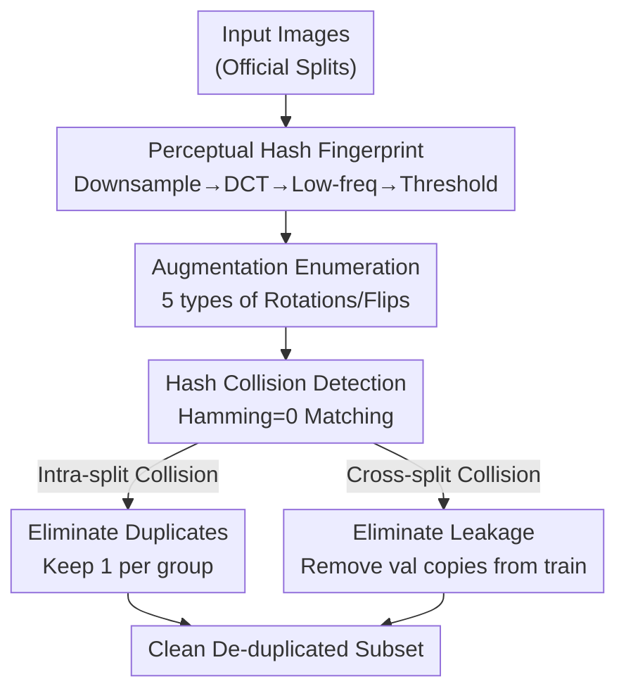

# Data Leakage Detection and De-duplication in Large Scale Geospatial Image Datasets

**Conference**: CVPR2026  
**arXiv**: [2304.02296](https://arxiv.org/abs/2304.02296)  
**Code**: https://github.com/yeshwanth95/Hash_and_search  
**Area**: Remote Sensing / Dataset Quality Auditing  
**Keywords**: Perceptual Hashing, Data Leakage, De-duplication, Building Footprint Extraction, Dataset Auditing

## TL;DR
This paper performs a quality audit on three commonly used remote sensing datasets for building footprint extraction using perceptual hashing. It discovers that the AICrowd Mapping Challenge dataset suffers from severe duplication (approx. 89% of training images are exact/augmented duplicates) and cross-split leakage (approx. 93% of validation images appear in the training set). The authors provide a lightweight, reusable de-duplication and leakage detection pipeline, revealing that many "SOTA" methods are actually overfitted to leaked data.

## Background & Motivation
**Background**: Building footprint extraction relies heavily on public benchmarks to train CNN/Transformer models. The AICrowd Mapping Challenge dataset, which provides MS-COCO format polygon annotations and a large scale (280,000 training and 60,000 validation 300x300 satellite tiles), has been utilized as the primary training and evaluation set by many recent polygon extraction methods, with some works using it exclusively.

**Limitations of Prior Work**: Researchers assume these public benchmarks are "clean" and directly use official train/val splits for experiments, performance benchmarking, and SOTA comparisons. However, no systematic check has been conducted to determine if internal duplicates or cross-split leakage exist within these large-scale datasets. If such issues occur, the reported high scores are invalid.

**Key Challenge**: Manual inspection of large datasets (ranging from hundreds of thousands to billions of images) is impractical. Furthermore, the contamination caused by duplication and leakage is implicit; a model's high score on a "test set" might simply result from the fact that it has already seen these images (and even memorized incorrect annotations) during training. This overfitting is often misinterpreted as strong generalization.

**Goal**: (1) Quantitatively audit the degree of duplication and leakage in three datasets: INRIA, SpaceNet 2, and AICrowd; (2) Provide the community with an inexpensive, easy-to-use, and dataset-agnostic pipeline for rapid dataset sanity checks.

**Key Insight**: The authors noted that they only need to detect **exact duplicates** and **augmented duplicates** (90°/180°/270° rotations + horizontal/vertical flips) rather than semantic neighbors. Under such transformations, "the same image" is highly correlated at the pixel level, which is a strength of perceptual hashing. Compared to self-supervised feature de-duplication that requires pre-training, perceptual hashing is training-free, computationally efficient, and insensitive to color the minor structural variations.

**Core Idea**: Use 64-bit perceptual hashing to calculate a fingerprint for every image (including its augmented versions). This reduces "finding duplicates/leakage" to hash collision detection (exact matching with a Hamming distance of 0), enabling auditing across hundreds of thousands of images via simple equality comparisons.

## Method

### Overall Architecture
The method is highly lightweight. The core steps involve: "calculating perceptual hashes for each image $\rightarrow$ using hash collisions to identify duplicates and leakage $\rightarrow$ eliminating colliding samples." The pipeline is dataset-agnostic and consists of three stages: first, calculating the perceptual hash of an image; second, detecting collisions within and between official splits to quantify duplication/leakage; and finally, eliminating augmented duplicates and cross-split leakage through augmentation enumeration to obtain a clean, de-duplicated subset.

### Key Designs

**1. Perceptual Hash Fingerprints: Compressing an image into 64 bits via low-frequency DCT, insensitive to color and micro-structures**

To find duplicates among hundreds of thousands of images, pixel-by-pixel comparison is unfeasible, and neural feature de-duplication requires pre-training and is difficult to generalize across datasets. The authors employ perceptual hashing: the input image is downsampled by factor $d$, followed by a $32 \times 32$ Discrete Cosine Transform $t$. Only the $8 \times 8$ lowest-frequency components $t_L$ in the top-left are retained. The mean of $t_L$ is used as a threshold for binarization and flattening to produce a 64-bit fingerprint $H_p$. Since low-frequency DCT captures the global structure and discards high-frequency details, the fingerprint is naturally insensitive to color changes and minor structural noise. This fits the goal of finding copies of the same image rather than semantic neighbors and allows images with different coordinates but identical content (e.g., pure water or grass tiles) to be identified as the same class.

**2. Hash Collision Detection: Unifying duplication/leakage detection as an equality comparison with Hamming distance 0**

With fingerprints generated, duplication and leakage detection are unified into a single operation: hash collision. Evaluation uses a bit depth of 64 and a Hamming distance threshold of 0 (strict equality). **Intra-split** collisions represent duplicates, while **inter-split** collisions (e.g., train vs. val) represent data leakage. Empirically, hash calculation takes ~4ms per image and comparison takes ~4ms (AMD EPYC 7313, 8 cores, 32GB RAM), ensuring the pipeline remains extremely fast even for large-scale datasets, which is critical for its ease of adoption.

**3. Augmentation Enumeration De-duplication: Catching "the same image in different poses" by hashing explicitly generated copies**

Exact hash matching only captures pixel-identical copies. However, many duplicates in datasets are "augmented copies" that have been rotated or flipped. Their pixel layouts and hashes change, so simple hashing of the original image misses them. The authors explicitly generate 5 augmented versions (90°, 180°, 270° rotations + horizontal/vertical flips) for every image and include them in the hash pool. If any augmentation of an image collides with another image, it is identified as an augmented duplicate. During de-duplication, one image per group is randomly retained; finally, cross-split collisions between train and val are checked to remove all leaked validation images from the training set. This process eliminates both internal redundancy and cross-split leakage to produce a truly clean training subset.

### Loss & Training
This work focuses on dataset auditing and does not involve model training or specific loss functions. The pipeline is training-free and does not require a GPU, relying solely on hash computation and matching.

## Key Experimental Results

### Main Results
A comparison of duplication/leakage audit results across three datasets (PHash, Hamming threshold 0). INRIA and SpaceNet 2 have negligible issues, whereas AICrowd is severely contaminated:

| Dataset | Audit Conclusion | Representative Overlap Rate |
|--------|----------|--------------|
| INRIA Aerial Labelling | Negligible (Identified "leakage" mostly involves low-contrast water/grass, representing false positives) | Order of $\sim 10^{-3}\%$ |
| SpaceNet 2 v2 | Negligible (Mostly no-data raster artifacts, representing false positives) | Order of $\sim 1\%$ |
| AICrowd (Official train→val) | Severe Leakage | 93.45% (56,368/60,317 val images in train) |
| AICrowd (Official train→test) | Severe Leakage | 93.26% (56,608/60,697) |
| AICrowd (Augmented intra-train) | Severe Duplication | 89.55% (251,403/280,741) |

The collapse of AICrowd's scale before and after de-duplication illustrates the severity of the redundancy:

| Split | Original Size | Unique Images | After Leakage Removal |
|------|----------|--------------|------------------|
| Training Set | 280,741 | 29,338 | 15,392 |
| Validation Set | 60,317 | 14,166 | — |

Out of the original 280,000 training images, only about 15,000 (roughly 5.5%) are truly unique and non-leaked.

### Ablation Study
The authors used Average Hash (AHash) for cross-validation to ensure that the contamination findings are not algorithm-dependent (results for AICrowd official splits, bracketed values are search set ratios):

| Comparison Direction | PHash Detection | AHash Detection |
|----------|------------|------------|
| Intra-train Duplicates | 166,193 (59.2%) | 167,829 (59.8%) |
| Train→Val Leakage | 95,241 (33.9%) | 97,950 (34.9%) |
| Val→Train Leakage | 56,368 (93.4%) | 56,431 (93.5%) |
| Test→Train Leakage | 56,608 (93.3%) | 56,740 (93.5%) |

Both hashing methods yield highly consistent contamination levels. AHash is slightly higher as it is more prone to false positives (misjudging similar but different images as duplicates), hence PHash is considered more suitable for large-scale auditing.

### Key Findings
- AICrowd's contamination is structural: ~89% of training images are duplicates, and ~93% of validation images are leaked into the training set. Testing on this dataset is essentially "re-testing the training set."
- Overfitting caused by leakage is visually verifiable: methods such as PolyWorld and HiSup not only achieve high scores but also **reproduce incorrect or incomplete GT annotations** from the training set, confirming that high scores come from memorization rather than generalization.
- The pipeline overhead is extremely low (~4ms hash/image, ~4ms comparison, CPU-only), making it suitable as a routine "dataset checkup" procedure.
- The few "leakages" detected in INRIA/SpaceNet were manually verified as low-information tiles (water/grass/no-data), where the hash algorithm's insensitivity led to false positives. This suggests that pipeline outputs should be interpreted alongside qualitative verification.

## Highlights & Insights
- **Reducing Dataset Auditing to Hash Equality**: Using 64-bit PHash with Hamming=0 simplifies duplication/leakage detection into cheap equality checks. This training-free, CPU-based approach is highly adoptable for the community.
- **Explicit Augmentation Enumeration for "Hidden Duplicates"**: Comparison of original images alone misses rotated/flipped copies. By explicitly including 5 geometric augmentations in the hash pool, the authors successfully identified the 89% redundancy in AICrowd.
- **Reproducing Error Annotations as Evidence**: Beyond numbers, the authors demonstrate that SOTA methods memorize incorrect ground truth. This transforms abstract "leakage" into undeniable qualitative proof of overfitting.
- **Transferability**: This auditing approach is applicable to any vision dataset where duplicates are geometric augmentations rather than semantic neighbors, such as classification, segmentation, or detection benchmarks.

## Limitations & Future Work
- **Detection Limited to Exact/Geometric Duplicates**: The Hamming=0 threshold and specific augmentation enumeration cannot handle cropping, scaling, or semantic duplicates. Such cases would require higher bit depths or self-supervised features.
- **Arbitrary Retention Strategy**: The "keep one per group" strategy does not consider preserving the highest quality annotations or the most representative samples.
- **Limited Audit Scope**: The study covers only three building footprint datasets. Whether the severe contamination of AICrowd extends to larger datasets like ImageNet/COCO/LAION remains to be explored.
- **Manual Verification of False Positives**: Detections in high-homogeneity datasets (like INRIA/SpaceNet) still require human eyes to distinguish between low-info tiles and true leakage.

## Related Work & Insights
- **vs. CE-Dedup / QHash**: While those methods de-duplicate to compress datasets while maintaining accuracy for "near-duplicates," this work focuses on **exposing benchmark contamination** and leakage for auditing purposes.
- **vs. Self-supervised Feature De-duplication**: Features from pre-trained descriptors might achieve higher rates but are computationally expensive on large datasets and generalize poorly. Perceptual hashing offers a training-free, universal, and faster alternative.
- **vs. SOTA on AICrowd (e.g., PolyWorld, HiSup)**: Instead of proposing a new model, this paper proves that high performance on this dataset is largely due to leakage-induced overfitting, prompting a re-evaluation of all reported results on AICrowd.

## Rating
- Novelty: ⭐⭐⭐ (Perceptual hashing is mature; the novelty lies in systematically using it to expose benchmark contamination with a reusable pipeline.)
- Experimental Thoroughness: ⭐⭐⭐⭐ (Three-way dataset auditing, AHash cross-validation, and qualitative evidence of overfitting provide solid conclusions.)
- Writing Quality: ⭐⭐⭐⭐ (Clear problem statement, detailed statistics, and convincing qualitative evidence.)
- Value: ⭐⭐⭐⭐ (Directly challenges the credibility of several SOTA results and provides the community with a low-cost auditing tool.)

<!-- RELATED:START -->

## Related Papers

- [\[CVPR 2026\] GeoSANE: Learning Geospatial Representations from Models, Not Data](geosane_learning_geospatial_representations_from_models_not_data.md)
- [\[CVPR 2026\] UniChange: Unifying Change Detection with Multimodal Large Language Model](unichange_unifying_change_detection_with_multimodal_large_language_model.md)
- [\[CVPR 2026\] Olbedo: An Albedo and Shading Aerial Dataset for Large-Scale Outdoor Environments](olbedo_an_albedo_and_shading_aerial_dataset_for_large-scale_outdoor_environments.md)
- [\[CVPR 2026\] Cross-modal Fuzzy Alignment Network for Text-Aerial Person Retrieval and A Large-scale Benchmark](cross-modal_fuzzy_alignment_network_for_text-aerial_person_retrieval_and_a_large.md)
- [\[ICCV 2025\] CityNav: A Large-Scale Dataset for Real-World Aerial Navigation](../../ICCV2025/remote_sensing/citynav_a_large-scale_dataset_for_real-world_aerial_navigation.md)

<!-- RELATED:END -->
