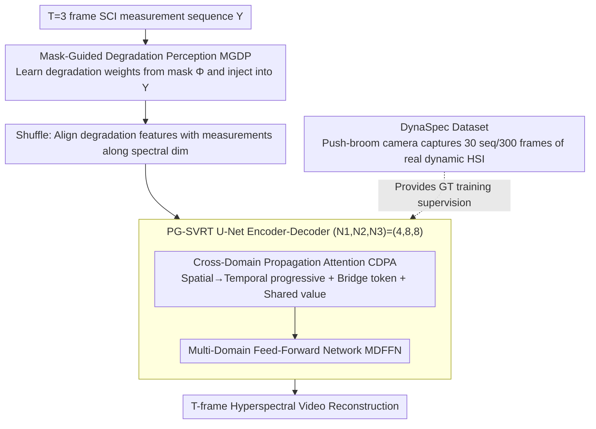

# Exploring Spatiotemporal Feature Propagation for Video-Level Compressive Spectral Reconstruction

**Conference**: CVPR 2026  
**arXiv**: [2603.00611](https://arxiv.org/abs/2603.00611)  
**Code**: [DynaSpec](https://github.com/nju-cite/DynaSpec)  
**Area**: Computational Spectral Imaging  
**Keywords**: Spectral Compressive Imaging, Hyperspectral Video Reconstruction, Spatiotemporal Feature Propagation, Transformer, DynaSpec Dataset

## TL;DR

The first to advance Spectral Compressive Imaging (SCI) from image-level to video-level reconstruction, constructing the first high-quality dynamic hyperspectral dataset DynaSpec (30 sequences/300 frames). Proposed PG-SVRT achieves 41.52dB PSNR and optimal temporal consistency through spatial-then-temporal progressive attention + bridging tokens, with FLOPs (28.18G) lower than several image-level SOTA methods.

## Background & Motivation

**Background**: Hyperspectral Images (HSI) can detect spectral properties of materials and are widely used in classification, detection, tracking, and autonomous driving. Spectral Compressive Imaging (SCI) compresses 3D data $X \in \mathbb{R}^{H \times W \times C}$ into a 2D measurement $Y \in \mathbb{R}^{H \times W'}$ via spatial-spectral encoding to achieve snapshot acquisition. Existing reconstruction methods (MST-L, DPU, RDLUF, etc.) have achieved excellent performance at the image level.

**Limitations of Prior Work**: (1) **Reconstruction Uncertainty**—Mask encoding inevitably loses spatial-spectral information, and recovering occluded content from a single frame has inherent ambiguity; (2) **Temporal Inconsistency**—Independent frame-by-frame reconstruction cannot guarantee temporal continuity, manifesting as flickering intensity curves and inter-frame jitter, which fails to meet video perception needs.

**Key Challenge**: Video-level reconstruction faces dual obstacles—**Data scarcity** (existing datasets are all image-level, and pseudo-video cropping lacks real motion degrees of freedom) and **Algorithmic bottlenecks** (existing methods struggle to efficiently model high-dimensional spatiotemporal dependencies—joint attention complexity explodes, while completely separate processing limits interaction).

**Goal**: To drive the leap of spectral reconstruction from image-level to video-level across three dimensions: data, model, and benchmark.

**Key Insight**: Fixed encoding patterns capture complementary features differently across adjacent frames—occluded information can be recovered through propagation from neighboring frames, which naturally enhances temporal consistency. This physical property provides a solid signal foundation for video-level reconstruction.

**Core Idea**: Utilize complementary features and temporal continuity of adjacent frames in temporal measurement sequences, achieving efficient video-level hyperspectral reconstruction through spatial-then-temporal progressive attention + bridging tokens.

## Method

### Overall Architecture

PG-SVRT aims to solve: given a sequence of $T=3$ SCI measurements, how to propagate complementary information from adjacent frames and ensure temporal consistency without letting the spatiotemporal attention complexity explode. The overall structure is a U-Net. Measurements first undergo Mask-Guided Degradation Perception (MGDP) to inject degradation priors, then a Shuffle aligns degradation features with measurements along the spectral dimension. This is followed by stacked Cross-Domain Propagation Attention (CDPA) + Multi-Domain Feed-Forward Network (MDFFN) for stage-wise encoding and decoding, finally outputting $T$ frames of hyperspectral reconstruction. The number of modules for the three layers is $(N_1, N_2, N_3)=(4,8,8)$, with base channels $C=N_\lambda=30$. The design relies on two pillars: first, a **real-captured dynamic hyperspectral dataset** providing ground truth for the "video-level reconstruction" problem for the first time; second, **spatial-then-temporal progressive attention** to decouple high-dimensional spatiotemporal dependencies efficiently without losing interaction.

### Key Designs

**1. DynaSpec Dataset: Creating a real ground truth for video-level spectral reconstruction**

The fundamental bottleneck for video-level reconstruction has not been algorithms but data—existing datasets are either image-level (CAVE/KAIST) or low spectral resolution downstream datasets. Previously, "videos" were forged by cropping images, lacking real motion degrees of freedom. This paper uses a GaiaField push-broom hyperspectral camera to capture controllable objects frame-by-frame, manually designing translation/rotation/articulated movements to simulate real-world motion. The result is 30 scenes, 300 HSI frames, with a spatial resolution of 1280×1280 and a spectral resolution of 2nm, covering 400–700nm with 151 channels. To ensure ground truth credibility, acquisition followed five principles: continuous inter-frame motion following physical laws, long-exposure noise reduction, spectral response correction, illumination spectra exclusion to approximate reflectance, and intensity calibration using invariant objects to eliminate thermal drift. This "controlled frame-by-frame scanning" rather than synthesis ensures a reliable supervision signal.

**2. Mask-Guided Degradation Perception (MGDP): Explicitly telling the network "where encoding loss is high"**

SCI mask encoding inherently loses spatial-spectral information non-uniformly. If the network treats all positions equally, targeted reconstruction is difficult. MGDP is located at the front of the architecture. It first compresses the mask $\Phi$ according to the SCI architecture (SD/DD) into $\Phi_s$, then crops and copies it into $\Phi_p$. It uses Conv$_{1\times1}$+sigmoid to learn the intensity distribution difference between $\Phi$ and $\Phi_p$ to obtain weights $W_\Phi$, applying it element-wise to measurement features before concatenating with the original measurement: $Y_{in} = \text{Concat}(\text{Conv}(W_m \odot F_m(Y)), Y)$. Thus, degradation priors are explicitly encoded into the input, so the network "knows" the degree of encoding loss at each spatial-spectral position before entering subsequent attention, allocating capacity where completion is most needed.

**3. Cross-Domain Propagation Attention (CDPA): Balancing efficiency and full interaction with spatial-then-temporal progressive attention**

This is the core module of PG-SVRT, stacked in U-Net stages for spatiotemporal feature propagation. Direct joint spatiotemporal attention complexity scales quadratically with $THW$, making it unaffordable. Conversely, completely separating spatial and temporal processing cuts off feature interaction. CDPA performs spatial then temporal processing, reusing the same features between steps. The spatial step partitions features into non-overlapping windows ($H_{win}=8,W_{win}=32$). Instead of all-to-all attention within windows, it pools $Q_s$ to generate a small set of bridging tokens $B_s\in\mathbb{R}^{Thw\times N_B\times C}$ ($N_B=64$) as intermediaries. Q–K–V interact indirectly through them, avoiding extra projection parameters:

$$Y_s^{out} = \text{GConv}\big(A(Q_s, B_s, A(B_s, K_s, V_s, \tau_1), \tau_2)\big) + Y_{N1}$$

The temporal step, after reshaping dimensions, **directly reuses the spatial attention output as the value**: $Y_t^{out} = A(Q_t, K_t, Y_t, \tau_3)$. Since $T$ is small and frames are strongly correlated, no temporal windows are used. Together, these compress total complexity to $O = 4THWC^2 + 4THWN_BC + 2T^2HWC$. As long as $2N_B < H_{win}W_{win}$ (here $128<256$), the bridging token is strictly cheaper than full window attention; while "shared value" lets spatial features flow into the temporal domain at no cost, achieving cross-domain propagation without new projection overhead.

### Loss & Training

Training uses multi-stage RMSE loss, Adam optimizer ($\beta_1=0.9, \beta_2=0.999$), learning rate $3\times10^{-4}$ with cosine annealing to $1\times10^{-6}$, running for 80 epochs with batch size 2 on a single RTX 3090. For fair evaluation, the authors compare across four SCI systems: SD-CASSI, DD-CASSI, PMVIS, and NDSSI.

## Key Experimental Results

### Main Results—Comparison with SOTA Methods (DD-CASSI System)

| Method | Conference | PSNR-K↑ | PSNR-D↑ | SAM-K↓ | ST-RRED-K↓ | GFLOPs |
|------|------|---------|---------|--------|-----------|--------|
| MST-L | CVPR'22 | 39.99 | 39.58 | 3.82 | 30.99 | 28.23 |
| PADUT | ICCV'23 | 38.61 | 40.41 | 4.72 | 47.19 | 32.78 |
| DPU | CVPR'24 | 40.02 | 41.01 | 5.22 | 25.90 | 31.04 |
| DPU* (+Temporal) | CVPR'24 | 40.50 | 41.36 | 5.17 | 26.71 | 77.36 |
| **PG-SVRT** | **Ours** | **41.23** | **41.82** | **3.81** | **19.35** | **28.18** |

### Ablation Study

| Configuration | PSNR | SSIM | SAM↓ | ST-RRED↓ | GFLOPs |
|------|------|------|------|----------|--------|
| Baseline (F-MSA+FFN) | 39.97 | 0.9827 | 5.53 | 43.90 | 30.11 |
| + CDPA | 41.30 (+1.33) | 0.9884 | 4.32 | 25.44 | 21.11 |
| + CDPA + MGDP | 41.41 (+0.11) | 0.9886 | 4.25 | 24.63 | 21.31 |
| + CDPA + MGDP + MDFFN | **41.52** (+0.11) | **0.9893** | **3.91** | **23.25** | 28.18 |

### Key Findings

- DD-CASSI is decisively the best among the four SCI architectures (PSNR 41.52 vs runner-up NDSSI 37.84) due to its high spectral sampling efficiency and clear structural representation.
- CDPA contributes the most (+1.33dB PSNR) while actually reducing FLOPs (30.11→21.11G) because bridging tokens replace full window attention.
- The spatial-then-temporal + shared value strategy is optimal (41.52), outperforming parallel processing (41.35) and temporal-then-spatial (41.04).
- Although PG-SVRT is a video model, its per-frame FLOPs (28.18G) are lower than image-based methods like DAUHST (35.93G).

## Highlights & Insights

- **Trinity of Data, Model, and Benchmark**: The DynaSpec dataset, PG-SVRT model, and four-system benchmark provide significant momentum for dynamic computational spectral imaging.
- **Clever Bridging Token Design**: Pooling Query to generate intermediary tokens for indirect attention achieves zero extra parameters and reduced complexity. It strictly reduces computation when $2N_B < H_{win}W_{win}$.
- **Shared Value Cross-Domain Propagation**: Spatial attention output serves directly as temporal attention value, elegantly solving multi-domain interaction without extra projection overhead.
- **Convincing DPU* Comparison**: The cost of simply concatenating temporal frames (77.36G) is much higher than PG-SVRT (28.18G), yet the performance is inferior.

## Limitations & Future Work

- DynaSpec only contains 30 scenes/300 frames; its limited diversity and scale might lead to overfitting specific motion patterns.
- Fixed frame count $T=3$; extension to long sequences is unverified, while actual dynamic scenes might need larger temporal windows.
- Training uses 256×256 crops; full resolution (1280×1280) inference efficiency and effects are not discussed.
- Explicit motion modeling methods like optical flow alignment or deformable convolutions were not explored in combination with CDPA.

## Related Work & Insights

- **vs DPU (CVPR'24)**: Image-level SOTA; simply concatenating temporal frames (DPU*) leads to a 2.5× explosion in FLOPs but limited gains (+0.48dB). PG-SVRT achieves video-level reconstruction elegantly with shared value propagation and lower FLOPs.
- **vs MST-L/CST-L**: Early image-level methods are far weaker in temporal consistency (ST-RRED 30–35) compared to PG-SVRT (19.35).
- The bridging token concept can be generalized to other attention designs requiring efficient high-dimensional data processing.
- Fair comparison across SCI systems provides a crucial reference for hardware selection in spectral imaging (DD-CASSI is clearly superior).

## Rating

- Novelty: ⭐⭐⭐⭐ Video-level spectral reconstruction is a new problem definition; CDPA bridging tokens and shared value propagation are creative.
- Experimental Thoroughness: ⭐⭐⭐⭐⭐ Four SCI system comparisons, 12 SOTA comparisons, multi-dimensional ablation, and real prototype verification.
- Writing Quality: ⭐⭐⭐⭐ Clear motivation and complete mathematical derivation of the unified SCI framework.
- Value: ⭐⭐⭐⭐⭐ The combination of dataset, method, and benchmark will have a profound impact on dynamic computational spectral imaging.

<!-- RELATED:START -->

## Related Papers

- [\[CVPR 2026\] Regulating Rather than Constraining: Adaptive Guidance for Complex Spectral Reconstruction in Pansharpening](regulating_rather_than_constraining_adaptive_guidance_for_complex_spectral_recon.md)
- [\[CVPR 2026\] FUSAR-GPT: A Spatiotemporal Feature-Embedded and Two-Stage Decoupled Visual Language Model for SAR Imagery](fusar-gpt_a_spatiotemporal_feature-embedded_and_two-stage_decoupled_visual_langu.md)
- [\[AAAI 2026\] M3SR: Multi-Scale Multi-Perceptual Mamba for Efficient Spectral Reconstruction](../../AAAI2026/remote_sensing/m3sr_multi-scale_multi-perceptual_mamba_for_efficient_spectral_reconstruction.md)
- [\[CVPR 2026\] Semantic-Adaptive Diffusion for Dynamic Spatiotemporal Fusion](semantic-adaptive_diffusion_for_dynamic_spatiotemporal_fusion.md)
- [\[CVPR 2026\] ChangeBridge: Spatiotemporal Image Generation with Multimodal Controls for Remote Sensing](changebridge_spatiotemporal_image_generation_with_multimodal_controls_for_remote.md)

<!-- RELATED:END -->
