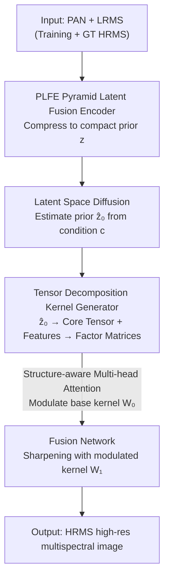

# Fast Kernel-Space Diffusion for Remote Sensing Pansharpening

**Conference**: CVPR 2026  
**arXiv**: [2505.18991](https://arxiv.org/abs/2505.18991)  
**Code**: None (Paper not public)  
**Area**: Remote Sensing Image Fusion / Diffusion Models / Pansharpening  
**Keywords**: Kernel-Space Diffusion, Pansharpening, Latent Diffusion, Tensor Decomposition Kernels, Fast Inference

## TL;DR
KSDiff shifts the diffusion process from "pixel-wise image reconstruction" to "generating a global prior vector in latent space," which then modulates the convolution kernels of a regressive pansharpening network. This approach combines the global distribution modeling of diffusion models with the inference speed of traditional CNNs—achieving leading metrics across WV3/GF2/QB datasets with an inference time of only 0.077 s, over 500 times faster than pixel-space diffusion baselines.

## Background & Motivation
**Background**: Pansharpening aims to fuse a high-resolution panchromatic (PAN) image and a low-resolution multispectral (LRMS) image into a high-resolution multispectral (HRMS) image that contains both spatial details and spectral information. Mainstream deep learning methods (PanNet, FusionNet, LAGConv, etc.) treat this as a deterministic nonlinear mapping from PAN+LRMS to HRMS, producing results in a single forward pass with high speed.

**Limitations of Prior Work**: Deterministic CNNs perform sample-wise regression and struggle to capture the "global prior" (statistical regularities of entire oceans or urban scenes) in remote sensing data distributions. Diffusion models are excellent at modeling complex conditional distributions and capturing such global context, but they require iterative denoising from pure Gaussian noise in pixel space. High-resolution remote sensing images with many channels (far exceeding RGB) require dozens or hundreds of network function evaluations (NFE), making inference extremely slow—Table 1 shows PanDiff takes 261 s and PLRDiff takes 40 s per image, while CNNs only take 0.04–0.4 s.

**Key Challenge**: A trade-off exists between global distribution modeling capability (diffusion) and inference efficiency (regressive CNNs). Fundamentally, most spatial and spectral information in pansharpening is already present in the input; the network's task is "refinement" rather than "reconstruction from scratch." Thus, using diffusion to reconstruct the entire high-resolution image from pure noise is both counter-intuitive and wasteful.

**Goal**: To create a pansharpening framework that enjoys the global prior of diffusion while maintaining CNN inference speeds, and can be embedded into existing regressive networks in a plug-and-play manner.

**Key Insight**: Since diffusion is expensive when "reconstructing the whole image," it should not generate images. Instead, it should generate a compact global prior representation in latent space to be injected into the CNN kernels, allowing the kernels to perform fusion "with global context." By running diffusion only in a low-dimensional latent space, the inference burden is drastically reduced.

**Core Idea**: Use latent space diffusion to generate "convolution kernels" rather than "pixels"—Kernel-Space Diffusion (KSDiff). The latent representation output by the diffusion model is modulated into convolution kernels through tensor decomposition and structure-aware multi-head attention, driving a standard regressive backbone to complete the fusion.

## Method

### Overall Architecture
The core of KSDiff is a **Kernel Generator**: it takes two inputs—the global prior $\hat{\mathbf{z}}_0$ produced by the diffusion model in latent space, and local information extracted from PAN/LRMS features—and fuses them into a modulation weight. This weight multiplies a standard base convolution kernel $\mathbf{W}_0$ to obtain the final kernel $\mathbf{W}_1$ with global context, which is then used in a standard U-Net style pansharpening network. The prior $\mathbf{z}$ is compressed by a **Pyramid Latent Fusion Encoder (PLFE)**. During inference, the diffusion model "estimates" this prior using only PAN/LRMS. The system is trained in **two stages**: first, the encoder + kernel generator + fusion network are pre-trained to obtain the ground truth prior $\mathbf{z}_0$; then, the diffusion model is trained to generate $\mathbf{z}_0$ from condition $\mathbf{c}$.

### Key Designs

**1. Kernel-Space Diffusion: Generating kernels instead of pixels**

Addressing the pain point that "pixel-space diffusion is too slow and performs redundant reconstruction," KSDiff moves diffusion entirely away from the image space. It does not predict HRMS but instead predicts a low-dimensional latent prior $\mathbf{z}\in\mathbb{R}^{N\times C_z}$ ($N\ll HW$). This prior modulates the kernels: the final kernel is $\mathbf{W}_1=\mathbf{W}_0\odot\mathbf{W}$, where $\mathbf{W}_0$ is a learnable standard base kernel and $\mathbf{W}$ is the modulation weight derived from the prior, using element-wise multiplication $\odot$. Consequently, iterative sampling only occurs in a tiny latent space, while the main network remains a single-forward regressive CNN—achieving diffusion-level global distribution modeling while maintaining CNN-level inference speed. Table 1 shows it produces images in 0.077 s, compared to 261 s for PanDiff and 40 s for PLRDiff—a three-magnitude difference—while achieving better metrics.

**2. PLFE Pyramid Latent Fusion Encoder: Compressing multi-modal priors without crosstalk**

How the prior $\mathbf{z}$ is generated is critical—simply concatenating PAN, LRMS, and GT into an encoder would cause entanglement of spatial and spectral information. PLFE solves this with two principles: first, a multi-scale pyramid structure where PAN/LRMS branch features are "refined" by HRMS features at each layer, integrating spatial cues and spectral semantics step-by-step. Second, a **Dynamic Fusion Gate** adaptively weighs "original branch features" against "HRMS-guided features." Guidance uses cross-attention with linear complexity (reducing memory from $\mathcal{O}((HW)^2)$ to $\mathcal{O}(d^2)$ where $d\ll HW$ for large images). The fusion gate calculates a Sigmoid weight per channel:

$$\mathbf{G}_{\text{gate}}=\sigma(\mathrm{Conv}_g[\mathbf{X},\mathrm{Proj}(\mathbf{Y})]),\quad \mathbf{F}=\mathbf{G}_{\text{gate}}\odot\mathbf{X}+(1-\mathbf{G}_{\text{gate}})\odot\mathrm{Proj}(\mathbf{Y})+\mathbf{O}$$

Where $\mathbf{X}$ is the branch feature, $\mathbf{Y}$ is the HRMS-guided feature, and $\mathbf{O}$ is the cross-attention output. The gate allows the network to trust the HRMS prior where reliable while preserving original features where misalignment might occur, maintaining spatio-spectral consistency and reducing artifacts. After $M$ pyramid levels, it projects to the compact prior $\mathbf{z}$. Note that two PLFEs are used: $\mathrm{PLFE}_1$ takes PAN+LRMS+GT (providing the target prior during training), and $\mathrm{PLFE}_2$ takes only PAN+LRMS (serving as the diffusion condition during inference, with a halved architecture compared to $\mathrm{PLFE}_1$).

**3. Tensor Decomposition Kernel Generator + Structure-Aware Multi-head Attention: Efficient and controllable prior injection**

Flattening the latent code through an MLP to reshape it into a convolution kernel would lead to a parameter explosion ($\mathcal{O}(C_{\text{in}}C_{\text{out}}k^2 C_z)$) and lack layer-wise control. KSDiff instead uses Tucker tensor decomposition to decompose the modulation weight $\mathbf{W}$:

$$\mathbf{W}=\mathcal{G}\times_1\mathbf{U}^{(1)}\times_2\mathbf{U}^{(2)}\times_3\mathbf{U}^{(3)}\times_4\mathbf{U}^{(4)}$$

Where $\mathcal{G}\in\mathbb{R}^{r_1\times r_2\times r_3\times r_4}$ is the compact core tensor and $\mathbf{U}^{(n)}$ are four factor matrices. The division of labor is clever: the **core tensor** $\mathcal{G}$ comes from the global prior—derived by mean-pooling $\mathbf{z}$ into a centroid vector followed by an MLP; the **factor matrices** come from local input features via a lightweight shared backbone and four attention heads, termed "Structure-aware Multi-head Attention." Thus, "the global prior determines the core structure of the kernel, while local features determine the expansion across four dimensions." Complexity drops from the MLP's $\mathcal{O}(C_{\text{in}}C_{\text{out}}k^2 C_z)$ to $\mathcal{O}(C_z r_1 r_2 r_3 r_4+\sum_n r_n d_n)$ ($r_n\ll d_n$). Ablations show that replacing this with an MLP of equal capacity increases parameters tenfold and **fails to converge**, proving the tensor structure is a prerequisite for convergence, not just a parameter-saving trick.

### Loss & Training
A **two-stage** serial strategy is used. **Pre-training stage**: Jointly optimize $\mathrm{PLFE}_1$, the kernel generator, and the fusion network to allow the encoder to learn to construct informative priors. The objective is the $L_1$ reconstruction loss $\mathcal{L}_{\text{s1}}=\|\mathbf{G}-\mathbf{H}_1\|_1$ ($\mathbf{G}$ is GT HRMS, $\mathbf{H}_1$ is reconstruction output). **Diffusion training stage**: Use DDPM forward noise addition and DDIM for accelerated sampling. The diffusion network learns to estimate the prior from condition $\mathbf{c}$ ($\mathrm{PLFE}_2$ encoded PAN+LRMS). The standard $\boldsymbol{\epsilon}$-prediction is replaced with direct prediction of the original sample $\mathbf{z}_0$ (mathematically equivalent but more stable in this task), and the diffusion model is **jointly trained** with the regressor:

$$\mathcal{L}_{\text{s2}}=\mathbb{E}_{t,\mathbf{z}_0,\mathbf{c}}[\|\mathbf{z}_0-\mathbf{z}_\theta(\mathbf{z}_t,t,\mathbf{c})\|_1]+\lambda\|\mathbf{G}-\mathbf{H}_2\|_1$$

The weight $\lambda$ is empirically set to 1. Ablations show joint training significantly outperforms a separate scheme. At inference, only $\mathrm{PLFE}_2$ + reverse diffusion + kernel generator + fusion network are used; GT is not involved.

## Key Experimental Results

Datasets follow Wald's protocol, using WorldView-3 (WV3), GaoFen-2 (GF2), and QuickBird (QB). Reduced-resolution metrics include SAM/ERGAS/Q2n/SCC; full-resolution metrics include HQNR/$D_\lambda$/$D_s$. Trained on RTX 4090 with AdamW.

### Main Results

WV3 Reduced-resolution + Full-resolution + Runtime (Selected methods):

| Method | SAM ↓ | ERGAS ↓ | Q2n ↑ | SCC ↑ | HQNR ↑ | Runtime(s) |
| :--- | :--- | :--- | :--- | :--- | :--- | :--- |
| FusionNet (DL) | 3.3252 | 2.4666 | 0.9044 | 0.9807 | 0.9406 | 0.065 |
| PanMamba (DL, sub-best SAM) | 2.9132 | 2.1843 | 0.9204 | 0.9855 | 0.9304 | 0.405 |
| PanDiff (Pixel Diffusion) | 3.2968 | 2.4647 | 0.8935 | 0.9860 | 0.9203 | 261.410 |
| PLRDiff (Pixel Diffusion) | 4.3704 | 3.4408 | 0.8539 | 0.9215 | 0.7361 | 40.142 |
| **Ours (KSDiff)** | **2.8102** | **2.0756** | **0.9221** | **0.9870** | **0.9468** | **0.077** |

On GF2 / QB reduced-resolution, KSDiff ranks first across all four metrics (GF2: SAM 0.6675 / ERGAS 0.5973 / Q2n 0.9855 / SCC 0.9900; QB: SAM 4.4747 / ERGAS 3.6289 / Q2n 0.9365 / SCC 0.9839). The runtime of 0.077 s is on par with traditional DL, roughly 3400x faster than PanDiff (261 s) and 520x faster than PLRDiff (40 s), validating the claim of being "over 500x faster than diffusion baselines."

### Ablation Study (WV3 Reduced-resolution, Table 4)

| Configuration | SAM ↓ | ERGAS ↓ | Q2n ↑ | SCC ↑ | Runtime(s) | Notes |
| :--- | :--- | :--- | :--- | :--- | :--- | :--- |
| Baseline Network | 3.1428 | 2.2961 | 0.9070 | 0.9827 | 0.035 | No latent diffusion prior |
| w/o PLFE | 3.0071 | 2.2367 | 0.9119 | 0.9838 | 0.079 | Replace PLFE with concat encoder |
| w/o Structure-Aware | — | — | — | — | — | Equal MLP, **failed to converge** |
| Separate-Training | 2.9799 | 2.1775 | 0.9118 | 0.9854 | 0.077 | Diffusion and regression trained separately |
| **Ours (full)** | **2.8102** | **2.0756** | **0.9221** | **0.9870** | **0.077** | Complete model |

### Key Findings
- **Latent diffusion prior provides largest gain**: Removing the prior regresses to the Baseline (SAM 2.8102 → 3.1428), indicating the global context from diffusion is the primary performance source.
- **Structure-aware tensor kernel generator is necessary for convergence**: An equal-capacity MLP increases parameters by 10x and fails to converge, proving the tensor decomposition is the key to learning "global prior modulated kernels."
- **Joint Training > Separate Training**: Separate training lags behind the full model, verifying that end-to-end optimization of diffusion estimation and image reconstruction is superior.
- **Smaller core tensors can be better + 4D structure matters** (Table 6): On FusionNet, $(4,4,2,2)$ outperforms larger core tensors like $(8,8,\cdot)$, suggesting a LoRA-like low-rank phenomenon. However, increasing kernel-size dimensions from 1 to 2 helps; $(r_1,r_2,1,1)$ collapses to a matrix, losing the 4D tensor structure.
- **Plug-and-play potential** (Table 5): Replacing convolutions in DiCNN, FusionNet, and LAGNet with KSDiff modulated kernels consistently improves performance (e.g., FusionNet SAM 3.3252 → 3.0622).

## Highlights & Insights
- **"Diffusion-generated kernels" is a transferable paradigm**: Moving expensive generative models to a low-dimensional parameter/kernel space and using their output to modulate a lightweight main network—this aligns with Neural Network Diffusion (generating network weights with diffusion) and is applicable to any low-level vision task where global priors are needed (SR, denoising, dehazing).
- **Clever use of tensor decomposition for "prior influence"**: The core tensor comes from the global prior while factor matrices come from local features, naturally decoupling global and local information into different degrees of freedom in the kernel. This is more controllable than MLP reshape and solves convergence issues.
- **Dynamic fusion gate as a robust trick**: Learning a per-channel gate to trust guidance when reliable and preserve original features otherwise is directly applicable to any cross-modal feature fusion scenario to reduce artifacts.
- **Key Insight**: The overhead of iterative sampling in diffusion is locked into an $N\times C_z$ latent space, decoupling it from output image resolution—this is why it achieves "diffusion quality + CNN speed."

## Limitations & Future Work
- **Dependency on GT HRMS for prior supervision**: $\mathrm{PLFE}_1$ requires GT to learn the target prior, relying heavily on paired training data in Wald's protocol; prior quality in real satellite scenes without GT needs further validation.
- **Backbone coverage**: While Table 5 shows success in embedding into various networks, sensitivity regarding which specific layers to replace or how many layers are needed has not been fully explored.
- **Diffusion still requires multi-step sampling**: Despite DDIM acceleration, sampling overhead is still higher than one-step regression (0.035 s baseline vs 0.077 s).
- **No code**: The method involves multiple engineering details (PLFE, tensor kernel generator, two-stage training) described in supplemental materials; the barrier to reproduction is high.
- **Future Directions**: Exploring self-supervised priors without GT, integrating more advanced few-step sampling/consistency models, and extending to other fusion tasks like hyperspectral sharpening.

## Related Work & Insights
- **vs. Pixel-Space Diffusion (PanDiff / PLRDiff)**: These reconstruct HRMS from noise in pixel space; they are high quality but slow (40–261 s). Ours moves diffusion to latent space to generate a prior for a regressive backbone, being over 500x faster with better metrics. The fundamental difference is "Diffusion for Image Reconstruction" vs. "Diffusion for Modulation Prior Generation."
- **vs. Deterministic DL (FusionNet / LAGConv / PanMamba)**: These offer speed but lack global distribution modeling. Ours maintains similar speeds (0.077 s) while injecting a diffusion prior, serving as a plugin to enhance these backbones.
- **vs. Dynamic Kernels (LAGConv / AKD)**: Those methods condition kernels on local input features. Ours adds conditioning on a **global prior** generated by diffusion and uses tensor decomposition for controlled injection.
- **vs. Latent Diffusion (LDM / DiffIR)**: While both use latent space to save compute, KSDiff's latent representation does not decode to an image; it modulates kernels, representing "Diffusion Prior → Parameter Space" instead of "Diffusion → Image Space."

## Rating
- Novelty: ⭐⭐⭐⭐⭐ "Kernel-space diffusion" is a novel and self-consistent shift from pixel reconstruction to generating modulation priors.
- Experimental Thoroughness: ⭐⭐⭐⭐ Complete across three datasets, full/reduced resolution, and multiple backbones, but lacks real-world zero-GT validation and open-source verification.
- Writing Quality: ⭐⭐⭐⭐ Clear motivation and standard formulas; some details are relegated to supplemental materials.
- Value: ⭐⭐⭐⭐⭐ Simultaneously solves speed and quality issues for diffusion-based pansharpening and offers plug-and-play enhancement for existing networks.

<!-- RELATED:START -->

## Related Papers

- [\[CVPR 2026\] Remote Sensing Image Super-Resolution for Imbalanced Textures: A Texture-Aware Diffusion Framework](remote_sensing_image_super-resolution_for_imbalanced_textures_a_texture-aware_di.md)
- [\[CVPR 2026\] Cross-Scale Pansharpening via ScaleFormer and the PanScale Benchmark](cross-scale_pansharpening_via_scaleformer_and_the_panscale_benchmark.md)
- [\[CVPR 2026\] Spatial-Spectral Residuals Informed Diffusion Neural Operator for Pan-sharpening](spatial-spectral_residuals_informed_diffusion_neural_operator_for_pan-sharpening.md)
- [\[CVPR 2026\] Semantic-Adaptive Diffusion for Dynamic Spatiotemporal Fusion](semantic-adaptive_diffusion_for_dynamic_spatiotemporal_fusion.md)
- [\[CVPR 2026\] GeoDiT: A Diffusion-based Vision-Language Model for Geospatial Understanding](geodit_a_diffusion-based_vision-language_model_for_geospatial_understanding.md)

<!-- RELATED:END -->
