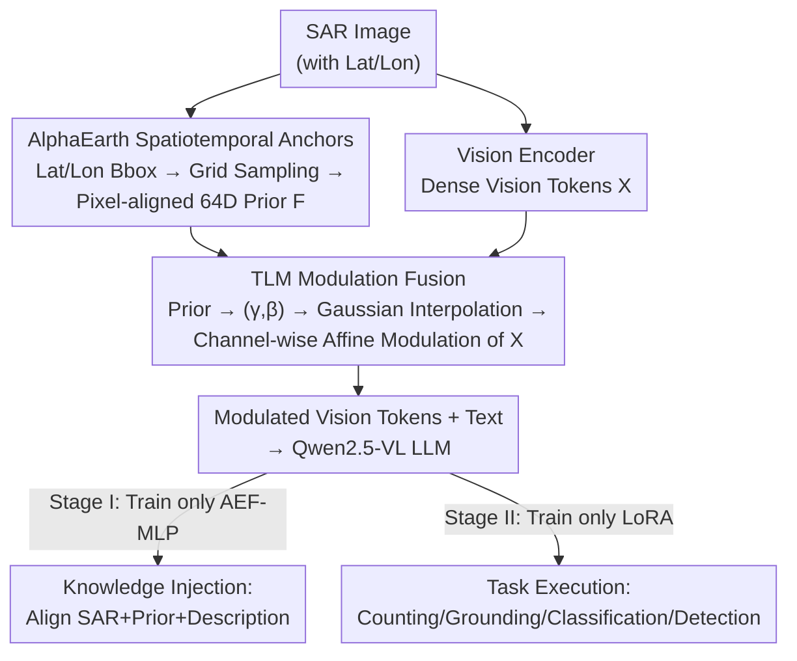

# FUSAR-GPT: A Spatiotemporal Feature-Embedded and Two-Stage Decoupled Visual Language Model for SAR Imagery

**Conference**: CVPR 2026  
**Paper**: [CVF Open Access](https://openaccess.thecvf.com/content/CVPR2026/html/Zhang_FUSAR-GPT_A_Spatiotemporal_Feature-Embedded_and_Two-Stage_Decoupled_Visual_Language_Model_CVPR_2026_paper.html)  
**Code**: None  
**Area**: Remote Sensing / SAR Vision-Language Models  
**Keywords**: SAR Interpretation, Vision-Language Models, Geospatial Priors, Conditional Modulation, Two-Stage SFT

## TL;DR
FUSAR-GPT customizes a vision-language model for SAR (Synthetic Aperture Radar) imagery based on Qwen2.5-VL-7B. It leverages the multi-source spatiotemporal features from the global remote sensing foundation model AlphaEarth as a "world knowledge" prior. After aligning them via "spatiotemporal anchors," the prior is injected into the vision backbone using Token-wise Linear Modulation (TLM) to compensate for the sparse and polarized representations of SAR images. Utilizing a two-stage decoupled SFT training strategy of "knowledge injection / task execution," the model outperforms mainstream VLMs by more than 10% across four SAR interpretation tasks: counting, grounding, classification, and detection.

## Background & Motivation
**Background**: SAR is an all-weather, all-time active microwave imaging modality crucial for remote sensing. Recently, general vision-language models (such as CLIP, BLIP, and Qwen-VL) have demonstrated powerful open-world understanding capabilities on natural RGB images. The remote sensing community has also begun adapting VLMs to this domain (e.g., EarthGPT, GeoChat, EarthDial), yet the vast majority of these studies target optical/multispectral RGB imagery.

**Limitations of Prior Work**: Directly applying RGB-pretrained VLMs to SAR data results in a severe performance collapse. The authors decompose this issue into three main points: (a) **SAR-optical modality gap**—the imaging mechanism of SAR is fundamentally different from that of visible light, causing a mismatch in the pretrained feature distribution and leading to the failure of the transfer paradigm; (b) **Ignorance of geospatial priors**—existing SAR interpretation methods inherit frameworks designed for natural images, lacking spatial awareness and wasting geographical scene priors, which leads to errors in high-level semantic reasoning (e.g., misidentifying urban buildings as metallic targets) and exacerbates hallucinations; (c) **Information sparsity and polarization**—coherent SAR imaging is highly sensitive to geometric and dielectric properties, resulting in an extremely high dynamic range. Artificial targets (such as corner reflectors) generate oversaturated strong scattering, whereas natural terrains (such as water surfaces) become vast dark regions. Consequently, the model's attention is dominated by a few highlights, and the rich contextual semantics within the dark areas are systematically ignored.

**Key Challenge**: Single-modality SAR information itself is both sparse and polarized, which is insufficient to support high-level semantic understanding in VLMs. Furthermore, forcing a single-stage fine-tuning to simultaneously optimize "multimodal fusion (SAR + prior + text)" and "instruction-driven task execution" leads to mutual conflict and performance degradation between the two objectives.

**Goal**: (1) Re-supplement SAR with a stable and globally consistent external semantic prior; (2) Inject this external prior without disrupting the learned spatial structure of the vision backbone; (3) Separate "learning to interpret SAR" and "learning to perform tasks" during training to prevent mutual interference.

**Key Insight**: The authors notice the existence of a global remote sensing foundation model, **AlphaEarth (AEF)**, which fuses heterogeneous data such as optical, SAR, and LiDAR into a 64-dimensional continuous spatiotemporal embedding field covering the entire globe. Given the true latitude and longitude of a SAR image, the corresponding geographical semantic vector can be "queried" from this embedding field as a stable world knowledge prior to compensate for the sparse SAR representations.

**Core Idea**: Establish a "SAR image-text-geographical feature" triplet paradigm. Use **spatiotemporal anchors** to precisely align the AEF geographical prior with SAR pixels, inject it into the vision tokens via **TLM conditional modulation**, and separate knowledge injection from task execution using **two-stage decoupled SFT**.

## Method

### Overall Architecture
FUSAR-GPT is built upon Qwen2.5-VL-7B as its backbone and primarily performs two operations: **multi-source spatiotemporal feature embedding** and **two-stage decoupled SFT**.

The input is a SAR image with geographic coordinates. First, a set of 64-dimensional geographic semantic vectors is sampled from the AlphaEarth embedding field based on the image's coordinate bounding box. Each geographic coordinate is then mapped to the pixel coordinates of the SAR image via linear transformation, obtaining a set of "geography-pixel-semantic" strictly aligned sparse priors (spatiotemporal anchors). Next, the vision encoder encodes the SAR image into dense vision tokens. The **TLM module** converts the sparse AEF priors into channel-wise affine modulation parameters $(\gamma,\beta)$ and aligns them with the visual feature map via Gaussian spatial interpolation. After that, it performs token-wise modulation on the vision representations. This step only "fine-tunes" the vision tokens without altering the spatial encoding of the backbone. The modulated vision tokens, together with the text, are fed into the LLM. Training contains two stages: Stage I only trains the AEF embedding MLP to align "SAR + geographic prior" with descriptive text (knowledge injection); Stage II freezes the upstream modules and only trains LoRA to perform specific downstream tasks (task execution).

### Key Designs

**1. SAR Image-Text-Geographical Feature Triplet + Spatiotemporal Anchor Alignment: Supplementing Sparse SAR with Stable "World Knowledge"**

The microwave coherent imaging of SAR causes severe content imbalance and sparse semantics, making it difficult for the model to comprehend dark scenes relying solely on the image itself. The authors introduce the global remote sensing foundation model AlphaEarth (AEF) as a third modality. AEF compresses heterogeneous multi-source data (such as optical, SAR, and LiDAR) into a globally covered, 64-dimensional continuous spatiotemporal embedding field, acting as an off-the-shelf geographical "world knowledge" lookup table.

To utilize it, this external knowledge must be **precisely anchored to specific spatial locations within the SAR image**, which forms the "spatiotemporal anchors." For any SAR image, its spatiotemporal bounding box $B=[lon_{min},lat_{min},lon_{max},lat_{max},y]$ (where $y$ is the imaging year) is first determined. A regular $N_{lon}\times N_{lat}$ grid is constructed over $B$, with node coordinates defined as $lon_i=lon_{min}+i\cdot\Delta lon$ and $lat_j=lat_{min}+j\cdot\Delta lat$. At each geographic node, the AEF is queried to obtain the 64-dimensional vector for that year $a_{ij}=I_y(lon_i,lat_j)\in\mathbb{R}^{64}$. Then, the geographic coordinates are linearly mapped to the SAR pixel coordinates $(x_{ij},y_{ij})$. Finally, they are organized into an aligned set $F(B,y)=\{(lon_{ij},lat_{ij},x_{ij},y_{ij},a_{ij})\}_{i,j}$ containing "geographic coordinates-pixel indices-semantic embeddings." In this way, cross-modal priors can be accurately injected into specific spatial locations of the SAR image. The authors emphasize: although AEF includes a temporal dimension, **temporal dynamics are not explicitly modeled** here. Instead, it is used as a macro-geographical semantic prior that remains relatively stable on an annual scale—this stability is crucial for compensating for SAR noise/specular reflection areas (e.g., enhancing weak structures in farmland and providing clean, stable object representations in specular noise regions).

**2. Token-wise Linear Modulation (TLM): "Modulating" Heterogeneous Sparse Priors into Vision Tokens without Disrupting the Backbone**

AEF priors are sparsely sampled geographical semantic vectors, whereas vision tokens are dense deep image features. Their formats and modalities are heterogeneous. Simple concatenation or direct addition can cause alignment misalignment, increase computational complexity, and potentially disrupt the learned spatial structures of the vision backbone. Inspired by conditional normalization, TLM does not treat the AEF as an auxiliary input feature, but rather as a **conditional signal to generate modulation parameters** that perform channel-wise affine transformations on the vision tokens.

This is accomplished in three steps. **Prior-to-Modulation Mapping**: Each AEF vector $v_i\in\mathbb{R}^D$ is projected into a $2C$-dimensional space via a two-layer MLP with SiLU, producing a pair of scaling and shifting coefficients: $h_i=\phi(W_1 v_i+b_1)$ and $(\gamma_i,\beta_i)=W_2 h_i+b_2$, which are stacked into matrices $\Gamma,B\in\mathbb{R}^{S\times C}$ (where $S$ is the number of valid priors, and $C$ is the visual hidden dimension). **Gaussian Spatial Alignment**: The normalized AEF coordinates are mapped onto the $H\times W$ feature map to obtain continuous positions $(\tilde y_i,\tilde x_i)$. At each spatial location $(h,w)$, interpolation weights are defined using a distance-based Gaussian kernel $\tilde w_i(h,w)=\exp(-\frac{(h-\tilde y_i)^2+(w-\tilde x_i)^2}{2\sigma^2})$. The weights are column-normalized along the prior dimension to yield $\sum_i w_i(h,w)=1$, resulting in a weight matrix $W\in\mathbb{R}^{S\times HW}$. **Weighted Aggregation & Modulation**: The modulation parameters at sparse locations are aggregated to each spatial grid cell using the weight matrix $W$, i.e., $\Gamma_{hw},B_{hw}=W^\top(\Gamma,B)$. The modulation field is then applied to the vision tokens using the bijective mapping $\pi$ from spatial grid cells to token indices:

$$x'_{\pi(h,w)}=x_{\pi(h,w)}\odot\big(1+\gamma(h,w)\big)+\beta(h,w)$$

In this way, the prior only "fine-tunes" the vision tokens in the spatial and channel dimensions while the main vision pathway remains unchanged. This successfully injects cross-modal priors and preserves the spatial encodings learned by the backbone, thereby improving the stability and discriminability of SAR representations.

**3. Decoupled Two-Stage SFT: Separating "Learning to Interpret SAR" and "Learning to Perform Tasks" at the Parameter Level**

General VLMs exhibit a huge domain gap on SAR data due to their optical pretraining. Optimizing both "multimodal fusion (SAR + AEF + text)" and "instruction-driven task execution" simultaneously in a single stage causes conflict and mutual degradation between the two objectives. The authors decouple the parameters $\Theta=\theta_v\cup\theta_{ae}\cup\theta_{llm}$ (vision encoder / AEF embedding MLP / LLM backbone) into groups and optimize them in stages.

**Stage I (Cross-Modal Alignment & Knowledge Injection)**: Using a descriptive corpus dataset $D_1=\{(I_{sar},F_{ae},T_{desc})\}$ (where $T_{desc}$ mainly consists of comprehensive geographical descriptions such as terrains and spatial distributions from FUSAR-GEOVL-1M), the model **freezes the vision encoder $\theta_v$ and the LLM backbone $\theta_{llm}$, and only trains the AEF embedding MLP $\theta_{ae}$**. The objective is to maximize the likelihood of the description text: $L_1(\theta_{ae})=-\mathbb{E}_{D_1}[\log P(T\mid E_v(I;\theta_v^{frozen}),E_{ae}(F;\theta_{ae});\theta_{llm}^{frozen})]$—forcing the MLP to learn how to efficiently fuse multi-source semantics and align them with descriptive texts. **Stage II (Task Inference & LLM Activation)**: Using an instruction dataset $D_2=\{(I_{sar},F_{ae},T_{inst},T_{ans})\}$ (with instructions covering grounding, classification, counting, and detection), the model freezes the vision encoder, the trained Stage I $\theta_{ae}^*$, and the default LLM weights, and **only updates the injected LoRA parameters $\theta_{lora}$** to maximize the task answer likelihood $L_2(\theta_{lora})$. Because the input features have already achieved SAR domain adaptation and cross-modal alignment in Stage I, the LLM in Stage II can focus solely on parsing instructions and performing complex analysis and reasoning.

> ⚠️ Note on training configuration discrepancy between text and figure: Section 3.3 of the main text explicitly states that Stage I **only trains** the AEF-MLP $\theta_{ae}$ and Stage II **only trains** LoRA. However, the caption of Fig. 2 states that "Stage-1 jointly updates LoRA and the TLM-MLP." This note follows the main text equations (12)-(15); please refer to the original paper for definitive details.

### Loss & Training
Both stages use AdamW with a warm-up ratio of 0.05, FlashAttention-2, DeepSpeed ZeRO Stage-2, BFloat16, and rank-8 LoRA ($\alpha=32$, applied to all linear layers). Stage I is trained for 30 epochs with a learning rate of $10^{-4}$ to perform cross-modal semantic alignment; Stage II is trained for 5 epochs with a learning rate of $10^{-5}$ to perform stable task-level adaptation. Since Qwen2.5-VL uses absolute coordinate encoding, all box annotations are first aligned to its uniform resolution. Inference is accelerated using vLLM. All experiments are conducted on 4 A100 GPUs.

## Key Experimental Results

Data are sourced from the FUSAR-GEOVL subset of FUSAR-KLIP that retains real-world latitude and longitude (satisfying the AEF geolocational requirements). Initially, 10k image-text pairs are selected, and AlphaEarth vectors are extracted based on coordinates to construct 10k AEF-image-text triplets. From these, a 2k subset with precise object bounding boxes is selected for downstream task training and evaluation. Four mainstream SAR interpretation tasks are evaluated: target counting, spatial grounding, target classification, and target detection. Baselines include Qwen2/2.5/3-VL, LLaVA, and InternVL series.

### Main Results

Counting + Spatial Grounding (Excerpt from Table 2, in %):

| Model | Scale | Counting @Acc | Grounding Acc@100 | Grounding Acc@50 | Grounding Top1 |
|------|------|-----------|--------------|-------------|-----------|
| Qwen2.5-VL | 7B | 34.85 | 30.81 | 57.07 | 78.28 |
| Qwen3-VL | 4B | 45.45 | 43.94 | 71.21 | 82.32 |
| Qwen3-VL | 8B | 41.41 | 42.93 | 71.72 | 85.86 |
| LLaVA-1.6 | 7B | 44.44 | 39.90 | 70.20 | 85.86 |
| InternVL-3.5 | 4B | 40.40 | 39.90 | 70.20 | 83.84 |
| **FUSAR-GPT** | **7B** | **52.53** | **52.02** | **79.29** | **91.41** |

- For the counting task, most baselines range from 30% to 40%, whereas FUSAR-GPT achieves 52.53%, outperforming the best baseline by over 7%. Moreover, "scaling up" general models yields no benefit (Qwen3-VL 8B's 41.41% is actually lower than 4B's 45.45%), indicating that scale alone cannot resolve the structural bottleneck of strong noise and weak textures in SAR.
- Grounding divides the image into a 3×3 grid to determine which grid cell contains the target. FUSAR-GPT surpasses the best baseline by 8-12% across Acc@100, Acc@50, and Top1 metrics, with a substantial lead in Top1 (91.41%) demonstrating its stability in identifying key regions under multi-target scenarios.

Detection (Table 4, F1, IoU=0.25/0.50, in %):

| Model | All F1@0.25 | Plane F1@0.25 | Ship F1@0.25 | All F1@0.50 |
|------|-------------|---------------|--------------|-------------|
| Qwen2.5-VL-7B | 47.1 | 47.5 | 38.5 | 27.7 |
| **FUSAR-GPT** | **74.8** | **75.7** | **57.1** | **58.7** |

- Under IoU=0.25, the overall F1 score for detection is boosted from 47.1% to 74.8% (an improvement of nearly 28 percentage points). Plain F1 increases from 47.5% to 75.7%, and Ship F1 increases from 38.5% to 57.1%, demonstrating greater robustness toward small-scale, low-contrast targets. A clear lead is maintained even under a more rigorous IoU=0.50 setting.
- Classification (Table 3, predicting the category given a bounding box, fairly compared only with Qwen2.5-VL series): Coarse-grained Plane/Ship accuracies both surpass Qwen2.5-VL-7B by over 12% (76.85 vs 64.66, 67.42 vs 55.19), with even more pronounced advantages in fine-grained categories (several fine-grained classes jump from 0% or low scores to 70%-100%).

### Ablation Study
The paper does not provide a standard module-level ablation table (e.g., "removing a specific module"), but instead analyzes the accuracy dynamics of the four tasks across **different training stages** in Fig. 5 (⚠️ the table below is compiled based on the textual descriptions from Fig. 5, not exact numerical values):

| Configuration | Phenomenon | Explanation |
|------|------|------|
| General VLM Baselines | Significantly lag across all four tasks | Optical pretraining is unsuitable for SAR |
| FUSAR-GPT (After Stage I) | Leads by a large margin from early on | The geographical prior injected in Stage I yields faster convergence and higher data efficiency |
| FUSAR-GPT (After Stage II) | Maintains and expands the lead | Decoupled training allows the LLM to focus on task inference |

### Key Findings
- **Prior injection yields more than a higher ceiling; it achieves faster convergence and higher data efficiency**: FUSAR-GPT outperforms all baselines from the very beginning of training, which the authors attribute to the robust prior knowledge injected during SFT Stage I.
- **Scaling up general VLMs is ineffective for SAR**: Qwen3-VL 8B actually underperforms its 4B counterpart in counting. This indicates that the strong noise and sparse textures of SAR present a structural bottleneck that cannot be resolved solely by piling up parameters. Targeted modality adaptation is essential.
- **Small-scale/Low-contrast scenarios benefit the most**: In detection, the F1 improvement for small-scale, low-contrast targets such as ships is remarkable, proving that geographical priors effectively compensate for dark/weak features.

## Highlights & Insights
- **Using a "global remote sensing foundation model" as an external world knowledge lookup table**: Instead of training a new prior, this method directly retrieves the pre-existing 64-dimensional global spatiotemporal embedding field of AlphaEarth by latitude and longitude. This offers a highly cost-effective and physically meaningful cross-modal compensation strategy, which can be extended to other texture-scarce or label-scarce remote sensing modalities (e.g., hyperspectral, night-time light, InSAR).
- **TLM adopts a conditional normalization paradigm for non-disruptive prior injection**: By transforming heterogeneous, sparse priors into a $(\gamma, \beta)$ modulation field and aligning them to the visual grid via Gaussian interpolation, this design injects channel-wise semantics while preserving the spatial encoding of the backbone. This is more elegant than mere concatenation or addition, making it globally applicable to general "sparse external condition $\rightarrow$ dense feature" fusion scenarios.
- **Decoupled training approach of "learning the world first, then learning tasks"**: The model first trains only the fusion MLP to establish multi-modal alignment, and then trains only the LoRA to learn downstream tasks, preventing conflict between the two objectives. This strategy offers valuable insights for any fine-tuning scenario with the dual burden of domain adaptation and task adaptation.

## Limitations & Future Work
- **Heavy reliance on precise geographical coordinates**: The spatiotemporal anchors require real coordinates to query AEF. SAR images without geographical metadata or with inaccurate geopositioning cannot benefit from this method, limiting its applicability to historical or anonymized data.
- **Lack of explicit temporal dynamic modeling**: The authors explicitly treat AEF as an annual-scale stable prior, neglecting temporal dynamics in rapidly changing scenarios (such as floods, construction, or moving targets), which remains a potential area for improvement.
- **Absence of standard module-level ablation**: The paper fails to provide a comparison table (e.g., "w/o AEF / w/o TLM / w/o Two-Stage") to quantify the individual contributions of each component. Furthermore, discrepancies in the parameter configurations of Stage I between the main text and figure captions warrant caution when reproducing the results.
- **Limited evaluation scale**: The training and evaluation on downstream tasks only use a small 2k labeled subset, limiting the diversity of categories and scenes. The generalizability of the findings needs to be validated on larger-scale benchmarks.

## Related Work & Insights
- **vs SARCLIP / SARLANG-1M**: These models perform basic modality alignment and zero-shot generalization for SAR, but they remain at the feature-alignment level, neglecting SAR's modality-specific characteristics and systematically ignoring geographical priors. FUSAR-GPT pushes SAR interpretation toward multi-task, open-ended comprehension using AEF geographical priors, TLM injection, and two-stage SFT.
- **vs EarthGPT / GeoChat / EarthDial**: These remote sensing VLMs mainly target optical/multispectral imagery (although EarthDial supports multi-temporal multi-sensor datasets including SAR, it remains a general conversation framework). FUSAR-GPT is a SAR-specific VLM designed explicitly to compensate for the sparse and polarized nature of SAR.
- **vs Direct Fine-Tuning of Qwen2.5-VL-7B**: Under the same 7B backbone, FUSAR-GPT comprehensively outperforms it across all four tasks. The performance gap stems from geographical prior injection and decoupled training, rather than model scale. This confirms that "optimizing modality adaptation is better than blindly scaling up general models."

## Rating
- Novelty: ⭐⭐⭐⭐ The first work to treat a global remote sensing foundation model as world knowledge and inject it into a SAR-VLM using conditional modulation. The triplet paradigm and TLM approach are highly novel.
- Experimental Thoroughness: ⭐⭐⭐ Solid comparisons across four tasks against multiple baselines, but lacks module-level ablation studies, evaluates on a small subset, and has a discrepancy between the text and figures.
- Writing Quality: ⭐⭐⭐⭐ The three-point motivation is clearly decomposed, methods and equations are comprehensive, and only the discrepancy in training configurations between text and figures requires careful reading.
- Value: ⭐⭐⭐⭐ Provides a reusable paradigm of "external geographical prior + non-disruptive injection + decoupled training" for sparse SAR interpretation.

<!-- RELATED:START -->

## Related Papers

- [\[CVPR 2026\] Exploring Spatiotemporal Feature Propagation for Video-Level Compressive Spectral Reconstruction](exploring_spatiotemporal_feature_propagation_for_video-level_compressive_spectra.md)
- [\[CVPR 2026\] GeoDiT: A Diffusion-based Vision-Language Model for Geospatial Understanding](geodit_a_diffusion-based_vision-language_model_for_geospatial_understanding.md)
- [\[CVPR 2026\] UniChange: Unifying Change Detection with Multimodal Large Language Model](unichange_unifying_change_detection_with_multimodal_large_language_model.md)
- [\[CVPR 2026\] GeoViS: Geospatially Rewarded Visual Search for Remote Sensing Visual Grounding](geovis_geospatially_rewarded_visual_search_for_remote_sensing_visual_grounding.md)
- [\[CVPR 2026\] AVION: Aerial Vision-Language Instruction from Offline Teacher to Prompt-Tuned Network](avion_aerial_visionlanguage_instruction_from_offli.md)

<!-- RELATED:END -->
