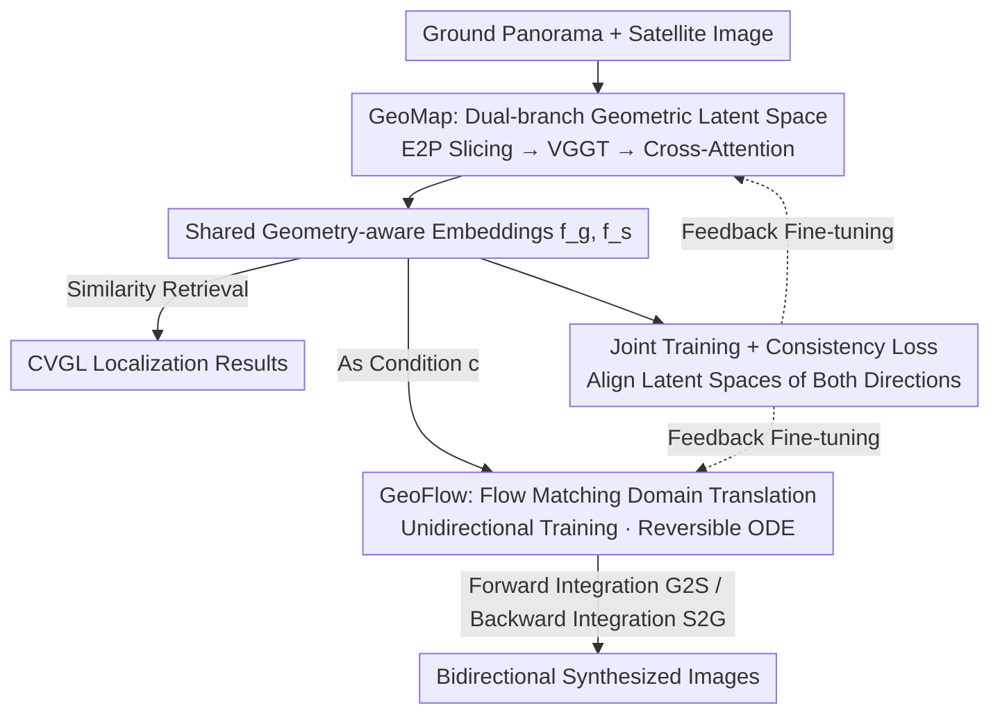

# Geo2: Geometry-Guided Cross-view Geo-Localization and Image Synthesis

**Conference**: CVPR 2026  
**Paper**: [CVF Open Access](https://openaccess.thecvf.com/content/CVPR2026/html/Zhang_Geo2_Geometry-Guided_Cross-view_Geo-Localization_and_Image_Synthesis_CVPR_2026_paper.html)  
**Code**: https://fobow.github.io/geo2.github.io/  
**Area**: Remote Sensing / Cross-view Geo-Localization  
**Keywords**: Cross-view Geo-localization, Cross-view Image Synthesis, Geometry Foundation Models, Flow Matching, Shared Geometric Latent Space  

## TL;DR
Geo2 leverages 3D priors from a Geometry Foundation Model (VGGT) to embed ground panoramas and satellite images into a **shared geometry-aware latent space**. This framework enables Cross-view Geo-localization (CVGL) and bidirectional Cross-view Image Synthesis (CVIS) to mutually enhance each other within the same architecture. By utilizing reversible flow matching, bidirectional generation is achieved through unidirectional training, setting new SOTA benchmarks in both localization and synthesis on CVUSA/CVACT/VIGOR.

## Background & Motivation
**Background**: Two core tasks exist in cross-view geospatial learning: CVGL (retrieving the geographic location of a ground-level street-view image from a satellite image database) and CVIS (synthesizing corresponding views between ground and satellite). Both fundamentally rely on establishing **geometric correspondence** between ground-level and bird's-eye views. Historically, numerous works have integrated geometric cues into models: GeoDTR uses a geometric layout extractor for CVGL, while CVIS methods employ height estimation, geometric projection, volume density modeling, or BEV estimation.

**Limitations of Prior Work**: Despite both tasks relying on geometry, the vast majority of works (see Table 1 in the paper) treat them as **two independent problems**. The geometric modules used are often customized for a single task (custom modules or predefined transformations like polar transformation), leading to poor generalization. Consequently, CVGL and bidirectional CVIS rarely benefit from each other in a unified framework—for instance, BEV estimation might assist ground→satellite synthesis but is difficult to apply to the satellite→ground direction.

**Key Challenge**: There is a lack of a **sufficiently general geometric prior** that holds for both tasks and both directions. Furthermore, mainstream CVIS methods (GAN/Diffusion + polar transformation assumptions) are inherently **irreversible**. Training for one direction does not enable the other, requiring separate models for bidirectional generation (e.g., GCCDiff).

**Key Insight**: Recent Geometry Foundation Models (GFMs, such as DUSt3R / MASt3R / VGGT) can predict generalizable 3D geometric attributes (depth, point maps, camera poses) from multi-view or even single-view images, serving as a natural source for a "universal geometric prior." However, the authors observed (Figure 1 in the paper) that **directly** feeding both ground and satellite images into VGGT leads to distorted reconstructions due to the massive viewpoint gap, and the spherical distortion of ground panoramas degrades feature quality—GFMs cannot be used off-the-shelf.

**Core Idea**: Use the geometric prior of VGGT to construct a **shared geometry-aware latent space** for ground and satellite views. This space reduces cross-view discrepancies for more accurate localization and naturally bridges bidirectional synthesis. A **reversible flow matching** model is employed for generation, allowing bidirectional inference from unidirectional training. Finally, joint training aligns the latent spaces for localization and synthesis, enabling mutual reinforcement.

## Method

### Overall Architecture
Geo2 is a unified framework that takes a pair of ground image $I^g$ and satellite image $I^s$ as input. The outputs include CVGL retrieval results and bidirectional CVIS synthesized images (G2S / S2G). The pipeline consists of three steps: First, **GeoMap** encodes both views into a shared geometric latent space to obtain embeddings $f^g, f^s$. These embeddings are used directly for CVGL retrieval via similarity. Simultaneously, they serve as conditions for **GeoFlow**—a flow matching model conditioned on geometry-aware latent vectors. Leveraging the reversibility of ODEs, **bidirectional synthesis (G2S and S2G) is achieved by training only in the ground→satellite (G2S) direction**. Finally, **Joint Training** fine-tunes GeoMap and GeoFlow together with a consistency loss to align the latent spaces, allowing localization and generation to benefit each other.

The key design philosophy is to reformulate CVIS from traditional "conditional generation" into a "domain translation" problem, thereby leveraging flow matching reversibility for bidirectional synthesis.

### Key Designs

**1. GeoMap: Dual-branch Embedding into Shared Geometry-aware Latent Space**

To address the issues of distorted reconstruction and panorama distortion, GeoMap uses **two independent branches** for ground and satellite views instead of processing them in a single multi-view inference. Since satellite images are single-view perspective images, $t^s = \text{VGGT}(I^s)$ directly yields geometric features. Ground panoramas are equiangular and highly distorted; thus, the authors first perform **equiangular-to-perspective (E2P) transformation** to slice the panorama into $V$ perspective patches $\{I_{P_i}\}_{i=1}^{V} = \text{E2P}(I^g)$. These patches provide dense coverage of the horizontal field of view and are fed into VGGT in a multi-view manner to obtain $t^g \in \mathbb{R}^{V\times C\times H_1\times W_1}$. This step essentially "translates" the panorama into a perspective distribution familiar to VGGT, restoring the quality of geometric features.

To compress these into low-dimensional retrieval embeddings, geometric features are first reduced to dimension $D$ via convolution ($t^{s\prime}=\text{Conv}(t^s)$). Meanwhile, a pre-trained CNN extracts semantic tokens $q^s, q^g$ from original images. Using semantic tokens as queries, **cross-attention** aggregates information from geometric features: $\text{out}^s = \text{Attn}(q^s, t^{s\prime}, t^{s\prime})$, followed by mean pooling and normalization to obtain the final embedding $f^s$ (similarly for $f^g$). Thus, $f^g$ and $f^s$ **simultaneously encode geometry and semantics** within the same space. CVGL performs retrieval via similarity optimized by InfoNCE loss. This shared space is the foundation for the geometric consistency reused by CVIS.

**2. GeoFlow: Flow Matching for Reversible Domain Translation**

Addressing the irreversibility of GAN/Diffusion-based CVIS, GeoFlow uses **flow matching** to explicitly model the transformation between ground and satellite domains as a probability path. It first encodes images into latent spaces $x^g, x^s$ using a pre-trained RAE. The path is defined via optimal transport displacement interpolation $x_t = (1-t)\,x^g + t\,x^s,\; t\in[0,1]$. A network $G_\theta$ is trained to predict the vector field $v = x^s - x^g$, with the loss:

$$\mathcal{L}_{IG} = \lVert G_\theta(x_t, t, c) - v \rVert^2,$$

where condition $c$ is the geometry-aware embedding from GeoMap. The backbone uses a lightweight DiT with a DDT head.

The ingenuity lies in bidirectional capabilities: the trained $G_\theta$ defines an ODE. G2S synthesis is the forward integration $x^s = x^g + \int_0^1 G_\theta(x_t,t,c)\,dt$. By **reversing the integration direction**, one obtains S2G: $x^g = x^s - \int_0^1 G_\theta(x_t,t,c)\,dt$. The model achieves reverse generation without ever being trained on the satellite→ground direction. Unlike GCCDiff, which requires separate training for each direction, Geo2 obtains bidirectional capability through unidirectional training.

**3. Joint Training + Consistency Loss: Mutual Enhancement**

Since both GeoMap and GeoFlow consume the same shared embeddings $f^g, f^s$, a three-stage joint training is used: first, freeze CNN/VGGT backbones and train GeoMap with $\mathcal{L}_{GL}$ (InfoNCE) for $T_1$ rounds to establish the shared latent space; then train GeoFlow for $T_2$ rounds; finally, perform **joint fine-tuning** for $T_3-T_2$ rounds with an added consistency loss:

$$\mathcal{L}_{KL} = \text{KL}(f^g \,\Vert\, f^s) + \text{KL}(f^s \,\Vert\, f^g),$$

to explicitly align ground and satellite embedding distributions. The InfoNCE loss is defined as:

$$\mathcal{L}_{GL} = -\log\frac{\exp(f^g\cdot f^s_{+}/\tau)}{\sum_{i=1}^{N}\exp(f^g\cdot f^s_i/\tau)},$$

where $\tau$ controls the distribution tightness. The consistency loss ensures that the latent representations for synthesis are consistent, which in turn makes retrieval more robust. Experiments show $\mathcal{L}_{KL}$ improves both retrieval accuracy and bidirectional generation quality.

### Loss & Training
Total Objective = Task-specific losses + Joint stage consistency loss: InfoNCE $\mathcal{L}_{GL}$ for CVGL, $L_2$ reconstruction/flow matching loss $\mathcal{L}_{IG}$ for CVIS, and $\mathcal{L}_{KL}$ during joint training. Total updates follow $\mathcal{L}_{GL} + \beta\mathcal{L}_{KL}$. Training is conducted in three stages (GeoMap, then GeoFlow, then Joint Fine-tuning).

## Key Experimental Results

### Main Results: Cross-view Geo-localization (CVGL)
Comparison with SOTA on CVUSA / CVACT / VIGOR (R@1, %). While CVUSA is nearly saturated, the advantage becomes more pronounced on harder benchmarks:

| Dataset / Setting | Metric | Geo2 | Prev. Best | Gain |
|--------|------|------|----------|------|
| CVUSA | R@1 | 98.83 | 98.71 (PanoBEV) | +0.12 |
| CVACT Val | R@1 | 94.36 | 91.90 (PanoBEV) | +2.46 |
| CVACT Test | R@1 | 75.08 | 73.68 (PanoBEV) | +1.40 |
| VIGOR Same-Area | R@1 | 81.59 | 82.18 (PanoBEV) | −0.59 (2nd best, but highest Hit Rate 90.35) |
| VIGOR Cross-Area | R@1 | 66.71 | 72.19 (PanoBEV) | +5.01 vs. Sample4Geo (61.70) |

> ⚠️ While R@1 on VIGOR is slightly lower than PanoBEV, the authors emphasize significant gains over the well-established Sample4Geo baseline (+3.73 Same-Area, +5.01 Cross-Area) and achieving the best Hit Rate.

### Cross-dataset Generalization + Bidirectional Synthesis (CVIS)
Cross-dataset performance demonstrates the generalization of geometric priors. G2S synthesis is also reported:

| Task / Setting | Metric | Geo2 | Baseline |
|------|---------|------|------|
| CVACT→CVUSA | R@1 | 55.14 | Sample4Geo 44.95 (+10.19) |
| CVUSA→CVACT | R@1 | 63.17 | PanoBEV 67.79 (2nd best, comparable) |
| CVACT G2S Synthesis | FID↓ | 31.72 | Skydiffusion 36.48 |
| VIGOR G2S Synthesis | FID↓ | 30.09 | ControlNet 53.27 |
| CVACT S2G Synthesis | FID↓ | 27.77 | CrossViewDiff 41.94 |

### Key Findings
- **Geometric priors provide massive gains in "hard" scenarios**: Gains are marginal (+0.12) on saturated CVUSA but reach +1.4 to +10.2 on CVACT Test, VIGOR Cross-Area, and cross-dataset settings. This confirms 3D geometric priors make feature representations more robust to distribution shifts.
- **Consistency loss is a win-win**: Results show $\mathcal{L}_{KL}$ simultaneously improves retrieval accuracy and bidirectional generation quality, providing direct evidence of mutual benefit.
- **Bidirectional Asymmetry**: S2G (Satellite→Ground) is generally more challenging than G2S, but Geo2 still achieves the best FID on CVACT/CVUSA, performing comparably to baselines on other metrics. This suggests the reversible ODE approach is viable but more difficult for the ground-view direction due to higher detail density.

## Highlights & Insights
- **"Translating" GFM priors into usable distributions**: Directly using VGGT fails; E2P slicing converts panoramas into perspective views familiar to VGGT. This "align first, extract later" strategy is a generalizable paradigm for leveraging foundation model priors in cross-domain tasks.
- **Flow Matching Reversibility = Free Bidirectionality**: By reformulating CVIS as domain translation, the forward/backward integration of a single ODE provides bidirectional synthesis, eliminating symmetrical training.
- **Unified Latent Space for Retrieval and Generation**: Localization requires discriminability, while generation requires reconstructability. Geo2 balances both in a geometry-aware embedding space, serving as a template for other "retrieval + generation" tasks.

## Limitations & Future Work
- **Dependency on VGGT and E2P quality**: The quality of geometric features relies on the foundation model and the E2P transformation; the shared space might degrade under extreme distortion where VGGT fails.
- **S2G weaker than G2S**: Reverse synthesis is not uniformly optimal across all metrics (e.g., LPIPS/PSNR), indicating that the convenience of reversibility comes with some quality trade-offs for complex views.
- ⚠️ **Lack of Main-text Ablation Table**: The decomposition of contributions (E2P slice count $V$, loss terms, three-stage training) is relegated to the supplementary material, making it harder to judge marginal gains from the main text alone.

## Related Work & Insights
- **vs GeoDTR / GeoDTR+**: These rely on task-specific geometric layout extractors for CVGL; Geo2 uses general GFM priors for both localization and bidirectional synthesis.
- **vs Sample4Geo / PanoBEV**: Pure CVGL retrieval methods that are strong on saturated benchmarks but weaker in cross-domain generalization. Geo2 outperforms Sample4Geo by 10.19% R@1 on CVACT→CVUSA.
- **vs GCCDiff**: Also performs bidirectional CVIS but requires **separate training** for G2A and A2G; Geo2 uses flow matching for bidirectional capability with unidirectional training.
- **vs CDE / RGCIS**: These also attempt to combine CVGL and CVIS, but CDE only performs unidirectional A2G, and RGCIS uses a frozen CVGL model to guide generation without mutual optimization. Geo2 **jointly optimizes** both in a coupled framework.

## Rating
- Novelty: ⭐⭐⭐⭐⭐ First to apply GFM geometric priors to cross-view geospatial learning and unify bidirectional synthesis with localization via flow matching.
- Experimental Thoroughness: ⭐⭐⭐⭐ Extensive coverage across three benchmarks and cross-dataset/bidirectional tasks, though component ablation depends on the supplement.
- Writing Quality: ⭐⭐⭐⭐ Clear framework and motivation; effective diagrams and mathematical derivation of ODE reversibility.
- Value: ⭐⭐⭐⭐⭐ Provides a reusable paradigm for unified localization and bidirectional generation with training efficiency.

<!-- RELATED:START -->

## Related Papers

- [\[CVPR 2026\] RHO: Robust Holistic OSM-Based Metric Cross-View Geo-Localization](rho_robust_holistic_osm-based_metric_cross-view_geo-localization.md)
- [\[CVPR 2026\] SinGeo: Unlock Single Model's Potential for Robust Cross-View Geo-Localization](singeo_unlock_single_models_potential_for_robust_cross-view_geo-localization.md)
- [\[CVPR 2026\] UniGeoRS: A Unified Benchmark for Tri-view Geo-Localization](unigeors_a_unified_benchmark_for_tri-view_geo-localization.md)
- [\[CVPR 2026\] MOGeo: Beyond One-to-One Cross-View Object Geo-localization](mogeo_beyond_one-to-one_cross-view_object_geo-localization.md)
- [\[CVPR 2026\] GeoBridge: A Semantic-Anchored Multi-View Foundation Model Bridging Images and Text for Geo-Localization](geobridge_a_semantic-anchored_multi-view_foundation_model_bridging_images_and_te.md)

<!-- RELATED:END -->
