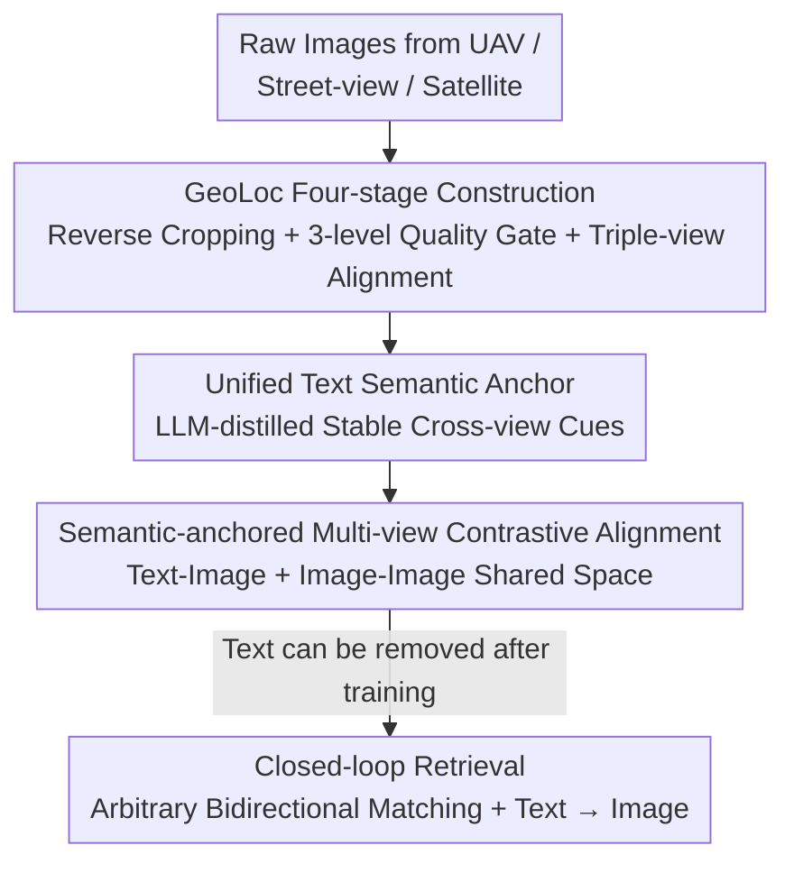

# GeoBridge: A Semantic-Anchored Multi-View Foundation Model Bridging Images and Text for Geo-Localization

**Conference**: CVPR 2026  
**Paper**: [CVF Open Access](https://openaccess.thecvf.com/content/CVPR2026/papers/Song_GeoBridge_A_Semantic-Anchored_Multi-View_Foundation_Model_Bridging_Images_and_Text_CVPR_2026_paper.pdf)  
**Code**: https://github.com/MiliLab/GeoBridge (Available)  
**Area**: Remote Sensing / Cross-View Geo-Localization / Multi-modal Alignment  
**Keywords**: Cross-view geo-localization, Semantic anchor, Multi-view alignment, Cross-modal retrieval, Contrastive learning

## TL;DR
GeoBridge utilizes a "location-aware unified text description" as a semantic anchor to bind images from three perspectives—UAV, street-view panorama, and satellite—into a shared semantic space. This approach breaks away from the traditional "satellite-centric" localization paradigm, enabling both arbitrary peer-to-peer view matching and text-to-image retrieval. The associated GeoLoc dataset (50,000+ triple-aligned sets across 36 countries) allows it to achieve SOTA performance in both cross-view and cross-modal retrieval.

## Background & Motivation
**Background**: The mainstream approach for cross-view geo-localization is "retrieval-based matching"—given a query image, search for a visually corresponding image from a reference database with GPS tags and use its coordinates as the localization result. To cope with the massive viewpoint differences between UAVs, street views, and satellites, most methods adopt a "satellite-centric" anchoring strategy: all views are aligned toward the satellite image for retrieval.

**Limitations of Prior Work**: This satellite-centric paradigm has two major drawbacks. First, it is fragile—when high-resolution or up-to-date satellite imagery is unavailable (disaster areas, remote regions, time-sensitive scenarios), the entire retrieval chain breaks with no alternative path. Second, it wastes complementary information—it only utilizes the "view $\leftrightarrow$ satellite" edge, failing to exploit the complementary cues between UAV, street view, and satellite perspectives, as well as between images and language. Realistic "UAV $\leftrightarrow$ street-view" matching (valuable for UAV navigation and emergency rescue) has long remained a gap.

**Key Challenge**: Strong heterogeneity between views forces the selection of a "central view" as a hub, but any single central view introduces its own inductive bias, leading to performance degradation on unseen view pairs. Simultaneously, language naturally encodes rich orientation, landmark, and topological semantics, but existing vision-language localization mostly relies on single-view scene descriptions, which are prone to semantic hallucinations and spatial inconsistencies.

**Goal**: (1) Develop a unified framework supporting arbitrary peer-to-peer bidirectional matching without dependence on satellites; (2) Tightly couple language signals with multi-view vision to enable text-based localization; (3) Provide a truly triple-view aligned dataset with broad geographic coverage to support training and evaluation.

**Key Insight**: Instead of choosing a specific view as a hub, it is more effective to create a "view-invariant" intermediary—text. Human descriptions of a place involve stable, cross-view cues such as intersections, bridges, buildings, and rivers. By distilling each location into a unified text description, it can serve as a shared alignment goal for all views.

**Core Idea**: Use a location-aware unified text description as a "semantic anchor" to simultaneously align text to each view and align views with each other, bridging multi-view images and language in a shared semantic space where the text branch is optional during inference.

## Method

### Overall Architecture
GeoBridge is a contrastive learning framework. Each geographic instance consists of a quadruple $(x^{(d)}, x^{(p)}, x^{(s)}, t)$: a UAV image $d$, a street-view panorama $p$, a satellite image $s$, and a unified text description $t$ customized for that location. These are mapped into L2-normalized global embeddings $z_d, z_p, z_s, z_t \in \mathbb{R}^D$ via three view-specific image encoders $E_d, E_p, E_s$ and a shared text encoder $E_t$ (all initialized with CLIP-L/14).

During training, text acts as a "cross-modal bridge" to align each view to a unified semantic, while image-to-image alignment reinforces cross-view consistency. During inference, the text branch can be removed, and the model performs nearest-neighbor retrieval for any "image $\leftrightarrow$ image" pair in the shared space, with additional support for "text $\rightarrow$ image" retrieval when text is available. The pipeline consists of two paths: the four-stage construction of the GeoLoc dataset and the semantic-anchored contrastive training of GeoBridge.

### Key Designs

**1. Unified Text Semantic Anchor: Utilizing view-invariant descriptions as a cross-modal bridge**

To resolve the challenge where choosing any view as a hub introduces bias and direct cross-view alignment is difficult due to heterogeneity, GeoBridge generates a concise paragraph for each location as a semantic anchor. This description is generated by ChatGPT-4o by synthesizing all three perspectives. Instructions explicitly require "merging all views, concise summarization, and ignoring transient elements"—emphasizing stable, view-invariant cues like roads, intersections, buildings, and landmarks while excluding transient content or view-specific terminology. The resulting text is naturally "view-invariant." Using it as a shared alignment goal transforms the difficult direct bridge between heterogeneous images into a task where each view aligns with the same text.

**2. Dual Contrastive Alignment: Fusing text-image bridging and image-image consistency**

GeoBridge calculates cosine similarities for each view pair $(u,v)\in\{(d,p),(p,s),(s,d)\}$ and each text-view pair $(t,v)$, scaled by a learnable temperature $\tau$. For a batch of size $B$, the scoring matrices are:

$$S_{u,v} = z_u (z_v)^\top / \tau \in \mathbb{R}^{B\times B}, \qquad S_{t,v} = z_t (z_v)^\top / \tau \in \mathbb{R}^{B\times B}.$$

Each matrix is optimized using InfoNCE, where $y_i$ is the correct match index:

$$L(S) = -\frac{1}{B}\sum_{i=1}^{B}\log\frac{\exp(S(i,y_i))}{\sum_{j=1}^{B}\exp(S(i,j))}.$$

Cross-view consistency is enforced by averaging three image-image edges: $L_{img}=\frac{1}{3}[L(S_{d,s})+L(S_{s,p})+L(S_{p,d})]$. Cross-modal bridging is provided by three text-image edges: $L_{text}=\frac{1}{3}\sum_{v\in\{d,p,s\}}L(S_{t,v})$. The total objective is $L_{total}=L_{img}+L_{text}$.

**3. GeoLoc Four-stage Construction: The first strictly triple-view aligned global dataset**

(a) **Collection & Seed Generation**: UAV images with geo-references are sourced from OpenAerialMap, using a sliding window to estimate ground footprints and record coordinates as seeds. (b) **Cross-source Collection & Reverse Cropping**: Seeds are used to query Google Street View. Only street views within the UAV coverage are kept. The original UAV image is reverse-cropped based on the street-view location at multiple scales (80m to 180m) for robustness. (c) **Deduplication & Cleaning**: Overlapping footprints >50% are deduplicated. A three-level quality gate is applied: BH-Gate (Laplacian variance for blur), C-Gate (contrast for weak edges), and UN-Gate (entropy for uninformative textures like sky/water). (d) **Triple-view Alignment**: Seeds are used to fetch aligned Google Satellite tiles. The final dataset contains 52,679 co-located triples across 36 countries.

### Loss & Training
The backbone uses CLIP-L/14. Adam optimizer ($1\times10^{-5}$) with cosine decay is used for 200 epochs on 8 A800 GPUs. Batch size is 32, and images are resized to 224×224. All parameters are trained end-to-end during pre-training; only the last three layers are fine-tuned for specific benchmarks.

## Key Experimental Results

### Main Results
GeoBridge achieves SOTA on UAV-Satellite (University-1652) and Street-Satellite (CVUSA/VIGOR):

| Dataset / Direction | Metric | Ours | Prev. SOTA | Description |
|--------|------|------|----------|------|
| University-1652 / Drone→Sat | R@1 | 95.82 | 94.67 (DAC) | AP increased from 95.50 to 97.77 |
| University-1652 / Sat→Drone | R@1 | 97.14 | 96.43 (DAC) | Leading in both directions |
| CVUSA / Street→Sat | R@1 | 99.14 | 98.80 (AuxGeo) | R@1% reached 99.98 |
| VIGOR-Cross / Street→Sat | R@1 | 73.87 | 72.19 (Panorama-BEV) | Most significant gain in cross-domain setting |

On the GeoLoc dataset, GeoBridge leads across all six directions:

| GeoLoc Direction | Metric | Ours | Second Best | Description |
|--------|------|------|------|------|
| D2S | R@1 | 45.05 | 28.70 (Sample4Geo) | Massive lead in cross-view retrieval |
| P2D (New Task) | R@1 | 41.15 | 19.34 (DAC) | Dominates the new UAV $\leftrightarrow$ Street-view path |
| RSIEval / Text→Img | R@5 | 71.00 | 60.00 (CLIP-L/14) | SOTA in text-based retrieval |

### Ablation Study
Alignment strategy ablation (GeoLoc, R@1) validates the necessity of semantic anchors:

| Configuration | D2S | S2D | P2S | S2P | D2P | P2D |
|------|-----|-----|-----|-----|-----|-----|
| Image-only | 38.20 | 34.63 | 6.43 | 6.95 | 7.16 | 4.90 |
| Text-only | 42.83 | 42.83 | 35.40 | 36.40 | 39.00 | 38.63 |
| GeoBridge (Fused) | **45.06** | **44.81** | **38.87** | **39.21** | **41.23** | **41.15** |

### Key Findings
- **Image-to-image alignment alone fails for large viewpoint gaps**: Street-to-satellite/UAV retrieval drops to single digits (R@1 4.90 for P2D) without anchors, proving direct heterogeneous bridging is insufficient.
- **Text anchors are the primary performance drivers**: Text-only alignment already exceeds 35% R@1, significantly outperforming Image-only. Fusion adds 2-3% more by capturing fine-grained visual consistency.
- **Strong Cross-domain Transfer**: Fine-tuning only the last three layers on external datasets still yields SOTA results, indicating that the multi-view semantics learned from GeoLoc are highly transferable.
- **Zero Online Overhead for Anchors**: Semantic anchors are only used during training; inference requires no LLM or text branch.

## Highlights & Insights
- **The "invariant intermediary" concept is elegant**: Instead of $N^2$ complex edges between heterogeneous views, aligning everything to text reduces the problem to $N$ easier view-to-text alignments. This paradigm is applicable to any multi-sensor fusion task.
- **Optional Inference Branch**: Learning with a text bridge but retrieving via image-image nearest neighbors provides the benefits of semantic alignment without the computational cost of LLMs at deployment.
- **Reusable Data Quality Gates**: The BH/C/UN gate cascade (Laplacian, contrast, entropy) is a practical trick for cleaning large-scale aerial or remote sensing datasets.

## Limitations & Future Work
- **Dependency on LLM Quality**: The model is bound by ChatGPT-4o's output. Errors or hallucinations in the text description could pollute the alignment target.
- **Low Absolute Cross-modal Accuracy**: Text $\to$ Image R@1 remains in the low double digits on GeoLoc, showing that text-only localization in complex terrain is still an open challenge.
- **Triple-co-location Requirement**: Training requires all three views to be present and aligned, which is costly. The behavior under missing views is not yet fully explored.

## Related Work & Insights
- **vs. Satellite-centric methods (DAC, Sample4Geo)**: These rely on direct image alignment with the satellite as a hub; they fail if satellites are missing and struggle with non-satellite pairs. GeoBridge treats the satellite as one of three equal views in a shared space.
- **vs. Vision-Language Localization**: These typically use single-view descriptions prone to hallucination. GeoBridge's unified multi-view anchor is more stable across scales and perspectives.
- **vs. Existing Datasets (University-1652, etc.)**: Prior datasets are mostly dual-view and localized. GeoLoc is the first strictly co-located triple-view dataset covering 36 countries.

## Rating
- Novelty: ⭐⭐⭐⭐⭐ Clear shift from satellite-centric to semantic-anchor paradigm.
- Experimental Thoroughness: ⭐⭐⭐⭐⭐ 6 datasets, cross-view + cross-modal tasks.
- Writing Quality: ⭐⭐⭐⭐ Methodology is clear; some implementation details are in supplements.
- Value: ⭐⭐⭐⭐⭐ Dual contribution of dataset and model with high practical utility for UAVs.

<!-- RELATED:START -->

## Related Papers

- [\[CVPR 2026\] SinGeo: Unlock Single Model's Potential for Robust Cross-View Geo-Localization](singeo_unlock_single_models_potential_for_robust_cross-view_geo-localization.md)
- [\[CVPR 2026\] UniGeoRS: A Unified Benchmark for Tri-view Geo-Localization](unigeors_a_unified_benchmark_for_tri-view_geo-localization.md)
- [\[CVPR 2026\] Geo2: Geometry-Guided Cross-view Geo-Localization and Image Synthesis](geo2_geometry-guided_cross-view_geo-localization_and_image_synthesis.md)
- [\[CVPR 2026\] PAUL: Uncertainty-Guided Partition and Augmentation for Robust Cross-View Geo-Localization under Noisy Correspondence](paul_uncertainty-guided_partition_and_augmentation_for_robust_cross-view_geo-loc.md)
- [\[AAAI 2026\] UniABG: Unified Adversarial View Bridging and Graph Correspondence for Unsupervised Cross-View Geo-Localization](../../AAAI2026/remote_sensing/uniabg_unified_adversarial_view_bridging_and_graph_correspondence_for_unsupervis.md)

<!-- RELATED:END -->
