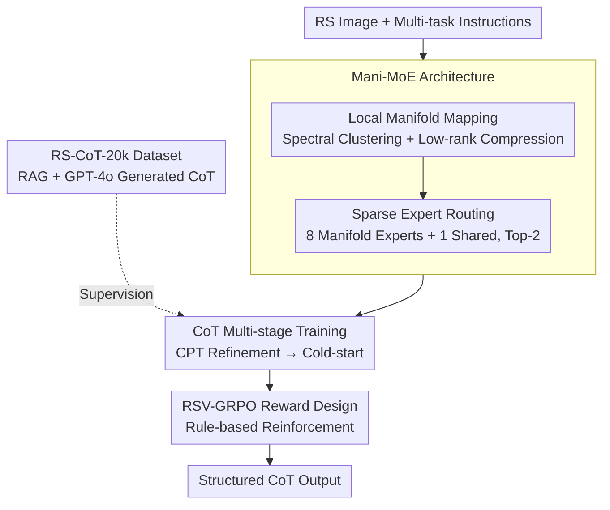

# GeoCoT: Towards Reliable Remote Sensing Reasoning with Manifold Perspective

**Conference**: CVPR 2026  
**Paper**: [CVF Open Access](https://openaccess.thecvf.com/content/CVPR2026/html/Li_GeoCoT_Towards_Reliable_Remote_Sensing_Reasoning_with_Manifold_Perspective_CVPR_2026_paper.html)  
**Code**: None (Paper not yet public)  
**Area**: Remote Sensing Multimodal / MoE / Chain-of-Thought Reasoning  
**Keywords**: RS-MLLM, Manifold MoE, Chain-of-Thought, Reinforcement Learning, Low-rank Subspace  

## TL;DR
GeoCoT explicitly integrates the "low-dimensional manifold" prior of remote sensing (RS) images into the Mixture-of-Experts (MoE) architecture. By using spectral clustering and low-rank compression to project redundant visual tokens into low-rank subspaces, it guides sparse expert allocation via manifold structure. Combined with a multi-stage training pipeline (CPT → Cold-start → RSV-GRPO reinforcement learning) and the self-constructed RS-CoT-20k dataset, the 12B RS model outperforms current SOTA by an average of 5.27% across five RS tasks.

## Background & Motivation
**Background**: Remote sensing image understanding (land cover classification, object detection, counting, relationship detection, image captioning) is shifting from single-task specialized models to Remote Sensing Multimodal Large Language Models (RS-MLLMs), using a unified vision-language model for multi-tasking. Representative works include SkyEyeGPT, EarthGPT, GeoChat, and SkySenseGPT.

**Limitations of Prior Work**: Existing RS-MLLMs almost exclusively use **a single set of shared parameters** (dense Transformer) for all tasks and modalities, leading to knowledge entanglement and weak specialization. They struggle to provide fine-grained, reliable results in complex RS scenarios. While some attempt to use MoE for task decomposition, direct application to RS faces new issues: RS images contain **vast homogeneous regions, repetitive textures, and sparse small targets**, which introduce severe redundancy and noise. Data-driven routing often leads to redundant computation and performance drops; without structural constraints, expert selection is prone to expert collapse.

**Key Challenge**: The statistical structure of RS images differs fundamentally from natural images—they are **highly structured and essentially low-dimensional manifolds embedded in high-dimensional space** (large uniform ground areas + sparse targets). General MoE and dense architectures assume tokens are distributed in unstructured high-dimensional space, wasting computation on redundant backgrounds and drowning out critical target information. Furthermore, they lack a structured reasoning chain from "global scene understanding → local target localization," making results untraceable and unreliable for high-stakes scenarios like disaster response.

**Goal**: To enable RS-MLLMs to (a) achieve fine-grained task specialization, (b) suppress redundancy/noise, and (c) provide structured, traceable reasoning from global context to specific targets.

**Key Insight**: Since RS information primarily "resides on low-dimensional manifolds," the **manifold prior is explicitly injected into the expert architecture**. High-dimensional tokens are first projected into low-rank manifold subspaces to remove redundancy, and routing is then guided by manifold structure rather than raw data.

**Core Idea**: Replace "shared-parameter dense models or data-driven MoE" with "Manifold-driven Sparse MoE (Mani-MoE) + Chain-of-Thought Reinforcement Learning (RSV-GRPO)" to simultaneously address redundancy, specialization, and reliable reasoning in RS.

## Method

### Overall Architecture
GeoCoT uses Qwen2.5-VL-7B as the base model and implements two primary modifications: **Architectural Design** and **Training Strategy**. Architecturally, the original MLP in every third layer is replaced with a Mani-MoE layer (performing local manifold mapping followed by sparse expert routing), increasing the model size from 7B to 12B. The training follows a three-stage pipeline: Continued Pre-training (CPT) for knowledge refinement to adapt to the RS domain, Cold-start on RS-CoT-20k with supervised Chain-of-Thought (CoT) to integrate Mani-MoE, and finally RSV-GRPO reinforcement learning tailored for RS to enhance "global-to-target" structured reasoning. The input consists of an RS image and multi-task instructions; the output is a structured response formatted as `<think>...</think><answer>...</answer>`.

### Key Designs

**1. Local Manifold Mapping: Projecting redundant RS tokens into low-rank subspaces**

To address the "huge homogeneous areas and sparse small targets" causing token redundancy, the authors apply **region-adaptive dimensionality reduction** rather than global reduction (which would erase sparse target information). Given a token feature matrix $X=[h_1,\dots,h_{L_v}]^\top\in\mathbb{R}^{L_v\times d}$, a similarity graph is constructed: $W_{ij}=\exp(-\|h_i-h_j\|_2^2/\varepsilon^2)$ if $\|h_i-h_j\|_2\le m$, else 0, where $m$ is the mean distance between all token pairs. A normalized Laplacian $L_{sym}=I-D^{-1/2}WD^{-1/2}$ is built, and an **eigen-gap heuristic** automatically determines the number of clusters $K=\arg\max_k(\lambda_{k+1}-\lambda_k)$. Spectral embeddings $Z\in\mathbb{R}^{L_v\times K}$ are used with k-means to group tokens into $K$ semantically/geometrically consistent clusters.

Crucially, **each cluster undergoes individual spectral decomposition with energy-based truncation**: For cluster $C_c$ with features $X_c$, the decomposition $X_c=P_c\Lambda_c Q_c^\top$ is performed, retaining the top $r$ components such that the cumulative energy exceeds a threshold $\xi=0.85$:

$$\frac{\sum_{t=1}^{r}s_{c,t}^2}{\sum_{t=1}^{v}s_{c,t}^2}\ge\xi.$$

This ensures that homogeneous background clusters are reduced to very low ranks, while sparse target clusters retain more components, eliminating redundancy without damaging targets. The authors demonstrate via SSIM-Retained Singular Value curves (Fig. 3) that their local mapping achieves 15%+ higher SSIM than Global Dimensionality Reduction (GDR) using only ~4% of retained singular values, proving RS images are indeed compressible.

**2. Mani-MoE Sparse Expert Routing: Partitioning experts by manifold structure**

To prevent expert collapse and noise sensitivity in data-driven routing, low-rank tokens from the manifold mapping are fed into specialized experts. Every three Transformer layers, the MLP is replaced with a Mani-MoE layer consisting of **8 manifold experts and 1 shared expert**. The shared expert is initialized with original Qwen2.5-VL-7B weights to maintain global scene understanding in complex backgrounds; the 8 manifold experts operate in the low-dimensional subspace, specializing in target-level reasoning for dense RS scenes. Routing uses a Switch Transformer Top-2 strategy with noisy gating $g=\text{softmax}(xW_g+\mathcal{N}(0,\sigma^2))$ to encourage diversity, plus an auxiliary load-balancing loss. Since the input to the router is already a de-noised manifold representation, gating decisions are guided by the manifold structure, avoiding the waste of routing computation to redundant backgrounds. Ablations (Table 4) show that 8 experts are optimal; 16 experts lead to diminishing returns due to routing uncertainty and expert under-utilization.

**3. CoT Multi-stage Training: Scaling from domain adaptation to structured reasoning**

To overcome the lack of RS knowledge and reasoning capabilities in general backbones, a three-stage progression is designed. **Knowledge Refinement CPT**: Fine-tuning for 3 epochs on a custom CPT corpus (8 open-source datasets filtered via Data Distillation Regularization—removing weak descriptions <50 words, MinHash+LSH de-duplication, T5 expansion, and RemoteCLIP image-text similarity <0.3). **Multi-task CoT Cold-start**: Mani-MoE is integrated, and instruction fine-tuning is performed on RS-CoT-20k (image-instruction-answer triplets). CoT supervision guides intermediate reasoning steps. To stabilize training, manifold expert gate weights use a cosine ramp-up, and expert weights are initialized from a Gaussian $\mathcal{N}_s(\mu,\sigma^2)$ estimated from shared expert statistics. LoRA (rank 32) is applied to attention modules to avoid full parameter updates.

**4. RSV-GRPO Reward Design: Enforcing "Global-to-Target" reasoning**

To ensure reliable reasoning and mitigate hallucinations, GRPO is adapted for RS vision tasks. GRPO samples $M$ responses per query and estimates gains using group relative advantage $A_i=(g_i-\text{mean}(\{g\}))/\text{std}(\{g\})$. The core is the **customized reward aggregation for varied RS tasks**:

$$R_{total}=\omega\cdot\underbrace{(R_{format}+R_{cos})}_{\text{Expression Reward}}+\eta\cdot\underbrace{R_{task}}_{R_{task}\in\{R_{count},R_{sim},R_{scene},R_{det}\}}.$$

$R_{format}$ enforces the `<think>...</think><answer>...</answer>` format; $R_{cos}$ is a cosine length scheduler $R_{cos}(t)=\delta-(\delta-\gamma)\cdot\frac{1-\cos(t\pi/T)}{2}$, where correct answers take $(\gamma_c, \delta_c)=(1.0, 0.5)$ to encourage conciseness, and incorrect answers take $(\gamma_w, \delta_w)=(-0.5, 0.0)$ to encourage more reasoning. Task-specific rewards include: exact match for counting; cosine similarity of sentence embeddings for captioning/relationship detection (via MEXMA); $F_1$ score for scene classification; and $R_{det}=\alpha(R_{iou}+R_{conf})$ for detection. These rule-based rewards force a structured chain: "global observation → regional focus → target confirmation → coordinate calculation."

### An Example: Localizing a Baseball Field
For a detection query "Where is the baseball field, provide absolute coordinates": Unlike GPT-4o (relative positions like "top-middle") or Qwen2.5-VL (one-step box output), GeoCoT follows a four-stage CoT: **Global Observation** (identifying suburban aerial view with housing/roads) → **Regional Focus** (suspicious light-brown geometric shape in a green area) → **Target Confirmation** (symmetrical contour, standard aspect ratio, proximity to tennis courts) → **Coordinate Calculation** (initial coarse box `<458><138><582><262>`, refined iteratively to `<469><139><587><263>` → `<474><141><581><247>` → final `<483><140><584><244>`). This process is traceable and justified.

### Loss & Training
Three stages: ① CPT (3 epochs, batch 2); ② Cold-start with LoRA (rank 32, 3 epochs, batch 4) including MoE load-balancing loss and gate cosine ramp-up; ③ RSV-GRPO using Eq. (10) clip+KL objective and Eq. (11) aggregated rewards. Training utilizes 8×A100 (80GB).

## Key Experimental Results

### Main Results
Comparison across 4 RS tasks (Table 2, some zero-shot):

| Task/Dataset | Metric | GeoCoT | SkySenseGPT | GPT-4o | Faster R-CNN |
| :--- | :--- | :--- | :--- | :--- | :--- |
| Relationship (DOTA-v2.0) | F1 | **81.21** | 74.34 | 41.83 | N/A |
| Scene Class. (AID) | Acc. | 91.73 | **92.25** | 58.81 | N/A |
| Counting (RSVQA_LR) | Acc. | **17.15** | 9.20 | 7.34 | N/A |
| Detection (DIOR) | mAP@0.5 | **78.29** | 69.94 | 54.56 | 76.50 |
| Detection (DIOR) | mAP@[.5:.95]| **54.95** | 48.17 | 30.57 | 41.43 |

GeoCoT ranks first in 3 out of 4 tasks and nearly matches the specialized SkySenseGPT in scene classification, averaging 5.27% higher than SOTA. For image captioning (UCM-Captions), it achieves best BLEU-1/4 (86.31/67.14) and ROUGE_L (80.18).

### Ablation Study
Incremental impact of the pipeline (Table 3):

| Configuration | Scene AID | Count | Det mAP@[.5:.95] | Rel F1 | Cap ROUGE_L |
| :--- | :--- | :--- | :--- | :--- | :--- |
| Baseline | 69.42 | 5.21 | 41.22 | 65.34 | 65.26 |
| +CPT | 75.81 | 8.56 | 45.61 | 72.76 | 71.41 |
| x+Cold-start(Classic-MoE) | 82.28 | 13.25 | 49.36 | 74.90 | 72.24 |
| y+Cold-start(Mani-MoE) | 87.06 | 15.07 | 51.71 | 77.82 | 75.49 |
| GeoCoT (Full) | **91.73** | **17.15**| **54.95** | **81.21** | **80.18** |

Expert count ablation (Table 4, post Cold-start):

| Experts (Params) | Scene AID | Count | Det mAP@[.5:.95] | Rel F1 | Cap ROUGE_L |
| :--- | :--- | :--- | :--- | :--- | :--- |
| 2 (8.3B) | 77.04 | 7.11 | 47.61 | 72.31 | 70.44 |
| 4 (9.5B) | 80.82 | 11.81 | 49.24 | 74.79 | 73.21 |
| 8 (12.0B) | **87.06** | **15.07**| **51.71** | **77.82** | 75.49 |
| 16 (17.1B) | 84.91 | 13.01 | 51.59 | 76.84 | **77.13** |

### Key Findings
- **Local Manifold Mapping is a major driver**: Moving from Classic-MoE to Mani-MoE yields a 2-5 point improvement across all tasks, proving that injecting the manifold prior is more effective than standard MoE.
- **Optimal expert count**: 8 experts provide the best balance. Increasing to 16 experts degraded performance in most tasks due to routing uncertainty.
- **Progressive improvement**: Each stage (CPT, Cold-start, RSV-GRPO) provides monotonic gains.
- **Deployment Efficiency**: The 12B model runs at ~22.56 tokens/s on a single RTX 4090 (24GB), making it practically deployable.

## Highlights & Insights
- **Statistical Priors as Architectural Design**: Explicitly modeling RS images as low-dimensional manifolds through spectral clustering and energy-based truncation is a highly intuitive and effective way to handle redundancy.
- **Manifold-based Routing**: By routing manifold representations rather than raw tokens, the model naturally avoids wasting compute on redundant backgrounds—a concept transferable to any domain with highly redundant/structured inputs (e.g., medical imaging).
- **Cosine Length Reward**: Coupling length with correctness (conciseness for right answers, reasoning for wrong ones) is a clever RL trick to prevent "reasoning filler."
- **Traceable Reliability**: Visualizing the "global → region → confirmation → refinement" chain provides the transparency required for high-stakes RS applications.

## Limitations & Future Work
- **Code not public**: Reproducibility is hindered by missing specifics for reward weights ($\alpha, \omega, \eta$).
- **Manifold Mapping Overhead**: The computational cost of per-layer spectral clustering and SVD was not independently quantified.
- **Class-specific Gap**: GeoCoT did not beat SkySenseGPT in scene classification, suggesting specialized discriminative models still hold an edge in certain narrow tasks.
- **Dataset Bias**: RS-CoT-20k is generated by GPT-4o, limiting the reasoning quality to the teacher model's upper bound and specific task coverage.

## Related Work & Insights
- **vs. General MoE (RingMoE, etc.)**: General models suffer from data-driven expert collapse; GeoCoT uses manifold structure to force specialized, noise-resistant routing.
- **vs. Dense RS-MLLMs (GeoChat, EarthGPT)**: Shared-parameter models suffer from knowledge entanglement; GeoCoT decouples tasks via sparse experts and introduces structured CoT reasoning.
- **vs. Zero-shot LLMs (GPT-4o)**: General-purpose models lag significantly in RS domain (e.g., 41.83 vs 81.21 in Relationship detection), highlighting the necessity of domain adaptation.

## Rating
- **Novelty**: ⭐⭐⭐⭐⭐ Explicit manifold prior in MoE routing is a novel and self-consistent approach.
- **Experimental Thoroughness**: ⭐⭐⭐⭐ Covers 5 tasks and includes comprehensive ablations, though some reward parameters and overhead details are missing.
- **Writing Quality**: ⭐⭐⭐⭐ Clear equations and convincing visualizations; some symbolic details are slightly opaque.
- **Value**: ⭐⭐⭐⭐⭐ High practical impact with single-GPU deployability and significant SOTA improvements.

<!-- RELATED:START -->

## Related Papers

- [\[CVPR 2025\] Think and Answer ME: Benchmarking and Exploring Multi-Entity Reasoning Grounding in Remote Sensing](../../CVPR2025/remote_sensing/think_and_answer_me_benchmarking_and_exploring_multi-entity_reasoning_grounding_.md)
- [\[ICLR 2026\] Towards Faithful Reasoning in Remote Sensing: A Perceptually-Grounded Geospatial Chain-of-Thought for Vision-Language Models](../../ICLR2026/remote_sensing/towards_faithful_reasoning_in_remote_sensing_a_perceptually-grounded_geospatial_.md)
- [\[CVPR 2026\] ChangeBridge: Spatiotemporal Image Generation with Multimodal Controls for Remote Sensing](changebridge_spatiotemporal_image_generation_with_multimodal_controls_for_remote.md)
- [\[CVPR 2026\] RECS4R: Bridging Semantics and Geometry for Referring Remote Sensing Interpretation](recs4r_bridging_semantics_and_geometry_for_referring_remote_sensing_interpretati.md)
- [\[CVPR 2026\] Robust Remote Sensing Image–Text Retrieval with Noisy Correspondence](robust_remote_sensing_image-text_retrieval_with_noisy_correspondence.md)

<!-- RELATED:END -->
