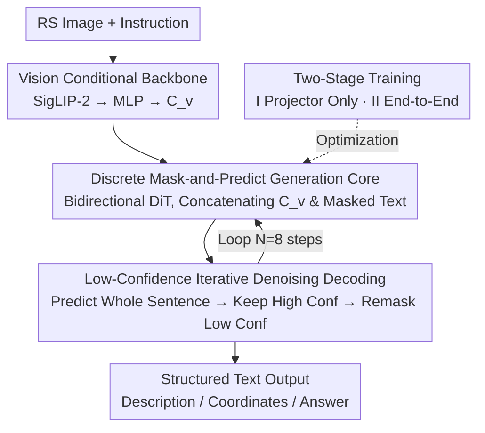

# GeoDiT: A Diffusion-based Vision-Language Model for Geospatial Understanding

**Conference**: CVPR 2026  
**Paper**: [CVF Open Access](https://openaccess.thecvf.com/content/CVPR2026/html/Liu_GeoDiT_A_Diffusion-based_Vision-Language_Model_for_Geospatial_Understanding_CVPR_2026_paper.html)  
**Code**: The paper states resources are available on the project page; no explicit repository link provided (⚠️ refer to the original text)  
**Area**: Remote Sensing / Multimodal VLM / Diffusion Models  
**Keywords**: Remote Sensing VLM, Discrete Diffusion, Parallel Decoding, Mask-and-Predict, Visual Grounding

## TL;DR
GeoDiT shifts text generation for remote sensing images from "autoregressive token-by-token" to "discrete diffusion parallel iterative denoising." Using SigLIP-2 visual conditioning and the LLaDA-8B bidirectional Transformer, it predicts entire sequences at once and refines them through low-confidence remasking, achieving new SOTA on tasks requiring structured output such as multi-object detection, visual grounding, and image captioning.

## Background & Motivation
**Background**: Migrating large-scale Vision-Language Models (VLMs) to Earth Observation data has become the mainstream paradigm for remote sensing intelligence. Early methods utilized dual-tower contrastive learning (CLIP-style) for retrieval, while recent efforts have shifted toward autoregressive VLMs—feeding visual features into an LLM backbone. Representative works include GeoChat, VHM, and EarthDial, which perform well in scene classification, VQA, and visual grounding.

**Limitations of Prior Work**: The authors point out a structural flaw in the autoregressive paradigm concealed by "good performance on single-output tasks." Remote sensing scenes are inherently **parallel and spatially unordered**—multiple ships or vehicles in an image have no natural sequential order. However, autoregression is strictly token-by-token and committed to a single direction: the first word or bounding box must be generated first, with all subsequent outputs conditioned upon it.

**Key Challenge**: This "linear commitment" is fundamentally incompatible with the "coarse-to-fine" requirement (determining global composition before filling in details) of remote sensing. This manifests as two types of systematic failures: ① In complex scene descriptions, generation focus anchors prematurely to the first salient object, consuming the description budget at the start and failing to balance other spatially dispersed concepts; ② In multi-object detection, it creates a "path-dependency feedback loop"—the generation of one box pathologically affects the next, leading to repetitive coordinates for the same object instead of systematically scanning different entities. The root cause of both failures is that **sequential processes cannot form a globally consistent understanding before committing.**

**Core Idea**: Switch to a generation paradigm that is inherently "global + parallel." Denoising diffusion models start from a globally noisy canvas and gradually denoise, allowing all semantic units (words or coordinates) to be determined simultaneously and interdependently. The authors reformulate "complex remote sensing description" as "text denoising under multimodal conditions," proposing **GeoDiT, the first diffusion-based VLM for remote sensing**, aligning the generation process with the intrinsic structure of the data.

## Method

### Overall Architecture
GeoDiT consists of two modules: a **vision backbone** providing geospatial context and a **generation core (Modality-Adapted DiT)** for text synthesis. Given a remote sensing image and an instruction, it outputs structured text (descriptions/coordinates/answers). The mechanism involves the vision backbone encoding the image into a set of condition vectors $C_v$. The generation core concatenates $C_v$ with a "masked text sequence" for **non-autoregressive iterative denoising decoding**. Starting from a template of all `[M]` tokens, it predicts the entire sentence at each step and remasks positions with low confidence, iterating $N$ times to reach the final output.

Training uses a "mask-and-predict" objective in two stages: Stage I freezes the vision encoder and generation core, training only the MLP projector for vision-language alignment; Stage II unfreezes all components for end-to-end fine-tuning on remote sensing instruction data. Inference is the reverse playback of the training denoising process.

### Key Designs

**1. Reformulating RS text generation as "Discrete Mask-and-Predict Diffusion": Replacing autoregression with parallel denoising**

This is the foundation of the paper, directly addressing the path dependency of autoregression. While original DiTs perform Gaussian diffusion on continuous latent variables, the target here is discrete text tokens. The authors recast the generation core into discrete mask-and-predict diffusion: the forward process $q$ independently replaces each token $T_0^i$ with a special `[M]` with probability $t$ ($t\sim U[0,1]$), producing a corrupted sequence $T_t$. The reverse process uses a bidirectional Transformer $p_\theta$ to predict the original tokens at masked positions, conditioned on the "unmasked text context + visual condition $C_v$." The input for each reverse step concatenates visual vectors and masked text embeddings: $X_t=\mathrm{concat}(C_v, E(T_t))$, passing through $L$ Transformer layers to obtain $H_t$, and projecting latent states at text positions into a vocabulary distribution $p_\theta(T_0\mid T_t,C_v)=\mathrm{softmax}(W_p H_t^{\text{text}}+b_p)$. Being bidirectional, it sees the entire sentence at once, allowing all words/coordinates to be solved simultaneously and interdependently, establishing consistency at a global level—something autoregression cannot achieve.

**2. SigLIP-2 Vision Conditioning + Direct LLaDA-8B Reuse: Adapting discrete diffusion bases to RS semantics**

The vision backbone uses pretrained SigLIP-2 (ViT-SO400M) to encode images $I\in\mathbb{R}^{H\times W\times3}$ into $N$ patch embeddings $Z_v=\mathrm{Encoder_{ViT}}(I)$, then projects them via a lightweight MLP to the latent dimension of the generation core $C_v=\mathrm{MLP}(Z_v)\in\mathbb{R}^{N\times d}$, serving as the geospatial context for the entire generation process. The authors did not design the generation core from scratch; instead, they recognized LLaDA-8B (32-layer bidirectional Transformer, $d=4096$, 32 heads) as an implementation of discrete diffusion optimized for iterative mask-and-predict, and initialized it with public weights. The authors admit the novelty lies not in reinventing the base, but in the methodology of "systematically grounding this generation capability into non-narrative RS semantics."

**3. Low-Confidence Remasking Iterative Refinement: Prioritizing high-certainty content and polishing uncertain details**

Inference is the reverse of Key Design 1 and determines how "coarse-to-fine" actually happens. Starting from an all-mask template $T_{t_N}$ of length $L$ ($t_N=1$), refinement occurs over $N$ discrete time steps. Each step takes the most likely tokens to produce a full prediction $\hat T_0=\arg\max_{T_0'} p_\theta(T_0'\mid T_{t_k},C_v)$ as an intermediate estimate. Then, **scheduled remasking** is applied based on output probability confidence—retaining the tokens the model is most certain about and remasking uncertain positions as `[M]` for the next input $T_{t_{k-1}}$, until $t_1\approx0$. This focuses computational effort on high-risk details like precise coordinates or specific object nouns. Ablation studies show this delivers the greatest gains for structured/object-centric metrics like mAP (+34.2%) and CIDEr (+11.3%), with modest gains for BLEU-4 and simple VQA.

### Loss & Training
The training goal is the negative log-likelihood upper bound of the denoising diffusion, calculated only at masked positions:

$$\mathcal{L}(\theta)=\mathbb{E}_{(I,T_0)\sim D}\left[-\sum_{i=1}^{L}\mathbb{1}[T_t^i=\texttt{[M]}]\,\log p_\theta(T_0^i\mid T_t,I)\right]$$

where $\mathbb{1}[\cdot]$ activates only for masked positions. Both stages use AdamW ($\beta_1=0.9, \beta_2=0.95$), cosine scheduling with 3% warmup, and no weight decay: Stage I trains only the MLP projector for 1 epoch on SkyScript (batch 96, peak lr $1\times10^{-3}$); Stage II performs end-to-end fine-tuning of the full model for 1 epoch on the MMRS-1M optical subset (34 RS datasets unified into instruction format, batch 24, peak lr $1\times10^{-5}$). Training was conducted on H200 GPUs.

## Key Experimental Results

### Main Results
Experiments covered image captioning, visual grounding/detection, and VQA/classification. Baselines were grouped into: commercial autoregressive (GPT-4V, Claude-4), open-source diffusion-based (LLaDA-V, LaVida, MMaDA), and open-source autoregressive RS VLMs (LLaVA-1.5, Qwen2.5-VL, GeoChat, VHM, EarthDial).

Image Captioning (CIDEr, object-centric metric, where GeoDiT shows the most significant advantage):

| Dataset | Metric | GeoDiT | Best Competitor (EarthDial) | Relative Gain |
|--------|------|--------|------|------|
| RSICD | CIDEr | 135.6 | 115.3 | +17.6% |
| Sydney-Captions | CIDEr | 128.3 | 113.0 | +13.5% |
| UCM-Captions | CIDEr | 73.8 | 64.2 (VHM) | — |
| NWPU-Captions | CIDEr | 77.4 | 69.3 | — |

Visual Grounding (VG, Acc@0.5) and Detection (DET, mAP@0.5) show across-the-board leads. Note that general diffusion models (LLaDA-V/LaVida/MMaDA) scored near zero on grounding/detection, indicating that "parallel decoding" is not equivalent to "geospatial semantic grounding":

| Task/Dataset | Metric | GeoDiT | Runner-up |
|--------|------|------|------|
| DIOR-RSVG | VG | 60.4 | 55.9 (VHM) |
| DIOR-RSVG | DET | 20.8 | 17.9 (Qwen2.5-VL) |
| VRSBench | VG | 63.7 | 56.3 (GeoChat) |
| VRSBench | DET | 24.9 | 19.6 (Qwen2.5-VL) |
| RSVG | VG | 43.2 | 42.0 (EarthDial) |

VQA and classification also set new SOTAs: RSVQA-LR-R 98.1, RSVQA-HR-C (Comparison) 80.6, WHU-RS19 95.0, AID 81.2. This suggests parallel refinement is beneficial not just for structured outputs, but also for single-label classification requiring global scene understanding.

### Ablation Study
Remasking Strategy (RSICD/DIOR-RSVG/AID):

| Configuration | BLEU-4 | CIDEr | mAP@0.5 | Acc. |
|------|--------|-------|---------|------|
| Random Remasking | 27.3 | 121.8 | 15.5 | 63.4 |
| Low-Confidence (Ours) | 28.6 | 135.6 | 20.8 | 67.6 |
| Gain | +4.76% | +11.3% | +34.2% | +6.21% |

Inference steps $N$ (performance largely saturates at $N=8$):

| N | BLEU-4 | CIDEr | mAP@0.5 | Acc. |
|---|--------|-------|---------|------|
| 1 | 21.0 | 65.8 | 7.5 | 76.5 |
| 2 | 25.3 | 105.1 | 14.2 | 79.8 |
| 4 | 27.8 | 127.3 | 18.9 | 70.7 |
| 8 | 28.6 | 135.6 | 20.8 | 81.2 |
| 16 | 28.7 | 136.2 | 21.1 | 81.3 |

> ⚠️ While the text in Table 6 mentions "performance saturates at N=128," the table only reaches N=16. The text also states doubling from N=8 yields only marginal gains; "128" is likely a typo for "8" or "16."

### Key Findings
- **Object-centric, structured metrics like CIDEr and mAP are where GeoDiT excels**: Low-confidence remasking boosts mAP by +34.2% and CIDEr by +11.3%, far exceeding the +4.76% for BLEU-4. Concentrating computation on high-risk details (precise coordinates, key nouns) is highly effective.
- **Step count and task sensitivity are coupled**: CIDEr and mAP rise sharply with steps, requiring multi-step iteration to resolve parallel semantics. Scene classification saturates early, suggesting it requires only a single global judgment without repetitive refinement.
- **Qualitative visualization** reveals a hierarchical generation pattern: Early stages (Yellow) determine the global scene and primary objects ("seven buses," "three trucks"); intermediate stages (Pink) add attributes ("yellow," "school"); late stages (Blue) fill in syntax/conjunctions ("containing," "and," "."). This "context-first → entity-second → syntax-last" workflow is only possible with parallel global understanding.

## Highlights & Insights
- The framing that **"data is parallel/unordered, so the generation paradigm should be parallel"** is convincing. Attributing the "degeneration loop of repeating coordinates" in autoregressive object detection to structural path dependency and solving it via diffusion is a strong argument.
- **CIDEr is deliberately chosen as a core metric**: It measures the consistency of the "set of contained objects," aligning with the non-narrative, unordered nature of RS descriptions.
- **Directly reusing LLaDA-8B** as a base without reinventing it allows focus on the adaptation layers (visual conditioning + two-stage alignment + refinement). This is a high-efficiency paradigm for migrating general NAR capabilities to vertical domains.

## Limitations & Future Work
- Generation length is **fixed and predefined** (16 for description, 32 for detection, 8 for others). This may be restrictive for ultra-long descriptions or extremely dense scenes; the paper does not discuss variable-length generation.
- Detection is treated as "generating coordinates within text." The absolute mAP (20–25) is still significantly lower than specialized detectors, suggesting "generative detection" currently serves more as a proof of concept.
- The paper lacks a **latency/throughput comparison** against autoregressive baselines ($N=8$ iterations vs. token-by-token autoregression).
- Evaluations were limited to optical imagery (MMRS-1M optical subset); generalization to SAR, multispectral, or hyperspectral modalities remains to be verified.

## Related Work & Insights
- **vs. Autoregressive RS VLMs (GeoChat / VHM / EarthDial)**: They share autoregressive bases with unidirectional token commitment. GeoDiT switches to parallel iterative denoising, proving systematically superior on object-centric/structured tasks due to the generation paradigm rather than data or backbone.
- **vs. General Diffusion VLMs (LLaDA-V / LaVida / MMaDA)**: While also using non-autoregressive parallel decoding, they are designed for general narrative text and score near zero on RS grounding/detection. GeoDiT proves that "parallelism" and "RS semantic grounding" are distinct requirements.

## Rating
- Novelty: ⭐⭐⭐⭐ First diffusion-based VLM for RS with clear framing, though the base uses LLaDA-8B.
- Experimental Thoroughness: ⭐⭐⭐⭐ Covers five task categories + two sets of ablations, though lacks efficiency comparisons and multi-modal coverage.
- Writing Quality: ⭐⭐⭐⭐ Strong logical flow and visualization; minor typos (N=128) and unclear resource links.
- Value: ⭐⭐⭐⭐ Establishes a new direction for structured RS output by aligning the generation paradigm with data structure.

<!-- RELATED:START -->

## Related Papers

- [\[CVPR 2026\] ZoomEarth: Active Perception for Ultra-High-Resolution Geospatial Vision-Language Tasks](zoomearth_active_perception_for_ultra-high-resolution_geospatial_vision-language.md)
- [\[CVPR 2026\] AVION: Aerial Vision-Language Instruction from Offline Teacher to Prompt-Tuned Network](avion_aerial_visionlanguage_instruction_from_offli.md)
- [\[CVPR 2026\] UniChange: Unifying Change Detection with Multimodal Large Language Model](unichange_unifying_change_detection_with_multimodal_large_language_model.md)
- [\[ICLR 2026\] Towards Faithful Reasoning in Remote Sensing: A Perceptually-Grounded Geospatial Chain-of-Thought for Vision-Language Models](../../ICLR2026/remote_sensing/towards_faithful_reasoning_in_remote_sensing_a_perceptually-grounded_geospatial_.md)
- [\[CVPR 2026\] LookasideVLN: Direction-Aware Aerial Vision-and-Language Navigation](lookasidevln_direction-aware_aerial_vision-and-language_navigation.md)

<!-- RELATED:END -->
