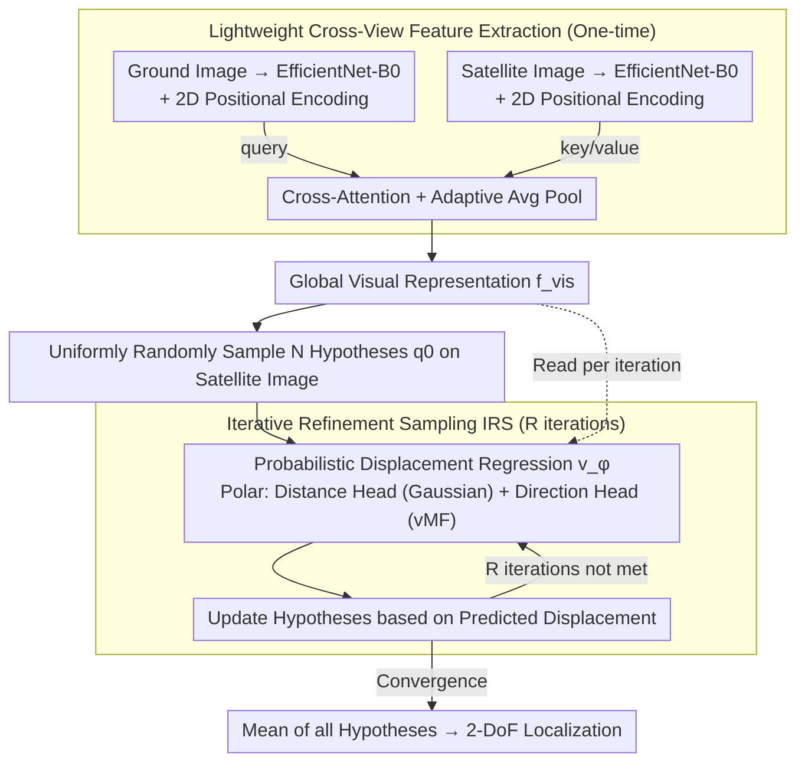

# GeoFlow: Real-Time Fine-Grained Cross-View Geolocalization via Iterative Flow Prediction

**Conference**: CVPR 2026  
**arXiv**: [2603.21943](https://arxiv.org/abs/2603.21943)  
**Code**: [GitHub](https://github.com/)  
**Area**: Remote Sensing / Cross-View Geolocalization  
**Keywords**: Cross-View Geolocalization, Flow Field Regression, Iterative Refinement Sampling, Real-Time Inference, Probabilistic Displacement Prediction

## TL;DR

GeoFlow is proposed as a lightweight cross-view fine-grained geolocalization framework inspired by flow matching. By learning a probabilistic displacement field combined with an Iterative Refinement Sampling (IRS) algorithm, it achieves precise 2-DoF localization from ground-level images to satellite images in continuous space, reaching 29 FPS real-time speed with accuracy comparable to SOTA.

## Background & Motivation

Fine-grained cross-view geolocalization (FG-CVG) aims to estimate the precise 2-DoF position of a ground image relative to a satellite image, which is crucial for autonomous navigation in GPS-denied areas. Existing methods face the following dilemmas:

1.  **Matching-based methods** (e.g., CCVPE): Discretize the search space into a finite patch grid, essentially a classification problem. These are difficult to scale to large search areas due to quantization errors caused by patch size.
2.  **Regression-based methods** (e.g., HC-Net, FG2): Although operating in continuous space, they often require prior knowledge such as camera intrinsics, BEV projection, or intermediate geometric estimation, leading to high computational overhead and difficulty in real-time deployment.
3.  **Accuracy vs. Speed Conflict**: High-precision models (e.g., FG2, 4.20 FPS) are too slow, while fast models lack sufficient accuracy.

The core motivation of GeoFlow is: **Can precise localization be achieved in continuous space while maintaining real-time inference speed?** The authors draw inspiration from Flow Matching models—which transport samples from a prior distribution to a target distribution by learning a vector field—mimicking the "coarse-to-fine" reasoning humans use during localization.

## Method

### Overall Architecture

GeoFlow addresses the problem of identifying the precise 2-DoF camera location in a satellite image given a ground-level street view in real-time. The pipeline consists of two steps: "encoding" and "iterative guessing." First, ground and satellite images are encoded and fused into a global visual representation $\mathbf{f}_{vis}$ via cross-attention. Then, multiple hypothesis positions are randomly initialized on the satellite image. Each hypothesis queries the same regression network to determine the direction and distance to the true location. After several iterations, these hypotheses converge, and their average is taken as the final result.

The key is separating heavy and light computations: encoding $\mathbf{f}_{vis}$ is a heavy operation performed only once, while the iterative process uses a lightweight regression head that takes $\mathbf{f}_{vis}$ and coordinates to output displacement. This allows the "iterative refinement" paradigm to run at 29 FPS.

### Key Designs

**1. Lightweight Cross-View Feature Extraction: Aligning images with 90° viewpoint difference**

Aligning the ground-level (horizontal) and satellite (overhead) views is a major challenge due to the unintuitive geometric relationship. GeoFlow avoids BEV projection or dependency on camera intrinsics. Instead, it uses two independent **EfficientNet-B0** backbones to encode ground and satellite images (intentionally choosing a lightweight backbone to prove that gains come from the methodology rather than capacity). Features are projected to a common dimension $d$ via 1×1 convolutions, with fixed 2D sinusoidal positional encodings added back. Alignment is completed via a single **cross-attention** layer: ground tokens act as queries, and satellite tokens act as keys/values, allowing the ground representation to "find corresponding areas" in the satellite image before being adaptive average pooled into a global vector $\mathbf{f}_{vis} \in \mathbb{R}^d$.

**2. Probabilistic Displacement Regression: Learning a "where to move" vector field**

Deterministic regression outputs only a single point, offering no recovery from errors or measure of confidence. GeoFlow reformulates localization as learning a regression field $\mathbf{v}^\phi(\mathbf{q}_0, \mathbf{f}_{vis})$. The input is the concatenation of the visual representation and the current hypothesis $\mathbf{q}_0$, and the output is the displacement from $\mathbf{q}_0$ to the ground truth. This is modeled using polar coordinates $(r, \theta)$ with two probabilistic heads: a distance head predicting Gaussian parameters $(\mu_r, \sigma_r^2)$, i.e., $r \sim \mathcal{N}(\mu_r, \sigma_r^2)$, and a direction head predicting von Mises-Fisher (vMF) parameters $(\mu_\theta, \kappa)$. The vMF distribution is more suitable than Gaussian for modeling "angular uncertainty" on the unit circle $S^1$. One refinement step is:

$$\hat{\mathbf{q}}_1 = \mathbf{q}_0 + \mu_r \cdot \frac{\mu_\theta}{\|\mu_\theta\|_2}$$

Probabilistic modeling provides more than a point estimate: $\sigma_r$ and $\kappa$ naturally quantify the confidence of each step, facilitating consensus among multiple hypotheses.

**3. Iterative Refinement Sampling (IRS): A training-free, adjustable inference algorithm**

Single predictions are often disturbed by visual ambiguity. IRS adopts the flow matching idea of "iteratively transporting from a random prior to a target." It starts by uniformly sampling $N$ hypotheses $\mathcal{Q}_0 = \{\mathbf{q}_0^{(i)}\}_{i=1}^N$ on the satellite image. These are refined over $R$ iterations where all hypotheses are fed in parallel to the same regression network. The final output is $\hat{\mathbf{q}}_{final} = \text{mean}(\mathcal{Q}_R)$. This mechanism allows multi-hypothesis consensus to suppress single-point ambiguity. Since the heavy visual encoding is only done once, $N$ and $R$ can be adjusted at inference time to trade off accuracy and speed—a "test-time scaling" capability new to FG-CVG.

### A Full Example

Using an example from KITTI Cross-Area (with $N=10, R=5$): after one-time cross-view encoding to get $\mathbf{f}_{vis}$, 10 hypothesis points are scattered. With $N=1, R=1$, the error is approximately 12.47 m. During iterations: in the 1st round, hypotheses move toward the target but remain scattered. By the 3rd round, mean error drops to ~8.47 m, and the median drops from 11.79 m to 5.88 m as points cluster. By the 5th round, they converge at ~8.42 m. Taking the mean reduces the error by 32.5% compared to single inference, while FPS only drops from 32.55 to 29.49.

### Loss & Training

During training, hypotheses $\mathbf{q}_0$ are sampled uniformly, and the displacement $\mathbf{u}_{gt}$ to the ground truth is calculated for supervision. Distance and direction use probabilistic NLL losses:

$$\mathcal{L}_r = \frac{1}{2}\left(\frac{(r_{gt} - \mu_r)^2}{\sigma_r^2} + \log \sigma_r^2\right)$$

The distance term uses inverse variance weighting, making the model more sensitive to errors when confidence is high ($\sigma_r$ is small), while $\log\sigma_r^2$ acts as a regularizer. The direction head uses an AngMF loss:

$$\mathcal{L}_\theta = -\log(\kappa^2+1) + \kappa \cdot \cos^{-1}(\mu_\theta^T \cdot \theta_{gt}) + \log(1+\exp(-\kappa\pi))$$

This is more robust than simple L2 angular regression. The total loss is $\mathcal{L} = \mathcal{L}_r + \mathcal{L}_\theta$.

## Key Experimental Results

### Main Results

**KITTI Dataset (Same-Area)**

| Method | Mean (m) ↓ | Median (m) ↓ | FPS ↑ | Params (M) |
| :--- | :--- | :--- | :--- | :--- |
| FG2 | **0.75** | 0.52 | 4.20 | - |
| HC-Net | 0.80 | 0.50 | 25.00 | 11.21 |
| CCVPE | 1.22 | 0.62 | 24.00 | 57.40 |
| **Ours** | 0.98 | 0.68 | **29.49** | **7.38** |

**VIGOR Dataset**

| Method | Same Mean (m) ↓ | Cross Mean (m) ↓ | FPS ↑ |
| :--- | :--- | :--- | :--- |
| FG2 | **2.18** | **2.74** | 3.60 |
| HC-Net | 2.65 | 3.35 | 20.00 |
| CCVPE | 3.60 | 4.97 | 18.00 |
| **Ours** | 3.51 | 4.62 | **29.49** |

### Ablation Study

**Impact of IRS Iterations R (KITTI Cross-Area, N=10)**

| Iterations R | Mean (m) | Median (m) | FPS |
| :--- | :--- | :--- | :--- |
| 1 | 10.69 | 9.95 | 32.55 |
| 3 | 8.47 | 5.88 | 31.23 |
| 5 | 8.42 | 5.60 | 29.49 |
| 10 | 8.41 | 5.59 | 26.23 |

**Impact of Hypothesis Count N (KITTI Cross-Area, R=5)**

| Seeds N | Mean (m) | FPS |
| :--- | :--- | :--- |
| 1 | 8.58 | 30.70 |
| 10 | 8.42 | 29.49 |
| 20 | 8.41 | 28.08 |

**Single Inference vs. Full IRS**

| Configuration | Mean (m) | Median (m) | Description |
| :--- | :--- | :--- | :--- |
| N=1, R=1 | 12.47 | 11.79 | Single inference baseline |
| N=10, R=5 | 8.42 | 5.60 | Full IRS, ~32.5% error reduction |

### Key Findings

1.  **Inference-time scaling is effective**: Moving from R=1 to R=3 reduces mean error by 20.8% with almost no FPS impact (32.55→31.23).
2.  **Extreme Efficiency**: Ours has only 7.38M parameters (1/7.8 of CCVPE) and consumes 686 MiB VRAM (1/6.9 of CCVPE), while being 7x faster than FG2.
3.  **IRS is a Critical Component**: The contrast between single inference and IRS shows that IRS is not a minor tweak but halves the median error.

## Highlights & Insights

1.  **Paradigm Innovation**: Reformulates FG-CVG as learning a probabilistic displacement field with iterative refinement, departing from traditional matching/regression paradigms.
2.  **Ultra-Efficiency Design**: Visual features are computed once. IRS iterations run a very lightweight MLP, achieving a breakthrough where iterative methods can be real-time.
3.  **Inference-time Scaling**: Observed for the first time in FG-CVG—analogous to test-time compute scaling in LLMs.
4.  **Elegant Probabilistic Modeling**: Using Gaussian for distance and vMF for direction is more theoretically sound than deterministic regression and naturally captures uncertainty.
5.  **Multi-Hypothesis Consensus**: Similar to particle filtering, consensus across multiple hypotheses naturally suppresses visual ambiguity.

## Limitations & Future Work

1.  **Absolute Accuracy Gap**: There remains a gap on VIGOR Cross-Area (Mean 4.62m vs. FG2's 2.74m); lightweight design comes with some accuracy trade-offs.
2.  **2-DoF Limitation**: Does not address orientation ($\theta$) estimation; assumes direction is known (from IMU/compass).
3.  **Backbone Strength**: EfficientNet-B0 has limited representation power; stronger backbones might further improve accuracy.
4.  **IRS Convergence**: Lacks theoretical analysis to guarantee IRS always converges to a global optimum.
5.  **Non-urban Scenarios**: Experiments were limited to urban road datasets; generalization to other terrains is untested.

## Related Work & Insights

- **Relation to Flow Matching**: Ours borrows the "iterative transport from noise to target" concept but predicts displacement vectors rather than learning a continuous flow field.
- **Particle Filter Echoes**: The IRS refinement is essentially a learned particle filter, using a displacement field instead of traditional propagation/resampling.
- **Scaling Trends**: Inference-time scaling (verified in LLMs like o1) is introduced here to vision-based localization, which is forward-looking for the field.

## Rating

- **Novelty**: ⭐⭐⭐⭐ — Novel paradigm combining probabilistic displacement fields with IRS.
- **Experimental Thoroughness**: ⭐⭐⭐⭐ — Complete across two datasets with multi-dimensional ablations and efficiency comparisons.
- **Writing Quality**: ⭐⭐⭐⭐ — Clear logic and excellent visualizations.
- **Value**: ⭐⭐⭐⭐⭐ — Real-time speed and lightweight design, highly deployment-friendly.

<!-- RELATED:START -->

## Related Papers

- [\[ECCV 2024\] Adapting Fine-Grained Cross-View Localization to Areas without Fine Ground Truth](../../ECCV2024/remote_sensing/adapting_fine-grained_cross-view_localization_to_areas_without_fine_ground_truth.md)
- [\[CVPR 2026\] MOGeo: Beyond One-to-One Cross-View Object Geo-localization](mogeo_beyond_one-to-one_cross-view_object_geo-localization.md)
- [\[CVPR 2026\] RHO: Robust Holistic OSM-Based Metric Cross-View Geo-Localization](rho_robust_holistic_osm-based_metric_cross-view_geo-localization.md)
- [\[CVPR 2026\] Geo2: Geometry-Guided Cross-view Geo-Localization and Image Synthesis](geo2_geometry-guided_cross-view_geo-localization_and_image_synthesis.md)
- [\[CVPR 2026\] SinGeo: Unlock Single Model's Potential for Robust Cross-View Geo-Localization](singeo_unlock_single_models_potential_for_robust_cross-view_geo-localization.md)

<!-- RELATED:END -->
## Related Papers

- [\[ECCV 2024\] Adapting Fine-Grained Cross-View Localization to Areas without Fine Ground Truth](../../ECCV2024/remote_sensing/adapting_fine-grained_cross-view_localization_to_areas_without_fine_ground_truth.md)
- [\[CVPR 2026\] MOGeo: Beyond One-to-One Cross-View Object Geo-localization](mogeo_beyond_one-to-one_cross-view_object_geo-localization.md)
- [\[CVPR 2026\] RHO: Robust Holistic OSM-Based Metric Cross-View Geo-Localization](rho_robust_holistic_osm-based_metric_cross-view_geo-localization.md)
- [\[CVPR 2026\] Geo2: Geometry-Guided Cross-view Geo-Localization and Image Synthesis](geo2_geometry-guided_cross-view_geo-localization_and_image_synthesis.md)
- [\[CVPR 2026\] SinGeo: Unlock Single Model's Potential for Robust Cross-View Geo-Localization](singeo_unlock_single_models_potential_for_robust_cross-view_geo-localization.md)

<!-- RELATED:END -->
