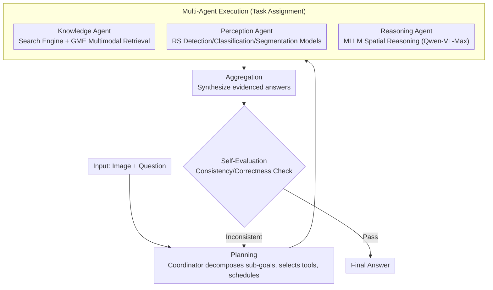

# GeoMMBench and GeoMMAgent: Toward Expert-Level Multimodal Intelligence in Geoscience and Remote Sensing

**Conference**: CVPR 2026 Highlight  
**arXiv**: [2604.08896](https://arxiv.org/abs/2604.08896)  
**Code**: [https://geo-mm-agi.github.io](https://geo-mm-agi.github.io)  
**Area**: Remote Sensing / Multimodal Benchmark  
**Keywords**: geoscience, remote sensing, benchmark, multi-agent, MLLM evaluation

## TL;DR

This paper introduces GeoMMBench (1,053 expert-level geoscience multiple-choice questions) and GeoMMAgent (a retrieval-perception-reasoning multi-agent framework). It systematically evaluates 36 MLLMs in the remote sensing domain, revealing systemic deficiencies in domain knowledge, perceptual grounding, and reasoning.

## Background & Motivation

While MLLMs have advanced rapidly in general domains, their evaluation in geoscience and remote sensing (RS) remains limited. Existing RS benchmarks are narrow in scope, focusing primarily on perception tasks (classification, detection, segmentation) and are often restricted to optical imagery. However, geoscience requires multi-sensor data fusion, spatio-temporal reasoning, and interdisciplinary knowledge integration, which current benchmarks fail to assess adequately.

GeoMMBench is the first expert-level, knowledge-driven geoscience multimodal benchmark spanning multiple disciplines, sensors, and task hierarchies.

## Method

### Overall Architecture

The paper presents two main contributions: GeoMMBench, an expert-level geoscience multimodal evaluation benchmark containing 1,053 multiple-choice questions with images; and GeoMMAgent, a companion multi-agent framework organized by a "plan–execute–evaluate" workflow. It integrates dedicated tools for retrieval, perception, and reasoning, connecting general MLLMs with domain-specific knowledge bases and RS models to bridge performance gaps. The former "measures the gap," while the latter "closes the gap." The following diagram illustrates the GeoMMAgent workflow: A unified coordinator first performs planning, assigns sub-tasks to three types of agents for execution, aggregates the results, and submits them to a self-evaluation module for verification. If inconsistencies are found, the process returns to the planning stage.

### Key Designs

**1. Three-Dimensional Coverage: Pushing Academic Boundaries in Geoscience**

Existing RS benchmarks focus on perception tasks in optical imagery, failing to test cross-sensor and interdisciplinary capabilities. GeoMMBench expands across three dimensions: Multidisciplinary (RS, photogrammetry, GIS, GNSS, math, physics, geography); Multi-sensor (optical, SAR, multi/hyperspectral, LiDAR, DEM, thermal); and Multi-task hierarchy (from theoretical concepts and preprocessing to perception and high-level geospatial applications). This intersection simultaneously exposes model deficiencies in "Knowledge, Grounding, and Reasoning."

**2. Expert-Level Question Design: Ensuring Authority and Comparability**

To evaluate "expert-level" capabilities, the questions themselves must be professional. All questions were formulated by PhD researchers and doctoral students in geoscience through extensive discussions, with materials sourced from authoritative references like educational resources and academic literature. The data is split into a val set (37 questions) for human expert benchmarking and model selection, and a test set (1,016 questions) for final evaluation, ensuring scores are both credible and comparable.

**3. Plan–Execute–Evaluate Orchestration: Organizing General MLLMs into Self-Checking Expert Workflows**

General MLLMs lack domain knowledge and complex sensor understanding. GeoMMAgent replaces simple pipelines with a "plan–execute–evaluate" loop. A coordinator decomposes complex problems into sub-goals and determines agent assignments. After execution, the self-evaluation phase verifies whether the reasoning chain and answer are consistent with the original plan, triggering selective re-runs or corrections if contradictions arise. This "error-detection and feedback" loop distinguishes it from direct MLLM prompting.

**4. Specialized Toolset: Plug-and-Play Knowledge, Perception, and Reasoning**

The three agents utilize a capability-based toolset. Knowledge tools access external info (Wikipedia, Google Search) and use GME for multimodal retrieval to align text-image evidence with source citations. Perception tools include traditional supervised RS models (object detection, scene classification, land use/cover segmentation) capable of interpreting complex SAR and hyperspectral data. Reasoning tools employ advanced MLLMs (e.g., Qwen-VL-Max) for logic-heavy spatial and comprehensive analysis. All tools are implemented via the Model Context Protocol (MCP), allowing for seamless expansion.

### Loss & Training

GeoMMBench is an evaluation benchmark and involves no training. GeoMMAgent leverages zero-shot capabilities of existing LLMs enhanced by tool invocation.

## Key Experimental Results

### Main Results

| Model Category | Representative Model | GeoMMBench Accuracy | Description |
| :--- | :--- | :--- | :--- |
| Open-source MLLM | InternVL2.5, Qwen2.5-VL | Moderate | Insufficient domain knowledge |
| Commercial MLLM | GPT-4o, Gemini | High but with gaps | Superior reasoning ability |
| GeoMMAgent | LLM + Tool Ensemble | Significant Improvement | Effective tool enhancement |

The val set (37 questions) assesses human expert performance, while the test set (1,016 questions) serves as the final benchmark. Questions cover four core disciplines (RS, photogrammetry, GIS, GNSS) and foundational sciences. GeoMMAgent uses its specialized agents—Knowledge, Perception, and Reasoning—to synthesize spectroscopy, mapping concepts, and complex SAR data analysis.

### Key Findings

- All 36 tested MLLMs exhibit systemic deficiencies in geoscience.
- Domain knowledge (e.g., spectroscopy, geodesy) remains the most significant weakness.
- GeoMMAgent significantly outperforms standalone LLMs through tool enhancement.
- Multi-sensor understanding (particularly SAR and hyperspectral) is substantially weaker than optical imagery analysis.
- The benchmark provides a comprehensive evaluation ranging from theoretical data preprocessing to advanced geospatial applications.

## Highlights & Insights

- First expert-level geoscience multimodal benchmark with cross-disciplinary, cross-sensor, and multi-level task coverage.
- Large-scale evaluation of 36 models establishes a robust performance baseline.
- GeoMMAgent demonstrates the effectiveness of tool-augmented frameworks in bridging domain-specific gaps.
- Expert-designed questions ensure high quality and academic authority.

## Limitations & Future Work

- The scale of 1,053 questions is still finite; some sub-fields may require denser coverage.
- Multiple-choice formats may not fully capture open-ended reasoning capabilities.
- The GeoMMAgent toolset requires continuous expansion to cover specialized tasks.
- Coverage of temporal tasks (multi-temporal analysis and change detection) remains insufficient.
- The performance gap between open and closed-source MLLMs suggests a continued need for domain-specific fine-tuning in RS.

## Rating

- Novelty: ⭐⭐⭐⭐⭐ — First expert-level geoscience multimodal benchmark.
- Technical Depth: ⭐⭐⭐⭐ — Well-designed multi-agent framework.
- Experimental Thoroughness: ⭐⭐⭐⭐⭐ — Comprehensive evaluation of 36 models.
- Practical Value: ⭐⭐⭐⭐⭐ — Provides standardized evaluation for RS-AI development.

<!-- RELATED:START -->

## Related Papers

- [\[CVPR 2026\] MM-OVSeg: Multimodal Optical-SAR Fusion for Open-Vocabulary Segmentation in Remote Sensing](mm-ovseg_multimodal_optical-sar_fusion_for_open-vocabulary_segmentation_in_remot.md)
- [\[CVPR 2026\] Exploring Spatiotemporal Feature Propagation for Video-Level Compressive Spectral Reconstruction](exploring_spatiotemporal_feature_propagation_for_video-level_compressive_spectra.md)
- [\[CVPR 2026\] GeoCoT: Towards Reliable Remote Sensing Reasoning with Manifold Perspective](geocot_towards_reliable_remote_sensing_reasoning_with_manifold_perspective.md)
- [\[CVPR 2026\] Fast Kernel-Space Diffusion for Remote Sensing Pansharpening](fast_kernel-space_diffusion_for_remote_sensing_pansharpening.md)
- [\[CVPR 2026\] RAMEN: Resolution-Adjustable Multimodal Encoder for Earth Observation](ramen_resolution-adjustable_multimodal_encoder_for_earth_observation.md)

<!-- RELATED:END -->
