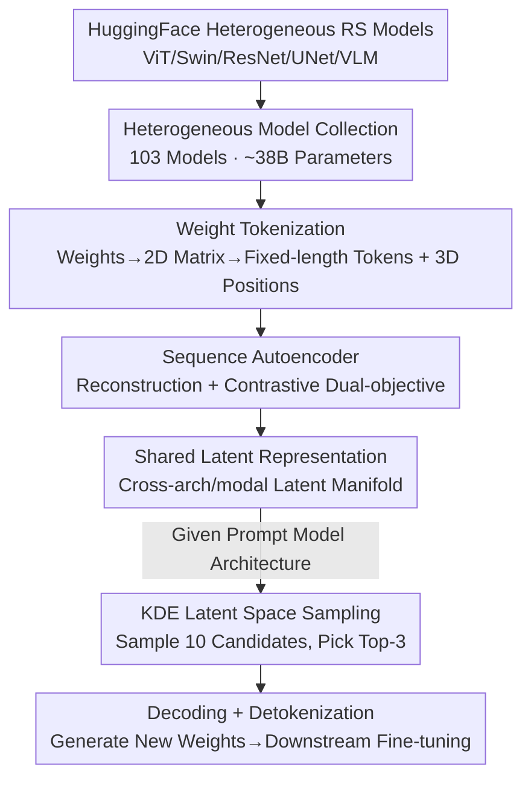

# GeoSANE: Learning Geospatial Representations from Models, Not Data

**Conference**: CVPR 2026  
**Paper**: [CVF Open Access](https://openaccess.thecvf.com/content/CVPR2026/html/Hanna_GeoSANE_Learning_Geospatial_Representations_from_Models_Not_Data_CVPR_2026_paper.html)  
**Code**: https://hsg-aiml.github.io/GeoSANE/  
**Area**: Remote Sensing / Weight-Space Learning  
**Keywords**: Remote Sensing Foundation Models, Weight-Space Learning, Model Foundry, Weight Generation, Latent Space Sampling

## TL;DR
GeoSANE treats the **weights themselves** of 103 off-the-shelf remote sensing models as training data. It utilizes a weight-space autoencoder to learn a shared latent representation across all models. New "ready-to-fine-tune" model weights are then sampled and decoded from this latent space for a target architecture. This shifts remote sensing pre-training from "learning from satellite data" to "learning from models." Generated models consistently outperform training-from-scratch and rival or exceed SOTA Remote Sensing Foundation Models (RSFMs) across ten datasets for classification, segmentation, and detection.

## Background & Motivation
**Background**: Remote Sensing Foundation Models (RSFMs) have exploded in recent years, with over 70 models identified in recent surveys. Each is pre-trained on large-scale satellite imagery to provide transferable representations for classification, segmentation, and detection.

**Limitations of Prior Work**: These models are **fragmented and complementary**—each specializes in specific sensors (Optical / Multi-spectral / SAR), resolutions, or tasks. Users face the dilemma of choosing which RSFM to use or whether to re-train. The union of all these models actually encodes broader geospatial knowledge than any single model, yet they remain unquantified and disconnected.

**Key Challenge**: Knowledge is locked within the weights of independent models. Conventional methods (training a larger foundation model) require massive data and compute. Model merging techniques (e.g., Model Soups, TIES, DARE) require models to share the **same architecture and initialization**, which fails for the diverse architectures found in the remote sensing ecosystem.

**Goal**: To aggregate knowledge from a large set of heterogeneous remote sensing models into a reusable representation and generate new models on demand, without relying on original data or requiring architectural homogeneity.

**Key Insight**: The authors leverage recent advances in weight-space learning—treating trained neural network **weights as an input modality** to learn a shared latent manifold of a model population. Existing open-source remote sensing models on HuggingFace serve as a natural "weight dataset."

**Core Idea**: Use a weight-space autoencoder to learn shared latent representations of cross-architecture, cross-modal remote sensing models. Then, sample from this latent space to generate new weights for a target architecture. This represents a shift from data-centric pre-training to weight-centric generation—"Learning from models, not data."

## Method

### Overall Architecture
GeoSANE is a "geospatial model foundry" where the pipeline consists of three stages: **① Collection** of a large batch of heterogeneous remote sensing models; **② Training** a weight-space autoencoder to embed these models into a shared latent representation; **③ Generation**: Given a prompt model (specifying the target architecture), sample in its latent neighborhood and decode new weights, producing a model with the same architecture as the prompt but with new, fine-tune-ready parameters.

The input consists of multiple sets of trained weights, and the output is a set of on-demand generated weights. The bridge is an autoencoder that serializes weights into tokens and processes them via a Transformer; its bottleneck layer represents the "shared latent representation of all models."

### Key Designs

**1. Heterogeneous RS Model Collection: Treating the "Model Population" as a Training Set**

Addressing the pain point that "knowledge is scattered across 70+ complementary RSFMs," GeoSANE does not scrape satellite imagery. Instead, it bulk-retrieves open-source models from the HuggingFace Hub using sensor keywords (Sentinel-1/2, SAR, multi-spectral) and task labels (land cover, flood detection, disaster response). It automatically loads and processes various architectures: Transformer backbones (ViT, Swin), CNNs (ResNet, UNet, MobileNet), multi-modal radar-optical models, YOLO detectors, and even vision-language models. Custom loaders were implemented for non-standard implementations like TorchGeo and FLAIR. The final collection includes **103 remote sensing models with approximately 38 billion parameters**. While the number of models is small, the parameter count provides enough tokens to learn strong representations.

**2. Weight Tokenization: Unifying Any Architecture into a Token Sequence**

To allow a single network to process weights from both ViT and ResNet, a unified input format is required. Following [44], GeoSANE reshapes weights $w$ from each layer into 2D matrices and slices them into fixed-size tokens $T_n$ of dimension $d_t$. Zero-padding or splitting is used for dimension alignment, and a binary mask $M$ distinguishes real parameters from padding. Each token is assigned a 3D positional encoding $P=[n, l, k]$, representing absolute sequence position $n$, layer index $l$, and intra-layer position $k$. This representation allows the model to handle diverse architectures and sizes, as any model is converted into a sequence of tokens with positional information.

**3. Sequence Autoencoder with Reconstruction + Contrastive Objectives: Learning the Shared Latent Manifold**

The backbone is a seq-to-seq autoencoder (both encoder and decoder are GPT-2 style Transformers with ~900M parameters). Simple bottlenecking forms the shared latent representation. The encoder $g_\theta$ maps token sequences to latent embeddings $Z=g_\theta(T,P)$, while the decoder $h_\psi$ reconstructs the original tokens $\widehat{T}=h_\psi(Z,P)$. A projection head $p_\phi$ maps latent embeddings to a lower dimension $z_p=p_\phi(Z)$ for contrastive learning. The objective combines reconstruction and contrastive terms:

$$\mathcal{L}_{rec}=\|M\odot(T-\widehat{T})\|_2^2,\quad \mathcal{L}_{c}=\mathrm{NTXent}(z_{p,i},z_{p,j}),\quad \mathcal{L}=(1-\gamma)\mathcal{L}_{rec}+\gamma\mathcal{L}_{c}$$

The mask $M$ ensures the loss is only calculated on real parameters. The contrastive term uses two augmented views of the same model: the original token sequence and a noisy version. NT-Xent pulls embeddings of the same model together while pushing others apart. Crucially, GeoSANE uses **run-time normalized losses** [12] (instead of pre-processing weights) to learn representations across any architecture.

**4. KDE Latent Space Sampling: Generating New Weights On-demand**

After training, the generation phase requires no further training. Given a prompt model $a$ (e.g., an ImageNet pre-trained ViT-L from timm), it is tokenized and encoded to get its latent representation $Z_a=g_\theta(T_a)$. A Kernel Density Estimator (KDE) is fitted around $Z_a$ to sample $\tilde z$. This local sampling explores latent neighborhoods structurally similar to the prompt while being shaped by geospatial knowledge. Each sample $\tilde z$ is decoded into synthetic weight tokens $\tilde T = h_\psi(\tilde z)$, which are detokenized into network weights $\tilde w$. The result is a model with the same architecture as the prompt but with new parameters ready for fine-tuning.

### Loss & Training
The GeoSANE autoencoder has ~900M parameters. To obtain stronger latent representations, it is first pre-trained on a larger general CV model corpus (~700M tokens from HuggingFace) and then fine-tuned on RS tokens (~165M tokens). It was trained for 150 epochs on a single H100 using AdamW ($lr=2\times10^{-5}$, $weight\_decay=3\times10^{-9}$), and OneCycleLR. Downstream fine-tuning was performed for 50 epochs.

## Key Experimental Results

### Main Results

Evaluations covered 10 datasets across optical, multi-spectral, and SAR modalities, spanning classification, segmentation, and detection.

**vs Training from Scratch** (same architecture and budget):

| Dataset | Task/Metric | Scratch | GeoSANE | Δ |
|---------|-------------|---------|---------|---|
| EuroSAT | Acc | 95.0 | 99.1 | +4.1 |
| RESISC-45 | Acc | 78.0 | 96.5 | +18.5 |
| fMoW | Acc | 35.7 | 58.9 | +23.2 |
| BigEarthNet | mAP | 69.8 | 88.7 | +18.9 |
| DFC2020 | mIoU | 46.8 | 54.3 | +7.5 |
| Sen1Floods11 | mIoU | 81.0 | 89.6 | +8.6 |
| DIOR | mAP@0.5 | 67.5 | 79.0 | +11.5 |

The most significant gains (+23.2 / +18.9) were observed on challenging multi-class datasets with fine-grained labels (fMoW, BigEarthNet).

**vs Existing RSFMs**: GeoSANE achieved the best or second-best results across 10 benchmarks. It significantly outperformed baselines on difficult tasks: Sen12Flood (+1.8), Wildfires (+1.6), DFC2020 (+4.5), and DIOR (+0.3).

### Ablation Study

| Setting | Key Metric | Conclusion |
|---------|------------|------------|
| vs DARE Merging | BigEarthNet 88.7 vs 69.0 | Direct parameter averaging causes conflicts; GeoSANE learns relationships in latent space. |
| vs Prompt Model | fMoW +6.5 / DIOR +5.4 | Generated weights outperform fine-tuning the ImageNet prompt, proving geospatial knowledge injection. |
| vs Pruning/KD (Lightweight) | BigEarthNet 11M: 83.7 vs KD 67.3 | Direct generation of small models outperforms pruning and distillation. |
| Cross-Arch Generation | Table 7 | A single latent space can generate weights for MobileNet, ResNet, ViT, Swin, and UNet. |

### Key Findings
- **Highest gains on difficult datasets**: On tasks like fMoW and BigEarthNet where scratch training struggles, GeoSANE’s priors improve results by 18-23 points.
- **Generation ≠ Merging**: DARE merging performed poorly on BigEarthNet (69.0), while GeoSANE reached 88.7, proving the value of learning weight relationships.
- **Lightweight models for free**: Unlike traditional compression (pruning/KD), GeoSANE samples target-sized weights directly from the latent space, bypassing the need for a teacher model.

## Highlights & Insights
- **"Models" as Data**: The most innovative aspect is the shift in raw material—recycling the compute already spent by the community by processing 103 models instead of PB-scale raw imagery.
- **Tokenization + Run-time Normalization**: The combination of serialized tokens with 3D positions and run-time normalized contrastive loss allows the model to accommodate heterogeneous architectures and modalities.
- **Decoupling Generation from Compression**: Lightweighting becomes a matter of choosing a different prompt architecture rather than a separate pruning/distillation stage.

## Limitations & Future Work
- The collection of 103 models (~38B parameters) is relatively small compared to standard ML datasets; whether model diversity covers all RS sub-domains remains to be seen.
- Generated models are constrained to the **same architecture** as the prompt; it cannot yet generate entirely new structural designs.
- Very small models (3.5M) showed occasional performance drops, suggesting that latent decoding is still limited by the architecture's capacity.

## Related Work & Insights
- **vs RSFMs (SatMAE, Scale-MAE, etc.)**: These models focus on pre-training from data; GeoSANE is a "meta-layer" that treats them as raw material.
- **vs Model Merging**: Merging is limited by architecture and initialization; GeoSANE stays flexible and handles conflicts better in latent space.
- **vs Weight Generation**: Prior works were often limited to homogeneous architectures or RGB-only models; GeoSANE scales to heterogeneous architectures and multi-modal RS data.

## Rating
- Novelty: ⭐⭐⭐⭐⭐ First to apply "learning from models" to remote sensing with heterogeneous architectures and multi-task generation.
- Experimental Thoroughness: ⭐⭐⭐⭐⭐ 10 benchmarks + GEO-Bench across three tasks and three modalities.
- Writing Quality: ⭐⭐⭐⭐ Clear motivation, though several figure/section references in the main text are missing (e.g., "Fig ??").
- Value: ⭐⭐⭐⭐⭐ Provides a scalable path to reuse existing RS models and generate lightweight weights on demand.

<!-- RELATED:START -->

## Related Papers

- [\[CVPR 2026\] Data Leakage Detection and De-duplication in Large Scale Geospatial Image Datasets](data_leakage_detection_and_de-duplication_in_large_scale_geospatial_image_datase.md)
- [\[CVPR 2026\] UniGeoSeg: Towards Unified Open-World Segmentation for Geospatial Scenes](unigeoseg_towards_unified_open-world_segmentation_for_geospatial_scenes.md)
- [\[CVPR 2026\] GeoDiT: A Diffusion-based Vision-Language Model for Geospatial Understanding](geodit_a_diffusion-based_vision-language_model_for_geospatial_understanding.md)
- [\[ECCV 2024\] Learning Representations of Satellite Images From Metadata Supervision](../../ECCV2024/remote_sensing/learning_representations_of_satellite_images_from_metadata_supervision.md)
- [\[CVPR 2026\] ZoomEarth: Active Perception for Ultra-High-Resolution Geospatial Vision-Language Tasks](zoomearth_active_perception_for_ultra-high-resolution_geospatial_vision-language.md)

<!-- RELATED:END -->
