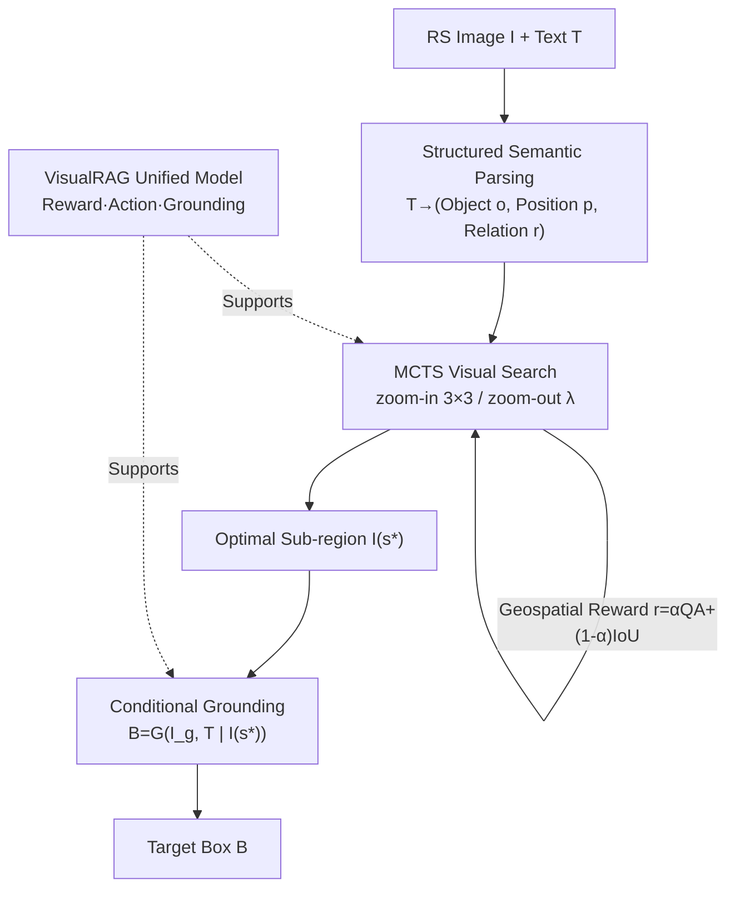

# GeoViS: Geospatially Rewarded Visual Search for Remote Sensing Visual Grounding

**Conference**: CVPR 2026  
**Paper**: [CVF Open Access](https://openaccess.thecvf.com/content/CVPR2026/html/Zhang_GeoViS_Geospatially_Rewarded_Visual_Search_for_Remote_Sensing_Visual_Grounding_CVPR_2026_paper.html)  
**Code**: https://github.com/Zhang-Peirong/GeoVis  
**Area**: Remote Sensing Visual Grounding / Multimodal VLM  
**Keywords**: Remote Sensing Visual Grounding, Visual Search, MCTS, Geospatial Reward, MLLM  

## TL;DR
GeoViS reformulates remote sensing visual grounding from a "one-step box regression" into a two-stage process: first, a reward-guided tree-based visual search locates the sub-region most likely to contain the target, and then this sub-region serves as a visual cue for conditional grounding. A unified VisualRAG model simultaneously provides reward evaluation, action guidance, and grounding inference, achieving SOTA performance on metrics like Pr@0.5 across five benchmarks.

## Background & Motivation
**Background**: Visual grounding aims to map textual descriptions to specific regions in an image. With the advancement of Multimodal Large Language Models (MLLM), fine-grained cross-modal alignment on natural images has matured. Leading remote sensing (RS) methods typically follow the paradigm of "feeding the whole image into the model and predicting the target box in one step."

**Limitations of Prior Work**: This paradigm fails in RS scenarios for two reasons. First, **targets are extremely small**—a single image can cover kilometers, while targets like planes or oil tanks occupy very few pixels. The authors refer to this as extremely low "effective resolution": target pixels are so sparse relative to the whole image that details are smoothed out after global encoding, making one-step prediction impossible. Simply scaling input or using patches does not improve effective resolution. Second, **queries contain complex geospatial relationships**—RS descriptions often involve hierarchical reasoning (e.g., "the first tennis court at the bottom right of the middle area, to the right of the parking lot"). Single-step prediction lacks hierarchical spatial modeling capabilities.

**Key Challenge**: To see small targets, one must focus on local areas to increase effective resolution, but focusing locally often loses the global context required to understand spatial relationships. "Detail clarity" and "global context preservation" are difficult to reconcile in a single-step prediction. Existing multi-step reasoning (CoT / RL) methods alleviate this but often rely on external detectors or large-scale reward datasets, which are costly and hard to generalize in RS.

**Goal**: Enable the model to locate tiny targets in large-scale RS imagery while maintaining awareness of global scene relationships, without relying on external detectors or expensive RL data.

**Key Insight**: Preliminary experiments (Sec 4.6) show that grounding accuracy improves significantly if the model can (i) correctly parse the geospatial context in text and (ii) use a "candidate region likely containing the target" as an additional visual input to increase effective resolution. These two elements are termed **visual cues**. The problem then becomes how to automatically discover reliable visual cues in large, complex RS images.

**Core Idea**: Reformulate grounding as "geospatially rewarded visual search"—mimicking human behavior by exploring the image from coarse to fine, guided by a geospatial reward that quantifies how well a region matches the visual cues.

## Method

### Overall Architecture
Given an RS image $I$ and text $T$, GeoViS splits the "target box prediction $B$" into two sequential stages: **Visual Search** and **Visual Grounding**. The first stage parses the text into structured geospatial context and performs a reward-guided hierarchical tree search (MCTS) on the global image, narrowing the candidate region to the most likely sub-region $I(s^\star)$. The second stage performs **conditional grounding** on the global image using this sub-region as a prior visual cue to output the final box. The entire pipeline is supported by a unified **VisualRAG model**, which provides reward evaluation and action guidance during search, and grounding inference during the final stage.

### Key Designs

**1. Two-stage Reformulation: From One-step Prediction to "Search → Conditional Grounding" MDP**

Directly learning the mapping $B=f(I,T)$ ignores the "gradual approximation" process humans use to find small targets, leading to poor performance under extreme scales. GeoViS models the search as a Markov Decision Process $M=(S,A,T,R)$: state $s_t$ represents a candidate region, actions transform the region $s_{t+1}=\mathcal{T}(s_t,a_t)$, and the model assigns a scalar reward $r_t=\mathcal{R}(s_t,a_t)$ based on semantic relevance. This allows for inference-based exploration using Monte Carlo Tree Search (MCTS). The selection follows the UCT rule:
$$a^*=\arg\max_{a\in\mathcal{A}(s)}\Big[Q(s,a)+c\sqrt{\tfrac{\ln N(s)}{N(s,a)+\varepsilon}}\Big],$$
where $Q(s,a)$ is the average return. After search converges to an optimal sub-region $s^\star$, the second stage performs **conditional grounding** $B=\mathcal{G}(I_g,T\mid I(s^\star))$. By using the searched sub-region as a prior, the model focuses on relevant details before projecting back to the global coordinates.

**2. Coarse-to-fine Action Space Driven by Structured Geospatial Parsing**

RS queries often describe objects via attributes and relationships. GeoViS first converts query $T$ into a structured representation $\hat{T}=\Phi(T)=\{o,p,r\}$, where $o$ is the object, $p$ represents spatial attributes, and $r$ refers to relations. The action space $A=\{\mathcal{T}_{\text{in}},\mathcal{T}_{\text{out}}\}$ mimics human search: **zoom-in** divides the current region into a $3\times3$ grid and selects a sub-grid $s_{t+1}=\mathcal{T}_{\text{in}}(s_t,a_t)=R_{i,j}(s_t)$; **zoom-out** expands the region by a factor $\lambda>1$ to regain context if exploration becomes too localized.

**3. Geospatial Reward: Weighted Combination of QA and IoU Rewards**

The reward function $\mathcal{R}(s_t,a_t)$ guides the search. GeoViS combines two complementary signals. The **QA reward** evaluates semantic consistency: given $I_g$, $I(s_t)$, and $\hat{T}$, VisualRAG performs binary checks for $o, p,$ and $r$. $r_{\text{QA}}\in[0,1]$ is the normalized ratio of positive answers. The **IoU reward** provides geometric supervision: VisualRAG predicts a box $B_t$ for object $o$ within the current region and calculates the IoU with a virtual central box $B_c$. The final reward is:
$$r_t=\alpha\,r_{\text{QA}}+(1-\alpha)\,r_{\text{IoU}},\quad r_t\in[0,1],$$
where $\alpha$ balances semantic verification and geometric consistency. Note: the paper indicates $\alpha=0.1$ is optimal, emphasizing the geometric term.

**4. VisualRAG Unified Model: Three Roles in One**

To unify search and grounding, the authors design the **Visual Reward–Action–Grounding (VisualRAG) model**. Based on a standard MLLM architecture, it takes $I_g$, $I(s_t)$, and $\hat{T}$ as input to provide: **Reward Evaluation** for semantic and spatial consistency, **Action Guidance** for selecting $3\times3$ sub-grids, and **Grounding Inference** for final box prediction. By training on these atomic operations, GeoViS avoids external detectors and expensive RL rollouts.

### Loss & Training
VisualRAG is initialized from Qwen2.5-VL-3B-Instruct. Full-parameter fine-tuning is performed on 8×A800 GPUs for 1 epoch with a batch size of 8. Optimization uses AdamW with an initial learning rate of $1\times10^{-5}$, cosine annealing, and 10% warm-up. During inference, MCTS uses 10 simulations per query with a maximum depth of 5.

## Key Experimental Results

### Main Results
GeoViS was evaluated on five benchmarks (DIOR-RSVG, VRSBench, GeoChat, RSVG-HR, OPT-RSVG).

| Dataset | Metric | GeoViS | Best Previous | Note |
|--------|------|--------|--------------|------|
| DIOR-RSVG | Pr@0.5 | 79.8 | GeoGround 77.7 | +30% higher than general MLLMs |
| VRSBench | Pr@0.5 | 68.5 | SkySenseGPT 63.5 | +5% over strongest RS MLLM |
| VRSBench | Pr@0.7 | 45.7 | GLM-4.1V 35.7 | — |
| GeoChat | Pr@0.5 | 23.7 | Geochat 22.7 | Stable under conversational queries |
| RSVG-HR | Pr@0.5 | 51.5 | Qwen3-VL-4B 47.7 | High-res tiny targets |
| OPT-RSVG | Pr@0.5 | 70.3 | Qwen3-VL-4B 43.9 | Multi-scale multi-source |

GeoViS outperforms both general-purpose and RS-specific MLLMs by 5–15% across key metrics.

### Ablation Study

| Configuration | Pr@0.5 (DIOR) | Note |
|------|---------------|------|
| Global only | 71.2 | Training on global scene only |
| Global + Local | 82.9 | Additional local crop → +11.7 gain |

Atomic operation breakdown (ViT frozen):

| Configuration | zoom-in | $r_{\text{QA}}$ | $r_{\text{IoU}}$ | Pr@0.5 |
|------|---------|-----|------|--------|
| Baseline (Qwen2.5-VL) | × | × | × | 69.5 |
| +zoom-in | ✓ | × | × | 70.2 |
| +zoom-in +rQA | ✓ | ✓ | × | 71.2 |
| +zoom-in +rIoU | ✓ | × | ✓ | 73.2 |
| Full model | ✓ | ✓ | ✓ | 74.5 |

### Key Findings
- **Effective resolution is critical**: Providing a local patch containing the target yields a +11.7 Pr@0.5 gain, validating the "visual cue" motivation.
- **Geometric rewards are more effective**: Adding $r_{\text{IoU}}$ (73.2) provides a larger boost than $r_{\text{QA}}$ (71.2). The $\alpha=0.1$ setting suggests that while QA handles "what/where," geometric precision is the primary bottleneck.
- **Atomic operations are transferable**: Each atomic step consistently improves performance, and these patterns generalize well across datasets.

## Highlights & Insights
- **Precise problem definition**: The authors quantify the small target problem as "target pixel ratio" rather than just "difficulty," correctly identifying that simple scaling does not fix low effective resolution.
- **No external dependencies**: By decomposing search into four trainable atomic tasks, GeoViS avoids the cumulative errors of external detectors and the high costs of RL.
- **Unified logic**: Using one model for rewards, actions, and grounding ensures that the search process is both efficient and naturally interpretable through search path visualization.

## Limitations & Future Work
- MCTS (10 simulations × depth 5) introduces significant inference overhead compared to one-step models; real-time performance needs evaluation.
- Performance on GeoChat (Pr@0.5 = 23.7) is relatively low, suggesting limitations in handling conversational or noisy instructions.
- Sensitivity to hyperparameters like $\alpha$ and the fixed $3\times3$ grid might limit flexibility in extremely large scenes or for targets at image edges.
- Reliance on structured semantic parsing $\Phi(T)$ means parsing errors can propagate to the search stage.

## Related Work & Insights
- **vs V\* / DyFo**: Unlike natural image search methods, GeoViS does not require external detectors, which are often unreliable in RS.
- **vs DeepEye / Mini-o3**: Avoids expensive RL rollouts by using QA+IoU rewards and atomic supervised training.
- **vs RS MLLMs (GeoGround, etc.)**: While others focus on architecture or interaction, GeoViS explicitly addresses the resolution bottleneck through "Search → Grounding."

## Rating
- Novelty: ⭐⭐⭐⭐
- Experimental Thoroughness: ⭐⭐⭐⭐
- Writing Quality: ⭐⭐⭐⭐
- Value: ⭐⭐⭐⭐

<!-- RELATED:START -->

## Related Papers

- [\[CVPR 2026\] FUSAR-GPT: A Spatiotemporal Feature-Embedded and Two-Stage Decoupled Visual Language Model for SAR Imagery](fusar-gpt_a_spatiotemporal_feature-embedded_and_two-stage_decoupled_visual_langu.md)
- [\[CVPR 2025\] DiSciPLE: Learning Interpretable Programs for Scientific Visual Discovery](../../CVPR2025/remote_sensing/disciple_learning_interpretable_programs_for_scientific_visual_discovery.md)
- [\[CVPR 2025\] Think and Answer ME: Benchmarking and Exploring Multi-Entity Reasoning Grounding in Remote Sensing](../../CVPR2025/remote_sensing/think_and_answer_me_benchmarking_and_exploring_multi-entity_reasoning_grounding_.md)
- [\[CVPR 2026\] RECS4R: Bridging Semantics and Geometry for Referring Remote Sensing Interpretation](recs4r_bridging_semantics_and_geometry_for_referring_remote_sensing_interpretati.md)
- [\[CVPR 2026\] ChangeBridge: Spatiotemporal Image Generation with Multimodal Controls for Remote Sensing](changebridge_spatiotemporal_image_generation_with_multimodal_controls_for_remote.md)

<!-- RELATED:END -->
