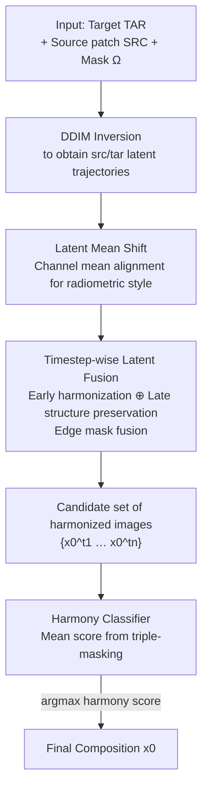

# HarmoniDiff-RS: Training-Free Diffusion Harmonization for Satellite Image Composition

**Conference**: CVPR 2026  
**arXiv**: [2604.19392](https://arxiv.org/abs/2604.19392)  
**Code**: https://github.com/XiaoqiZhuang/HarmoniDiff-RS (Available)  
**Area**: Remote Sensing / Diffusion Models / Image Composition  
**Keywords**: Satellite image composition, image harmonization, diffusion latent space, DDIM inversion, training-free

## TL;DR
When pasting a satellite source patch into a target satellite scene, HarmoniDiff-RS requires no training or fine-tuning. It first utilizes channel mean alignment in the diffusion latent space to unify radiometric styles, then applies timestep-wise fusion—where early inversion latents handle harmonization and late latents preserve structure—to eliminate hard boundaries. Finally, a lightweight harmony classifier automatically selects the most harmonious candidate, achieving the highest Harmony Score (0.225) and lowest Boundary Gradient Difference (BGD 4.88) on the self-constructed RSIC-H benchmark.

## Background & Motivation
**Background**: Satellite image composition (pasting source regions like buildings, roads, or ports into target scenes) is valuable for data augmentation, disaster simulation, and urban planning, yet it has been a neglected problem in remote sensing. Natural image composition (e.g., FreeCompose, Tale, TF-ICON) is well-established, primarily leveraging diffusion generative priors for foreground-background semantic alignment and seamless fusion.

**Limitations of Prior Work**: Natural image methods cannot be directly transferred to satellite imagery. First, they generally allow for **deformation of the source foreground** (e.g., changing a sheep from a standing to a sitting posture to fit the background), whereas satellite source regions involve **rigid structures** like buildings or ports, where geometric distortion leads to unrealism. Second, they rely on **instance-level segmentation masks** to define foreground boundaries, which are rarely available with precision in satellite imagery.

**Key Challenge**: The difficulty in satellite composition shifts from "semantic alignment" to "boundary harmonization + radiometric consistency." The goal is to make the pasted patch appear as if it belongs to the same imaging event as the target scene—accounting for cross-domain differences in lighting, tone, season, and sensors—while **maintaining the geometric rigidity of the source** and eliminating hard edges. Tools common in natural image composition, such as deformation and segmentation masks, are inapplicable here.

**Goal**: Define and solve the new task of "Realistic Satellite Image Composition"—harmonizing rigid source regions into target scenes to ensure smooth boundaries and appearance consistency without altering original geometry, all while requiring no training, online optimization, or fine-tuning.

**Key Insight**: The authors discovered that latents at different timesteps along the DDIM inversion trajectory possess **complementary characteristics**. Early inversion latents (closer to noise) are more "harmonized" but fail to preserve identity, while late latents preserve structure but retain hard edges. Since both ends have strengths, they can be fused across timesteps rather than selecting just one point.

**Core Idea**: Operate entirely within the diffusion latent space. Channel mean shifting is used to unify radiometric statistics, followed by a progressive fusion of "early harmonization latents" and "late structure-preservation latents" via edge masks. A classifier then automatically selects the optimal candidate, enabling training-free composition that preserves geometry while achieving seamless results.

## Method

### Overall Architecture
The input consists of a target scene TAR, a source patch SRC, and a paste mask $\Omega$; the output is a seamless harmonized satellite image. The pipeline operates in three steps within the latent space: first, **Latent Mean Shift** aligns radiometric/style statistics of the source patch; second, **Timestep-wise Latent Fusion** blends early harmonization latents and late structure-preservation latents using edge masks to generate a set of candidate images; finally, the **Harmony Classifier** scores each candidate to select the final output. The entire process reuses the generative prior of DiffusionSat without training the diffusion model or performing online optimization.

### Key Designs

**1. Latent Mean Shift: Training-free radiometric style unification**

The primary issue in cross-domain pasting is the radiometric discrepancy (lighting, tone, season, sensor) between the source patch and the target scene. Borrowing from the observation that "channel statistics in the diffusion latent space encode global appearance and style," the authors assume that **per-channel means serve as a lightweight style controller**. Given source inversion latents $\text{src}_t$, target inversion latents $\text{tar}_t$, and the paste mask $\Omega$, the mean difference $\Delta^c = \mu_{\text{tar}_t^c} - \mu_{\text{src}_t^c}$ is calculated for each channel $c$. The source latents are shifted $\tilde{\text{src}}_t^c = \text{src}_t^c + \Delta^c$, and the target latents within region $\Omega$ are replaced by these shifted source latents. This transfers the radiometric characteristics of the target scene to the source patch without training.

**2. Timestep-wise Latent Fusion: Balancing boundaries and geometry**

Hard boundaries remain after Mean Shift. The authors observed a complementarity in DDIM inversion: **early inversion latents generate more harmonized images but fail to preserve identity, whereas late latents preserve structural semantics but leave obvious hard edges.** For a set of harmonization timesteps $\text{ht}\in\{t_1,\dots,t_n\}$, the combined latents from Mean Shift are sampled via DDIM to a preset "structure-preservation timestep" $t_p$. An edge mask is constructed along the boundary: $M_{edge}=\text{dilate}(\Omega,w)-\text{erode}(\Omega,w)$. During denoising from $t_p$ to $t_0$, latents are fused at each step:

$$z_{t-1} = M_{edge}\cdot z_{t-1}^{edge} + (1-M_{edge})\cdot z_{t-1}^{p}$$

Where $z_{t-1}^{edge}=\text{DDIM}(z_t)$ represents the harmonization branch (acting only on the boundary), and $z_{t-1}^{p}$ is the structure-preserving branch from Mean Shift (acting outside the boundary). This allows boundary regions to be "filled" by harmonization-capable latents while internal regions maintain geometric fidelity.

**3. Harmony Classifier: Automated candidate selection**

Different timesteps yield different trade-offs between "global harmony" and "identity preservation," resulting in a candidate set $\{x_0^{t_1},\dots,x_0^{t_n}\}$. A lightweight ResNet-18 classifier $C_\psi$ is trained to output the probability of an image being visually harmonious. The input is a concatenation of the RGB image and the binary mask. Training uses 20,000 samples from RSIC-H (real backgrounds as positive, random copy-paste/Poisson blending as negative). For spatial robustness, scores are averaged across three mask configurations (original, dilated, eroded), and the candidate with the highest score $s$ is selected as the output.

### Loss & Training
The diffusion backbone is entirely training-free, utilizing DiffusionSat (a satellite-fine-tuned version of SD 2.1). Sampling steps are set to 20, guidance scale to 3.5, with harmonization timesteps in 6–14 and structure-preservation timesteps in 15–20. Only the lightweight Harmony Classifier (ResNet-18) is trained (20k samples / 5 epochs / single A100). The prompt template is "A satellite image of a [source label] in [target country]," incorporating target scene metadata to maintain radiometric features.

## Key Experimental Results

### Main Results
The RSIC-H benchmark was constructed from fMoW, featuring 413 target scenes and 381 source patches, with scale alignment using GSD metadata. Evaluation metrics include FID (↓ realism), Harmony Score HS (↑ harmony), and Boundary Gradient Difference BGD (↓ boundary smoothness, $\text{BGD}_{abs}=|\mu_{\Gamma_{in}}(G)-\mu_{\Gamma_{out}}(G)|$ with $w=3$ pixels).

| Method | FID ↓ | HS ↑ | BGD ↓ |
| :--- | :--- | :--- | :--- |
| Copy-Paste | 94.44 | 0.058 | 33.93 |
| Poisson Blending | **90.66** | 0.173 | 8.70 |
| Poisson Blending + VAE | 96.07 | 0.184 | 7.04 |
| SD2 Inpainting | 97.92 | 0.084 | 9.18 |
| SD2 + FreeCompose | 97.25 | 0.076 | 30.28 |
| SD2 + HarmoniDiff-RS | 95.32 | 0.217 | 6.48 |
| **Sat + HarmoniDiff-RS (Ours)** | 92.38 | **0.225** | **4.88** |

Ours achieved the highest HS (0.225) and lowest BGD (4.88), indicating superior harmony and boundary smoothness. FID ranked second, slightly behind Poisson Blending (90.66) because Poisson Blending retains original high-frequency details. A PB+VAE variant shows FID degrading to 96.07 when passed through the same VAE, confirming that the FID gap is primarily due to **VAE compression in the diffusion backbone** rather than harmonization quality.

### Ablation Study
| Configuration | FID ↓ | HS ↑ | CLIP ↑ | Description |
| :--- | :--- | :--- | :--- | :--- |
| INIT (copy-paste) | 94.44 | 0.06 | 1.00 | Direct paste |
| + LMS | 91.95 | 0.15 | 0.95 | Add latent mean shift |
| + TWR | 117.81 | **0.74** | 0.85 | Reconstruction-selected; fidelity collapses |
| + LTF (Ours) | 92.38 | 0.22 | 0.95 | Early/late latent edge fusion |

LMS significantly reduces FID (94.44→91.95). TWR (Timestep-wise Reconstruction, selecting the highest HS from independent reconstructions) yields the highest HS (0.74) but at the cost of FID (117.81) and CLIP (0.85), losing identity. The final LTF (Late Timestep Fusion) restores FID (92.38) and CLIP (0.95) while maintaining HS (0.22).

### Key Findings
- **Early/Late Fusion is Essential**: Purely chasing harmony (TWR) destroys fidelity. LTF's edge mask fusion balances harmony and identity.
- **FID Disadvantage stems from VAE**: The PB+VAE control experiment demonstrates that the FID gap is caused by VAE smoothing of fine textures (roofs, parking grids) rather than the method itself.
- **Domain-Specific Backbones are Superior**: HarmoniDiff-RS using DiffusionSat outperforms the SD2 version in HS (0.225 vs 0.217) and BGD (4.88 vs 6.48).

## Highlights & Insights
- **Diffusion timesteps as knobs**: Treating the inversion trajectory as a tunable trade-off between harmony and fidelity, then using spatial masks to assign different timesteps to different regions (boundary vs. interior), is a transferable strategy for local editing tasks.
- **Style Control via Mean Shifting**: Unifying radiometric statistics with a simple mean-shift equation is training-free and effective for domains like remote sensing where labels are scarce.
- **Metric-Quality Distinction**: The authors honestly attributed the FID gap to VAE compression via the PB+VAE baseline, providing clarity beyond simple leaderboard rankings.
- **Practical Training-Free Implementation**: The diffusion process is entirely training-free; the classifier is primarily for automation and can be replaced by manual selection in practice.

## Limitations & Future Work
- **VAE Reconstruction Bottleneck**: High-frequency textures are smoothed during VAE encoding/decoding. Future plug-and-play with better latent models is needed.
- **Failure Cases**: Harmonization is difficult when there is a severe semantic mismatch between the source and target; blurry transitions sometimes occur; shadow control reflects physical inconsistencies.
- **Methodological Limitations**: HS is derived from a custom-trained classifier, posing a self-verification risk. BGD lacks semantic checking. RSIC-H is relatively small and dataset-specific.

## Related Work & Insights
- **vs. Poisson Blending**: PB achieves low FID by preserving pixels but fails to address semantic/radiometric inconsistency (higher BGD).
- **vs. FreeCompose**: Ineffective for remote sensing as it relies on instance segmentation and allows foreground deformation, which fails to resolve radiometric domain shifts.
- **vs. SD2 Inpainting**: Treats source as a hard prior, failing to adjust internal semantic or radiometric attributes.
- **vs. CC-Diff++**: Focuses on region consistency for generation, whereas HarmoniDiff-RS focuses on **harmonizing existing real satellite imagery**.

## Rating
- Novelty: ⭐⭐⭐⭐ Defined a "rigid-geometry" satellite composition task with a clever timestep-fusion approach.
- Experimental Thoroughness: ⭐⭐⭐⭐ Solid baselines and ablation, though the self-trained classifier for HS is a potential bias.
- Writing Quality: ⭐⭐⭐⭐ Clear motivation and honest attribution of results.
- Value: ⭐⭐⭐⭐ High potential for practical application in data augmentation.

<!-- RELATED:START -->

## Related Papers

- [\[CVPR 2026\] ReAttnCLIP: Training-Free Open-Vocabulary Remote Sensing Image Segmentation via Re-defined Attention in CLIP](reattnclip_training-free_open-vocabulary_remote_sensing_image_segmentation_via_r.md)
- [\[CVPR 2026\] Remote Sensing Image Super-Resolution for Imbalanced Textures: A Texture-Aware Diffusion Framework](remote_sensing_image_super-resolution_for_imbalanced_textures_a_texture-aware_di.md)
- [\[CVPR 2026\] Beyond Tie Points: Satellite Image Block Adjustment based on Dense Feature Consistency](beyond_tie_points_satellite_image_block_adjustment_based_on_dense_feature_consis.md)
- [\[CVPR 2026\] Semantic-Adaptive Diffusion for Dynamic Spatiotemporal Fusion](semantic-adaptive_diffusion_for_dynamic_spatiotemporal_fusion.md)
- [\[CVPR 2026\] Prompt-Free Unknown Label Generation for Open World Detection in Remote Sensing](prompt-free_unknown_label_generation_for_open_world_detection_in_remote_sensing.md)

<!-- RELATED:END -->
